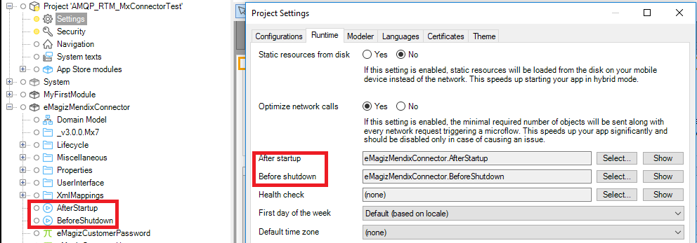
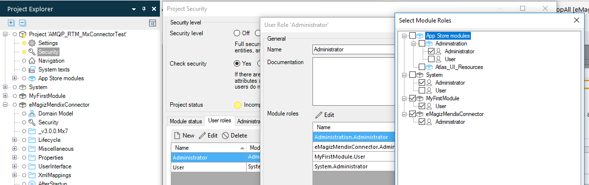
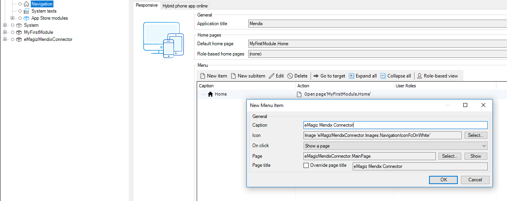
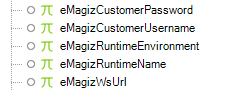
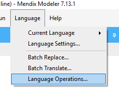
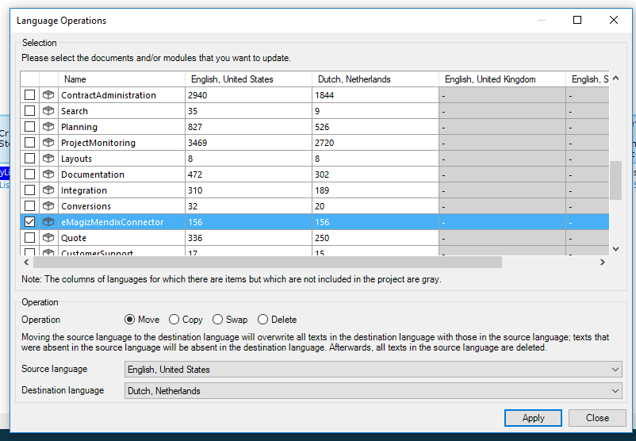
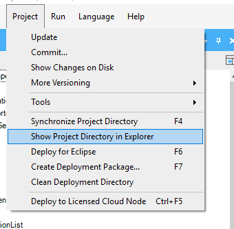

# STEP PLAN INSTALLATION EMAGIZ MENDIX CONNECTOR

To get a new version of the eMagiz Mendix Connector in a Mendix app, the following steps need to be performed.  

##  1. Download the eMagiz Mendix connector
   - The eMagiz Mendix connector can be downloaded via eMagiz. Log in and then go to one of the busses you have access to.    
   - Go to **Deploy -> On Premises -> Runtime Downloads** the eMagiz Mendix connector can be downloaded. It is important that you look at the column Mendix version. It must correspond to the Mendix version of the project where you want to use the eMagiz Mendix Connector. If you do not do this then the connector will **not** work.  
   

   

##  2. Importing eMagiz Mendix connector  
   - In the next step the connector is imported into the correct Mendix project. Open the Project. In the Project Explorer, right-click and choose the option "Import module package..."
   

   

   - Select the appropriate eMagiz Mendix connector.

**Please note:**  
If it is already present, you get a question where you choose the **override** option.

##  3. Configuration 
- **Afterstartup/Before shutdown:** In the Mendix Project, go to Project settings -> Runtime -> for the fields After startup and Before shutdown select the coresponding MFs from the eMagizMendixConnector module.

   

  

- **Rights** : It is recommended that only the administrator user role has access to the eMagiz Mendix Connector module. In order to do this go to Project Security -> User Roles -> start editing the Administrator User Role -> start editing the Modules roles -> check the box of the eMagiz Mendix Connector module and save. 

   

- **Navigation page item:** In the Mendix project, go to Navigation -> Click New Item -> fill in the fields as in the image below.

   

- **Constants:** In the Mendix project, go to project settings -> start editing the active configuration -> Constants -> and add there the following constants from the eMagizMendixConnector module: 

   

The values for these constants can be found from the eMagiz iPaaS: Deploy -> On premises -> Runtime connection settings

   

- **Webservices cloud / Webservice user**

- **Request handler**

##  4. Usage  
- Deployment/updating flows
- Starting/stopping flows
- Explanation User Interface
- Version Numbering

##  5. Possible errors  

There are several situations where you get errors/warnings in your project as a result of the installation/updating the eMagiz Mendix connector.

  - **Log errors/warnings**
  
 An example of this is when The Mendix project has multiple languages. After the import you will receive multiple errors/warnings. These are easy to solve by following the steps.

   

   

  

  - **Layout errors that can be solved with the eMagiz cleanup tool**
  
Another example is the layouts. These can be solved by choosing the layouts that are used within your project.  

   

 

The cleanup is in the project directory Under the Resource folders.

   

 

Click right mouse button (or double click) For "Openings with | Java™ Platform SE Binary

   

 

After performing this action it is good to check the userlib for verification. This can be based on the following steps. First open your project folder (see below)

   

Then navigate to Userlib. In this userlib, there should only be one reference to a version of the eMagizMendixConnector. (see below)

   

For reference, all JAR files using the eMagizMendixConnector (version 2.4.1):  

   

  - **Cleanup the project directory to avoid other problems**

The last step is to clean up the project directory and then committing your customization. Ideally, you perform all of these actions in a single commit so that you can perform a rollback and so that you can easily isolate any problems.

   

  

##  6. Best practices  

 - Configure startup time
 - Communication in conjunction with Mendix Inbound/outbound Web services
 - Conflicting userlib AppStore Modules
 - Tracing WebServices Lognode at debugging
 - Deployments – updates request handler
 - Restart
 - Stop
 - Start
 - OnDersteunde Mendix Versions
 - What to consider
 - Multithreading
 - Error handling
 - Retry mechanisme
