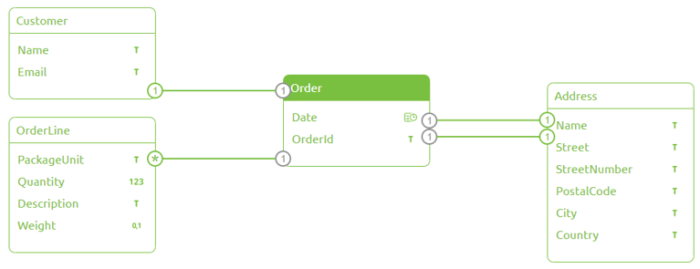
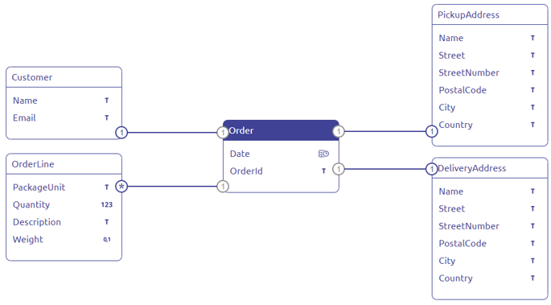
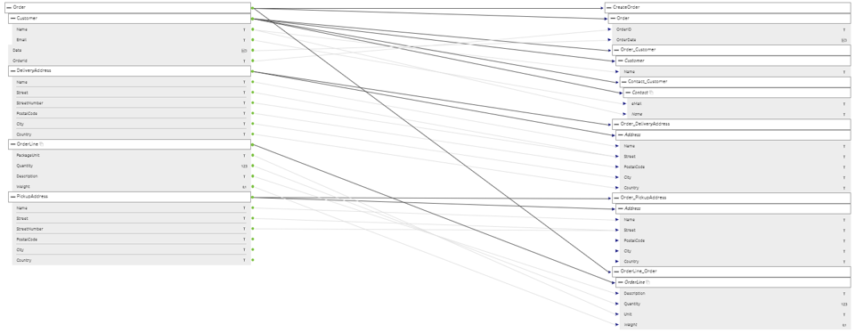
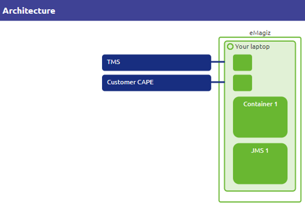

# Integration Lifecycle Management (ILM)

ILM is an approach to data and storage management that recognizes that the value of information changes over time and that it must be managed accordingly. ILM seeks to classify data according to its business value and establish policies to migrate and store data on the appropriate storage tier and, ultimately, remove it altogether. ILM has evolved to include upfront initiatives like master data management and compliance. It consists of five phases:  

  1) **CAPTURE** requirements
      * Define integrations
      * Obtain test data
  2) **DESIGN** solution
     * Architecture
     * Message definitions
  3) **CREATE** flows
  4) **DEPLOY** flow to the environment
  5) **MANAGE** and monitor flows  
  

  

  
  ## 1. Capture
  
   * **Why** capture requirements?  
   
     * Determine scope
     * Provides guidelines for designing flows first time right
     * Reduces chance of overlooking key decisions
     * Centralized documentation of requirements
     * Support developer during the design phase
   
   * **HowTo** capture requirements?  
      * Determine systems that are integrated  
      * Determine information flows/message types  
      * Determine alerts/events you want to be notified of  
      * Connect the systems with information flows  
    
   * **Result**
      
  
  
  
  ## 2. Design
  
   * Design phase objective  
      * Design the solution based on the requirements of the capture phase  
      * Design tasks:  
       -> Systems connection settings  
       -> CDM  
       -> Message definitions (x 3: CDM, system 1, system 2)  
       -> Message mappings  
       -> Architecture  
      
   * Results  
     * Message bus:  
      
  
  
     
     * CDM:  
      
  
  
     
     * CDM message definition:  
      
  
  
     
     * System message:  
      
  
  
     
     * Message mapping:  
      
  
  
     
     * Architecture:  
      
  
  
     
   ## 3. Create
   
   

