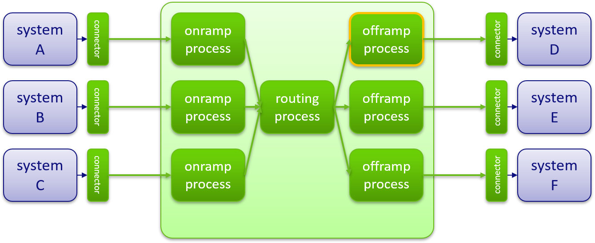
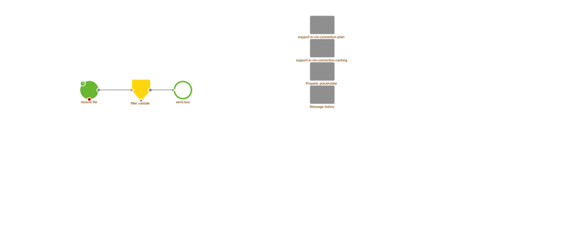
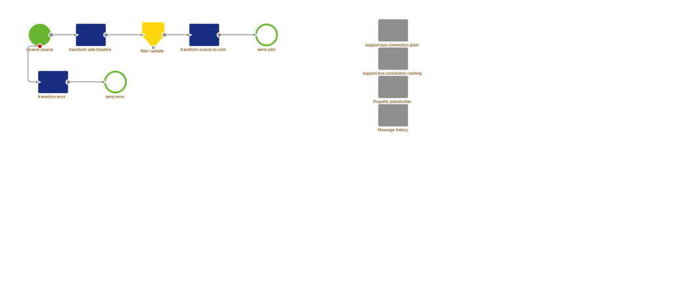
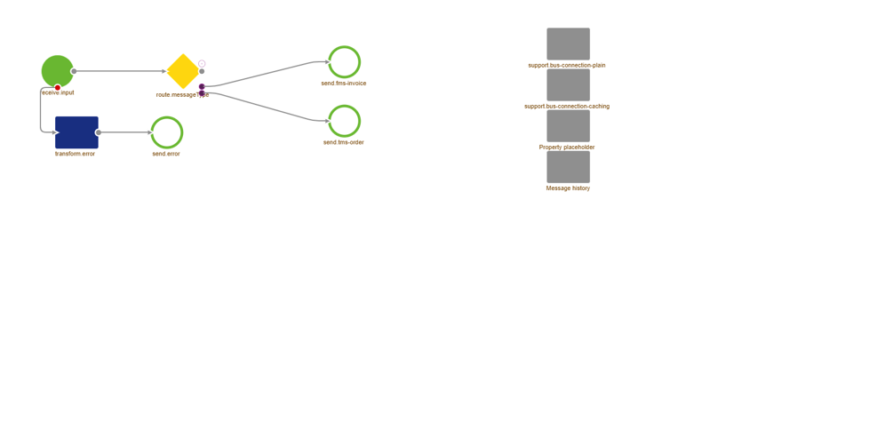
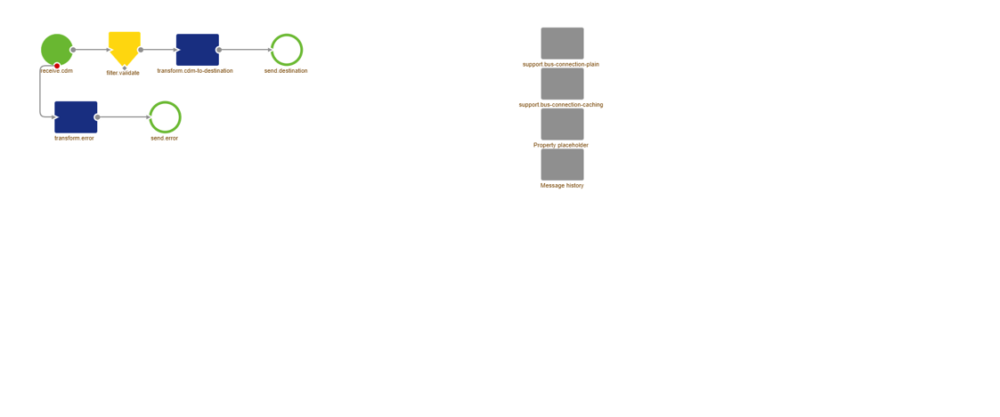

# Integration Lifecycle Management (ILM)

ILM is an approach to data and storage management that recognizes that the value of information changes over time and that it must be managed accordingly. ILM seeks to classify data according to its business value and establish policies to migrate and store data on the appropriate storage tier and, ultimately, remove it altogether. ILM has evolved to include upfront initiatives like master data management and compliance. It consists of five phases:  

  1) **CAPTURE** requirements
      * Define integrations
      * Obtain test data
  2) **DESIGN** solution
     * Architecture
     * Message definitions
  3) **CREATE** flows
  4) **DEPLOY** flow to the environment
  5) **MANAGE** and monitor flows  
  

  

  
  ## 1. Capture
  
   * **Why** capture requirements?  
   
     * Determine scope
     * Provides guidelines for designing flows first time right
     * Reduces chance of overlooking key decisions
     * Centralized documentation of requirements
     * Support developer during the design phase
   
   * **HowTo** capture requirements?  
      * Determine systems that are integrated  
      * Determine information flows/message types  
      * Determine alerts/events you want to be notified of  
      * Connect the systems with information flows  
    
   * **Result**
      
  
  
  
  ## 2. Design
  
   * Design phase objective  
      * Design the solution based on the requirements of the capture phase  
      * Design tasks:  
       -> Systems connection settings  
       -> CDM  
       -> Message definitions (x 3: CDM, system 1, system 2)  
       -> Message mappings  
       -> Architecture  
      
   * Results  
     * Message bus:  
      
  
  
     
     * CDM:  
      
  
  
     
     * CDM message definition:  
      
  
  
     
     * System message:  
      
  
  
     
     * Message mapping:  
      
  
  
     
     * Architecture:  
      
  
  
     
   ## 3. Create  
    
   * Build the solution that has been designed in the prior phase
   * Transfer the integrations from Design to Create
   * Fill in missing details:  
     * Flows
     * Definitions
     * Transformations

 <b> Graphical representation of an integration </b>

  
  

  * **Entry connector**  
  
    * First entry point for messages on the bus.
    * Deals with transport from the application to the message bus.  
    * Separate interface from transformation logic.  
    
      

  * **Onramp process**  
  
    * Validates source application data
    * Transforms source application data to common data model  
    * Adds metadata for routing purposes
    
      
 
  * **Routing process**  
  
    * Routes messages to the designated offramp based on: metadata, message content or pre-defined routing rules.  
    
      

  * **Offramp process**  
  
    * Validates common data model data
    * Transforms common data model data to destination format
    
      

  * **Exit connector**  
  
    * Exit point for messages on the bus.
    * Deals with transport from the message bus to the target application e.g. call a webservice, drop a file, post a http request.  
    * Separate interface from transformation logic.  
    
    

### eMagiz diagram notation
    
  - inbound channel adapter  
    
  - outbound channel adapter  
    
  - channel  
    
  
  - **Channels**
    - Decouples Producers from Consumers
    - Provide extension points for interceptors
    - May follow Point-to-Point or Pub-Sub
    - Messages may be queued / buffered
    - Synchronous / Asynchronous
  
   

 
  - **Endpoints**
    - Producers send Messages to Message Channels
    - Consumers receive Messages from Message Channels
    - Endpoints can be both Consumer and Producer
    - Message driven or polling, depending on the input Channel
  
   

 
  - **Channel adapters**
    - Connects a channel to some other system or transport
    - Inbound or outbound
    - Unidirectional
    - Implementations including: JMS, File, FTP(S), HTTP, JDBC, TCP, IMAP/Mail, XMPP.
  
   

 
  - **Filter**
    - Discard messages based on boolean evaluation
    - Implementations: XML validating filter, XPath filter, Standard filter.
  
   

 
  - **Transformer**
    - Convert payload or modify headers
    - Implementations including: XSLT, XPath, Flat file to XML, ISO8583 bytes to XML, JSON to XML, File to String and many more.
  
   

 
  - **Router**
    - Determine next channel based on content of the Message
    - Implementations: XPath router, Header value router, Payload type router,  Recipient list router.
  
   

 
  - **Support object**
    - Provide additional functionality used by other messaging components
    - Reusable
    - Not connected to message channels
    - Implementations including: FTP connection settings, Property placeholder, Jetty server and many more

  
   

 
  - **Gateway****
    - Same as Channel Adapter, but bidirectional
    - Implementations including: Web services, HTTP, JMS, TCP, JDBC.

  
   

 
  - **Splitter**
    - Generate multiple messages from one
    - Implementations: XPath splitter, Standard splitter.

  
     

  - **eMagiz entry message flow example**  
  
    
  
  

  - **eMagiz onramp process flow example**  
  
    
  
  
  
  - **eMagiz routing process flow example**  
  
    
  
  
  
  - **eMagiz offramp process flow example**  
  
    
  
  
  
  - **eMagiz exit message flow example**  
  
    
  
  

 

   ## 4. Deploy 

