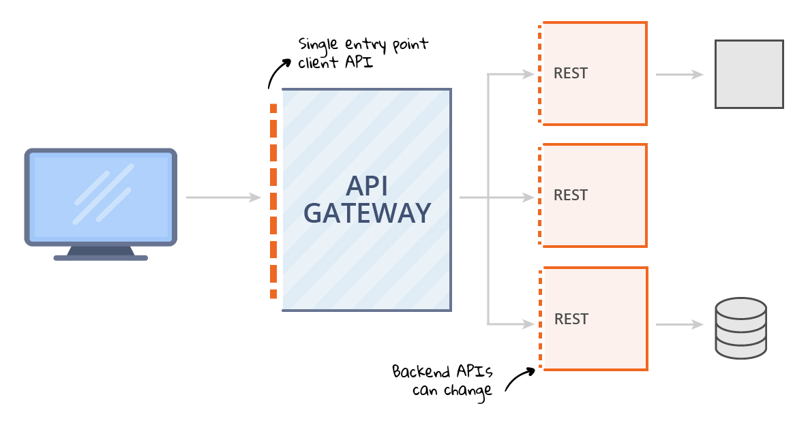
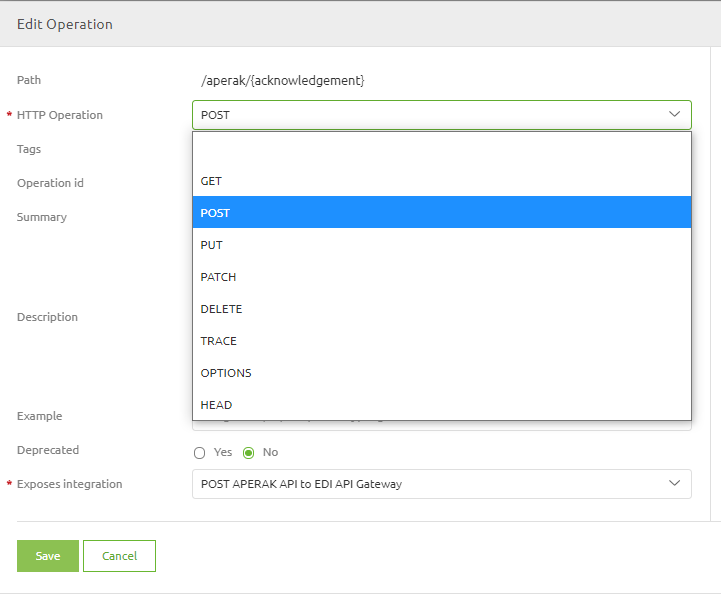
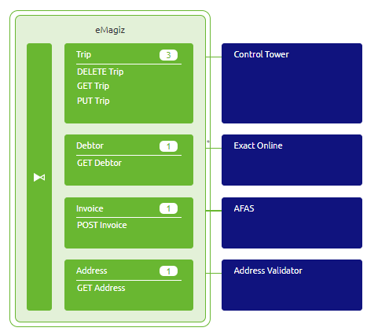
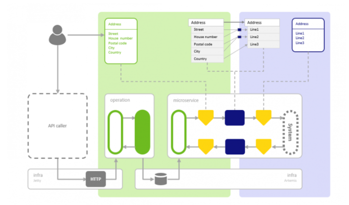
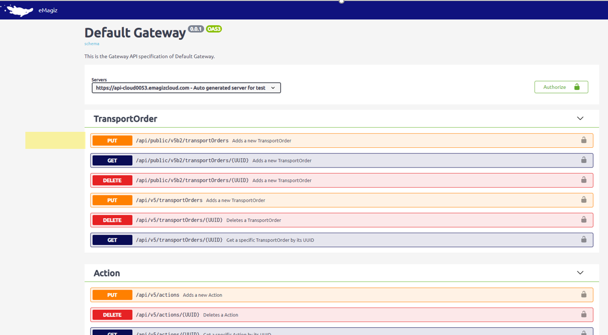
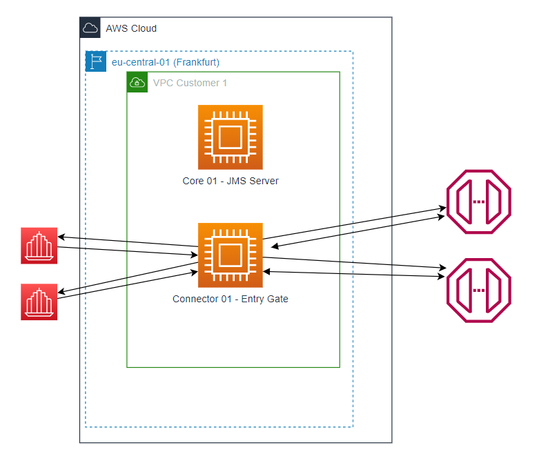

    

        <main class="micro-learning">
        <ul class="doc-nav">
            <li class="doc-nav__item"><a href="../../docs/fundamental/index_academy_fundamental_all" class="doc-nav__link">Home</a></li>
            <li class="doc-nav__item"><a href="#intro" class="doc-nav__link">Intro</a></li>
            <li class="doc-nav__item"><a href="#theory" class="doc-nav__link">Theory</a></li>
            <li class="doc-nav__item"><a href="#practice" class="doc-nav__link">Practice</a></li>
            <li class="doc-nav__item"><a href="#solution" class="doc-nav__link">Solution</a></li>
        </ul>

 
##### Intro

# eMagiz API Gateway
 
In this microlearning, we will introduce the essential concepts of the eMagiz API Gateway. The focus will be to address the fundamental concepts of this pattern. Please refer to other Fundamentals to learn more about related items and look at the relevant microlearnings available to learn how to configure an API Gateway in eMagiz.

Should you have any questions, please get in touch with academy@emagiz.com.

- Last update: November 10th, 2021
- Required reading time: 10 minutes

## 1. Prerequisites
- Some context on API Management will be helpful.

## 2. Key concepts
All concepts are discussed in the section below.

##### Theory
  
## 3. Introducing API Gateway

The eMagiz API Gateway is the pattern in which a specific entry point is made available for external applications (users). These external applications can connect to this entry point via a series of operations. These operations are listed in a manner that allows this application user to retrieve data or provide data. Users & Roles are managed on a central level to control access to the various data sources.

### 3.1 Entry point for application users
The entry point is a REST/JSON-based web service publicly accessible via the eMagiz Cloud for external application users. There is no other type of web service possible, and all the operations inside this web service are all REST/JSON based. In eMagiz, this concept translates into an All Entry flow type.

### 3.2 Operations
An operation is defined as an entry point in the API Gateway that allows a specific type of interaction with the data exposed. For instance, a user wants to get the data for a particular order or create an order via this entry point. In this example, there will be a GET Order and a POST Order operation. The traditional HTTP operations, such as GET, POST, and PUT,  are possible - see the below figure for the complete list.

 
### 3.3 API Providers & Transformation
There is a specific system connected to the operation for every operation, which gets the data or processes the data. That system, application, or service is geared towards that specific piece of data and may have its connectivity requirements, security requirement, or data structure. eMagiz will create a particular Exit Gate Flow type so that all these requirements can be appropriately handled. The figure below the Control Tower, Exact, AFAS, and Address validator are the API providers.

Each operation can have a Gateway Message and a System message for the specific API. In this way, standard eMagiz transformation tooling is made available to handle content and format transformations in the API Gateway.

### 3.4 Interaction type & error handling
The API Gateway follows a synchronous pattern which means there is always a request being made to the web service, and that same web service will always provide you with a response. The web service will wait until the backend system delivering the response is ready to send that response. 

In all cases, the web service provides a specific response using HTTP response codes (the standard definition used). If a particular HTTP response code is returned that includes a specific error, then the requestor/application user is responsible for handling the returned error. That is by design as the synchronous nature of these request imply that the calling application needs to decide to continue to the next functional step or alike. In any case, it is different and specific for each application user.

eMagiz does allow to influence some of these response codes by specific information per HTTP responses codes. Or provide custom responses.

### 3.5 Centralized User Management
In the context of an API Gateway, user management means the mechanism whereby users are granted access to a specific set of operations. User Management in eMagiz can define users and roles. The user will have the access credentials to access the API Gateway in the first place. Options are OAuth2.0 or API Key. Users are assigned a role that defines to what operations access has been given. In this way, the access to the gateway is handled centrally, and the data exposed is adequately protected. Credentials are to be submitted to application users on a separate note.

### 3.6 API Disovery
External application users can discover the operations via an online Portal - the SwaggerUI technology is used for that purpose. In that online section, the user can see all the published operations. For operation, all the required information is displayed to understand how to connect to the API correctly. That includes the request and response definitions, parameters, naming, response codes, and many more. Once the credentials have been provided, the application user can try out the operation. 

### 3.6 Architectural components

A simplified picture below is a list to illustrate the overall architecture of API Gateway in the eMagiz Cloud.  

##### Practice

## 4. Key takeaways

- API Gateway can serve as a single entry point for all external or intern application users
- API Gateway can simplify the IT landscape by offering a reusable entry point 
- API Gateway is a synchronous pattern by default
- API Gateway leverages the standard capability of eMagiz around deployment, transformation, and business owner interaction

##### Solution

## 5. Suggested Additional Readings

- [API Gateway Introduction](https://www.emagiz.com/en/api-gateway-en/)
- [Crashcourse API Gateway](../microlearning/crashcourse-api-gateway-index.md)
- [API Management](../microlearning/intermediate-api-management-index.md)
- [Transformations in API Gateway](../microlearning/intermediate-configuring-the-api-gateway-index.md)
- [Testing the API Gateway](../microlearning/intermediate-testing-emagiz-api-gateway-index.md)
- [Advanced config API Gateway](../microlearning/advanced-api-management-index.md)

## 6. Silent demonstration video

</main>

