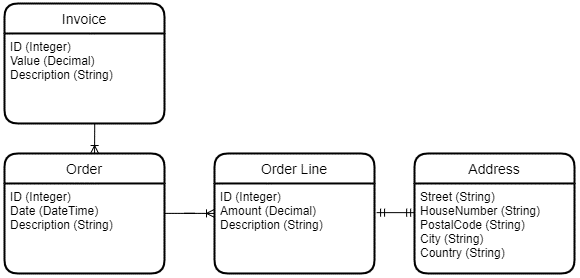
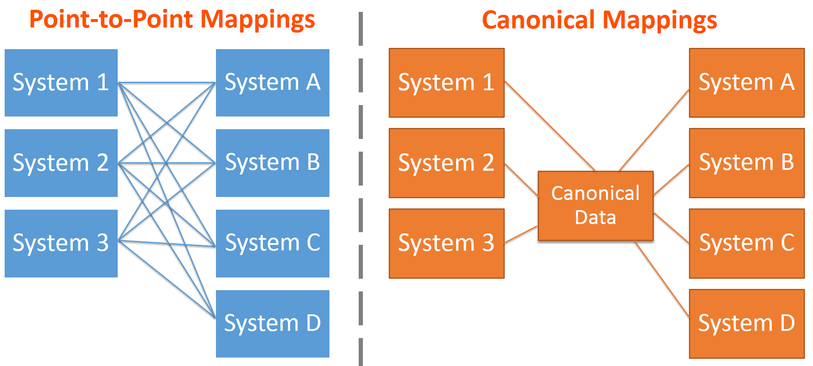
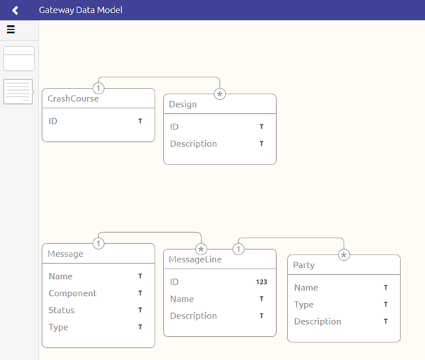

    

        <main class="micro-learning">
        <ul class="doc-nav">
            <li class="doc-nav__item"><a href="../../docs/fundamental/index_academy_fundamental_all" class="doc-nav__link">Home</a></li>
            <li class="doc-nav__item"><a href="#intro" class="doc-nav__link">Intro</a></li>
            <li class="doc-nav__item"><a href="#theory" class="doc-nav__link">Theory</a></li>
            <li class="doc-nav__item"><a href="#practice" class="doc-nav__link">Practice</a></li>
            <li class="doc-nav__item"><a href="#solution" class="doc-nav__link">Solution</a></li>
        </ul>

 
##### Intro

# Data Models
 
In this fundamental, we will zoom in on what data models are and how they are used within the various integration patterns we support in the platform. Then, we start our journey with a more theoretical look at the concept of data models. Following, we will zoom in on each of the three integration patterns. Finally, per integration pattern, we will explain the role of the data model within each of these three patterns.

Should you have any questions, please get in touch with academy@emagiz.com.

- Last update: April 28th, 2022
- Required reading time: 6 minutes

## 1. Prerequisites
- Some context on cloud functionality will be helpful.

## 2. Key concepts
- Data models define the structure of data related to a system or related to eMagiz itself
- Within a data model, you model out the relationships between entities
- Within a data model, you define all relevant attributes of an entity
- eMagiz uses data models in each of the patterns to structure the data (flow)

##### Theory
  
## 3. Data Models

In this fundamental, we will zoom in on what data models are and how they are used within the various integration patterns we support in the platform. Then, we start our journey with a more theoretical look at the concept of data models. Following, we will zoom in on each of the three integration patterns. Finally, per integration pattern, we will explain the role of the data model within each of these three patterns.

### 3.1 What is a data model

A data model is a visual representation of how a system has structured its data. With the help of a data model, you can show the relationships between entities and define the attributes on the entity level. See below for a small example of a data model.

As you can see above, we have several entities (i.e., Order, Invoice) related to each other in a certain way. Furthermore, we see that our entities are defined through the help of attributes. So, for example, our Order entity holds an ID, Date, and Description attribute. The data model also tells us the data types of the entity's attributes. Therefore the picture above tells us that the ID is represented as an integer, the Date is a DateTime, and the Description is defined as a String (Text).

Lastly, data models provide information about the type of association between two entities. Within data models, there are three types of associations possible.

- One-to-One
- One-to-Many or Many-to-One
- Many-to-Many

Applying this knowledge to the example above teaches us that one Invoice contains multiple orders and that one Order contains multiple OrderLines. Furthermore, it tells us that each OrderLine only holds one Address reference.

Now that we know what data models are in the conceptual sense, we will focus on how data models are used within each of the three integration patterns we support in eMagiz.

### 3.2 Data models in Messaging

In the messaging pattern of eMagiz, we use a Canonical Data model (CDM). Canonical data models are a type of data model that aims to present data entities and relationships in the simplest possible form to integrate processes across various systems and databases. More often than not, the data exchanged across multiple systems rely on different languages, syntax, and protocols.

For more information on further understanding the CDM please check out this [microlearning](../microlearning/crashcourse-messaging-what-is-cdm.md).

### 3.3 Data models in API Management

As with every integration pattern, eMagiz gives you the option to create your data model. This data model can be based on standards (i.e., OTM5), custom-made, or a combination of both. 
For API, the data model represents the structure of messages that you want to publish to the outside (other parties or other internal systems) world. 

With the help of this data model, you can create a uniform layer through which you expose your data to the outside world. In terms of the API Management pattern, we extend this uniform layer to include not only the data model but also the security (i.e., OAuth 2.0 - Client Credentials) and the message format (JSON).

An example of an API Data model in eMagiz is shown below.

For further understanding of the API Data Model, please check out this [microlearning](../microlearning/crashcourse-api-gateway-api-data-model.md).

### 3.4 Data models in Event Streaming

As with every integration pattern, eMagiz gives you the option to create your data model. This data model can be based on standards, custom-made, or a combination of both. 
For Event Streaming, the data model represents the structure of messages exchanged between parties with the help of topics.

With the help of this data model, you can create a shared understanding between producers and consumers on topics of what kind of data is exchanged. This can help, especially the consumer, define what they can expect when consuming data and adapt their logic based on the provided information. 

An example of an Event Streaming Data model in eMagiz is shown below.

For more information on how to further understand the Event Streaming Data Model, please check out this [microlearning](../microlearning/intermediate-configuring-event-streaming-data-model.md)

##### Practice

## 4. Key takeaways

- Data models define the structure of data related to a system or related to eMagiz itself
- Within a data model, you model out the relationships between entities
- Within a data model, you define all relevant attributes of an entity
- eMagiz uses data models in each of the patterns to structure the data (flow)

##### Solution

## 5. Suggested Additional Readings

If you are interested in this topic and want to learn how you can control your Cloud with the help of the eMagiz platform, please check out our microlearnings offering on eMagiz Cloud Management:

- [Understanding the eMagiz CDM](../microlearning/crashcourse-messaging-what-is-cdm.md)
- [API Data Model](../microlearning/crashcourse-api-gateway-api-data-model.md)
- [Event Streaming Data Model](../microlearning/intermediate-configuring-event-streaming-data-model.md)
- https://afteracademy.com/blog/what-are-the-different-types-of-relationships-in-dbms

</main>

