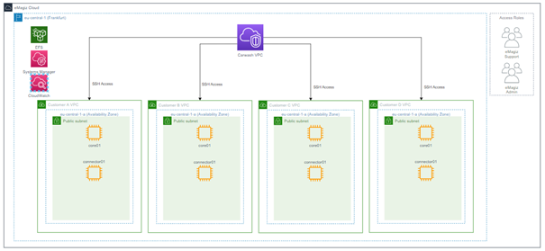
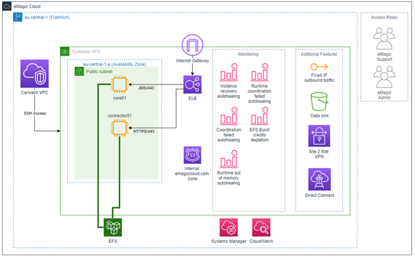
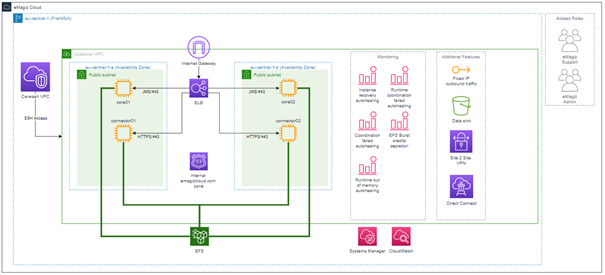

    

        <main class="micro-learning">
        <ul class="doc-nav">
            <li class="doc-nav__item"><a href="../../docs/fundamental/index_academy_fundamental_all" class="doc-nav__link">Home</a></li>
            <li class="doc-nav__item"><a href="#intro" class="doc-nav__link">Intro</a></li>
            <li class="doc-nav__item"><a href="#theory" class="doc-nav__link">Theory</a></li>
            <li class="doc-nav__item"><a href="#practice" class="doc-nav__link">Practice</a></li>
            <li class="doc-nav__item"><a href="#solution" class="doc-nav__link">Solution</a></li>
        </ul>

 
##### Intro

# eMagiz Cloud - Inner Workings
 
In this fundamental, we will zoom in on how the eMagiz Cloud is structured and how it functions for you as a customer. We will start our journey at a high level in which we focus on how we support multiple customer environments within the same eMagiz Cloud. From there, we will in on the details of each of those customer environments. Building on that, we show the differences between a single lane and a double lane setup. Last but not least, we will focus on the key benefits deploying in the eMagiz Cloud holds for you.

Should you have any questions, please get in touch with academy@emagiz.com.

- Last update: November 4th, 2021
- Required reading time: 6 minutes

## 1. Prerequisites
- Some context on cloud functionality will be helpful.

## 2. Key concepts
- Each eMagiz model is deployed in a client specific VPC (Virtual Private Cloud) in the eMagiz Cloud
- The eMagiz Cloud is automated on AWS technology - all VPC's reside in eu-central-01
- A carwash serves as entry point for all incoming traffio to allow highest level of security and to route this traffice to the right VPC
- Each VPC has DNS functionality to ensure that external systems don't have to call an IP address directly
- Each VPC is automatically monitored by the eMagiz Cloud
- You can add additional features to your specific VPC such as DirectConnect, VPN or fixed IP addresses
- A double lane means that all machines are duplicated to increase uptime of the deployed Model. The JMS Server is setup in a failover (active-passive) manner

##### Theory
  
## 3. eMagiz Cloud - Inner Workings

When running your eMagiz solution, there are generally two methods of deploying. There is the Cloud and the on-premise (i.e., in your own data center) option. We see a strong development towards Cloud-based functionality across markets. Furthermore, we see that patterns such as API Gateway and Event Streaming are tailored for a cloud only approach. Given all those characteristics, we have an eMagiz Cloud first strategy when further developing our patterns and features across the platform.

In this fundamental, we will zoom in on how the eMagiz Cloud is structured and how it operates for you as a customer. We will start our journey at a high level in which we focus on how we support multiple customer environments within the same eMagiz Cloud. From there, we will in on the details of each of those customer environments. Building on that, we show the differences between a single lane and a double lane setup. Last but not least, we will focus on the key benefits deploying in the eMagiz Cloud holds for you.

### 3.1 High-level overview

The first perspective on the Cloud we take is how we run multiple customers within the same eMagiz Cloud solution that we offer. The picture below shows how we structured our Cloud to ensure that your data is kept safely within your environment.

The most outer line of the picture represents the total eMagiz Cloud. Our support department and cloud admins have access to this level from which they can access each customer environment if need be. When going one level deeper, we see the standard region in which all our customers' data is kept. This default region (eu-central-01 located in Frankfurt) allows us to keep data under European Law and reduces the latency as most of our customer base is located within the European continent. Within this region, we have what we call a Carwash. This carwash is placed in front of each of our customer VPC's to add a layer of security. This layer restricts access to customer endpoints. Behind the carwash, we have one separate VPC per customer model. So when you have multiple models running in eMagiz (as part of your Enterprise license), you will effectively have the same amount of VPCs in the Cloud (assuming all of them run in the Cloud). This allows for the best possible separation of concerns between customers and models.

### 3.2 Customer level overview

Now that we have a conceptual idea of how the various customers within the Cloud are separated from each other, we will zoom in on how a standard single-lane VPC setup looks.

We once again see the outer layers of the eMagiz Cloud and the region. But in this overview, we zoomed in on one of the customer VPCs we have shown in the previous paragraph. When zooming in, we see several new things emerge within the picture. At first, we have an Internet Gateway that connects your VPC to the internet. This way, the carwash can redirect the traffic to the correct VPC, and the VPC is subsequently able to receive and process the message. Immediately after the gateway, we have a load balancer that determines whether the data is on HTTPS or JMS level. Depending on that, the message will be either sent to the core or the connector machine. This allows each VPC to communicate securely with the outside world and means that HTTPS traffic cannot be sent to the core machine.

Below the load balancer, we show our DNS functionality. This ensures that when external parties call an endpoint hosted within one of your flows, they do not have to know the IP address of your VPC but can call the DNS name that you configured partly within the portal. We finished off by replacing the IP with emagizcloud.com within all the endpoints that are hosted by eMagiz. This makes life way easier when allowing external parties to connect to your endpoints.

At the bottom of the picture, we see the EFS (Elastic File System). This file storage system stores meta-information securely for each customer so that only that customer can access it. A benefit of using this solution instead of regular file storage is that it can automatically scale. As a result, our cloud offering becomes more robust in dealing with high surges of traffic. Furthermore, by using EFS, your data is kept separate from the machines and can be re-used if the machines within the VPC need to be spun up in a different availability zone. To review: The EFS is also located on multiple availability zones for redundancy and distaster recovery.

More to the right of the picture, we see the monitoring capabilities on the eMagiz Cloud level. Here we depict our most noteworthy monitoring functionality that will be triggered when your VPC or part of your VPC runs into trouble. Apart from the trigger, we also keep the log information for 30 days for analysis purposes if an RCA needs to be performed by eMagiz Support. This information is stored within the Systems Manager and CloudWatch.

Some of the monitoring triggers lead to an auto-healing action that will restore the state of your environment to normal without anyone having to take action. This means that the downtime in case of an outage is significantly reduced in these cases.

Moving over to the last portion of the overview, we see some of the features we offer on the eMagiz Cloud. For example, you can define a fixed IP on outbound traffic for cases where the external party uses IP whitelisting to verify traffic. Another feature is the data sink capability that stores sunk messages in a bucket to be retrieved from the portal. 

Please check out the suggested additional readings section for applied knowledge on how you can control the eMagiz Cloud from the portal and utilize some of these functionalities from the eMagiz portal.

### 3.3 Single lane vs. Double Lane

In the previous overview, we showed a single-lane setup. In the outline below, we deliver what we call a double lane setup. The most fundamental difference between the two is that you have a mirror image of each piece of functionality you are running with the double lane. Having a mirror image of everything reduces the downtime of the environment during maintenance and unexpected outings of your environment. 

In this double lane setup, the backup JMS is dormant until activated. All processing components running in the Cloud will run at the same. As a result, you will see the number of consumers double across all your queues.

### 3.4 Key benefits

Now that we have explained how our Cloud is configured, we will wrap up this fundamental by looking at the key benefits the Cloud holds for you when building your models with the help of the eMagiz platform. Below we have summarized these key benefits:

- Each model has its VPC
- Meta information is stored on EFS for auto-scaling purposes
- Meta information is stored on EFS to guarantee a quick recovery in case of an outage
- Monitoring capabilities provide auto-healing options
- The eMagiz Cloud can be fully controlled via the eMagiz platform (check out our microlearnings under suggested additional readings)
- A carwash is placed in front of all VPCs to add a layer of security
- You can add additional features to your specific VPC

##### Practice

## 4. Key takeaways

- Each eMagiz model result in a separate VPC in the eMagiz Cloud
- eMagiz models are deployed in the AWS eu-central-01 zone by default - other regions are possible upon request
- A carwash is placed in front of all VPCs to add a layer of security
- Each VPC has DNS functionality to ensure that external parties don't have to call an IP address directly
- Each VPC is automatically monitored
- You can add additional features to your specific VPC
- Setting up a double lane is a safeguard against downtime
- The eMagiz Cloud can be controlled via the eMagiz platform (check out our microlearnings under suggested additional readings)

##### Solution

## 5. Suggested Additional Readings

If you are interested in this topic and want to learn how you can control your Cloud with the help of the eMagiz platform, please check out our microlearnings offering on eMagiz Cloud Management:

- [Novice - eMagiz Cloud Management](../microlearning/novice-emagiz-cloud-management-index.md)
- [Intermediate - eMagiz Cloud Management](../microlearning/intermediate-emagiz-cloud-management-index.md)
- [Advanced - eMagiz Cloud Management](../microlearning/advanced-cloudmanagement-index.md)

</main>

