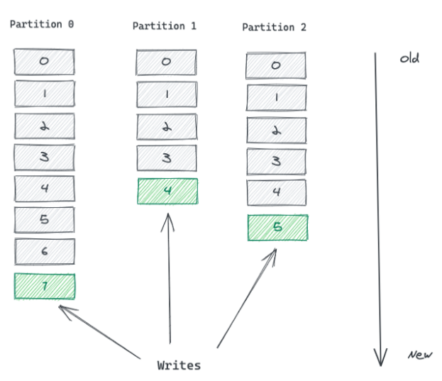
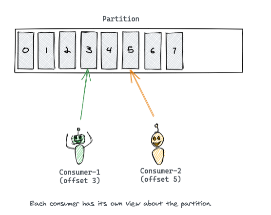
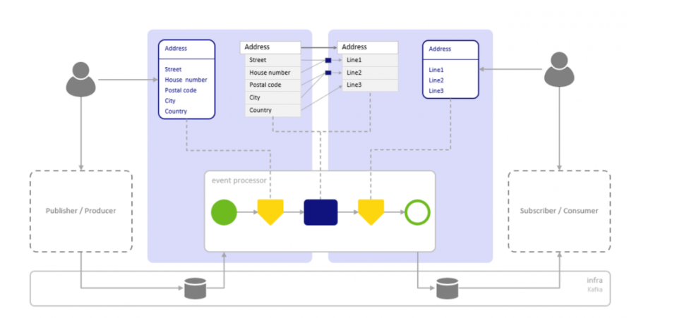
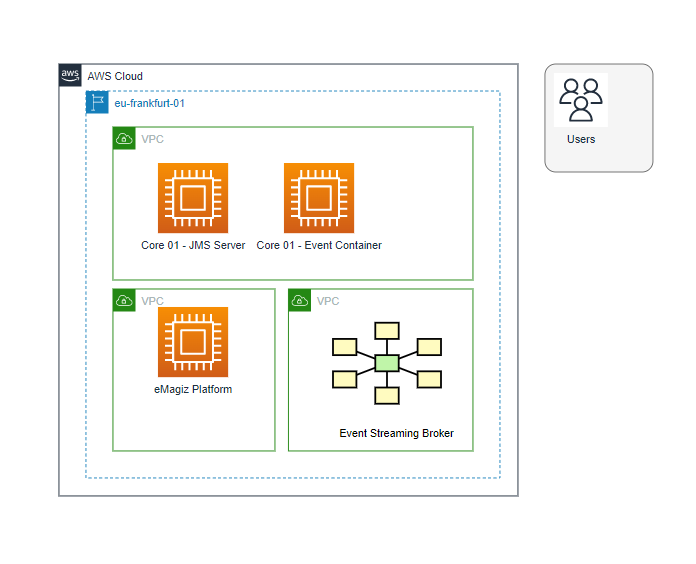
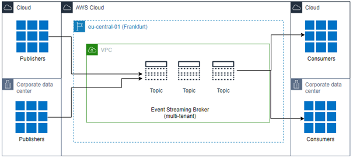

    

        <main class="micro-learning">
        <ul class="doc-nav">
            <li class="doc-nav__item"><a href="../../docs/fundamental/index_academy_fundamental_all" class="doc-nav__link">Home</a></li>
            <li class="doc-nav__item"><a href="#intro" class="doc-nav__link">Intro</a></li>
            <li class="doc-nav__item"><a href="#theory" class="doc-nav__link">Theory</a></li>
            <li class="doc-nav__item"><a href="#practice" class="doc-nav__link">Practice</a></li>
            <li class="doc-nav__item"><a href="#solution" class="doc-nav__link">Solution</a></li>
        </ul>

 
##### Intro

# eMagiz Event Streaming - Introduction
 
In this microlearning, we will introduce the most important concepts of Event Streaming. The focus will be to address the key concepts of this pattern. Please refer to other Fundamentals to learn more about related items, and take a look at the relevant microlearnings available to learn how to configure Event Streaming.

Should you have any questions, please get in touch with academy@emagiz.com.

- Last update: November 3rd 2021
- Required reading time: 10 minutes

## 1. Prerequisites
- Some context on Event Streaming will be helpful.

## 2. Key concepts
All concepts are discussed in the section below.

##### Theory
  
## 3. Introducing Event Streaming

Event Streaming is the concept whereby systems can produce data and consume data from a single location. In the integration world this integration pattern is referred to as Publish-Subscribe (or PubSub). The single location is called a topic, the Pulisher is often called a Producer and a Subscriber a Consumer. The key is that a topic may contain multiple Publishers of the same data, and may contain more Subcribers of the same data. Consumers are subscribed to a topic and will receive a notification that triggers a read action. Core focus of Event Streaming is high-volume and high-speed.

### 3.1 Topics
Topics are the things where the message or data packets is stored. It is not a conventional database, and uses a logbased approach to store data. Each new data packet is put on top of the stack and an offset indicator is added which helps consumers to understand which message is read or which ones not. The data on the topic can be spread in multiple partions which are the smallest technical unit where a data packet is written into. Having multiple partions makes it possible to read /write data at ultra-high speed by Consumers/Producers.

Data in topics are focus on storing small events which are no bigger than 1 Mb per data packet/message.

### 3.2 Retention

Retention is an important concept as that allow to clear messages from the topic in an organized manner. The key is that data should be kept on the topic fo a limited amount of time or limited amount of size.

#### 3.2.1 Retention Hours

Retention Hours is the number of hours data can reside on the topic before a FiFo principle of removing the first entry in the log kicks in. The moment data is still on the topic beyond this threshold it will automatically start deleting the data. The default setting eMagiz provides you is 168 hours (7 days). 

#### 3.2.2 Retention Bytes

Retention Bytes is the number of bytes available per partition on that topic before a FiFo principle of removing the first entry in the log kicks in. The moment your topic holds more bytes as compared to the retention byte setting it will automatically start deleting the data. The default setting eMagiz provides you is roughly 500 MB. 

### 3.3 Replication
The default replication mechnanism is that the data will be spread across 3 different nodes so that no data is lost, high availability is ensured and high performance is guaranteed. Event Streaming distributes the partitions of a particular topic across multiple brokers. By doing so, we’ll get the following benefits.

- If we are to put all partitions of a topic in a single broker, the scalability of that topic will be constrained by the broker’s IO throughput. A topic will never get bigger than the biggest machine in the cluster. By spreading partitions across multiple brokers, a single topic can be scaled horizontally to provide performance far beyond a single broker’s ability.
- A single topic can be consumed by multiple consumers in parallel. Serving all partitions from a single broker limits the number of consumers it can support. Partitions on multiple brokers enable more consumers.
- Multiple instances of the same consumer can connect to partitions on different brokers, allowing very high message processing throughput. Each consumer instance will be served by one partition, ensuring that each record has a clear processing owner.

### 3.4 Reading data from a topic
Consumers can read data from a topic at their own pace and availability. Event Streaming doesn't push messages - consumers need to come and get the data. The offset of a message works as a consumer side cursor at this point. The consumer keeps track of which messages it has already consumed by keeping track of the offset of messages. After reading a message, the consumer advances its cursor to the next offset in the partition and continues. Advancing and remembering the last read offset within a partition is the responsibility of the consumer. Event Streaming has nothing to do with it.

### 3.4 The Event Streaming Broker

The Event Streaming Broker holds the technical infrastructure to manage all these topics, Producers/Consumers associated, etc. The Kafka framework is used inside the eMagiz Event Streaming to enable this technology piece. The entire Event Streaming Broker is part of the eMagiz platform and fully managed from the platform.

### 3.5 Event Processing
eMagiz reuses the transformation capability to allow transformation of messages. In this pattern, messages are transformed in special type flows called Event processors. The Event processor will use a topic in and topic out which means that data is transported from 1 topic to another. On each topic you can define an event data model. 

### 3.6 Architectural components of Event Streaming in eMagiz

A simplied picture below is list to illustrate the overall architecture of Event Streaming in eMagiz. The first picture is the situation where there is a multi-tenant Event Broker and both clients are using Event Processing. 

The picture below shows the situation where clients are using the Event Broker as passthrough - there is no event processing. So there is no need for an Event Streaming container and JMS.

#### 3.6.1 Event Broker
eMagiz is hosting an Event Broker inside the eMagiz Cloud and is accessible only via the eMagiz platform. All traffic is routed via the eMagiz platform, and is protected 2-way SSL. The Broker holds the specific Kafka based technology around managing topic, Access Control Lists (ACL), users, retention, etc. All components as decribed in the introduction section of this Fundamental. The broker will respond to the requests made from the eMagiz platform such as putting a message on topic and soforth.

#### 3.6.2 JMS and Event Streaming container
In the case where specific flows are deployed for Event Processing, the regular JMS server will control and manage the traffic. The Event Streaming Container will hold the required flows for Event Processors. The Core machine is not accessible from outside the VPC - as usual for the eMagiz core machine.

#### 3.6.3 Users
Users will have access to produce and consume messages. Users are managed in User Management sections in the eMagiz Portal. Once configured, the credentials are accessible via the Event Catalog. Users can access the topics via SSL and certificates. The Key and Trust stores are available in the Event Catalog - as well as all the required details of the Event Broker to allow access. Other access methods such as Basic Authentication, SASL like options are not supported to access the Event Broker.

##### Practice

## 4. Key takeaways

- Event Streaming provides a mean for maximum decoupling of producing and consuming systems
- Event Streaming is a asynchronous pattern by default
- Event Streaming can be used for large volume events but can als play a role in hybrid integration scenario's

##### Solution

## 5. Suggested Additional Readings

- https://www.emagiz.com/event-streaming/
- Crashcourse Event Streaming	:
- Key Concepts Event Streaming	: https://emagiz.github.io/docs/microlearning/intermediate-key-concepts-emagiz-event-streaming-index
- Configuring Event Streaming	: https://emagiz.github.io/docs/microlearning/intermediate-configuring-event-streaming-index
- Event Streaming Connectors	: https://emagiz.github.io/docs/microlearning/intermediate-event-streaming-connectors-index

## 6. Silent demonstration video

<iframe width="1280" height="720" src="../../vid/fundamental/ES_Fundamental_final.mp4" frameborder="0" allow="accelerometer; autoplay; clipboard-write; encrypted-media; gyroscope; picture-in-picture" allowfullscreen></iframe>

</main>

