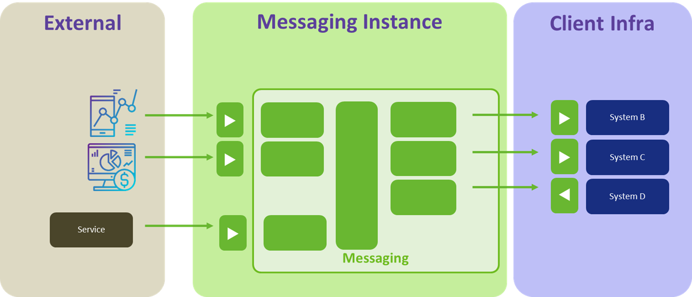
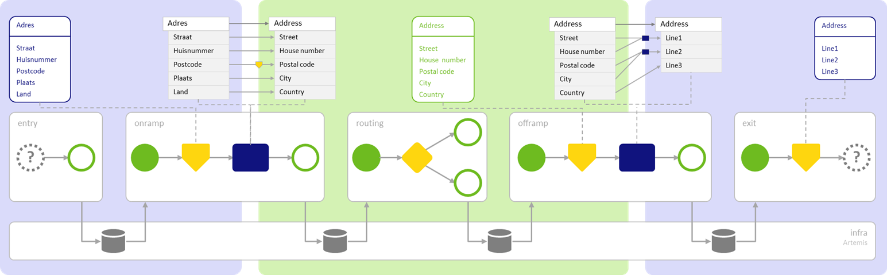
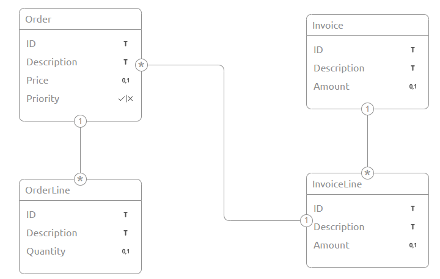
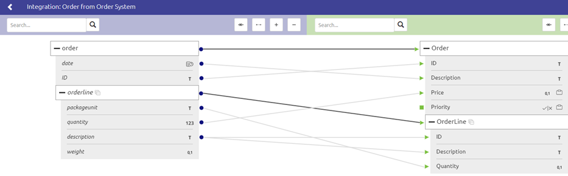
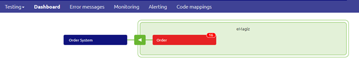
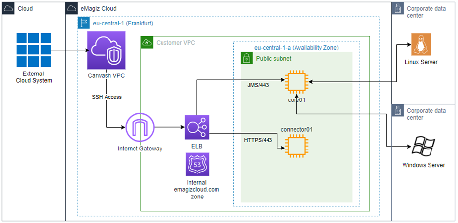
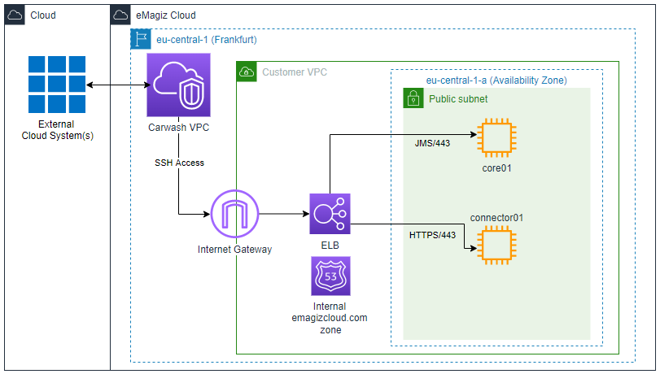

    

        <main class="micro-learning">
        <ul class="doc-nav">
            <li class="doc-nav__item"><a href="../../docs/fundamental/index_academy_fundamental_all" class="doc-nav__link">Home</a></li>
            <li class="doc-nav__item"><a href="#intro" class="doc-nav__link">Intro</a></li>
            <li class="doc-nav__item"><a href="#theory" class="doc-nav__link">Theory</a></li>
            <li class="doc-nav__item"><a href="#practice" class="doc-nav__link">Practice</a></li>
            <li class="doc-nav__item"><a href="#solution" class="doc-nav__link">Solution</a></li>
        </ul>

 
##### Intro

# eMagiz Messaging
 
In this microlearning, we will introduce the essential concepts of eMagiz Messaging. The focus will be to address the fundamental concepts of this pattern. Please refer to other Fundamentals to learn more about related items and look at the relevant microlearnings available to learn how to configure messaging flows in eMagiz.

Should you have any questions, please get in touch with academy@emagiz.com.

- Last update: March 4th, 2022
- Required reading time: 10 minutes

## 1. Prerequisites
- Some context on messaging will be helpful.

## 2. Key concepts
All concepts are discussed in the section below.

##### Theory
  
## 3. Introducing Messaging

The eMagiz Messaging is the pattern in which you can connect various parties via various connectivity mechanisms to the messaging engine of eMagiz. These external applications can connect in the most appropriate way (i.e., REST, SOAP, SFTP, and many more) to eMagiz. eMagiz will subsequently place the input messages on a specific queue. For example, you can distribute the message to various other external applications and deliver the messages via the connectivity method most desirable for each external application. 

Any messaging integration in eMagiz consists of five layers. The message starts in the entry and moves via the onramp, routing, offramp, and exit to the other application. 

### 3.1 The five layers of eMagiz Messaging

eMagiz has implemented a five-layered model based on the integration architectural pattern VETRO, which stands for Validate, Enrich, Transform, Route, and Operate. Each of these layers plays a role in the pattern. Below is an explanation of these five layers. Each of these layers will result in integration components referred to as flows in eMagiz. Each of these flows will run strategically across the integration landscape in a specific runtime position (see section "Architectural components" in this document).

1. Entry - in the entry flow, you can configure the connectivity with the system that will send a message to eMagiz. It can be a push from the external system or a pull from eMagiz to the external system. Once the message is received, the message will be queued directly to the next step in the model
2. Onramp - In this part, the message will be transformed and validated, preparing it for the following steps to send it to the external system. Specific elements exist here also to enrich the message where needed with additional attributes
3. Routing - Using specific header information, the message can be routed to one of more offramps for further processing
4. Offramp - In this process, the message passed on from the routing can be first validated if it meets the expected structure and then transformed to the target system. Once processed, the message is put in the exit queue.
5. Exit - the exit will read the message from the queue and then connect to the target system

### 3.2 Canonical Data Model (CDM)
The Canonical Data Model is a crucial part of the messaging pattern, which we call the CDM in layman terms. The CDM is the data model at the heart of all your messaging integration and defines how a specific message should look from your point of view. For example, when you have an Order and Invoice integration, the CDM will explain what an Order looks like, how an Invoice looks, and how the two are related (or not). Based on this model, you can select portions of the CDM to act as the CDM message for a specific message type (i.e., Order).

Critical considerations in setting up a CDM are:

- Clarity
- Consistency
- Logical

### 3.3 Transformation
As the external parties will most likely not adhere to this standard you defined in the CDM, a crucial part of messaging integration is transforming the structure as supplied (or requested) by the external party to and from the CDM. You can quickly transform this data with the help of the eMagiz tooling in the Design phase of eMagiz. See below for an illustration.

 
### 3.3 Queueing
Within eMagiz, we use the queueing mechanism to transport messages from one queue to the other. The JMS orchestrates this mechanism of queues. The JMS registers and deregisters queues dynamically when there is a need for the queue to be created or destroyed. For example, a customer needs to be registered on any queue to pick up messages. Once the message is delivered to the next queue and the transaction is finished, the message leaves the previous queue. For a more in-depth analysis of how queues work within the platform, please check out this [microlearning](../microlearning/intermediate-orchestration-of-data-packets-queues-how-do-they-work.md).

### 3.4 Error Handling
Each messaging flow related to a messaging queue (i.e., onramp, routing, offramp, exit) contains a subprocess that will send the error to the error flow if the operational process fails. As a result, the error will show up in the Dashboard in the Manage phase of eMagiz so the user can analyze it. An example of what this Dashboard looks like can be found below.

With the help of this information, you can easily determine the origin of an error message. For more information on that please check out this [microlearning](../microlearning/crashcourse-platform-manage-determining-origin-of-error-message.md).

### 3.5 Architectural components

Connecting various systems via the messaging pattern allows you to deploy parts of your architecture as close to the system as possible. This means that you can deploy part of the solution in the eMagiz Cloud and part of the runtimes that hold the entries and exits on-premise if the system you want to connect to is also deployed on-premise. This makes the connection between the entry or exit and the system in question more stable in nature.

An example of such a hybrid setup is depicted below.

Logically if all your systems are cloud systems, the most logical choice would be to deploy the complete eMagiz model within the eMagiz Cloud. An example of such a cloud setup is depicted below.

##### Practice

## 4. Key takeaways

- Messaging uses five layers to transport data between systems
- The CDM is a crucial component within messaging
- To transport the messages, we use the queueing mechanism
- Errors from the messaging flows show up in the manage dashboard
- Messaging runtimes should be deployed as close to the system as possible

##### Solution

## 5. Suggested Additional Readings

- [Messaging Introduction](https://www.emagiz.com/en/messaging-en/)
- [Crashcourse Messaging](../microlearning/crashcourse-messaging-index.md)
- [Orchestration of Data Packets](../microlearning/intermediate-orchestration-of-data-packets-index.md)
- [Additional Key Concepts Messaging](../microlearning/intermediate-key-concepts-emagiz-messaging-index.md)

## 6. Silent demonstration video

<iframe width="1280" height="720" src="../../vid/fundamental/fundamental-messaging-introduction.mp4" frameborder="0" allow="accelerometer; autoplay; clipboard-write; encrypted-media; gyroscope; picture-in-picture" allowfullscreen></iframe>

</main>

