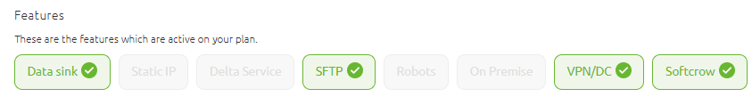
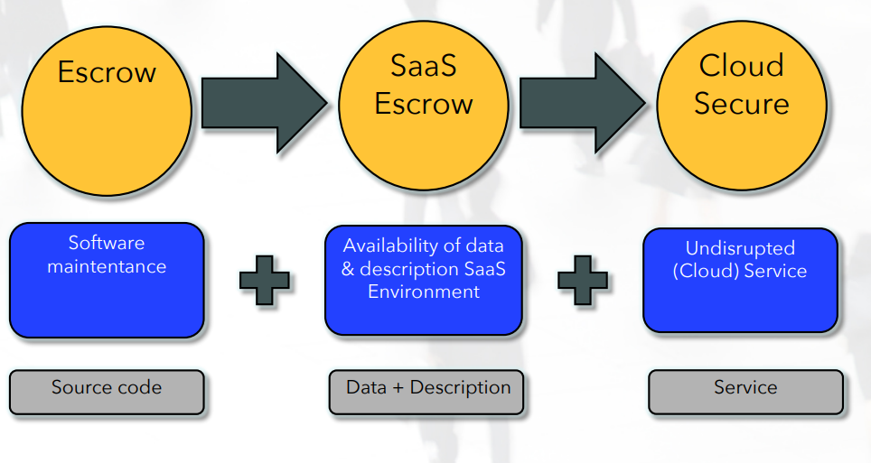

    

        <main class="micro-learning">
        <ul class="doc-nav">
            <li class="doc-nav__item"><a href="../../docs/fundamental/index_academy_fundamental_all" class="doc-nav__link">Home</a></li>
            <li class="doc-nav__item"><a href="#intro" class="doc-nav__link">Intro</a></li>
            <li class="doc-nav__item"><a href="#theory" class="doc-nav__link">Theory</a></li>
            <li class="doc-nav__item"><a href="#practice" class="doc-nav__link">Practice</a></li>
            <li class="doc-nav__item"><a href="#solution" class="doc-nav__link">Solution</a></li>
        </ul>

 
##### Intro

# eMagiz Licensed features
In this fundamental, we'll take a look at licensed features of eMagiz to provide a fundamental description of these.

Should you have any questions, please get in touch with academy@emagiz.com.

- Last update: March 16th, 2022
- Required reading time: 5 minutes

## 1. Prerequisites

- Take a closer look at the Fundamentals for Messaging, API Gateway and Event Streaming

## 2. Key concepts
eMagiz contains an overview of the licensed items and features of the platform. You can find them under Administration --> Licenses and will display for the accessible companies the models and it's licensed items. Below a screenshot of such a page of a sample environment. This fundamental will describe the list of additional features list on the top right quadrant of the page.

##### Theory
  
## 3. Licensed features

Below the list of all items.

#### 3.1 Data sink

Data Sink refers to the capability to sink (or store) messages into a storage location, and a specific tag to the message that can be used to retrieve that same message again. Once that message is stored, it can be found in the Data Sink user interface that is part of the iPaaS Portal (my.emagiz.com). Messages can be see there, and the actual content of the message viewed. The search option is only available on the tag used to sink that specific message - not on the content of the message itself. Traceability and compliancy are the main use cases for this functionality.

Please consult this microlearning for more information: https://emagiz.github.io/docs/microlearning/advanced-data-management-data-sink
 
#### 3.2 Static IP

The static IP feature allows the fix the IP address of the Cloud slot for extern access. In normal cases, the IP address of a eMagiz Cloud environment is dynamic or will change frequently due to Cloud formation actions. This feature will fix the IP address via an alternative approach, and is suited for situations where external parties need to secure the access to and from the eMagiz Cloud (private) slot.

#### 3.3 Delta service

The Delta Service is used in conjunction with Data pipelines, where eMagiz will store meta-data of the process so that only the added, changed and deleted records can be transmitted to the next step of the integratioon. eMagiz uses H2 database technology for that, which is part of the eMagiz runtime.

#### 3.4 SFTP Service

eMagiz can offer access to an SFTP Service in the eMagiz Cloud that can be leveraged by clients for file based integrations. Connected parties of clients can put their files on that SFTP Server and eMagiz flows can read & drop files to SFTP services. Access credentials are managed by eMagiz Support, and will provide the required access and sizing constraints.

Please consult this microlearning for more information: https://emagiz.github.io/docs/microlearning/intermediate-file-based-connectivity-sftp-connectivity

#### 3.5 Robots

For Robots eMagiz offers an RPA technology that allows to scrape data from websites. That data is then transmitted to other systems or services and leveraged. There are concrete uses cases for detecting arrival times of vehicles, carriers, etc. and using that information to optimize supply chains in Transport & Logistics.

#### 3.6 VPN / DirectConnect (DC)

In specific cases, eMagiz offers the ability to create secure & dedicated connections to client infrastructure. As an additional layer of securing traffic between Cloud and client infrastructures. eMagiz offers a wide range of specific security measures as can be read in the security guide. A VPN service can created from the dedicated client Cloud environment (please see below link to fundamental eMagiz Cloud). Furthermore, eMagiz offers the option for a Direct Connection, which means in this contex that the connection between the eMagiz Cloud and the client infrastructure is channeled via physical connection lines (as opposed to internet based connections). 

Please consult this microlearning for more information: 
- https://emagiz.github.io/docs/microlearning/expert-solution-architecture-aws-direct-connect#aws-direct-connect
- https://emagiz.github.io/docs/fundamental/fundamental-emagiz-security-guide
- https://emagiz.github.io/docs/fundamental/fundamental-emagiz-cloud-inner-workings

#### 3.7 Softcrow

eMagiz offers the ability to provide a escrow+ service to clients, whereby not only the source code of the entire eMagiz platform is deposited to an external service but also the data backups and cloud resources. That external service will provide access to this services in case eMagiz as a company stops all it's activities. An external service provider is handling this provision, and secures source code, data and uninterrupted cloud service. 

##### Practice

## 4. Key takeaways

- The eMagiz platform contains several add-on features that are explained in each of the above points
- Access to the features can be granted via specific agreements between clients and eMagiz

##### Solution

## 5. Suggested Additional Readings

This fundamental contains reference to additional reading in section 3

## 6. Silent demonstration video

N/A

</main>

