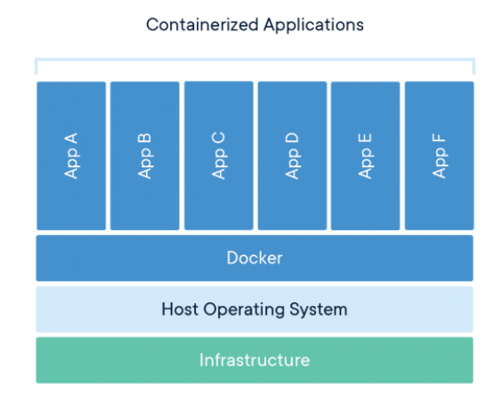

    

        <main class="micro-learning">
        <ul class="doc-nav">
            <li class="doc-nav__item"><a href="../../docs/fundamental/index_academy_fundamental_all" class="doc-nav__link">Home</a></li>
            <li class="doc-nav__item"><a href="#intro" class="doc-nav__link">Intro</a></li>
            <li class="doc-nav__item"><a href="#theory" class="doc-nav__link">Theory</a></li>
            <li class="doc-nav__item"><a href="#practice" class="doc-nav__link">Practice</a></li>
            <li class="doc-nav__item"><a href="#solution" class="doc-nav__link">Solution</a></li>
        </ul>

 
##### Intro

# eMagiz Runtime Generation 3
 
In this fundamental, the focus will be on the runtimes of eMagiz and notably the next generation runtime. The internal projectname is called Generation 3, which we'll use here for now.

Should you have any questions, please get in touch with academy@emagiz.com.

- Last update: March 17th, 2022
- Required reading time: 10 minutes

## 1. Prerequisites

- Advanced knowledge of the eMagiz platform

## 2. Key concepts
The first thing to consider is the eMagiz runtime. This is the Java based application container where the generated code of eMagiz flows is deployed and put into operation. That runtime is something you can download in the Deploy --> Containers section as a zipfile, and make active on your local laptop or machine. The way to invoke the Java application container is to execute the karaf.bat (which refers to the framework we use for that). For runtimes that are deployed, the karaf.bat is the executable refered in the services of the DMZ server of the client.

This runtime play a core role in the next generation architecture. 

##### Theory
  
## 3. Overview of the Generation 3 runtime

### 3.1 History of runtime
In the last years eMagiz evolved from a local, on-premises deployment platfrom to a Cloud-first platform. In the inception of the eMagiz runtime, we where able to provide a process that could only run locally on a (dedicated) server of clients. We refer that as Generation 1 runtime. With the requirement to deploy eMagiz runtime also in the Cloud, we updated the runtime to Generation 2. Which included the OSGI and Karaf framework that allowed to remotely manage runtimes. Our next step explained below is then referred as Generation 3.

### 3.2 Spring Boot framework

The ambition of eMagiz to work towards serverless Cloud environments, where the eMagiz runtime can be made operational. A bigger portion of our platform leverages the Spring Integration framework, and the Spring Boot framework provides the requirement components to form a Java based application container that can run on Docker technology. It was therefore logical to migrate the existing runtime to that framework, making OSGI and Karaf obsolete. Furthermore, the Spring Boot framework provides means to measure many more things in the context of log entries and runtime metrics. 

### 3.3 Docker technology

A more modern technology compared to traditional servers is to use Docker containers. Docker provides containers that mimic servers in a specific way. A container is a standard unit of software that packages up code and all its dependencies so the application runs quickly and reliably from one computing environment to another. A Docker container image is a lightweight, standalone, executable package of software that includes everything needed to run an application: code, runtime, system tools, system libraries and settings.

Container images become containers at runtime and in the case of Docker containers - images become containers when they run on Docker Engine. Available for both Linux and Windows-based applications, containerized software will always run the same, regardless of the infrastructure. Containers isolate software from its environment and ensure that it works uniformly despite differences for instance between development and staging.

The runtime of eMagiz can run inside a Docker, and the runtime is made part of the docker image. In the docker image you will find other required pieces such as OS, Java, monitoring services, etc.

### 3.4 Impact on Way of Working Gen2 vs. Gen3

- Deployment Plan
The deployment has a new option called Deploy runtimes. These steps will be part of a default plan, or can be added as seperate line. Effectively, once a runtime is deployed as part of a Docker image, the image needs to be loaded and executed. That means that current image including all flows will be replaced with a new image. This makes the deployment simple and fast. The option means that all runtimes of a machine will be deployed in matter of seconds

- Releases
The releases functionality is used for defining the Docker image. Setting the release means creating a new Docker image.

- Deploy Architecture
On every runtime you can see the running status of a Docker image. In a way, this a replacement for the Runtime Dashboard. The docker image is switched on or off, and flows can't be selectively switched on or off.

- Properties
In previous generation runtime, properties where loaded at runtime level (in a way). Updating a property meant stopping and starting a flow to effectuate the property change. Now, the properties are made part of the Docker image. That results in the necessity to create a new release once a property is changed.

- Build number
The notion of build numbers no longer exists in the new runtime. Or not so explicitly as before. The Docker image will load the required libraries when creating the runtime image, and always use the latest.

##### Practice

## 4. Key takeaways

- Generation 3 runtime architecture has a series of consequences for user that need to be understood well
- The new generation architecture is the current path towards serverless, and simplyfies deployment greatly for users.

##### Solution

## 5. Suggested Additional Readings

- [Setting up a deployment plan](../microlearning/crashcourse-platform-deploy-setup-deployment-plan)
- [Deploy a release](../microlearning/crashcourse-platform-deploy-execute-deployment-plan.md)
- [Property Management](../microlearning/crashcourse-platform-deploy-property-management.md)

</main>

