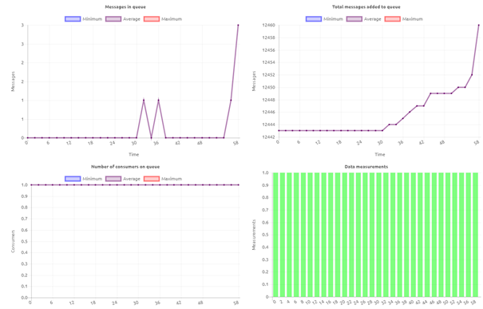
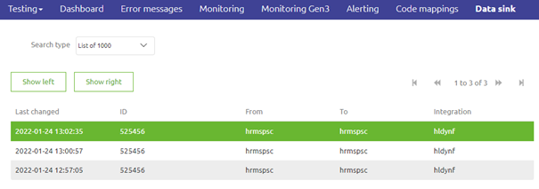
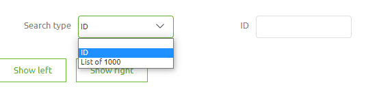
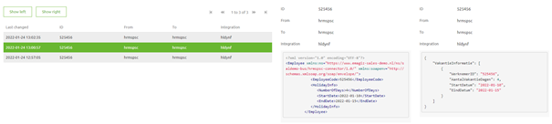

    

        <main class="micro-learning">
        <ul class="doc-nav">
            <li class="doc-nav__item"><a href="../../docs/fundamental/index_academy_fundamental_all" class="doc-nav__link">Home</a></li>
            <li class="doc-nav__item"><a href="#intro" class="doc-nav__link">Intro</a></li>
            <li class="doc-nav__item"><a href="#theory" class="doc-nav__link">Theory</a></li>
            <li class="doc-nav__item"><a href="#practice" class="doc-nav__link">Practice</a></li>
            <li class="doc-nav__item"><a href="#solution" class="doc-nav__link">Solution</a></li>
        </ul>

 
##### Intro

# Traceability in eMagiz
 
This fundamental will zoom in on which traceability concepts we have incorporated within the eMagiz portal to ensure that data passes from A to B. We will focus on traceability from three perspectives. At first, we zoom in on whether a message has been sent from A to B. Secondly, we determine whether a specific message has been dispatched from A to B. Thirdly, we focus on proving that the message was indeed sent years after a message has been sent. After this journey, you should have a solid understanding of which options eMagiz offers to trace messages between various systems across the integration platform. 

All these concepts are used for Traceability & Compliancy business requirements.

Should you have any questions, please get in touch with academy@emagiz.com.

- Last update: March 8th, 2022
- Required reading time: 5 minutes

## 1. Prerequisites
- An overall view of the capabilities of the eMagiz platform will be helpful

## 2. Key concepts
- eMagiz offers various options to trace messages across the platform
- The three most noteworthy options are
    - Queue Statistics
    - Data Sink
    - Long Term Archiving

##### Theory
  
## 3. Traceability in eMagiz

This fundamental will zoom in on which traceability concepts we have incorporated within the eMagiz portal to ensure that data travels from A to B. We will focus on traceability from three perspectives. At first, we zoom in on whether a message has been sent from A to B. Secondly, we determine whether a specific message has been dispatched from A to B. Thirdly, we focus on proving that the message was indeed sent years after a message has been sent. After this journey, you should have a solid understanding of which options eMagiz offers to trace messages between various systems across the integration platform.

### 3.1 Queue Statistics

In the Manage phase of eMagiz, we collect statistics to determine whether a message has been sent from one system to another. For example, we have the queue statistics for messaging and API Gateway. In this overview, you can zoom in on a specific queue and see the number of messages sent within that timeframe, the number of messages in the queue at a particular time, and whether or not messages are consumed at a specific moment in time. See below for an illustration of this concept.

With the help of this overview, you can determine that a queue has processed a message at a specific moment. However, the statistics do not tell you anything about the content of the data. For most use cases, this is sufficient as the fact that a message has been sent is proof that the receiving application has received the data and can be found in that application.

For more information on queue statistics please check out the following [microlearning](../microlearning/crashcourse-messaging-interpreting-queue-statistics.md)

In some cases, however, more traceability is needed for Ops work. For those use cases, we have additional functionality within eMagiz called data sink.

### 3.2 Data Sink

On top of the standard Manage functionality in eMagiz, you can acquire additional functionality that allows you to sink data at any given point in the flow into a bucket hosted by eMagiz. We advise you to do this twice per integration. Once when the message enters the eMagiz platform and once the message leaves the eMagiz platform. By providing a unique identifier (i.e., an order number), you can search through this data for maximum 180 days (minimum 30 days) to determine whether a specific message with a particular identifier is indeed received and/or delivered by eMagiz in the Manage phase of eMagiz. See below for an illustration of this functionality.

For more information on data sink please check out the following [microlearning](../microlearning/advanced-data-management-data-sink.md)

However, in some cases, there are additional legal requirements you need to meet. These legal requirements require you to prove for an extended period (i.e., seven years) that a specific message was sent at a particular moment in time. For this requirement, we have the long-term archiving functionality in eMagiz.

#### 3.3 Long Term Archiving

The long-term archiving functionality is an expansion of the data sink functionality. By adding a specific tag to the logic within the flow, the data will be placed in the data sink and placed in our long-term archiving solution. In this solution, we will keep the data for a standard period of seven years before deleting the data from the long-term archiving solution. This allows you to retrieve chunks of data from the long-term archiving via a ticket request in our support portal. As a result, we will provide you with the requested data promptly.

For more information on data sink please check out the following [microlearning](../microlearning/advanced-data-management-long-term-archiving.md)

##### Practice

## 4. Key takeaways

- Each eMagiz model has a standard Manage phase in which statistics are kept on your environment
- With these statistics, you can determine whether messages have been received by and sent by eMagiz
- This functionality does not allow you to see the content of the messages itself
- On top of that, eMagiz offers Data Sink and long term Archiving as additional licensed features
- Data sink is helpful for an Ops scenario to check whether a specific message is processed by eMagiz (Traceability)
- Long term archiving is helpful for legal purposes as it gives you the option to prove for seven years that a specific message is sent at a specific time (Compliancy)

##### Solution

## 5. Suggested Additional Readings

If you are interested in this topic and want to learn how you can control your Cloud with the help of the eMagiz platform, please check out our microlearnings offering on eMagiz Cloud Management:

- [Interpreting Queue statistics](../microlearning/crashcourse-messaging-interpreting-queue-statistics.md)
- [Data sink](../microlearning/advanced-data-management-data-sink.md)
- [Long term Archiving](../microlearning/advanced-data-management-long-term-archiving.md)

</main>

