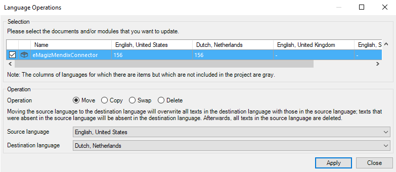
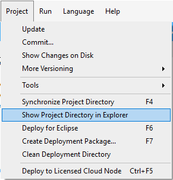
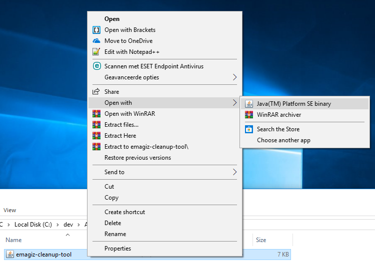
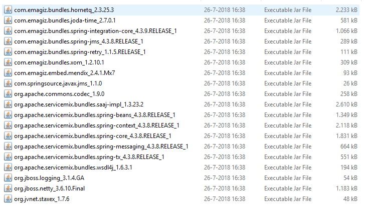
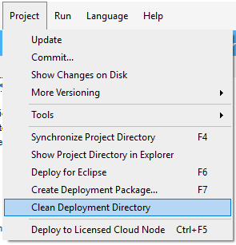

##  1. Usage  
- Deployment/updating flows
- Starting/stopping flows
- Explanation User Interface
- Version Numbering

##  2. Possible errors  

There are several situations where you get errors/warnings in your project as a result of the installation/updating the eMagiz Mendix connector.

  - **Log errors/warnings**
  
 An example of this is when The Mendix project has multiple languages. After the import you will receive multiple errors/warnings. These are easy to solve by following the steps.

   

   

  

  - **Layout errors that can be solved with the eMagiz cleanup tool**
  
Another example is the layouts. These can be solved by choosing the layouts that are used within your project.  

   

 

The cleanup is in the project directory Under the Resource folders.

   

 

Click right mouse button (or double click) For "Openings with | Java™ Platform SE Binary

   

 

After performing this action it is good to check the userlib for verification. This can be based on the following steps. First open your project folder (see below)

   

Then navigate to Userlib. In this userlib, there should only be one reference to a version of the eMagizMendixConnector. (see below)

   

For reference, all JAR files using the eMagizMendixConnector (version 2.4.1):  

   

  - **Cleanup the project directory to avoid other problems**

The last step is to clean up the project directory and then committing your customization. Ideally, you perform all of these actions in a single commit so that you can perform a rollback and so that you can easily isolate any problems.

   

  

##  3. Best practices  

 - Configure startup time
 - Communication in conjunction with Mendix Inbound/outbound Web services
 - Conflicting userlib AppStore Modules
 - Tracing WebServices Lognode at debugging
 - Deployments – updates request handler
 - Restart
 - Stop
 - Start
 - OnDersteunde Mendix Versions
 - What to consider
 - Multithreading
 - Error handling
 - Retry mechanisme
