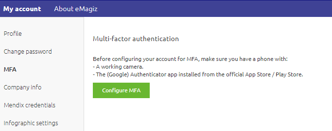
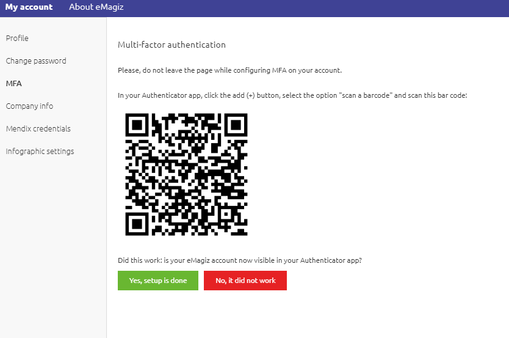

## 1. Introduction

This document describes how to enable MFA to each user account. At the moment the eMagiz bus is enabled to allow only MFA user access, it's mandatory to enable MFA on your account. Specific functionalities in eMagiz are only accessible once a user has entered the MFa code, which is usually valid for 8 hours. Examples include access to Deploy and Manage in the production environment, and setting permission on the bus.

## 2. Steps involved

1. Go to the Administration section of your profile
2. Select the MFA from the left-hand menu

3. Download the Google Authenticator app on your smartphone
4. Scan de QR code with your smart phone and Authenticator app

5. Once done, select the green button to indicate the setup is done
6. In case of problems, contact your eMagiz Partner Manager
