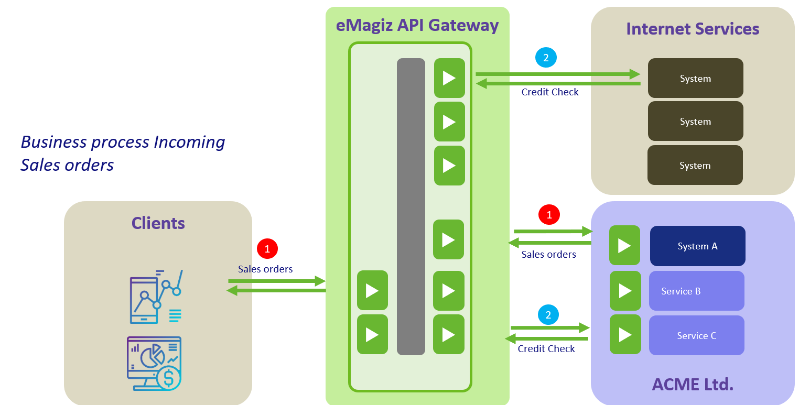
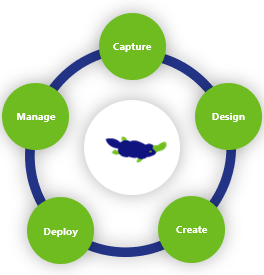

## Release notes API Gateway

This document describes the overall positioning and use of the API Gateway embedded into the Low-code, Enterprise iPaaS platform eMagiz. You will find a short description of this part of the product to understand the overall capability. This release will complement the User Guide also available in the User Guides section. 

Release per July 13rd, 2020. 

## Positioning & Key Concepts

The API Gateway is one of the key Integration patterns that eMagiz supports in the platform. Key concepts of the API Gateway in this context is that it allows to create an entry point for all published API's inside an IT landscape. Backend systems, micro-services or access to external systems can be published, so that either internal development teams and applications can access the specific APIs as part of business process execution.

A typical landscape could look like this. 
The API Gateway is located in the secured eMagiz Cloud and provides the ability to access it from external application users. A client of ACME Ltd. could be sending in Sales Orders directly from their own systems. The incoming Sales order is then delivered back to the back office system of ACME and could send a response back with a successful delivery. Inside the ACME LTd. organization, various developments teams are processing the sales order further. One of the things that need to take place is to perform an external credit check of that specific client. Service C might be responsible for that, and is processing the request/response in a synchronous manner. 

## Key considerations when to use the API Gateway integration pattern

Below is the list of considerations when to use the API Gateway.

One of the first angles to consider an API Gateway is when an integration in synchronous in nature. A business process is handled via a specific application, and that business process requires data from another (micro-)service and can only proceed once that response to that data request is returned successfully. This is a typical synchronous message interaction. The API Gateway is able to provide the exact operation to the application requesting the data.

The other important angle when to consider an API Gateway is to use the gateway concept as a mean to allow external & internal developments teams to connect to published APIs. On the one hand, Sales Orders from external clients might be send to the Gateway, or an internal microservice could be calling an API as part of a business process whereby the API reaches out to another (external) web services. Data is provided via the API Gateway.

Other considerations or key notes when to use an API Gateway are:
- Data is transactional in nature
- Data request is synchronous
- The backend provider of the operation must be online to return or process data - data is pushed
- Standardization of access to data is important 
- Dependency between developments should be reduced - less coupled services 
- Access to the same data can come in from many different systems

## Features

The API Gateway is fully embedded into the eMagiz Low-code Enterprise iPaaS so that users have a similar user experience when configuring the API Gateway, a Messaging integration or an Event Stream. All the platform features in the different ILM phases are able to take into account the API Gateway configuration. What is important to realize is that the primary focus of the API Gateway configuration is to allow all configuration work to take place in the Design phase. You will find out that most or often all the Create models are automatically generated. Only in specific cases where specific customization is required, the created objects can be modified. Newly created Designs could result in rework of the customization in the Create object. 

**1. Capture your API Gateway**
In this phase, the regular operations or message types can be captured with all the necessary information of that specific operation. At the system level, you can indicate that the system acts as backend service provider that has certain API's available

**2. Design an API Gateway**
This is the central phase in the configuration of the API Gateway. The main idea is that the entire Gateway should be configured from the Design phase The front-end Gateway is the part where the external application user(s) can access the specific operation published and where the application user is authorized for. Specific operations can be configured and documented including parameters and response types. In the backend operation provider (an eMagiz system), the actual link to the backend operations can be registered including parameters. Frontend and backend operations can be connected to each other at the moment an operation is exposed in the eMagiz API Gateway. Integrations or message types connected to a backend operation providing system are now able to have operations as child objects to get a better overview of what operations are available. Operations are still the integrations reported in the various parts of eMagiz - the message type becomes more of a group object.

- In case the backend service provider has an OpenAPI 3.0 specification available, this can be imported to have everything directly configured. Documentation towards what OpenAPI statements are support can be found in the help texts.
- The security method for entire Gateway can be set - at this moment the eMagiz API Gateway works with API keys that be handed out to application users. Users can be provided with such an API key, and users are assigned certain roles. These roles have in turn access to certain backend operations.

For transformations, the request & reply system messages can be created visually like in the platform. The same goes for the gateway model that can be created visually as well. There is no concept of a CDM message as in the Messaging pattern. The transformation & Enrichment can take place in the standard mapping tooling available. So the concepts of Request message, Response message, Mapping are available as right click options in the platform. 
Other transformation to reach SOAP/XML based backend operations are also possible by selecting what format the operations has in the backend operation. This will then automatically ensure the transformation considers the JSON to XML transformation. For other protocol transformations, the XML variant can be used and custom influenced in the Create phase.

**3. Create phase for the API gateway**
In the Create phase, integrations with backend operations can be added to the Create model as usual. Result is that the specific components are created automatically. Via the Create - API Gateway section, the components are listed for now. In the upcoming releases, the Create phase will be updated to embed the API Gateway components in the complete view. 

**4. Deploy the API Gateway**
In the Deploy Phase the application users can be registered, the API key generated automatically and access to the specific backend operations where that application user should have access granted. Furthermore, the components of the API Gateway are the following: 
- Gateway infra
- All entry (later replaced with single entries per operation)
- Exit gate (contains connection to backend provider)

These components can be made part of the Release and Deployment plans. The Deploy Architecture will contain the Cloud architecture to be deployed, and can be applied with the Design Architecture. The API Gateway runs in the eMagiz Cloud exclusively for now. 

**5. Manage phase specific to the API Gateway**
In this phase, everything works as usual. Error messages of eMagiz will be routed in the Error messages, and the queue statistics are available as a separate entry in the left-hand menu. 

