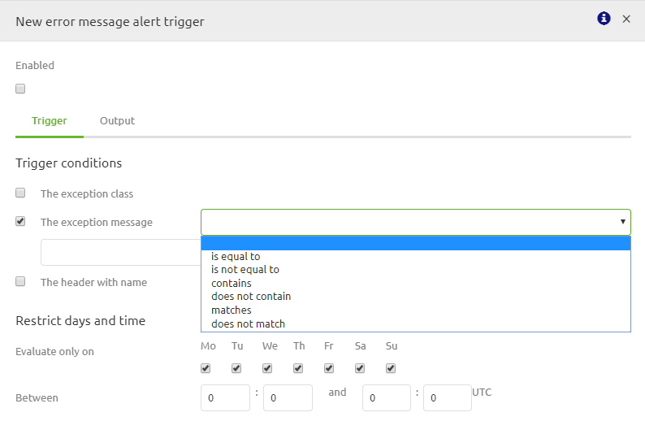
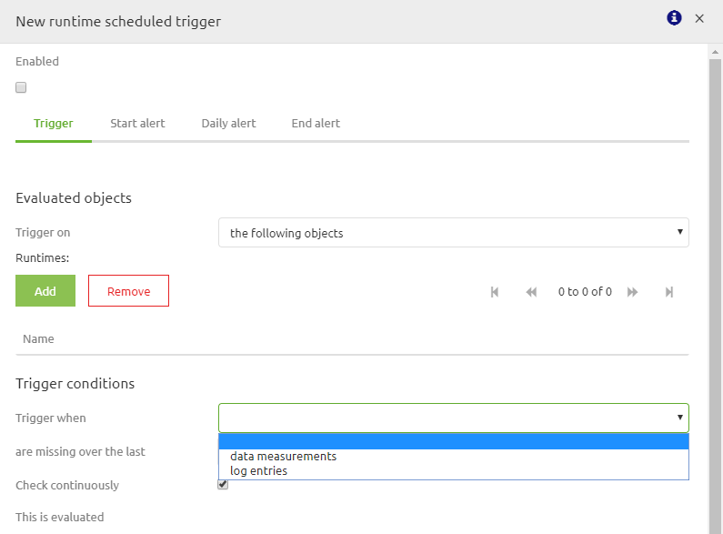
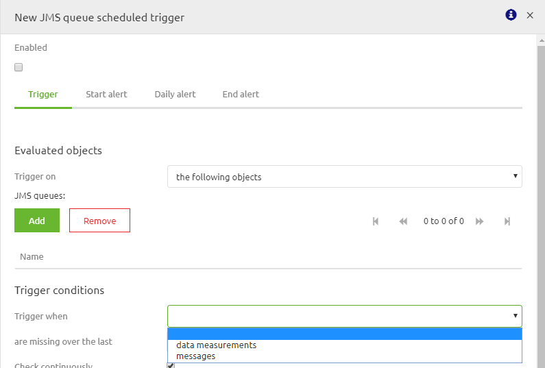

## Configuring alerting in an effective way

Last update date: 30-03-2020
 
This document discusses the practical implementation of alerting within eMagiz and how you can best use this to stay in control of your complete environment.
The main idea behind alerting in general and in eMagiz is to stay in control of the integration landscape we are developing alongside our customers. With alerting you will have the option to specifically manage your integrations by defining thresholds and triggers on which a specified actions are needed when such a trigger arises.
To summarize, alerting gives you:
-	Effective management to stay in control of your integration landscape.
-	Configuration options to let the right people know the status of integrations.

## Best practices
-	Use the standard as described here to correctly set up the alerting
-	Always stay in contact with the business, preferable as early as possible on which triggers they deem relevant
-	eMagiz already provides you, from the start point, with a set of relevant triggers
-	Always send alerts to generic mailboxes or multiple persons. This to prevent problems when someone is unable to check their email. 
-	Use the include option. This means that you select all flows or runtimes for which a certain trigger is relevant. This prevents unnecessary triggers the moment you add an integration to Create. See figure below for an example

-	Always link a tag with a trigger. Tags can be re-used. Triggers need to be as specific as possible
-	Always use a generic description for your trigger so it is clear to all what the function of the trigger is
-	When naming the tags please consider this naming convention
o	All standard tags are prefixed with Standard - . This with the exception of the Error messages and Cloud alert tag. Those are used by eMagiz for separate purposes
o	All business tags are prefixed with Business - 

## How-to steps Configuring alerting
Follow these steps carefully in order to acquire the desired result. If a step is unclear or you are not able to follow it, please contact CAPE Academy. 
1.	First determine the alert you are dealing with. Within eMagiz we general divise alerting into three separate entities (default aka standard, business and customer support)
a.	If you want to update an standard alert please continue with step 3
b.	If you want to add an business alert please continue with step 5
2.	When dealing with an alert you need to make sure that this alert is kept up to date with developments within your integration landscape. So with each deployment on an environment, especially Production, you need to check whether all relevant alerts still include all flows or runtimes (depends on the alerting at hand). To make your life easier use the deployment plan in which you can add manual steps in which you can state which alerts need to be changed (see figure below).

3.	Navigate to Manage -> Alerting -> Triggers
4.	Continue with How-to steps Create or Update alerting

## How-to steps Create or Update alerting
1.	Navigate to Manage -> Alerting -> Triggers
2.	Check if there is already an trigger checking your use case
a.	If yes, double click on the alert in question and add the runtime, flow, statistic etc. to the alert and press save. No need to continue any further.
b.	If no, continue with step 3
3.	Navigate to Manage -> Alerting -> Tags
4.	Check if there is already a tag for your use case. See best practice on tag names for more information.
a.	If yes, then continue with step 5
b.	If no, create a new tag conform the best practice and continue with step 5
5.	Press the New button and determine the type of trigger (see figure 4)
a.	If you select Error messages, See How-to steps Trigger Error Messages. You would want to select this type when you want to raise alerts on Error Messages which you received from all queues that are running on a certain environments
b.	If you select Log entries, See How-to steps Trigger Log entries. You would want to select this type when you want to raise alerts on any type of Logging that is generated on your environment
c.	If you select Measurement data, See How-to steps Trigger measurement data. You would want to select this type when you want to raise alerts on all statistics (runtime and queue) that is generated on your environment
d.	If you select Missing data, See How-to steps Trigger missing data. You would want to select this type when you want to raise alerts on all statistics (runtime and queue) that is not generated on your environment

## How-to steps Trigger Error Messages
1.	After you have selected the option Error messages as trigger type you will see the following pop up.

2.	For triggers on error message you have three options as you can see from the above pop up:
a.	The exception class. If you want to use this trigger condition continue with step 3
b.	The exception message. If you want to use this trigger condition continue with step 6
c.	The header with name. If you want to use this trigger condition continue with step 9
3.	Select the checkbox before the exception class. The screen will change to the following

4.	Select if you want the exception class to be equal to, not equal to, contains, does not contain, matches or does not match. The advice would be to make the alerting as specific as possible so choose: equal to, contains or matches
5.	Select the correct exception class for which the trigger needs to raise an alert. Examples are:
a.	org.springframework.integration.MessageRejectedException
b.	org.springframework.messaging.MessageHandlingException
c.	org.springframework.web.client.HttpClientErrorException
d.	com.emagiz.components.error.ErrorToXmlTransformer.RestErrorResponseBody
6.	Select the checkbox before the exception message. The screen will change to the following

7.	Select if you want the exception message to be equal to, not equal to, contains, does not contain, matches or does not match. The advice would be to make the alerting as specific as possible so choose: equal to, contains or matches
8.	Select the correct exception message for which the trigger needs to raise an alert. Examples are:
a.	400 Bad Request
b.	Message was rejected due to XML Validation errors
c.	failed to receive JMS response within timeout of

9.	Select the checkbox before the header with name. The screen will change to the following

10.	Select if you want the name of the header to be equal to, not equal to, contains, does not contain, matches or does not match. The advice would be to make the alerting as specific as possible so choose: equal to, contains or matches
11.	Select the correct name of the header for which the trigger needs to raise an alert. Examples are:
a.	xxx_sourceSystem
b.	xxx_targetSystems
c.	xxx_messageTypes
12.	Select the correct value of the header for which the trigger needs to raise an alert. Examples are:
a.	Project
b.	Order
c.	WMS
d.	TMS

## How-to steps Trigger Log entries
1.	After you have selected the option Log entries as trigger type you will see the following pop up

2.	Select to which runtimes you will apply the trigger. For this also select the most specific option (advice is the following objects). Options are:
a.	The following objects
b.	All objects
c.	All objects, except for
3.	Select on which trigger condition you want the alert to be raised. Options are:
a.	The level. If you want to use this continue with step 4
b.	The bundle. Don’t use this option. It has no practical use
c.	The flow. Don’t use this option. The trigger would we too specific but yet at the same time to generic.
d.	The message. If you want to use this continue with step 5
e.	The stack trace. If you want to use this continue with step
4.	Log entries can be send in three forms i.e. Info, Warning or Error. The Error option is the most relevant one to select as other forms are only relevant in combination with other triggers conditions
5.	Select if you want the message to be equal to, not equal to, contains, does not contain, matches or does not match. The advice would be to make the alerting as specific as possible so choose: equal to, contains or matches
6.	Select the correct exception message for which the trigger needs to raise an alert. Examples are:
a.	org.springframework.transaction.CannotCreateTransactionException
b.	Application exception overridden by rollback exception
7.	Select if you want the stack trace to be equal to, not equal to, contains, does not contain, matches or does not match. The advice would be to make the alerting as specific as possible but due to the nature of stack traces we advise to use the contains function on a specific section relevant to that flow.
8.	Select the correct part of the stack trace for which the trigger needs to raise an alert. Examples are:
a.	org.springframework.messaging.MessageHandlingException: error occurred in message handler
b.	AMQ224095: Error updating Consumer Count

## How-to steps Trigger measurement data
1.	Select which evaluated object type you want to start your trigger with. Two options are predominantly used:
a.	Runtime. If you want to select this option continue with step 2
b.	JMS queue. If you want to select JMS queue continue with step 5

2.	You will be prompted with the following pop up. First step is to select the Runtimes for which the trigger will be executed. Once again the advise is to use the following objects option

3.	Next step would be to select the Trigger condition on which you want the trigger to raise an error. For each option you have furthermore the option to select is greater than or is less than. 
4.	Use the runtime statistics of the runtime(s) for which you want to configure the trigger to determine the correct thresholds.
5.	You will be prompted with the following pop up. First step is to select the JMS queues for which the trigger will be executed. Once again the advise is to use the following objects option

6.	Next step would be to select the Trigger condition on which you want the trigger to raise an error. For each option you have furthermore the option to select is greater than or is less than. 
7.	Mainly the two following options are used in all busses (and are supplied standard by eMagiz):
a.	One for queued messages
b.	One for number of consumers
8.	Use the queue statistics of the jms queue(s) for which you want to configure the trigger to determine the correct thresholds (in combination with common sense)

## How-to steps Trigger missing data
1.	Select which evaluated object type you want to start your trigger with. Two options are predominantly used:
a.	Runtime. If you want to select this option continue with step 2
b.	JMS queue. If you want to select JMS queue continue with step 6

2.	You will be prompted with the following pop up. First step is to select the Runtimes for which the trigger will be executed. Once again the advice is to use the following objects option

3.	The two following options are used in all busses (and are supplied standard by eMagiz):
a.	One for data measurements
b.	One for log entries
4.	If you feel you need to change and/or add/adapt triggers of this kind please take a look at those eMagiz generated for you. Those are generated based on the best practice
5.	You will be prompted with the following pop up. First step is to select the Runtimes for which the trigger will be executed. Once again the advice is to use the following objects option

6.	For trigger conditions you have the following options:
a.	Data measurements. Loss of data measurements is already covered on runtime level, with the queued messages and number of consumers trigger. Therefore this is not needed unless you have a specific scenario.
b.	Messages. In some cases it can be handy if you receive an alert when messages are missing over a certain period of time. For example when you have an integration that is always running, each day, between 19:00 and 20:00 and needs to deliver data. If not someone needs to know. Continue with step 8 in which we elaborate on this example further.
7.	Select messages for Trigger when the following option: messages
8.	Select for are missing over the last the following option: 15 minutes
9.	Check continuously on yes
10.	Evaluate only on: Select all days (default option)
Between: 19:00 and 20:00. Be aware eMagiz talks UTC time so take that into account when selecting the correct values.
