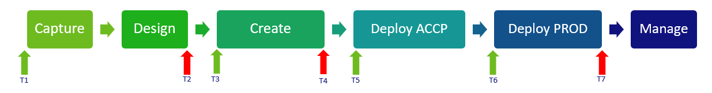

eMagiz Defintion of Done

## Positioning

This document describes tollgate DevOps teams could implement when using eMagiz for their daily integration activities. Tollgates in this context are the list of items that can be inserted into Defintion of Done lists that are used. These tollgates are organized around the Integration LifeCycle of eMagiz (Capture, Design, Create, Deploy and Manage), further refered to as the ILM. The ILM has the intention to take each new or changed integration through a guided process to ensure all steps required are actually taken. For most of these process steps, certain elements can be verified before continuing which can help peer reviews and prepare deployments. Further, these items will help you to make a good busines ready designs for every integration. 

Depending on the structure used in the user story writing for DevOps teams, these DoD items can be set properly at the right location. For instance, the Capture & Design ILM phases are often put into single User Story so that tollgates T1 and/or T2 can be connected to this User Story as DoD items. Situations are different every time, the intention is to provide some inspiration to DevOps team with daily eMagiz activities.

The tollgates are described below in terms of a list of suggestions per tollgate. For more information on the Integration Life Cycle, please check out the documentation menu to find out more.

## Tollgate T1 – Business Ready

Objective of this tollgate is to validate the business value to add new integrations before starting the actual change in eMagiz. 

- Background and necessity of the new integration
- Sense of urgency and deadlines
- What are the business processes involved
- What is the criticality of the business process and what indicators are used to measure this
- What type of information is exchanged?
- What are the assumptions, preconditions and dependencies from a business point of view
- Are there legal implications or requirements
- What is the impact on architectural principals
- Is there an formal approval from key stakeholders to implement this integration?

## Tollgate T1 – Discovery Done

Objective of this tollgate is to ensure all aspects of the integration are properly validated and agreed wit the business before creating the actual integration.

- Clarity on scope, effort, risks and impact (story points)
- Capture 100% completed
- Design 100% completed (CDM, Message definitions and Design Architecture)
- Definitions from both system stable and final
- High level design available
- Impact on eMagiz Cloud resource known
- Impact on timelines with associated teams and involved application agreed
- Summary presentation available with summary of Discovery and approved by key stakeholders

## Tollgate T3 – Delivery Ready (to start)

Objective of this tollgate is to validate if the create phase can actually start - are all information elements available?

- Connectivity test on environments from source and target system successfully completed
- Handover from eMagiz Architect to eMagiz DevOps team completed
- Definitions from both system stable and final
- example messages available and representative
- Test scenario's created by business ready and available

## Tollgate T4 – Delivery Done

Objective of this tollgate is to validate if the Create phase has been properly completed - focus on review and peer review.

- Create completed 
- Alle flows are part of a Release and are running stable without errors on Test
- Unit tests are available and stable
- Peer review completed
- End to end test with business completed
- Test report presented and agreed with business stakeholders

## Tollgate T5 – Ketentest Ready (to start)

Objective of this tollgate is to ensure the business can actually test the new or changed integratio in the Acceptance environment.

- Unit test successfully completed on Acceptance
- Test scenario's are accepted by the business
- Criteria for successful end to end test known
- Acceptance environments of involved systems are represenative for the integration to test
- Dates are agreed jointly to run the test
- eMagiz specifics
	- All flows are released on Acceptance
	- Connectivity check done on Acceptance
	- Properties are properly configured on Acceptance
	

## Tollgate T6 – Go-live Ready

Objective of this tollgate is to prepare the Go-live of the Releaes to production

- End to end test completed
- Go live plan ready and reviewed
- Go live date agreed with the business
- Roll back scenario's ready
- Risk assessment completed and actions set out
- eMagiz specifics
	- All flows are inside a proper release
	- Connectivity check done on Production
	- Properties are properly configured on Production
	- Deploy Architecture current

## Tollgate T7 – Go-live Done

Objective of this tollgate is to validate the production environment if the Release is running on Production.

- No warnings or errors that can't be explained or for which no plan is in place
- Alerting updated
- Transfer to Support completed in case of a Model SLA
- All systems are live.

