## 1. CONTEXT AND REQUIREMENTS   
eMagiz offers the possibility to transform a flat file structure, i.e. textfile, csv file or EDIFACT file, to a xml message. The component needed to execute these kinds of transformations is called: flat file to xml transformer. The other way around is also possible, this is called a xml to flat file transformer. For transforming EDIFACT messages eMagiz offers a separate option which you can use if the EDIFACT you are transforming is composed based on the EDI standard.

**When to use flat file to xml transformation via the tooling**

Use this how to when transforming flat file messages to xml with the help of the eMagiz tooling

**When not to use flat file to xml transformation via the tooling**
In any situation where you don’t need to transform a flat file to xml.

**Requirements**
No technical requirements are necessary for this how to.

## 2.	BEST PRACTICES
As the name suggest this standard component gives you, the user, the possibility to transform an flat file (text, csv or EDIFACT) to an xml message and vice versa. In the following chapters we will work out two examples for each option. The first example will always be the simpler case, which you will encounter more often. The second example will be the advanced case. BE AWARE! In case of transforming an EDIFACT messages this can generaly be done easier via the special components eMagiz provides you with. Keep this in mind when designing your message solution. Do you want to know more about transforming EDIFACT messages please see this link. 

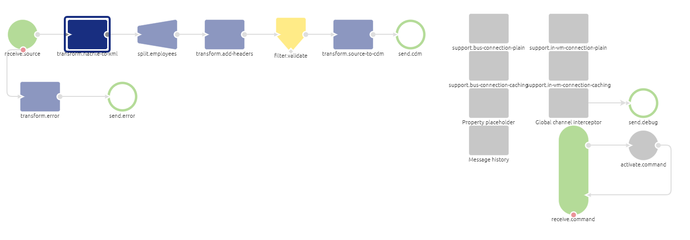

## 3.	HOW-TO STEPS FLAT FILE TO XML (SIMPLE)
Follow these steps carefully in order to acquire the desired result. If a step is unclear or you are not able to follow it, please contact CAPE Academy.

Step 1: Adding the correct component
The first step is adding the correct component to your flow. In this case you will need a blue rectangular shape component of the transformer family. The component is called: flat file to xml transformer. It is wise to name it according to its function. This way it is clear for all to see what the function of the component is within the context of the flow. See below for an example of such naming convention.

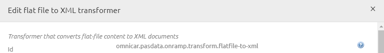

Step 2: Choosing the correct line mapper type
In most cases the flat file you are working with is separated by a delimiter. This delimiter is often a comma or a semicolon. In these cases setting up the component correctly is not that hard.
In this step you need to select Default line mapper as the option for line mapper type. This is the standard that assumes that every line in the file has the exact same format. 

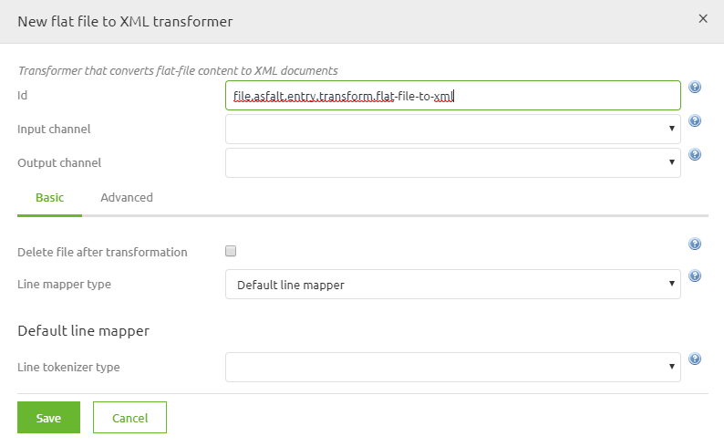

Step 3: Choosing the correct line tokenizer type
The next step will be to select the line tokenizer type. In this case choose the Delimited line tokenizer. With this option you are telling the component that each column is separated by a delimiter. The other option eMagiz provides you with is that each element within each line has a fixed length on the basis of which eMagiz can transform the message (this option is not discussed further in this how to).

Step 4: Definining the columns
The fourth step would be to define the columns you are expecting in the source file. This can be done in two different ways. One way is to manually create them. So for each column in the source file you will create a new entry here. Or you will use a CSV (comma separated) in which you specified all the columns that are present in the source file. The result will be something like this

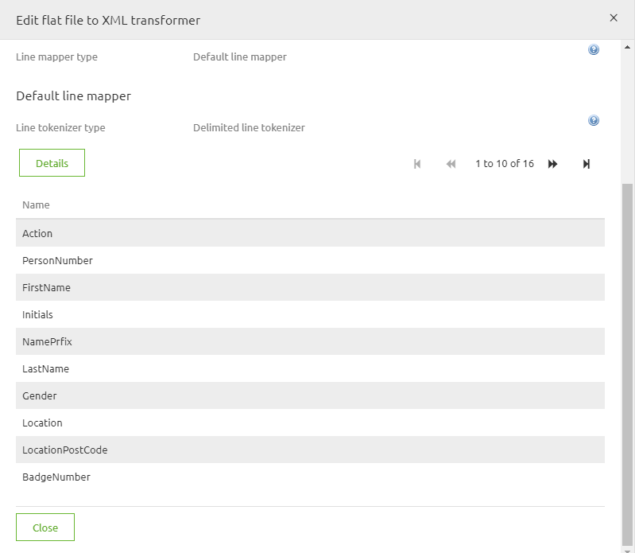

Step 5: Definining the root and record element

Step 5 of the process will make you define the root and record element of your output xml. This setting can be altered under the Advanced tab in the pop up you are currentrly working in. Often we see that a Records / Record structure is used or as we see in the example below, Employees/Employee.

Step 6: Setting the delimiter (optional)

If the delimiter in your source file deviates from the standard (comma) you can specify this under the Advanced tab. The option is called Delimiter and can be found under Line Tokenizer Type. In this field you could place a semicolon, inverted question marks or exclamation marks.  

Step 7: Skipping the (first) line (optional)
On the Advanced tab you also have the option to skip lines. Most often this will come into use when you are confronted with a flat file for which the first line consists of headers instead of data. In rare cases you might even want to skip more lines than one. This is possible. Be aware that you can only skip lines from the top, so not somewhere in the middle or at the end of the file.

Step 8: Seeing the result
As a result of this transformation you will end up with a flat xml structure consisting of a root element with under it a list of record elements. See below for an example. In general you will need to transform this structure to a more layered xml message that you have defined in your CDM. This can, of course, be done via the standard transformation tooling of eMagiz.

## 4.	HOW-TO STEPS FLAT FILE TO XML (COMPLEX)
Follow these steps carefully in order to acquire the desired result. If a step is unclear or you are not able to follow it, please contact CAPE Academy.

Step 1: Adding the correct component
The first step is adding the correct component to your flow. In this case you will need a blue rectangular shape component of the transformer family. The component is called: flat file to xml transformer. It is wise to name it according to its function. This way it is clear for all to see what the function of the component is within the context of the flow. See below for an example of such naming convention.

Step 2: Choosing the correct line mapper type
In more complex scenario’s you will encounter flat files in which each line has its own structure. 
In dit soort gevallen is het nodig om in hetzelfde standaard component te kiezen voor Pattern matching composite line filter. In this step you need to select Pattern matching composite line filter as the option for line mapper type. This is the option that assumes that every line in the file has an unique format. 

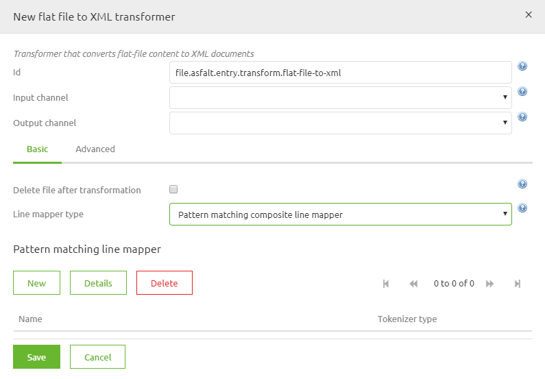

Step 3: Definining the structure of the rows
For each line you now have to specify how this is build up. This can be done in two parts. First by entering a pattern by which eMagiz can tell which line it needs to select. This pattern will almost always be based on the start of a line, i.e. 0*. The * is important. This basically states this pattern is valid for all lines that start with a 0 and have other characters following it.
The second part will be to select the Fixed length tokenizer (this is most common in this combination) and definining an entry for each part of the line and specifying when that part of the line starts and ends. See an example below

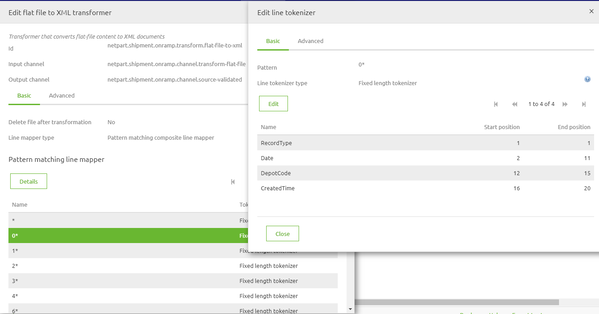

BE AWARE, On the Advanced tab of the Edit line tokenizer tab you will have the option to determine whether the pattern you have just defined needs to be maintained strictly or not. If the boolean is turned to yes (default) this means that the line in question always looks like the pattern you have defined, without exception. If you are working with a file for which this does not apply you can set the boolean to false. This way you are more flexible in transforming the data but you will also increase your chances on unexpected results.

Step 4: Definining the root and record element

Step 5 of the process will make you define the root and record element of your output xml. This setting can be altered under the Advanced tab in the pop up you are currentrly working in. Often we see that a Records / Record structure is used or as we see in the example below, Employees/Employee.

Step 6: Skipping the (first) line (optional)
On the Advanced tab you also have the option to skip lines. Most often this will come into use when you are confronted with a flat file for which the first line consists of headers instead of data. In rare cases you might even want to skip more lines than one. This is possible. Be aware that you can only skip lines from the top, so not somewhere in the middle or at the end of the file.

Step 7: Seeing the result
As a result of this transformation you will end up with a flat xml structure consisting of a root element with under it a list of record elements. See below for an example. In general you will need to transform this structure to a more layered xml message that you have defined in your CDM. This can, of course, be done via the standard transformation tooling of eMagiz.

## 5.	HOW-TO STEPS XML TO FLAT FILE (SIMPLE)
Follow these steps carefully in order to acquire the desired result. If a step is unclear or you are not able to follow it, please contact CAPE Academy.

Step 1: Setting up the xml
It is beneficial, when working with this component to prepare your xml message to make this transformation much easier. This can be done to create a structure in which you have a root under which you have one list of records containing all relevant information (i.e Records/Record structure)

Step 2: Adding the correct component
The first step is adding the correct component to your flow. In this case you will need a blue rectangular shape component of the transformer family. The component is called: xml to flat file transformer. It is wise to name it according to its function. This way it is clear for all to see what the function of the component is within the context of the flow. See below for an example of such naming convention.

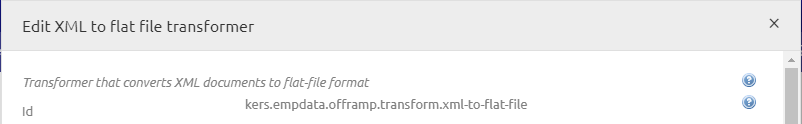

Step 3: Select the type of flat file you want to generate
In most cases you will want to generate a csv file. So you can select that option and already state how many columns you want in your output. This number should correspond to the number of attributes in your input xml. After you have executing both actions you only need to press generate columns.

Input:

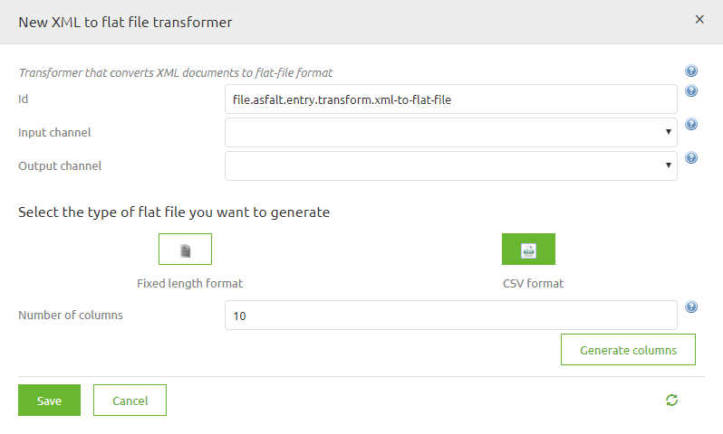

Output:

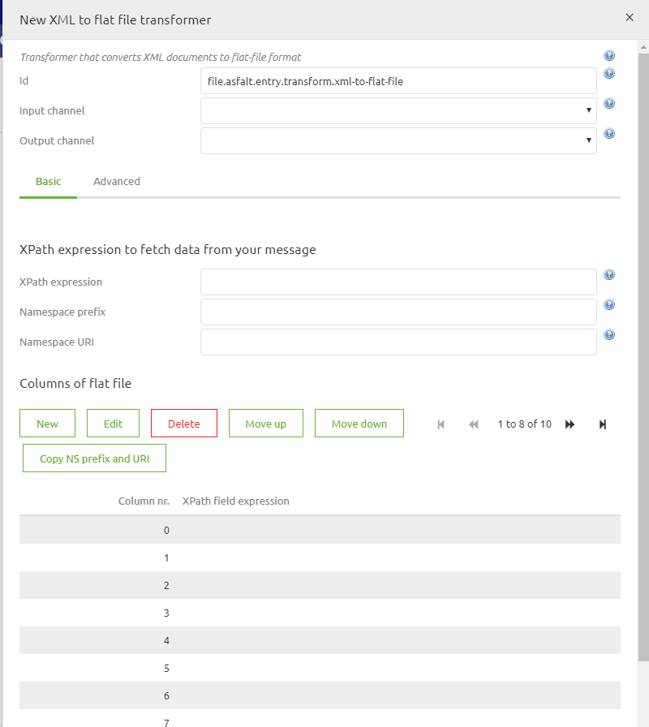

Step 4: Definining the xpath to create the lines
The first thing we need to set up within the component is the xpath expression we are using to split the incoming xml messages to separate lines we are transforming to lines within the flat file. Standard we often see an xpath like: /Records/Record. In the example below we choose /*:Employees/*:Employee. Alternatively you can determine the namespace prefix and the namespace itself, just as you can in the support object called Xpath expression.

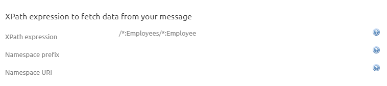

Step 5: Filling in the correct xpath expression per column
For each column you have just generated you now have to define the xpath expression. Because you were smart in step 1 of this how-to this step just has become a lot easier. Due to the nature of the xml message that will form the input the xpaths you need to set will mimic the name of the attribute they correspond with. See below for an example

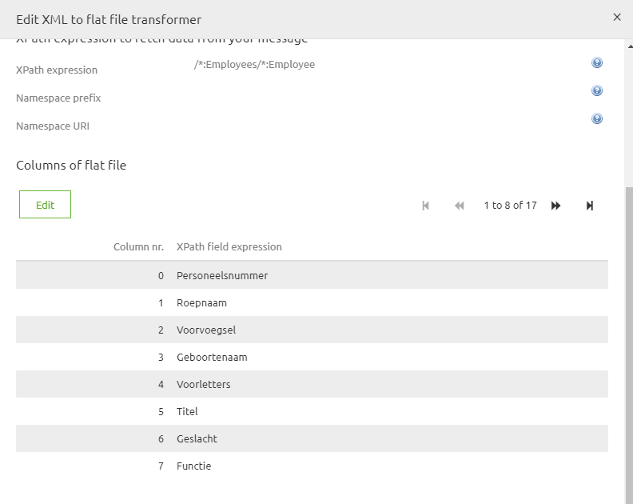

 
BE AWARE, when the input xml has a namespace you need to take this into account when writing your xpath expression to make this work. Just as you would need to take that into account when using the standard transformation tooling.

Step 6: Setting the delimiter (optional)

If the delimiter in your output file deviates from the standard (comma) you can specify this under the Advanced tab. The option is called Delimiter. In this field you could place a semicolon, inverted question marks or exclamation marks.  

Step 7: Setting the Line separator (optional)
On the Advanced tab you also have the determine the line separator. Most often this will come into use when working with different operating systems. The default “Linux” enter (\u000A) differs from the default “Windows” enter (\u000D\u000A). So when the customer asks you to use an CarriageReturn and LineFeed as Line separator go for the Windows option.

Step 8: Setting the charset (optional)
In some cases you need to deviate from the standard UTF-8 charset when formatting the lines. If this is the case you can determine the charset in this component in order for the connected system to handle the input correctly. Examples of different charsets are:
•	windows-1252
•	US-ASCII
•	x-UTF-8-BOM

## 6. HOW-TO STEPS XML TO FLAT FILE (COMPLEX)
Follow these steps carefully in order to acquire the desired result. If a step is unclear or you are not able to follow it, please contact CAPE Academy.

Step 1: Setting up the xml
It is beneficial, when working with this component to prepare your xml message to make this transformation much easier. In this complex case this will be done by using a custom xslt to already format the xml in such a way that it will become easier to split and use this component. In the custom xslt you can create a record in which you define two parts of the line that have a certain structure (i.e recordtype and recordvalue).
If you need held setting up such an xml please feel free to contact the CAPE Academy or the eMagiz Competence Center.

Step 2: Adding the correct component
The first step is adding the correct component to your flow. In this case you will need a blue rectangular shape component of the transformer family. The component is called: xml to flat file transformer. It is wise to name it according to its function. This way it is clear for all to see what the function of the component is within the context of the flow. See below for an example of such naming convention.

Step 3: Select the type of flat file you want to generate
In these cases you will want to opt for the fixed length format option and in this example we need two columns
Input:
FlatFileTransformation-Step3-1

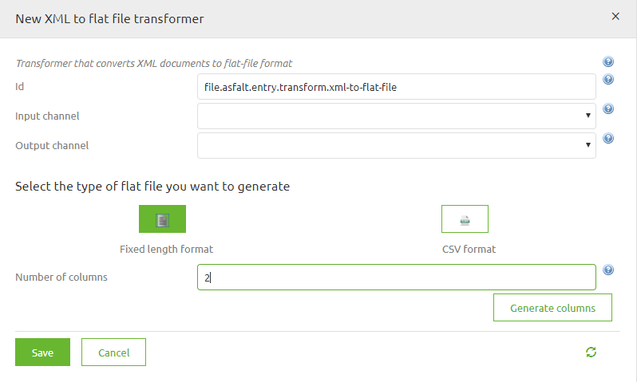

Output:

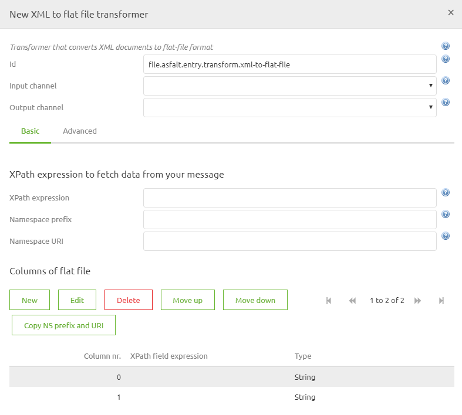

Step 4: Definining the xpath to create the lines
The first thing we need to set up within the component is the xpath expression we are using to split the incoming xml messages to separate lines we are transforming to lines within the flat file. The expression is completly depended on how you have built your xml in step 1

Step 5: Filling in the correct xpath expression per column
For each column you have just generated you now have to define the xpath expression. Because you were smart in step 1 of this how-to this step just has become a lot easier. Due to the nature of the xml message that will form the input the xpaths you need to set will mimic the name of the attribute or entity they correspond with. See below for an example

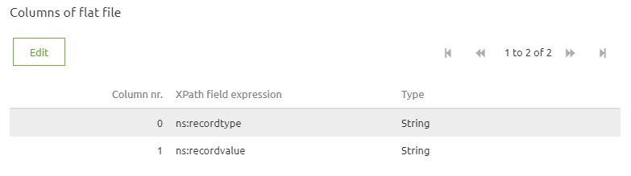

 
BE AWARE, when the input xml has a namespace you need to take this into account when writing your xpath expression to make this work. Just as you would need to take that into account when using the standard transformation tooling.

Step 6: Setting the Line separator (optional)
On the Advanced tab you also have the determine the line separator. Most often this will come into use when working with different operating systems. The default “Linux” enter (\u000A) differs from the default “Windows” enter (\u000D\u000A). So when the customer asks you to use an CarriageReturn and LineFeed as Line separator go for the Windows option.

Step 7: Setting the charset (optional)
In some cases you need to deviate from the standard UTF-8 charset when formatting the lines. If this is the case you can determine the charset in this component in order for the connected system to handle the input correctly. Examples of different charsets are:
•	windows-1252
•	US-ASCII
•	x-UTF-8-BOM

