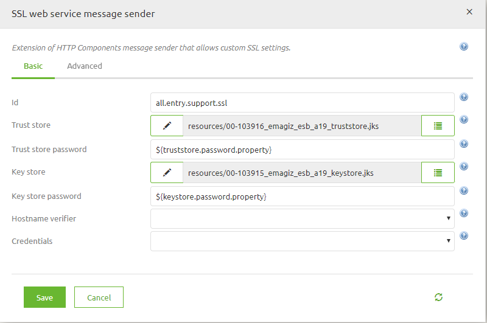
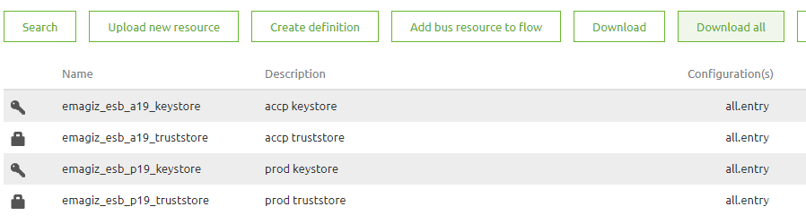
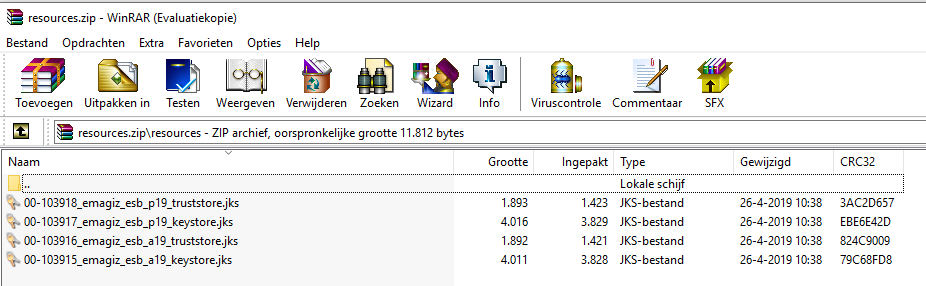
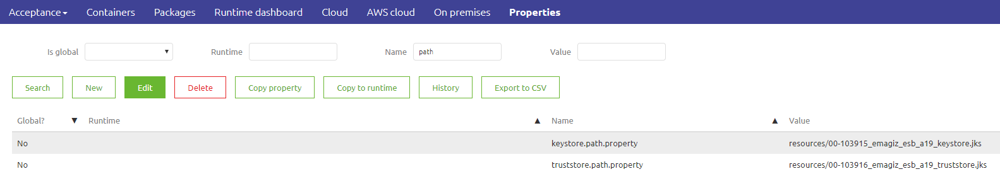
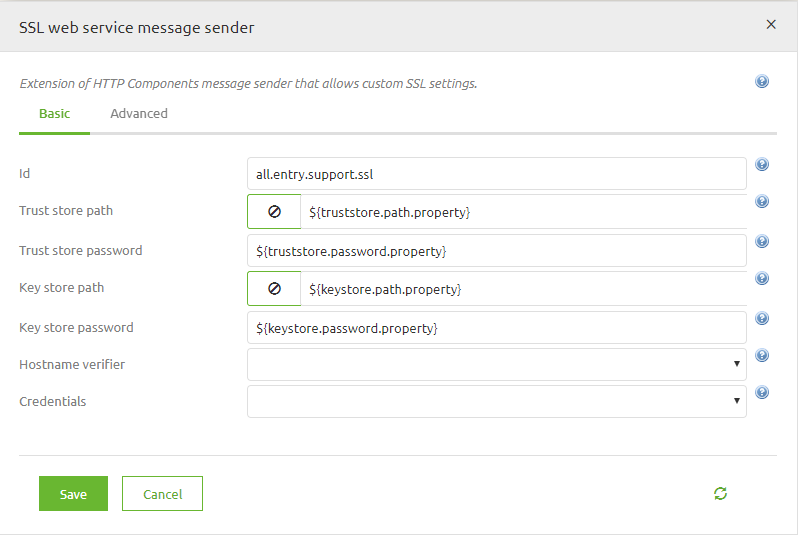

## 1. CONTEXT AND REQUIREMENTS   
This document explains how to create a java trust- and keystore to be used in the eMagiz create phase. Specifically for the support object SSL web service message sender used by the web service outbound gateway. The goal of this being to set up a Two-Way SSL authentication. In other scenarios please consult an expert regarding eMagiz. 
The assumed starting point of this document is that you have already received (either from the customer  a .p12 file containing the keypair and a .cer file containing the to be trusted certificate . 

## 2.	BEST PRACTICES
•	When you have different certificates for test, acceptance or production, you should use a property for the trust- and key store path in your SSL web service message sender component. So that you may use the right keystore for each environment. 
•	Save the passwords you set for the keystores in KeePass so you have a backup for the passes in case someone changes or deletes your properties.
•	Save the certificates in CSP under Registration so you can set a notification for when the certificate is about to expire.
•	Save the certificate and the keystore under the same password to prevent problems

 
## 3.	HOW-TO STEPS
Follow these steps carefully in order to acquire the desired result. 
Before you head into the how-to steps make sure you have downloaded the program Keystore Explorer from the internet. We will use this program to create our trust- and keystore.
How to create a java truststore – containing your trusted certificate(s)
1.	Open Keystore Explorer.
2.	Select Create a new keystore.
(Truststores in this context are just keystores that have trusted certificates)
3.	Select JKS (Java Key Store) and press OK.
4.	Click the Import Trusted Certificate button as can be seen below.

5.	Select the concerning certificate (.cer file).
6.	Save the file and secure it with an appropriate password that matches the password of the keystore (step 7)
7.	Give the keystore an appropriate password.
8.	Save the keystore with an appropriate name as an .jks file.

How to create a java keystore – containing your keypair
9.	Open Keystore Explorer.
10.	Select Create a new keystore.
11.	Select JKS (Java Key Store) and press OK.
12.	Click the Import Key Pair as can be seen below.

13.	Select PKCS #12 (assuming you received a .p12 file)
14.	Type in the Decryption Password and select the .p12 file 
15.	Save the file and secure it with an appropriate password that matches the password of the keystore (step 7)
16.	Give the keystore an appropriate password.
17.	Save the keystore with an appropriate name as an .jks file.

How to use a SSL web service message sender in your eMagiz flow to set-up a Two-Way SSL Authentication: Same key- and truststore for all environments 
18.	Open your flow and start editing.
19.	Create your web service outbound gateway if you have not done that already.
20.	Upload the key- and truststore in the Resources tab.
21.	Create your SSL web service message sender.
22.	Select your key- and truststore in the key- and truststore paths.
23.	Create your key- and truststore password properties and type them in the appropriate fields.

24.	Open your web service outbound gateway, go to the advanced tab and select your SSL web service message sender in the Message sender field.

How to use a SSL web service message sender in your eMagiz flow to set-up a Two-Way SSL Authentication: Different key- and truststores for every environment
25.	Open your flow and start editing.
26.	Create your web service outbound gateway if you have not done that already.
27.	Upload all the key- and truststores in the Resources tab (in this case we have different key- and truststores for acceptance and production).

28.	Now download all your key- and truststores to know what their paths will be.

29.	For each environment create a key- and trustore property containing the path to your key- and truststore. The value should be: “resources/[filename of the key- or truststore]”. So in the case of the acceptance keystore this would be:
“resources/00-103915_emagiz_esb_a19_keystore.jks”

30.	Create your SSL web service message sender.
31.	Type in your key- and truststore path properties.
32.	Create your key- and truststore password properties and type them in the appropriate fields.

33.	Open your web service outbound gateway, go to the advanced tab and select your SSL web service message sender in the Message sender field.

