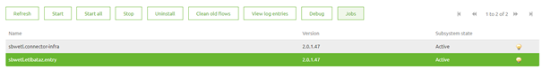
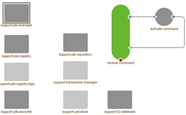
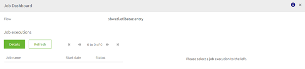

# Job dashboard data pipeline
On this page we will explain a bit on the job dashboard functionality within eMagiz

## Job dashboard
On runtime level within the runtime dashboard a button named Jobs is available for users that make use of one or more data pipeline solutions within their respective eMagiz projects. By clicking on this button after you have selected a specific flow you get an overview of the Job executions of that flow.

## Explaining the inner workings of the Job Dashboard

By clicking on the Job dashboard you send a command to the flow you have selected in your runtime dashboard. This flow receives the command and thereby activates the job manager.

The job manager in turn will look in the H2 database linked to that specific flow for relevant information on the executions of jobs via the data pipeline solutions.

This information is then showed to the user via a popup were you can see all executions and see the details of executions when you click through them

## Best practices

- Create a separate H2 database per data pipeline you build within your project. For example if you have 10 data pipelines you should create 10 separate H2 databases. As stated in the documentation of the store component: 
	- dp.h2.message.database; database name for the local h2 database (eg: "batch"). When using multiple pipeline flows on one container, consider renaming this property by replacing 'message' with the corresponding message type name in the 'support.h2-database' component.
- Clean up the H2 database on a periodic basis to keep its contents in check to prevent that the Job dashboard will stop functioning
- Use the Job dashboard in conjuction with the Manage phase to monitor and set up alerting surrounding the performance of the data pipeline solutions