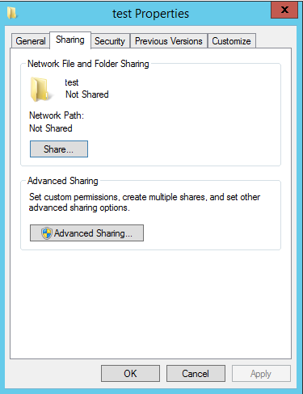
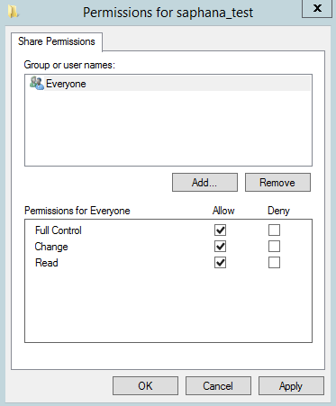
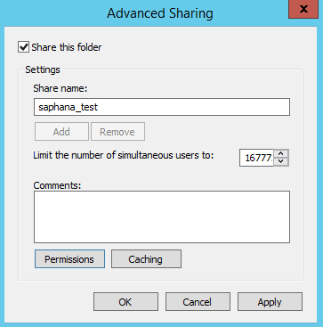
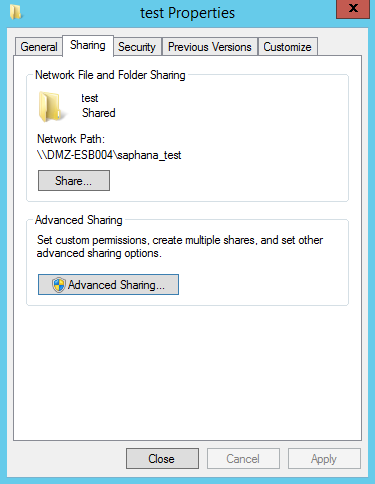
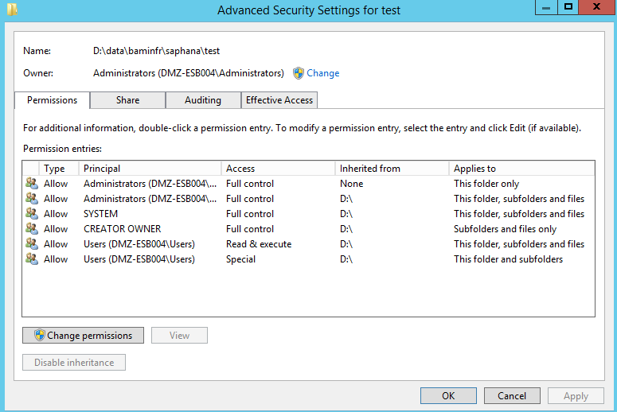
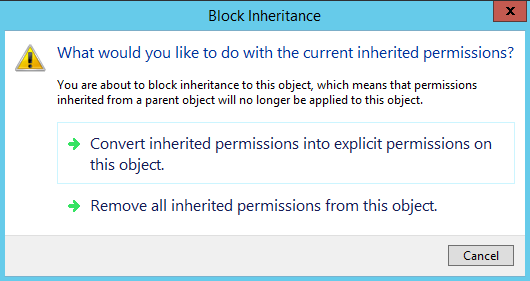
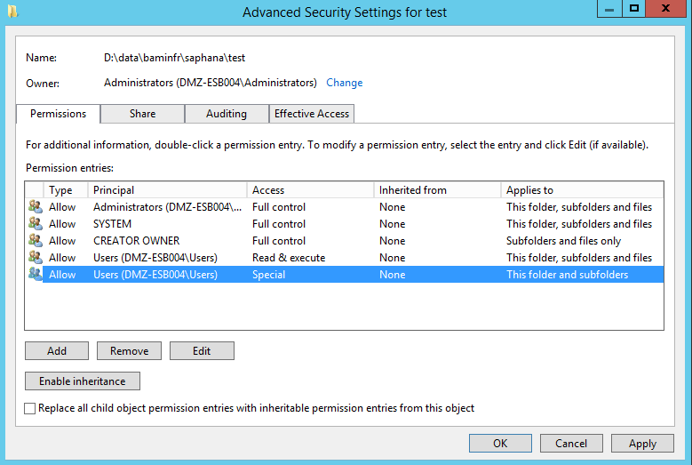
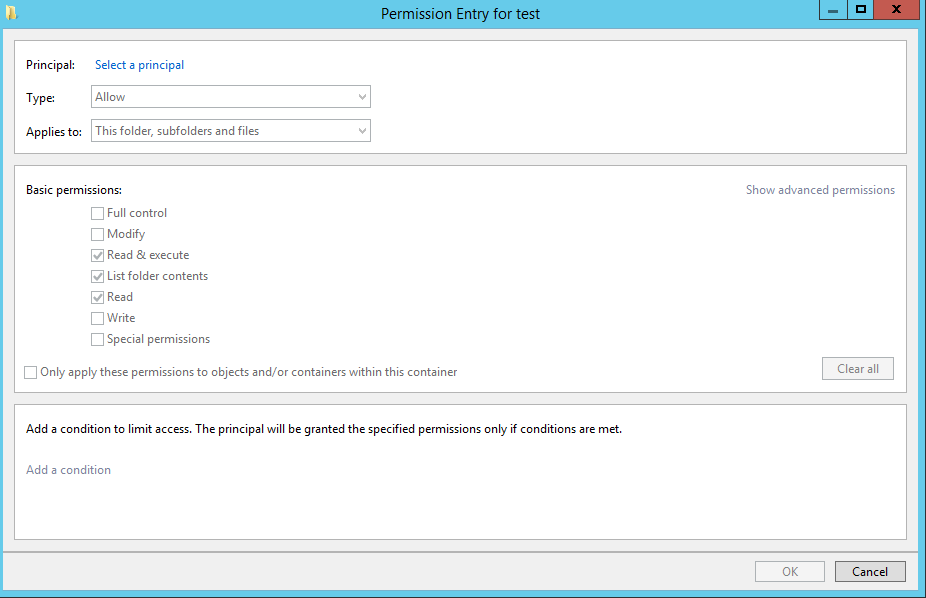
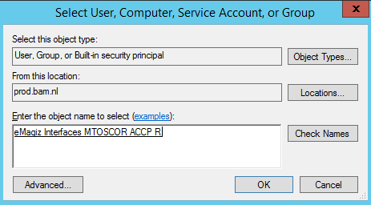
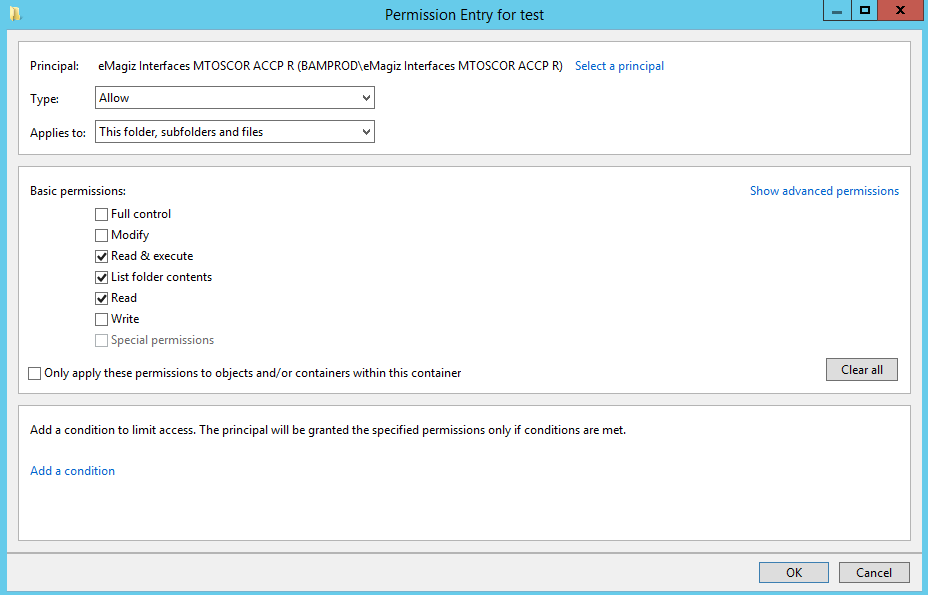

## 1.CONTEXT AND REQUIREMENTS   
This document discusses how to create a network share and give users or AD groups rights to access those shares.
The main idea behind network shares is to give users located somewhere else in the network the ability to see and possibly write documents in a certain folder. To make sure not everyone is able to do so the access rules of such a network share need to be configured properly. This how to will guide you to correctly create a network share and configure the access rights correctly 

## 2.	BEST PRACTICES
•	Give rights to AD Groups on the Production and Acceptance environment and not to specific users
•	Name all network shares according to a pre-defined naming convention

## 3.	HOW-TO STEPS
Follow these steps carefully in order to acquire the desired result. If a step is unclear or you are not able to follow it, please contact CAPE Academy.
**3.1 How to create a network share?**
 **3.1.1	Navigate to the folder you want to share**
  
  Right-click on this folder. Navigate to Eigenschappen/Properties and select Sharing. The end result should look similar to what is shown below:
  

  **3.1.2	Click on Advanced Sharing**
  
  •	Select the tickbox to share the folder. 
  •	Give the share a name. Naming convention used is {systemname_environment}. If there are more ESB’s with simular system names, then the naming convention is {busname_systemname_environment}
  •	Click on the button called Permissions
  •	Select Everyone, give them full control. This is because you want all users in the organisation to be able to see the share (access is arranged elsewhere, described further in this document) The permissions page should look similar to this:
  

  •	Press apply and press OK. This will send you back to the previous tab (Advanced Sharing). This should look like this
  

  •	Press Apply and OK. This will send you back to the previous tab (Share). The end result should look similar to this. As you can see a network path has been added.
  

**3.2	How to configure the access rights?**
  
  Navigate to the tab called Security
  The security tab you need is the one from the folder for which you just created a network share. 
  •	Click here on the button called Advanced. This leads you to the next screen
  

  •	Press the button Change permissions
  •	Select one of the entries and press Disable inheritance. This is required to configure explicit access rights for the share. This will give you the following pop up
  

  •	Select the option called: “Convert inherited permissions into explicit permission on this object”. This will lead to the following screen
  

  •	Select all entries for ‘Users’ (in this example there are two) and select remove. This is important because otherwise ALL users in the organisation would have access rights to this share.
  •	Make sure the Owner is an Administrator AD group and not a single user. In this example this is configured correctly.
  •	Click on the button Add. This will lead you to the new screen
  

  •	Click on select a principal and when presented with the pop-up type in the name (or part thereof) of the AD group you want to grant rights to the share. It is important the rights are only granted to AD Groups and not to individual persons. For system users this is allowed.
  •	Click on the button Check names if the name is not yet underlined. Select the correct name and press OK. This leads to something similar to this
  

  •	Press OK
  •	Select the corresponding rights you want to give to the AD Group you just selected
  o	Full control in case of Read & Write rights
  o	Standard rights which is the default Windows suggestion in case of Read rights.
  •	These actions make sure you end up with something comparable to this
  

  •	Press OK
  •	If you are done, Press Apply and then OK, else press Add to add a new AD group that needs rights to the share.
  •	Press Close
  •	You are done.

## Key note
Since build 50 the underlying frameworks of eMagiz is using an updated version of Java, which uses a different approach (Java method) for verification. In previous versions, bullet 1 below is used; in the current version bullet 2 is used as approach. This are code extracts with some explainations, but in essence the recent version is checking whether the JVM has sufficient rights via the Windows permission structure. This has an impact on current implementations, as certain permission structures are no longer sufficient. One known example is that the service user of the eMagiz Connector need to have write access to the entire network path configured. In the past, the windows permission structure was not used to determine whether the JVM could write a file to a network share or not.

1. https://docs.oracle.com/javase/7/docs/api/java/io/File.html#canWrite()
2. https://docs.oracle.com/javase/10/docs/api/java/nio/file/Files.html#isWritable(java.nio.file.Path)

Some relevant reading:
a. https://www.geeksforgeeks.org/files-iswritable-method-in-java-with-examples/
