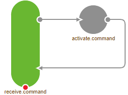
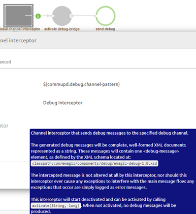
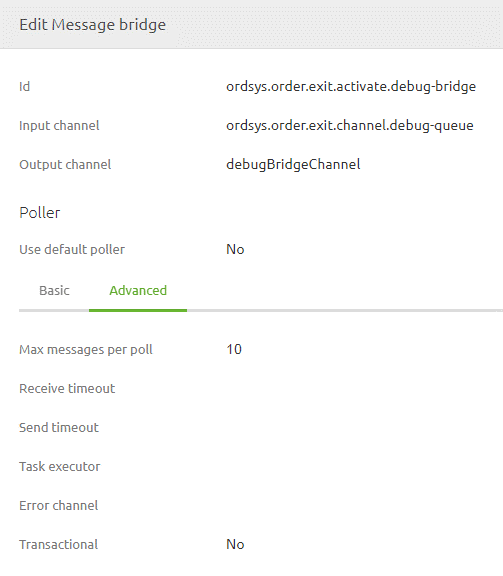
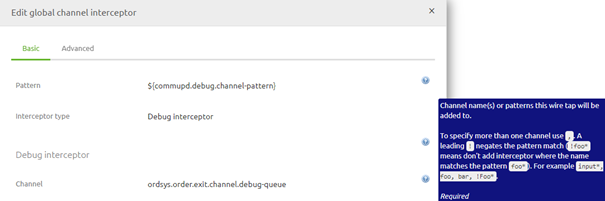

# Guidelines Debugging

In this document we will try to provide some context with regards to the debugger functionality. How you can effectively use it and when you should shy away from using it completely.

## The debugger explained

**Be aware:** Although this gives a nice insight in how the debugger works. Any changes to these settings could have a serious impact so don't change any of the prefilled settings. The only two things you are allowed to change are the two properties you as a user need to fill in

Let our journey begin by explaining what the debugger is and how it works within eMagiz. 
The debugger consists of a collection of several components working in unison to show the messages to the user.

The command components make sure that when you as a user press the Debug button on a flow in your Runtime Dashboard the activate.command component will activate the debug interceptor for this particular flow. Which channels will be debugged can de governed by the {busname}.debug.channel-pattern. A *.* is adviced if you want to debug all channels. What every you do don't enter *. When you enter * you end up debugging everything including the debugging channel creating an infinite loop.

Further downstream in this sequence of steps is a message bridge that looks every x time period (based on the cron setting) whether there are messages available and this message bridge will pick up 10 messages. So per time period 10 messages are send to the user looking at their debug screen.

## Configuration of the debugger

As specified above as a user there are two actions you can take to influence the behavior of the debugger.

1. Defining what you want to debug by setting the debug pattern via the property {busname}.debug.channel-pattern. By entering *.* you debug all functional channels within the flow(s) you want to debug. By specifying the channel name(s) you can debug only certain channels within the flow you want to debug

2. Defining how many times you want to check whether there are messages ready to be shown to the user. 
	-	These messages can either be stored in a H2 database or kept in memory. You can tell the difference by clicking on activate.debug-bridge and see whether a support.h2-tx-manager component is lighting up.
	-	The more frequently you check for messages the higher the load will become on the system as a whole. Especially when the debugger is linked to the H2 database and you have many flows on a runtime you should not debug that often. Advice is to limit the frequency with which you poll for those situations to once a minute.

## Using the debugger for testing
The debugger can be a nice addition to your arsenal when testing the functionality you have build. Please note that within the eMagiz platform the Unit Testing functionality is available to use on most onramps and offramps.

Because unit testing not only shows the messages as they pass through the channels but also provides feedback on your test scenarios we advice to use unit testing when you can. For more information on Unit testing please see [User Guide Unit testing](userguide-unitttest.md)

In all other scenarios you can use the debugger to test your functionality. Before activating the debugger always think about what you want to test and what the expected result should be.
For example, when you need to make a change to the offramp transformation it is wise to only debug that offramp as you want to test the change made in the offramp. If the change has an impact on the exit you should also debug the exit at once.

## Using the debugger for Production
When you have Deploy rights on Production you have the ability to debug flows on Production. Debugging on Production should not be done lightly and should only be done in accordance with the customer. Especially because debugging on Production could also mean that you debug messages containing privacy sensitive information you should not see as a user without explicit consent.

It would be better to reproduce the scenario in the Acceptance or Test environment so you can make changes and test them based on the change you have made and to also a regression test making sure the change did not impact other parts of the flow. Having a default set of unit tests configured for your flow via the Unit Testing functionality can really help here.

If you cannot use the Unit testing functionality for the (regression) test you can test the scenarios by hand via the debugging functionality.

## Best practices

- Use Unit Testing when you can. For more information on unit testing see [User Guide Unit testing](userguide-unitttest.md)
- Don't fire up debug screens for each separate flow in the process. Think before you test on what you want to test and where the test will most likely fail or pass. Debug only that flow
- Don't change the settings eMagiz provides you by default
- Don't debug in Production without a good reason. Think about the consequences.
- Users without deploy rights on a environment are also unable to debug on that environment. This way you can limit the use of the debugger.
- Try to avoid debugging on Production. Rather reproduce the issue on Test or Acceptance.
