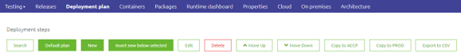
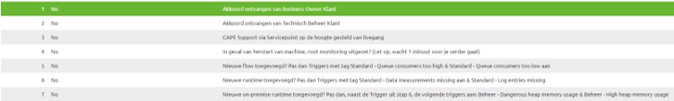
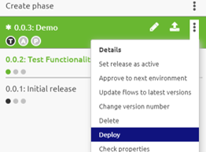
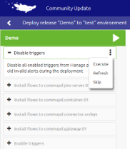

# Set up your Deployment Plan?
Easy screen within the portal gives you the option to setup a deployment plan. A deployment plan is a set of steps through which you govern what needs to be done for every deployment that is executed on the Test, Acceptance and Production environment.

## Default plan

eMagiz gives you the option to choose a default plan. With this default plan all standard features are automatically set up for your environment. Among these features are the following
-	Automatic disable/enable triggers
-	Automatically Install, Stop and Start flows

## Best practices

-	Update deployment plan for each runtime you add in Deploy
-	Keep the deployment plan (mostly) the same between Test, Acceptance and Production
-	Use the automatic disable and enable alerting functionality
-	In Production use several manual steps for processes that need to happen before (or after) a deployment

## Making manual changes

Apart from following the standard default plan you as a user have the option to make manual changes in the deployment plan. At your disposal are various options, such as:

-	Edit step
-	Add step at a certain point within your deployment plan (insert new below selected)
-	Add step at a random order
-	Move order of steps
-	Delete step
-	Copy deployment plan between environments (Test, Acceptance and Production)

## Executing the deployment plan

As a user you have the option to execute the deployment plan when you want to Deploy a certain Release to a certain environment. 
When you select the context menu for the Release you have the option to choose Deploy. Selecting this will lead you to the Deploy Widget which will guide you through the steps as you have configured them in your Deployment Plan

Below you will see a visual representation of how the Deploy page looks like. In here you can press the play button or execute the deployment plan manually per step

