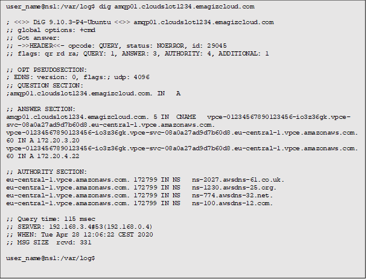

Redundant connections to eMagiz over AWS Direct Connect

## Introduction
An eMagiz bus can be reached via the internet or via a dedicated AWS Direct Connect connection. The Direct Connect solution acts like an extension of the customer network. This instruction explains how traffic needs to be routed over the dedicated connection by adding DNS records to the corporate resolving servers.
The network architecture
Below is a technical representation of the connectivity between the customer network and the AWS deployment of a eMagiz Platform Instance of the customer. 

An eMagiz platfom instance is reachable via the internet via DNS records with below format:
amqp01.cloud<number>.emagizcloud.com (The primary node)
amqp01b1.cloud<number>.emagizcloud.com (The backup node)

## Force eMagiz traffic over the Direct Connect
To force traffic from the customers network to the bus over a Direct Connect connection a change to the corporate DNS service needs to be done by adding overrides to the bus DNS records.
In the infrastructure drawing the Direct Connect VPC is an extension of the customer network. It contains IP numbering matching the customers network IP plan. From the received allocation two subnets are configured in separate AWS Availability Zones (datacenters). Within these subnets two endpoints are setup so the bus can be reached via the internal network. These “Service Endpoints” can be resolved via a DNS record with the following format:
vpce-<unique_id>.vpce-svc-08a0a27ad9d7b60d8.eu-central-1.vpce.amazonaws.com
The private addresses which are resolved by above endpoint need to be added to the internal DNS servers as overrides so traffic to the public eMagiz Platform Instance DNS names are resolved to the internal IP addresses.
- An example of above change implemented in BIND can be followed in below blog posting: https://www.redpill-linpro.com/sysadvent/2015/12/08/dns-rpz.html
- Comparable solutions exist for Microsoft DNS servers: https://blog.simonw.se/override-a-single-external-hostname-with-internal-dns-entry/

## Example implementation with BIND
An example customer has cloudslot 0128 and service endpoint vpce-01234567890123456-io3z36gk allocated to their private endpoint over Direct Connect. A DNS lookup before the change results connecting to the public internet endpoint of the eMagiz Platform Instance:

Creating a RPZ zone in the “company.com” dns servers:

After the change a DNS lookup to the bus results in answers over the Direct Connect (172.20.3.20 and 172.20.4.22):

