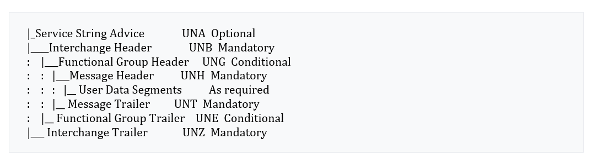
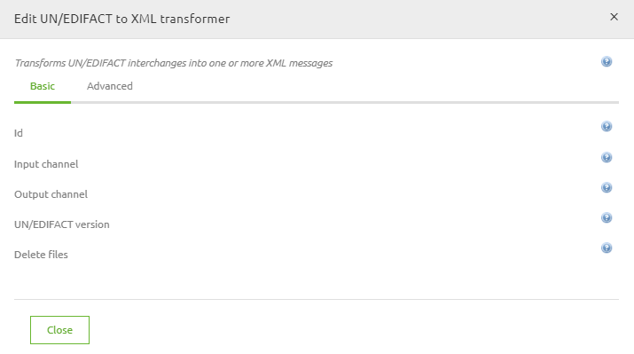
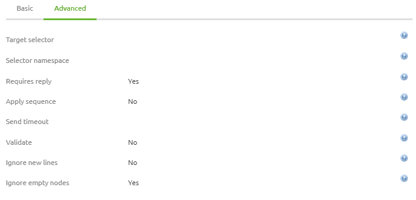
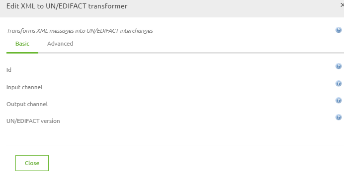
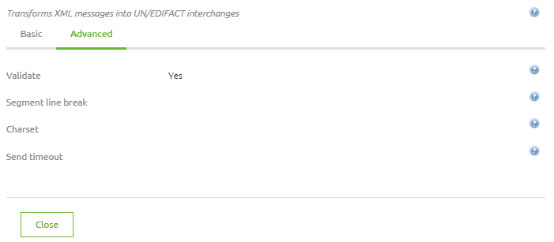

How to EDIFACT
Issue date: 03-Jul-2020
 
This document describes best practices on EDIFACT. It discusses what EDIFACT is, how to transform an EDIFACT file to XML and from XML to EDIFACT.

## Introduction – What is EDIFACT?
EDIFACT stands for Electronic Data Interchange For Administration, Commerce and Transport. The standard is developed by the United Nations to create an international standard for exchanging messages electronically between organizations. It is often named EDI, but EDI stands for Electronic Data Interchange which is the way of work how organizations can exchange data while EDIFACT defines the structure how these messages are exchanged. 
In EDIFACT, you have multiple standard. UN/EDIFACT is the most comprehensive and worldwide most common standard. This document will be about UN/EDIFACT messages standard.
EDIFACT contains a set of standard message types which define what kind of information is exchanged and in what format. Each message type supports a specific process, for example an order or an invoice.  
Examples of message types which are common in the B2B communication are:
-	ORDERS – It describes an order
-	ORDRSP – It describes an order response, this is the confirmation that the orders is accepted or declined
-	INVOIC – It describes an invoice
-	APERAK – It describes an acknowledgement of receipt
EDIFACT has a hierarchical structure consisting of multiple components. The topmost unit of an EDIFACT message is the Interchange (UNB), which can be thought of as an envelope. The interchange defines the message recipient, the message sender, the message number, the message date, etc. An interchange can in turn contain several individual Groups (UNG) representing message groups. Alternatively, an interchange can also contain individual messages (concrete messages).A message itself is enclosed by a header (UNH) and a trailer segment (UNT). 
A message group is surrounded by an UNG and UNE segment. Within a message, there are several segments and segment groups, which represent individual related message parts (for example, information about the biller, a specific invoice line, etc.). 
A segment group is initiated by a so-called trigger element. Segments consist of data elements and composite data elements. The smallest unit of an EDIFACT file are simple data elements.
A group or segment can be mandatory (M) or conditional (C) and can be specified to repeat. For example :
- C99 indicates between 0 and 99 repetitions of a segment or group
- M99 signifies between 1 and 99 repetitions of a segment or group
A group, like a message, is a sequence of segments or groups. The first segment or group beneath a group must be mandatory, and the group should be made conditional if the logic of the situation demands it.

<p align="center"></p>

An example of how an EDIFACT file (partly) looks like is:
UNA:+.? ' UNB+UNOC:3+SENDERCODE+RECEIVERCODE+270217:1438+ID:f57cbf19-fc' UNH+1+ORDERS:D:96A:UN' BGM+220+AB123456+9' DTM+137:20170115212655:204' RFF+ON:'
More information about the different message types and their structure can be found here:
https://www.truugo.com/edifact/
An example of an EDIFACT file and a EDIFACT file transformed into XML can be found here:

- [Example EDIFACT](ORDERS_edifact_example1.edifact)
- [Example XML](ORDERS-edifact-xml_example1.xml)

 
## EDIFACT to XML
In eMagiz, you are able to both transform a XML to an EDIFACT file as from EDIFACT to XML. This chapter discusses the transformation from EDIFACT to XML.
In order to transform an EDIFACT file into a XML, you need in eMagiz only one component, the UN/EDIFACT to XML Transformer. This transformation component transforms the following piece of EDIFACT message:
UNA:+.? ' 'UNB+UNOC:3+SENDERCODE+RECEIVERCODE+270217:1438+ID:f57cbf19-fc' 'UNH+1+ORDERS:D:96A:UN'
Into
<out:unEdifact xmlns:out="urn:org.milyn.edi.unedifact.v41">
	<out:UNB>
		<out:syntaxIdentifier>
			<out:id>UNOC</out:id>
			<out:versionNum>3</out:versionNum>
		</out:syntaxIdentifier>
		<out:sender>
			<out:id>SENDERCODE</out:id>
		</out:sender>
		<out:recipient>
			<out:id>RECEIVERCODE</out:id>
		</out:recipient>
		<out:dateTime>
			<out:date>270217</out:date>
			<out:time>1438</out:time>
		</out:dateTime>
		<out:controlRef>ID:f57cbf19-fc</out:controlRef>
	</out:UNB>
	<out:interchangeMessage>
		<out:UNH>
			<out:messageRefNum>1</out:messageRefNum>
			<out:messageIdentifier>
				<out:id>ORDERS</out:id>
				<out:versionNum>D</out:versionNum>
				<out:releaseNum>96A</out:releaseNum>
				<out:controllingAgencyCode>UN</out:controllingAgencyCode>
			</out:messageIdentifier>
		</out:UNH>

Based on this XML file, you can transform the messages via a XSLT. The transformation component has several features. The Basic settings view is:
<p align="center"></p>

 The Id, Input channel and Output channel are known and will not be discussed. 
-	UN/EDIFACT version: This is the version of the incoming EDIFACT message. This determines what transformation eMagiz will use and how the EDIFACT file should be interpreted. You can find your EDIFACT version in the UNH segment:
UNH+1+ORDERS:D:96A:UN'. In this case the version is D:96.
-	Delete files: Specify whether the source file should be deleted. Used if you picked up the file from a local folder of SFTP. Best practice is to delete your original files, as you do not need them anymore in most cases.

The advanced settings that are available. Mostly you don’t need to change the settings here. Use the target selector f you need to split a EDIFACT file into multiple XML files. You can enter in this field the entity where you would like to split the files.
-	Target selector: Expression for splitting the EDI message into smaller fragments. Default is the entire EDI message.
-	Selector namespace: If required, you can add here the namespace for the expression above.
-	Requires reply: Set to true if you expect that the result of this transformer always leads to at least one output message.
-	Apply sequence: Set to true if you would like to have a sequence number to your output messages.
-	Send timeout: Set if the transformation cannot take longer than a certain amount of time.
-	Validate: Set to true if the incoming message validates against the EDIFACT content fields as data type, min and max length. Structure of the document is always validated during this transformation.
-	Ignore new lines: Set to true if you would ignore unexpected new lines.
-	Ignore empty nodes: Set to true if you would ignore unexpected empty nodes.

<p align="center"></p>


## XML to EDIFACT
In order to transform a XML to an EDIFACT file, you can use the XML to UN/EDIFACT transformer component. Important is to structure your XML correctly in EDI-XML. Since the EDIFACT message can grow rapidly due to its many features, its XML structure can be complex to build. 

<p align="center"></p>

-	UN/EDIFACT version: This is the version of the outgoing EDIFACT message. This determines what transformation eMagiz will use and how the XML file should be interpret. Your EDIFACT version should meet with what is stated in the UNH component. Voorbeeld?
In comparison to the advanced settings for incoming EDIFACT messages, the advanced settings for the outgoing EDIFACT messages are more relevant to use. 
<p align="center"></p>

-	Validate: Set this value to Yes if you would like to validate the structure of the EDIFACT file. This means that not the values are checked but data validation on data type, minimal length or maximal length.
-	Segment line break: If you would like to add new lines, you can set delimiter character. This could be for example the ‘ character as shown in the example earlier in this document.
-	Charset: Character set which is used to decode the incoming XML message into text. Default is UTF-8.
-	Send timeout: This setting is not widely used. Use it if you want to have a timeout when the component takes too much time to transform the message into an EDIFACT file.


## Example EDIFACT message
```
UNA:+.? 'UNB+UNOC:3+SENDERCODE+RECEIVERCODE+270217:1438+ID:f57cbf19-fc'UNH+1+ORDERS:D:96A:UN'BGM+220+AB123456+9'DTM+137:20170115212655:204'RFF+ON:'NAD+ST+StCode++StName:StCode+StStreet+StCity++StZipcode+StCountry'NAD+SU+SuCode++SuName:SuCode+SuStreet+SuCity++SuZipcode+SuCountry'NAD+OY+ByCode++ByName:ByCode+ByStreet+ByCity++ByZipcode+ByCountry'NAD+IV+IvCode++IvName:IvCode+IvStreet+IvCity++IvZipcode+IvCountry'CUX+2:EUR:9+3:EUR:4'PAT+1+6::::'TDT+12++:++'TOD+6++::::'LIN+1133435'PIA+5+LINEUNIT-00000006:AA'IMD+A++:::Test Item:'QTY+21:10.0:PCE'QTY+187:0.0:PCE'QTY+48:0.0:PCE'QTY+91:0.0:PCE'PCD+22:0.0'PCD+12:'PCD+12:'DTM+2:20170508:102'DTM+72::102'DTM+35::102'DTM+94::102'MOA+66:617.39:EUR'FTX+LIN+++0001'FTX+AAI+++8f8g5bff-9232-4e2d-8ad0-f41788dffcc7'PRI+AAB:'PRI+AAB:'PRI+AAA:617.39'PRI+AAA:'UNS+D'UNT+61+1'UNZ+1+20170227023802'
```

## Example XML message from EDIFACT

```
<?xml version="1.0" encoding="UTF-8"?>
<out:unEdifact xmlns:out="urn:org.milyn.edi.unedifact.v41">
	<out:UNB>
		<out:syntaxIdentifier>
			<out:id>UNOC</out:id>
			<out:versionNum>3</out:versionNum>
		</out:syntaxIdentifier>
		<out:sender>
			<out:id>SENDERCODE</out:id>
		</out:sender>
		<out:recipient>
			<out:id>RECEIVERCODE</out:id>
		</out:recipient>
		<out:dateTime>
			<out:date>270217</out:date>
			<out:time>1438</out:time>
		</out:dateTime>
		<out:controlRef>ID:f57cbf19-fc</out:controlRef>
	</out:UNB>
	<out:interchangeMessage>
		<out:UNH>
			<out:messageRefNum>1</out:messageRefNum>
			<out:messageIdentifier>
				<out:id>ORDERS</out:id>
				<out:versionNum>D</out:versionNum>
				<out:releaseNum>96A</out:releaseNum>
				<out:controllingAgencyCode>UN</out:controllingAgencyCode>
			</out:messageIdentifier>
		</out:UNH>
		<ORDERS>
			<Beginning_of_message>
				<DOCUMENT_MESSAGE_NAME>
					<Document_message_name__coded>220</Document_message_name__coded>
				</DOCUMENT_MESSAGE_NAME>
				<Document_message_number>AB123456</Document_message_number>
				<Message_function__coded>9</Message_function__coded>
			</Beginning_of_message>
			<Date_time_period>
				<DATE_TIME_PERIOD>
					<Date_time_period_qualifier>137</Date_time_period_qualifier>
					<Date_time_period>20170115212655</Date_time_period>
					<Date_time_period_format_qualifier>204</Date_time_period_format_qualifier>
				</DATE_TIME_PERIOD>
			</Date_time_period>
			<Segment_group_1>
				<Reference>
					<REFERENCE>
						<Reference_qualifier>ON</Reference_qualifier>
						<Reference_number/>
					</REFERENCE>
				</Reference>
			</Segment_group_1>
			<Segment_group_2>
				<Name_and_address>
					<Party_qualifier>ST</Party_qualifier>
					<PARTY_IDENTIFICATION_DETAILS>
						<Party_id._identification>StCode</Party_id._identification>
					</PARTY_IDENTIFICATION_DETAILS>
					<PARTY_NAME>
						<Party_name_-_-1>StName</Party_name_-_-1>
						<Party_name_-_-2>StCode</Party_name_-_-2>
					</PARTY_NAME>
					<STREET>
						<Street_and_number_p.o._box_-_-1>StStreet</Street_and_number_p.o._box_-_-1>
					</STREET>
					<City_name>StCity</City_name>
					<Postcode_identification>StZipcode</Postcode_identification>
					<Country__coded>StCountry</Country__coded>
				</Name_and_address>
			</Segment_group_2>
			<Segment_group_2>
				<Name_and_address>
					<Party_qualifier>SU</Party_qualifier>
					<PARTY_IDENTIFICATION_DETAILS>
						<Party_id._identification>SuCode</Party_id._identification>
					</PARTY_IDENTIFICATION_DETAILS>
					<PARTY_NAME>
						<Party_name_-_-1>SuName</Party_name_-_-1>
						<Party_name_-_-2>SuCode</Party_name_-_-2>
					</PARTY_NAME>
					<STREET>
						<Street_and_number_p.o._box_-_-1>SuStreet</Street_and_number_p.o._box_-_-1>
					</STREET>
					<City_name>SuCity</City_name>
					<Postcode_identification>SuZipcode</Postcode_identification>
					<Country__coded>SuCountry</Country__coded>
				</Name_and_address>
			</Segment_group_2>
			<Segment_group_2>
				<Name_and_address>
					<Party_qualifier>OY</Party_qualifier>
					<PARTY_IDENTIFICATION_DETAILS>
						<Party_id._identification>ByCode</Party_id._identification>
					</PARTY_IDENTIFICATION_DETAILS>
					<PARTY_NAME>
						<Party_name_-_-1>ByName</Party_name_-_-1>
						<Party_name_-_-2>ByCode</Party_name_-_-2>
					</PARTY_NAME>
					<STREET>
						<Street_and_number_p.o._box_-_-1>ByStreet</Street_and_number_p.o._box_-_-1>
					</STREET>
					<City_name>ByCity</City_name>
					<Postcode_identification>ByZipcode</Postcode_identification>
					<Country__coded>ByCountry</Country__coded>
				</Name_and_address>
			</Segment_group_2>
			<Segment_group_2>
				<Name_and_address>
					<Party_qualifier>IV</Party_qualifier>
					<PARTY_IDENTIFICATION_DETAILS>
						<Party_id._identification>IvCode</Party_id._identification>
					</PARTY_IDENTIFICATION_DETAILS>
					<PARTY_NAME>
						<Party_name_-_-1>IvName</Party_name_-_-1>
						<Party_name_-_-2>IvCode</Party_name_-_-2>
					</PARTY_NAME>
					<STREET>
						<Street_and_number_p.o._box_-_-1>IvStreet</Street_and_number_p.o._box_-_-1>
					</STREET>
					<City_name>IvCity</City_name>
					<Postcode_identification>IvZipcode</Postcode_identification>
					<Country__coded>IvCountry</Country__coded>
				</Name_and_address>
			</Segment_group_2>
			<Segment_group_7>
				<Currencies>
					<CURRENCY_DETAILS_-_-1>
						<Currency_details_qualifier>2</Currency_details_qualifier>
						<Currency__coded>EUR</Currency__coded>
						<Currency_qualifier>9</Currency_qualifier>
					</CURRENCY_DETAILS_-_-1>
					<CURRENCY_DETAILS_-_-2>
						<Currency_details_qualifier>3</Currency_details_qualifier>
						<Currency__coded>EUR</Currency__coded>
						<Currency_qualifier>4</Currency_qualifier>
					</CURRENCY_DETAILS_-_-2>
				</Currencies>
			</Segment_group_7>
			<Segment_group_8>
				<Payment_terms_basis>
					<Payment_terms_type_qualifier>1</Payment_terms_type_qualifier>
					<PAYMENT_TERMS>
						<Terms_of_payment_identification>6</Terms_of_payment_identification>
						<Terms_of_payment_-_-1/>
						<Terms_of_payment_-_-2/>
					</PAYMENT_TERMS>
				</Payment_terms_basis>
			</Segment_group_8>
			<Segment_group_9>
				<Details_of_transport>
					<Transport_stage_qualifier>12</Transport_stage_qualifier>
					<MODE_OF_TRANSPORT>
						<Mode_of_transport/>
					</MODE_OF_TRANSPORT>
					<CARRIER/>
				</Details_of_transport>
			</Segment_group_9>
			<Segment_group_11>
				<Terms_of_delivery_or_transport>
					<Terms_of_delivery_or_transport_function__coded>6</Terms_of_delivery_or_transport_function__coded>
					<TERMS_OF_DELIVERY_OR_TRANSPORT>
						<Terms_of_delivery_or_transport_-_-1/>
						<Terms_of_delivery_or_transport_-_-2/>
					</TERMS_OF_DELIVERY_OR_TRANSPORT>
				</Terms_of_delivery_or_transport>
			</Segment_group_11>
			<Segment_group_25>
				<Line_item>
					<Line_item_number>10000</Line_item_number>
				</Line_item>
				<Additional_product_id>
					<Product_id._function_qualifier>5</Product_id._function_qualifier>
					<ITEM_NUMBER_IDENTIFICATION_-_-1>
						<Item_number>LINEUNIT-00000006</Item_number>
						<Item_number_type__coded>AA</Item_number_type__coded>
					</ITEM_NUMBER_IDENTIFICATION_-_-1>
				</Additional_product_id>
				<Item_description>
					<Item_description_type__coded>A</Item_description_type__coded>
					<ITEM_DESCRIPTION>
						<Item_description_-_-1>Test Item</Item_description_-_-1>
						<Item_description_-_-2/>
					</ITEM_DESCRIPTION>
				</Item_description>
				<Quantity>
					<QUANTITY_DETAILS>
						<Quantity_qualifier>21</Quantity_qualifier>
						<Quantity>10.0</Quantity>
						<Measure_unit_qualifier>PCE</Measure_unit_qualifier>
					</QUANTITY_DETAILS>
				</Quantity>
				<Quantity>
					<QUANTITY_DETAILS>
						<Quantity_qualifier>187</Quantity_qualifier>
						<Quantity>0.0</Quantity>
						<Measure_unit_qualifier>PCE</Measure_unit_qualifier>
					</QUANTITY_DETAILS>
				</Quantity>
				<Quantity>
					<QUANTITY_DETAILS>
						<Quantity_qualifier>48</Quantity_qualifier>
						<Quantity>0.0</Quantity>
						<Measure_unit_qualifier>PCE</Measure_unit_qualifier>
					</QUANTITY_DETAILS>
				</Quantity>
				<Quantity>
					<QUANTITY_DETAILS>
						<Quantity_qualifier>91</Quantity_qualifier>
						<Quantity>0.0</Quantity>
						<Measure_unit_qualifier>PCE</Measure_unit_qualifier>
					</QUANTITY_DETAILS>
				</Quantity>
				<Percentage_details>
					<PERCENTAGE_DETAILS>
						<Percentage_qualifier>22</Percentage_qualifier>
						<Percentage>0.0</Percentage>
					</PERCENTAGE_DETAILS>
				</Percentage_details>
				<Percentage_details>
					<PERCENTAGE_DETAILS>
						<Percentage_qualifier>12</Percentage_qualifier>
						<Percentage/>
					</PERCENTAGE_DETAILS>
				</Percentage_details>
				<Percentage_details>
					<PERCENTAGE_DETAILS>
						<Percentage_qualifier>12</Percentage_qualifier>
						<Percentage/>
					</PERCENTAGE_DETAILS>
				</Percentage_details>
				<Date_time_period>
					<DATE_TIME_PERIOD>
						<Date_time_period_qualifier>2</Date_time_period_qualifier>
						<Date_time_period>20170508</Date_time_period>
						<Date_time_period_format_qualifier>102</Date_time_period_format_qualifier>
					</DATE_TIME_PERIOD>
				</Date_time_period>
				<Date_time_period>
					<DATE_TIME_PERIOD>
						<Date_time_period_qualifier>72</Date_time_period_qualifier>
						<Date_time_period/>
						<Date_time_period_format_qualifier>102</Date_time_period_format_qualifier>
					</DATE_TIME_PERIOD>
				</Date_time_period>
				<Date_time_period>
					<DATE_TIME_PERIOD>
						<Date_time_period_qualifier>35</Date_time_period_qualifier>
						<Date_time_period/>
						<Date_time_period_format_qualifier>102</Date_time_period_format_qualifier>
					</DATE_TIME_PERIOD>
				</Date_time_period>
				<Date_time_period>
					<DATE_TIME_PERIOD>
						<Date_time_period_qualifier>94</Date_time_period_qualifier>
						<Date_time_period/>
						<Date_time_period_format_qualifier>102</Date_time_period_format_qualifier>
					</DATE_TIME_PERIOD>
				</Date_time_period>
				<Monetary_amount>
					<MONETARY_AMOUNT>
						<Monetary_amount_type_qualifier>66</Monetary_amount_type_qualifier>
						<Monetary_amount>617.39</Monetary_amount>
						<Currency__coded>EUR</Currency__coded>
					</MONETARY_AMOUNT>
				</Monetary_amount>
				<Free_text>
					<Text_subject_qualifier>LIN</Text_subject_qualifier>
					<TEXT_LITERAL>
						<Free_text_-_-1>0001</Free_text_-_-1>
					</TEXT_LITERAL>
				</Free_text>
				<Free_text>
					<Text_subject_qualifier>AAI</Text_subject_qualifier>
					<TEXT_LITERAL>
						<Free_text_-_-1>8f8g5bff-9232-4e2d-8ad0-f41788dffcc7</Free_text_-_-1>
					</TEXT_LITERAL>
				</Free_text>
				<Segment_group_28>
					<Price_details>
						<PRICE_INFORMATION>
							<Price_qualifier>AAB</Price_qualifier>
							<Price/>
						</PRICE_INFORMATION>
					</Price_details>
				</Segment_group_28>
				<Segment_group_28>
					<Price_details>
						<PRICE_INFORMATION>
							<Price_qualifier>AAB</Price_qualifier>
							<Price/>
						</PRICE_INFORMATION>
					</Price_details>
				</Segment_group_28>
				<Segment_group_28>
					<Price_details>
						<PRICE_INFORMATION>
							<Price_qualifier>AAA</Price_qualifier>
							<Price>617.39</Price>
						</PRICE_INFORMATION>
					</Price_details>
				</Segment_group_28>
				<Segment_group_28>
					<Price_details>
						<PRICE_INFORMATION>
							<Price_qualifier>AAA</Price_qualifier>
							<Price/>
						</PRICE_INFORMATION>
					</Price_details>
				</Segment_group_28>
			</Segment_group_25>
			<Section_control>
				<SECTION_IDENTIFICATION>D</SECTION_IDENTIFICATION>
			</Section_control>
		</ORDERS>
		<out:UNT>
			<out:segmentCount>61</out:segmentCount>
			<out:messageRefNum>1</out:messageRefNum>
		</out:UNT>
	</out:interchangeMessage>
	<out:UNZ>
		<out:controlCount>1</out:controlCount>
		<out:controlRef>20170227023802</out:controlRef>
	</out:UNZ>
</out:unEdifact>
```