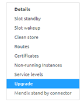
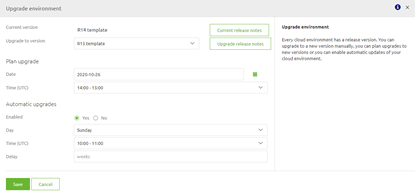
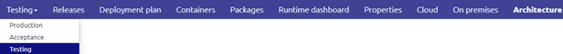
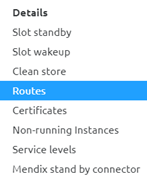
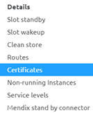
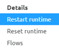
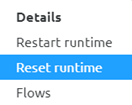
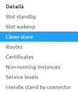
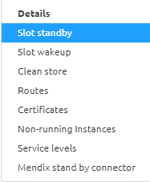
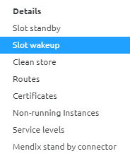

Controlling the eMagiz Cloud

Issue date: 26-05-2020

This page discusses how you can control and execute various actions via the eMagiz portal on the eMagiz cloud. The main idea of having the ability to control the eMagiz Cloud from the portal is to increase what a user can do without any the help of experts that master the specific Cloud environment where the eMagiz instance is deployed (in this case AWS). 
This functionality enables users to make the following configuration changes to the eMagiz Cloud - currently only the first step is described (rest will follow shortly).
- Upgrade Cloud Template
- Add / Remove Runtimes
- Add / Update Routes
- Add / Update Certificates
- Start / Stop Runtimes
- Start / Stop Machines
- Reset Runtime
- Clean Store
- Slot Standby / Slot wakeup
- Mendix stand by connector

In this page we will discuss each of these actions separately to make it even easier for you, the user, to control the eMagiz Cloud.
To summarize, controlling the eMagiz Cloud gives you:
-	Tools to stay in control of the eMagiz Cloud.
-	A way to do it yourself.

## Best practices
-	Read the release notes on the eMagiz portal every time a new cloud template is released by eMagiz. These release notes can be found under Documentation -> Release Notes -> Cloud Templates
-	Keep your Cloud setup as up to date as possible
-	When using the Slot Standby / Slot Wakeup functionality combine this with the Mendix stand by connector to prevent a large number of errors / warnings in the log 
-	All actions described below can only be executed on AWS cloud environments and AWS cloud runtimes for now
-	If you are unsure what an action does, please discuss the steps you want to make with someone else before executing them or use the Q&A section in the eMagiz Portal or contact productmanagement@emagiz.com
-	All changes made from the eMagiz Portal are only send to the AWS cloud at the moment you press the Apply to Environment button. If you do not press this button, your changes only reside in the eMagiz Portal (Integration model) and not in the cloud.
-	In case of a so-called double lane bus (failover available) you have the option to first update the failover setup (Availibility Zone B) and at a later stage the ‘live’ setup (Availability Zone A). This to prevent down-time of the platform instance

## How-to steps Upgrade Cloud Template
Follow these steps carefully in order to acquire the desired result. 
Before we explain step by step which actions to take to upgrade a cloud template let us first consider why you want to update a cloud template in the first place. 
 
A Cloud template is the configuration, specified by eMagiz, how deploy Architecture will run in AWS and which supporting tools (such as auto healing, auto recovery and improved alerting for instance) are available for your environment. 
With each new cloud template these functionalities will improve autonomous use and stability of the instance. 
Which changes exactly are made in a particular cloud template can be found in the Release notes section under Community -> Documentation in the eMagiz portal. 

What is important to understand is that the update of a Cloud template can be done without any downtime in case your particular environment runs in a failover scenario. 
You can simply update zone A and zone B in sequence so that all services can continue to work without interruption. 
In case you run in a single lane scenario, you will have to plan a short downtime of the environment to perform the update which takes between 1 or 4 minutes. There will be no loss of messages.

### New way (Beta release)
To make this possible we give you three choices to upgrade your cloud template. These choices are accessible via a context menu on the Deploy Architecture page under the section Upgrade.

Note: For Production you should switch off the Root monitoring therefore the Manual step is advisable for Production. Also don't forget to turn the Root monitoring back on if you are finished and Root has the correct information.

#### Manual
1.	Navigate to Deploy -> Architecture for the bus you want to perform this action
2.	Select Start Editing
3.	Select the context menu and select Upgrade
4.	Select the newly available Cloud template
5.	Press Save & Upgrade
6.	eMagiz will handle the update and will notify you when the update is successfully finished

#### Planned
1.	Navigate to Deploy -> Architecture for the bus you want to perform this action
2.	Select Start Editing
3.	Select the context menu and select Upgrade
4.	Select the newly available Cloud template
5.	Select a specific future date and time on which you want to execute the cloud template upgrade
6.	Press Save
7.	eMagiz will handle the update and will notify you when the update is started and when it is successfully finished

#### Scheduled
1.	Navigate to Deploy -> Architecture for the bus you want to perform this action
2.	Select Start Editing
3.	Select the context menu and select Upgrade
4.	Enable Automatic Upgrades
5.	Select the day of the week and the time you want the scheduled deployment to be executed
6.	Press Save
7.	eMagiz will handle the update (if one is available) and will notify you when the update is started and when it is successfully finished

### Current way (Depricated)

Below the steps to update a Cloud template automatically or at the moment the pop-up appears. 
0. Please switch off Root Monitoring off before proceeding. 
1.	Navigate to Deploy -> Architecture for the bus you want to perform this action
2.	If a new template has been made available you will see a popup screen asking if you want to update to the latest cloud template. If this fits you can execute the upgrade of the cloud template by pressing the green button at the bottom of the popup. If you however which to delay it you can silence the pop up for a day by pressing the other button. Another option (manually) to update your cloud template can be found starting at step 5
3.	By pressing the button in step 2 eMagiz will now automatically update the cloud template for you. You can follow the progress of this update by right clicking on the white part of the canvas and selecting details you will see the cloud template number and the state of the last update. See figure below. If it says update complete the update has been successful. 
4.	Execute all standard checks, i.e checking the logs under Manage -> Log Entries and verify if you can access the runtimes via runtime dashboard
5.  Switch root monitoring on.

In case you decide to run the update the later, here are the steps to perform this update manually.
0.  Switch root monitoring off.
1.	Select the correct environment for which you want to perform this action. 
2.	Press Start Editing button. Located on the left bottom of the screen
3.	Right click on the white canvas and select details
4.	Select the cloud template of your choosing in the dropdown. Be aware, eMagiz will only let you choose the next GA version apart from your current version.
5.	Don’t forget to press Apply to environment on the left bottom of the screen to make sure that your changes are applied to the AWS cloud
6.	Verify if the update has been successful. This can be seen in the details screen by looking at the Last known state
7.	Execute all standard checks, i.e checking the logs under Manage -> Log Entries and verify if you can access the runtimes via runtime dashboard
8.  Switch root monitoring on.

## How-to steps Add / Update Runtimes
Follow these steps carefully in order to acquire the desired result. Each time you want to add, change the location of a runtime on a VM or want to remove a runtime you will need to follow the steps outlined below to make sure that what you have envisioned is actualized in the eMagiz Cloud (in AWS)
1.	Navigate to Design -> Architecture
2.	Press Start Editing
3.	Add runtime to the desired machine or move runtime to the newly added machines  
4.	Navigate to Deploy -> Architecture for the bus you want to perform this action
5.	Select the correct environment (the environment should match the environment for which you made changes in Design) for which you want to perform this action. See figure below for how you can do this

6.	Press Start Editing button. Located on the left bottom of the screen
7.	The bus picture will show all changes using colour. All runtimes outlined in red are runtimes that will be removed from that machine. All runtimes outlined in green are runtimes that will be added to that machine. If you move a runtime from machine A to B it will show up outlined in red on machine A and outlined in green on machine B
8.	Don’t forget to press Apply to environment on the left bottom of the screen to make sure that your changes are applied to the AWS cloud
9.	Execute all standard checks, i.e checking the logs under Manage -> Log Entries and verify if you can access the runtimes via runtime dashboard

## How-to steps Add / Update Routes 
Follow these steps carefully in order to acquire the desired result. A route is a port which can be opened up to accept specific traffic. By coupling a route to a specific endpoint you can use it to host a webservice (SOAP / REST) on a specific port. This route is then used to internally route the message from the carwash to the internal eMagiz Cloud endpoint you have configured here. This way you can host several webservices in your integration landscape parallel to one another.
1.	Navigate to Deploy -> Architecture for the bus you want to perform this action
2.	Select the correct environment for which you want to perform this action. See figure below for how you can do this

3.	Press Start Editing button. Located on the left bottom of the screen
4.	Navigate with your mouse to the white (blank) canvas surrounding your bus environment
5.	Right click on this white (blank) canvas and select the Routes option. See picture below

6.	If you want to add a route, press the New button. If you want to change a route, press the Edit button. 
7.	Type in the DNS left most label. Best practice is to use the technical name of the runtime in combination with the environment (example is ddh-test)
8.	Select the internal port. Best practice is to vary the start number of the port between Test, Acceptance and Production. This to prevent potential trouble. (example is 9090 on Test, 8090 on Acceptance and 7090 on Production) 
9.	Type in the flow symbolic name (example is ddh.all-entry)
10.	Select the Cloud Runtime for which this route needs to be applied. If no certificate is necessary, continue with step 13. If a certificate is necessary, please continue with step 12
11.	Select the Certificate you want to use to add an extra security layer to your route. Be aware, the certificate needs to exist before you can add it. See (add link to How-to steps Add / Update Certificates)
12.	Don’t forget to press Apply to environment on the left bottom of the screen to make sure that your changes are applied to the AWS cloud

## How-to steps Add / Update Certificates
Follow these steps carefully in order to acquire the desired result. A certificate can be used to further improve the security of the webservice (SOAP / REST) you are hosting in the eMagiz Cloud environment.
1.	Navigate to Deploy -> Architecture for the bus you want to perform this action
2.	Select the correct environment for which you want to perform this action. See figure below for how you can do this

3.	Press Start Editing button. Located on the left bottom of the screen
4.	Navigate with your mouse to the white (blank) canvas surrounding your bus environment
5.	Right click on this white (blank) canvas and select the Routes option. See picture below

6.	If you want to add a certificate, press the New button. If you want to change a certificate, press the Edit button.
7.	Type in the common name (be aware this needs to exactly match the common name of the certificate as supplied). Ask the person that provided you the certificate what the common name is
8.	Leave the Certificate Pem field empty
9.	Add a client name. This can be used as identifier to quickly see for which runtimes certificates are used
10.	Don’t forget to press Apply to environment on the left bottom of the screen to make sure that your changes are applied to the AWS cloud

## How-to steps (Re)Start / Stop Machines
Follow these steps carefully in order to acquire the desired result. 
1.	Navigate to Deploy -> Architecture for the bus you want to perform this action
2.	Select the correct environment for which you want to perform this action. See figure below for how you can do this

3.	Press Start Editing button. Located on the left bottom of the screen
4.	Navigate with your mouse to the Machine (deployed in AWS) that you want to start, stop or restart
5.	Select the action of your choosing. See picture below

6.	eMagiz will now automatically execute the action you have chosen. All runtimes running on this machine will be stopped, started or restarted depending on the action you have chosen in step 5.
7.	Execute all standard checks, i.e checking the logs under Manage -> Log Entries and verify if you can access the runtimes via runtime dashboard

## How-to steps Restart Runtimes
Follow these steps carefully in order to acquire the desired result.. 
1.	Navigate to Deploy -> Architecture for the bus you want to perform this action
2.	Select the correct environment for which you want to perform this action. See figure below for how you can do this

3.	Press Start Editing button. Located on the left bottom of the screen 
4.	Navigate with your mouse to the Runtime (deployed in AWS) that you want to restart
5.	Right click on this runtime and select the Restart Runtime option. See picture below

6.	eMagiz will now automatically restart this runtime. By restarting the runtime, you restart all flows (including infra) of the runtime you have selected and afterwards they will come up in the same state as before.
7.	Execute all standard checks, i.e checking the logs under Manage -> Log Entries and verify if you can access the runtimes via runtime dashboard

## How-to steps Reset Runtime 
Follow these steps carefully in order to acquire the desired result. Before we get into the details of how you can reset a runtime let us first consider what resetting a runtime means and why you can use this. By resetting the runtime you are basically throwing away your complete data folder (flows, logs, etc.) expect for the messages that are being stored on that runtime (in the h2 database). By throwing this away eMagiz will automatically retrieve the newest versions of all flows belonging to that runtime from the portal and deploy them on the runtime. Basically you wipe the slate clean and start over.
As you can see, this is a pretty invasive action that comes with certain risks. Advice is to only use this button on Test and Acceptance when restarting the runtime nor restarting the machine has helped you solve the problem, nor is there any indication that a specific root cause is causing the problem.
1.	Navigate to Deploy -> Architecture for the bus you want to perform this action
2.	Select the correct environment for which you want to perform this action. See figure below for how you can do this

3.	Press Start Editing button. Located on the left bottom of the screen
4.	Navigate with your mouse to the Runtime (deployed in AWS) that you want to Reset
5.	Right click on this runtime and select the Reset Runtime option. See picture below

6.	eMagiz will now automatically reset this runtime. By resetting the runtime, you completely clear a runtime and start it anew, including removing all flows and installing the current infra flow that is available from the eMagiz portal.
7.	Execute all standard checks, i.e checking the logs under Manage -> Log Entries and verify if you can access the runtimes via runtime dashboard

## How-to steps Clean Store 
Follow these steps carefully in order to acquire the desired result. Before we get into the details of how you can reset a runtime let us first consider what ‘cleaning the store’ means and why you can use this in certain scenario’s. The clean store is even more nuclear in comparison to the Reset Runtime option. By choosing the clean store you do not only throw away logging and deployed flows but also all messages stored on JMS and runtime level. Only use this option, after consulting someone else, and only use it on Test and Acceptance. Using it on Production would probably mean that the cure is worse than the problem you have. 
1.	Navigate to Deploy -> Architecture for the bus you want to perform this action
2.	Select the correct environment for which you want to perform this action. See figure below for how you can do this

3.	Press Start Editing button. Located on the left bottom of the screen
4.	Navigate with your mouse to the white (blank) canvas surrounding your bus environment
5.	Right click on this white (blank) canvas and select the Clean Store option. See picture below

6.	eMagiz will now automatically execute a clean store action. By executing the clean store action you completely clear the message store of the JMS servers, including stopping the servers, clearing the content of all queues, and starting them again.
7.	Execute all standard checks, i.e checking the logs under Manage -> Log Entries and verify if you can access the runtimes via runtime dashboard

## How-to steps Slot Standby
Follow these steps carefully in order to acquire the desired result. With this button you have the option to put the Slot to sleep. This can be a valid option when you don’t use the slot 24/7 to reduce the costs that come with running a slot.
1.	Navigate to Deploy -> Architecture for the bus you want to perform this action
2.	Select the correct environment for which you want to perform this action. See figure below for how you can do this

3.	Press Start Editing button. Located on the left bottom of the screen 
4.	Navigate with your mouse to the white (blank) canvas surrounding your bus environment
5.	Right click on this white (blank) canvas and select the Slot standby option. See picture below

6.	Read the confirmation pop up and if you agree press Yes. eMagiz will now shutdown all runtimes in the correct order and prevent messages from being transported.

## How-to steps Slot Wakeup
Follow these steps carefully in order to acquire the desired result. With this button you have the option to wake the Slot up. This can be a valid option when you don’t use the slot 24/7 to reduce the costs that come with running a slot.
1.	Navigate to Deploy -> Architecture for the bus you want to perform this action
2.	Select the correct environment for which you want to perform this action. See figure below for how you can do this

3.	Press Start Editing button. Located on the left bottom of the screen 
4.	Navigate with your mouse to the white (blank) canvas surrounding your bus environment
5.	Right click on this white (blank) canvas and select the Slot wakeup option. See picture below

6.	Read the confirmation pop up and if you agree press Yes. eMagiz will now start all runtimes in the correct order and makes sure that all messages are being transported again.
