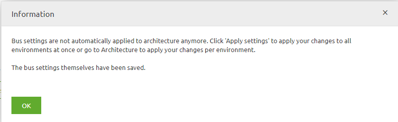
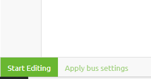
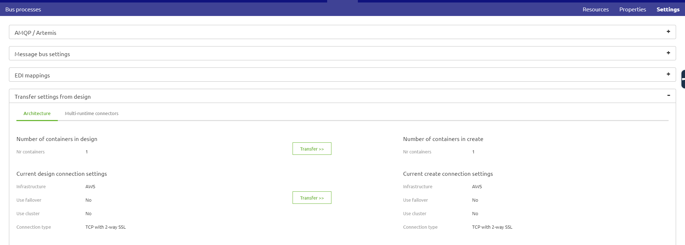
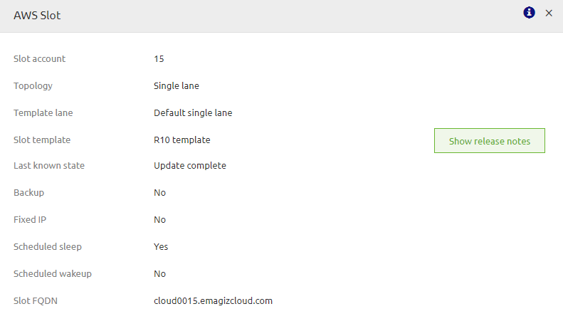

## 1. CONTEXT AND REQUIREMENTS  

eMagiz offers the possibility to migrate your infrastructure from one cloud provider to another. This can be done in various easy steps. In this how to we will describe the steps one needs to take to successfully migrate from Root to AWS.
Requirements
Assitance is needed from the eMagiz development team so plan ahead and contact your partner manager early on to make this work.

## 2.	BEST PRACTICES
In this chapter the best practices are outlined for when you want to migrate from Root to AWS.
- Plan ahead as some steps require the assistance of an eMagiz development team colleague
- Consult your partner manager beforehand to see if there is a possible cloud slot which you can use for your solution
- Always update the JMS as this is mandatory
- Store the settings you used in Root as you need to remove the complete Root setup before you can switch over to AWS
- Test your actions in Test and Acceptance before moving to Production
- Ensure to have the property for the data directory for JMS created. <bus_technical_name>.jmsserver.datadir=/efs/data/artemis/jms01

## 3.	HOW-TO STEPS MIGRATE FROM ROOT TO AWS
Follow these steps carefully in order to acquire the desired result.

Step 1: Edit the settings in Design (once)
Navigate, for your bus, to the Design page and click on Settings in the right top hand corner

Step 2: Change the IaaS option in the Design settings (once)
When you have opened the Settings page press the Edit settings button and select AWS as the IaaS you want to use. When pressing Save you will see the below popup:

As the popup clearly states you will have to Apply these changes to each environment independently via Design -> Architecture. Best practice is obviously to first test these changes in Test and Acceptance before executing them on Production
Step 3: Press Apply bus settings under Design -> Architecture (per environment)
Navigate to Design -> Architecture and navigate to the environment for which you need to apply the settings. Start at Test and move only ahead to Acceptance or Production when everything is properly tested. Press Apply bus settings. Nothing should change because you have moved from one cloud provider to another

Step 4: Transfer settings from Design (once)
In this step you transfer the settings you have changed in step 2 to Create. This can be done via Create -> Settings -> Transfer settings from Design.

This step will mean a new version for all flows on your bus. Be aware, on JMS level, some changes are applied. So a new version of the JMS is mandatory. Although nothing else has changed, atleast not for this scenario, once again the best practice is to first test everything (atleast) on Acceptance beforing moving to Production.
Step 5: Check and store custom settings made to Root cloud (per environment)

Navigate to Deploy -> Cloud and check if one of the following cases applies:

-	Firewall forwarding rules
o	If these apply register the incoming port and for which connector they are used. You will need to configure these again when switching over to AWS
-	Speciality VM’s
o	Consult your partner manager what the exact use is of this speciality VM and if this will work without problems in AWS without intervention of the eMagiz team

Step 6: Remove Root Cloud machines (per environment)

Stop all running connector, container and firewall machines and delete them one by one. The advised order:
-	Connector
-	Container
-	Firewall
Step 7: Remove association between Bus environment and Root cloud slot (eMagiz admin needed!!!!) (per environment)
Make an appointment with your partner manager to remove the link between the bus environment and a root cloud slot. When they have removed this link you can continue with the next step
Step 8: Apply to environment  (per environment)
Navigate to Deploy -> Architecture and press apply to environment. If you have not execute the previous steps correctly you will get a warning that you are not allowed to do this. If you get this warning go back to Step 1 and check your work. When everything goes okay you will see the pop up you are all familiar with saying that eMagiz is updating/creating the AWS environment. You can monitor this process by clicking on Details away from any machine and looking at Last known state

Step 9: Set Scheduled Sleep (eMagiz admin needed) (per environment)
If you are migrating an Test and Acceptance environment set Scheduled Sleep to yes, unless specific deals are made between the customer and Cape.
Step 10: Check your work
If all previous steps have been executed correctly you should no go to Manage and see the logging of runtimes starting up again and you will be able to once again reach these runtimes via the Runtime Dashboard.

