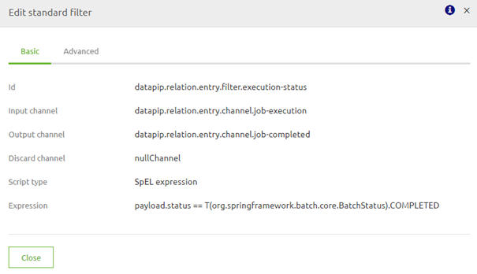
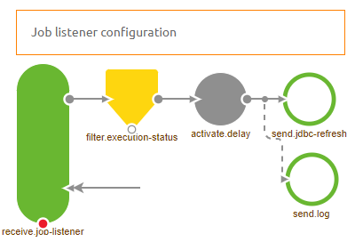

## Migration Path - AWS Redshift Refresh

Below you will find a document describing the migration path to add the AWS Redshift Refresh functionality to a datapipeline solution you have previously build.
In case you want to implement a new datapipeline make sure to import it from the store as that will guarantee that this functionality will be included.

Should you have any questions, please contact productmanagement@emagiz.com.
Last update: February 2th 2021

## Pre-requisites
- Basic knowledge of the eMagiz platform
- Understanding of Data pipelining concepts
- A existing Data pipeline solution within your eMagiz project.

## 1. Remove unnecessary components

First we will delete components that have become obsolete as of late. The components you can remove from the flow are:

- support.bus-connection-plain
- support.bus-connection-caching

Furthermore you could remove the following debug components as every interesting step is already monitored and can therefore be tracked without the help of the debugger:

- global channel interceptor
- activate.debug-bridge
- send.debug
- entry.channel.debug-queue
- debugBridgeChannel

## 2. Add new components to refresh AWS Redshift
AWS Redshift offers you the option to create a materialized view. A materialized view is a table that combines information from several source tables into one view.
To keep updating this materialized view when a source table is updated eMagiz has created some functionality to refresh the materialized view.

To make sure that your existing data pipeline will function in the same way you should execute the following steps:
- Add a channel called job-execution
- Add a channel called dummy
- Add a channel called job-completed
- Add a channel called job-completed-delay
- Add a channel called log
- Add a job execution listener gateway and configure it as follows
	

- Add a standard filter and configure it as follows (the expression checks whether the Job is already finished) -> payload.status == T(org.springframework.batch.core.BatchStatus).COMPLETED
	

- Add a standard activator and configure it as follows (the expression puts the thread to sleep for 60 seconds) -> T(java.lang.Thread).sleep(60000) ?: 'AWS Materialized view refreshed.'
	

- Add a JDBC outbound channel adapter and configure it as follows (query can be found below)
	

- Add a logging channel adapter and configure it as follows
	

- Make sure that the job-completed-delay channel is wiretapped with the help of the log channel	

### 2.1 Query you need for refresh

The following query is needed to refresh the AWS materialized view.	Make sure that the name of the materialized view is filled in as a property value.
	
REFRESH MATERIALIZED VIEW ${dp.jdbc.distinctive-name.tablename}_mv;
COMMIT;	
	
## 3. Intermediate Result

The result should look something like this:

## 4. Add listener to job
If you only add the listener section in the flow you would end up with a solution that only partly works. 
To make sure the complete chain of events starts working in unison you need to tell the Job which listeners need to listen to the execution of the job.

To do so open the component called support.job.{technicalnameofmessagetype}. On the advanced tab you need to add two listeners:

- A Gateway Listener -> Select the job execution listener that you have added in step 2
- A Exception Listener -> This one makes sure that when a error occurs in AWS Redshift the status of the Job will be Failed instead of Completed.

The configuration should look as follows:

## 5. End Result

The end result of all this should look something like this:

