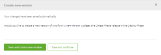
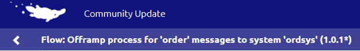
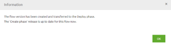

<<<<<<< HEAD
# Promote create version to deploy?
eMagiz gives you the option to make changes in the Create phase and temporarily save them if you are not yet content with the way the flow works. After you have pressed Stop Editing eMagiz gives you a choice.
Do you want to save the flow and continue on a later moment with what you have build till here. Or are you satisfied with the result and want to create a new deployable version

This way you have more control over which versions are available to be deployed in Test, Acceptance and Production. You have to make a concious choice as a developer to promote something to Deploy. 
As a result your teammates and yourself have a better and more complete picture of which changes are still in progress and which are ready for Acceptance and Production.

When you choose to continue on a later moment eMagiz indicates this on flow level by showing an asterisk behind the flow version the next time you enter the flow

The moment you choose to make a deployable version based on the changes you made in create you are prompted with a popup in which you have to specify what you changed and what type of change you made (patch, minor, major).
eMagiz will on the basis of this transfer this version, and all accompanying versions to the Create phase release. This to make it available for your next Release

=======
# Promote create version to deploy?
eMagiz gives you the option to make changes in the Create phase and temporarily save them if you are not yet content with the way the flow works. After you have pressed Stop Editing eMagiz gives you a choice.
Do you want to save the flow and continue on a later moment with what you have build till here. Or are you satisfied with the result and want to create a new deployable version

This way you have more control over which versions are available to be deployed in Test, Acceptance and Production. You have to make a concious choice as a developer to promote something to Deploy. 
As a result your teammates and yourself have a better and more complete picture of which changes are still in progress and which are ready for Acceptance and Production.

When you choose to continue on a later moment eMagiz indicates this on flow level by showing an asterisk behind the flow version the next time you enter the flow

The moment you choose to make a deployable version based on the changes you made in create you are prompted with a popup in which you have to specify what you changed and what type of change you made (patch, minor, major).
eMagiz will on the basis of this transfer this version, and all accompanying versions to the Create phase release. This to make it available for your next Release

>>>>>>> fdbf314c551131ff79d798c8d8b5783fc88fba2a

