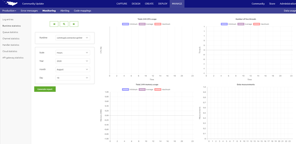
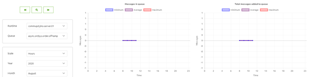

## Recovery Guide eMagiz Cloud

Below you will find several sections that describe several scenarios that could occur when running your eMagiz environment in the eMagiz cloud. For each of these scenarios / signals we detailed what to do in case something like that arises. This to make sure that the customer experiences no or very limited downtime on the integration platform identify constructs of the framework that are deemed legacy and are replaced by newer and better alternatives. The guide is split up per legacy construct. Per section we describe the legacy method, the new method and how to migrate from legacy to new. Should you have any questions, please contact productmanagement@emagiz.com.
Last update: August 19th 2020

## Pre-requisites
- Advanced knowledge of the eMagiz platform
- Good analysis skills to determine the root cause of problems

## Signals
Below you will find a list of signals that could occur when running your eMagiz environment in the eMagiz cloud. For each of these signals we have detailed sections on how to analyze these problems.

[No messages can be send to system X](#solve-the-problem-where-there-is-no-traffic-between-emagiz-and-the-runtime-for-which-you-have-received-the-alert)

[Live server seems to be down](#solve-the-problem-where-both-live-jms-as-well-as-backup-jms-are-down)

[Backup server does not start up after failback scenario](#solve-the-problem-where-backup-server-won't-come-up-again-after-restarting-the-live-jms)

[Connector / Runtime seems to be down](#solve-the-problem-where-a-runtime-is-down)

[Number of consumers is greater than threshold](#solve-the-problem-where-there-are-too-few-or-too-many-consumers)

[Number of consumers is less than threshold](#solve-the-problem-where-there-are-too-few-or-too-many-consumers)

[Out of memory log entry](#solve-the-problem-when-confronted-with-an-out-of-memory-log-entry)

## First Aid

In this section we specify what can be done to give first aid to a eMagiz Cloud environment in case this is needed

### Solve the problem where there is no traffic between eMagiz and the runtime for which you have received the alert

1.	Log in to eMagiz
2.	Open the bus for which you have received the alert, navigate to ‘Manage’ and select the ‘Production’ environment
3.	Navigate to the sub tab ‘Monitoring’ and select the ‘Runtime statistics’ option in the left hand panel.
4.	Select the runtime, on the basis of the runtime name (from the alert / mail) and check whether the runtime statistics are indeed missing. In the scenario were you are told message traffic does not work between several systems you would have to check each of these runtimes to verify whether runtime statistics are available

5.	Check for the last measured point in time to determine whether this time matches the current time in UTC.
	-	Runtime statistics indicate nothing is happening for some time now
		-	Navigate to ‘Manage’, ‘Monitoring’ and select ‘Queue statistics’ in the left hand panel. Check whether there are a lot of queues residing in queues towards this system (note: Entries do not have queues)
		
			

		
		-	Navigate to ‘Deploy’, ‘Runtime Dashboard’. See if the JMS server is Active. This can be done by selecting the JMS runtime and verifying that the lamp is yellow and the status is Active
			-	Yes -> Continue with step 4
			-	No -> In case you are dealing with a failover bus, check whether the backup is running, by executing the process as described in step ii
				-	Yes -> Backup should handle the message traffic. [Check message traffic](#check-message-traffic)
				-	No -> [Restart live and/or backup server](#restart-live-and/or-backup-server)
	-	Runtime statistics indicate that statistics are coming in
		-	Confirm messages are being consumed from the queues and verify in the application itself (yourself or with help from someone else) whether message arrive and are being processed. For help, see [Check message traffic](#check-message-traffic)
6.	Go to [Check whether statistics are missing for mulitple bus environments](#check-whether-statistics-are-missing-for-multiple-bus-environments) and verify if the statistics are also missing for other eMagiz environments

### Solve the problem where both live JMS as well as backup JMS are down

In case of a single lane option only the live JMS will be down to end up in this section
1.	Log in to eMagiz
2.	Open the bus for which you have received the alert, navigate to ‘Manage’ and select the ‘Production’ environment
3.	Navigate to the sub tab ‘Monitoring’ and select the ‘Runtime statistics’ option in the left hand panel.
4.	Select the runtime (both live as backup if available) and check whether the runtime statistics are indeed missing.
5.	Check for the last measured point in time to determine whether this time matches the current time in UTC.
	-	Runtime statistics indicate nothing is happening for some time now
		-	Navigate to ‘Manage’, ‘Monitoring’ and select ‘Queue statistics’ in the left hand panel. Check whether there are a lot of queues residing in queues towards this system (note: Entries do not have queues)
		
		

		
		-	Navigate to ‘Deploy’, ‘Runtime Dashboard’. See if the JMS server is Active. This can be done by selecting the JMS runtime and verifying that the lamp is yellow and the status is Active
			-	Yes -> Continue with step 4
			-	No -> In case you are dealing with a failover bus, check whether the backup is running, by executing the process as described in step ii
				-	Yes -> Backup should handle the message traffic. [Check message traffic](#check-message-traffic)
				-	No -> [Restart live and/or backup server](#restart-live-and/or-backup-server)
	-	Runtime statistics indicate that statistics are coming in
		-	Confirm messages are being consumed from the queues and verify in the application itself (yourself or with help from someone else) whether message arrive and are being processed. For help, see [Check message traffic](#check-message-traffic)
6.	Go to [Check whether statistics are missing for mulitple bus environments](#check-whether-statistics-are-missing-for-multiple-bus-environments) and verify if the statistics are also missing for other eMagiz environments

		
### Solve the problem where backup server won’t come up again after restarting the live JMS
This scenario is only applicable for buses with a failover setup

1.	Log in to eMagiz
2.	Open the bus for which you have received the alert, navigate to ‘Manage’ and select the ‘Production’ environment
3.	Navigate to the sub tab ‘Monitoring’ and select the ‘Log Entries’ option in the left hand panel.
	-	Check whether a certain logging line is present in the eMagiz logs
		-	Search for each of the following values in the field message via separate searches: ‘Java heap space’ or ‘Out of memory’ or ‘I/O error’ or ‘Metaspace error’
			-	Yes -> Inform customer that the backup is currently not working and discuss with your colleagues, support and the customer for a suitable time window to get the backup up and running again
			-	No -> Continue with step b
	-	In case you arrive here the number of consumers on a container runtime should be two
		-	Yes -> No further action required
		-	No -> Restart backup server. [Restart live and/or backup server](#restart-live-and/or-backup-server)

### Solve the problem where a runtime is down
1.	Log in to eMagiz
2.	Open the bus for which you have received the alert, navigate to ‘Manage’ and select the ‘Production’ environment
3.	Navigate to the sub tab ‘Monitoring’ and select the ‘Runtime statistics’ option in the left hand panel.
4.	Select the runtime, on the basis of the runtime name (from the alert / mail) and check whether the runtime statistics are indeed missing. In the scenario were you are told message traffic does not work between several systems you would have to check each of these runtimes to verify whether runtime statistics are available

5.	Check for the last measured point in time to determine whether this time matches the current time in UTC.
	-	Runtime statistics indicate nothing is happening for some time now
		-	Navigate to ‘Manage’, ‘Monitoring’ and select ‘Queue statistics’ in the left hand panel. Check whether there are a lot of queues residing in queues towards this system (note: Entries do not have queues)
		
		

				
		-	Check executed in the previous step indicates that the runtime is down
			-	Yes -> Runtime should be restarted
				-	Navigate to ‘Deploy’, ‘Architecture’ and  select the ‘Production’ environment. Search for the runtime that is not working anymore.
				-	Determine on the basis of the search were the connector is running
					-	In case of a cloud connector you can restart the connector via this page. [Restart a runtime in AWS](#restart-a-runtime-in-AWS)
					-	In case of an on-premise runtime you can’t restart the connector via this page. Discuss with customer and support how you can best restart the connector
				-	Restart not successful -> Contact support for assistance as they can check the logs in the eMagiz Cloud
			-	No -> Temporary connection loss between eMagiz cloud and runtime. If message traffic works as expected consider this an incident and log an RCA with support
	-	Runtime statistics indicate that statistics are coming in
		-	Confirm that messages are indeed consumed from the queue and check whether messages arrive and are being processed
			-	Messages arrive -> Continue with step 6
			-	Messages do not arrive -> Continue with step ii
		-	In case you runtime statistics are coming in but no messages are consumed and delivered please see [Solve the problem where there is no traffic between eMagiz and the runtime for which you have received the alert](#solve-the-problem-where-there-is-no-traffic-between-emagiz-and-the-runtime-for-which-you-have-received-the-alert)
6.	Log an RCA with support for further analysis

		
		
### Solve the problem where there are too few or too many consumers
1.	Did you receive an alert that there are too few consumers on queue?
	-	Yes -> Navigate to ‘Manage’ and select ‘Queue statistics’ on the ‘Production’ environment from the left hand panel. Check various flows that are running on this runtime. The queue statistics should indicate that the number of messages have been dropped from 2 to 1 or from 1 to 0.
		-	Success -> This means that this specific runtime is indeed down. See [Restart a runtime in AWS](#restart-a-runtime-in-AWS) to restart the runtime in question. In case a on-premise runtime is broken discuss with the customer and support what the next action will be.
			-	Check whether the number of consumers is back to the expected level
				-	Yes -> Problem solved
				-	No -> Potentially there are bigger issues on JMS level. Navigate to [Solve the problem where both live JMS as well as backup JMS are down](#solve-the-problem-where-both-live-jms-as-well-as-backup-jms-are-down)
		-	Failure -> This means the consumer count works as expected. Consider this an Incident
	-	Nee -> Continue with step 2
2.	Did you receive the alert that there are too many consumers?
	-	Yes -> Navigate to ‘Manage’, ‘Queue statistics’ for the ‘Production’ environment. Check various flows that are running on this runtime. The queue statistics should indicate that the number of messages have been increased from 1 to 2 or from 2 to 3.
		-	Success -> This means an unwanted consumer has been spotted. The only way to resolve this is through a restart of the JMS server. [Restart live and/or backup server](#restart-live-and/or-backup-server)
		-	Failure -> This means the number of consumers is as expected. Consider this an Incident

### Solve-the-problem-when-confronted-with-an-out-of-memory-log-entry
1.	Log in to eMagiz
2.	Open the bus for which you have received the alert, navigate to ‘Manage’ and select the ‘Production’ environment
3.	Navigate to the sub tab ‘Monitoring’ and select the ‘Log Entries’ option in the left hand panel.
	-	Check whether a certain logging line is present in the eMagiz logs
		-	Search for each of the following values in the field message via separate searches: ‘Java heap space’ or ‘Out of memory’ or ‘I/O error’ or ‘Metaspace error’
			-	Yes -> Continue with step 4
			-	No -> Check whether the alerting is correctly set up
4.	Navigate to ‘Deploy’, ‘Runtime Dashboard’ on the ‘Production’ environment and test whether the runtime for which you have received the out of memory alert. This to verify whether or not the runtime is running.
	-	Yes -> Continue with step 5
	-	No -> Continue with step 5
5.	[Restart a runtime in AWS](#restart-a-runtime-in-AWS)

### Restart a runtime in AWS
1.	Navigate to ‘Deploy’, ‘Architecture’ and select the ‘Production’ environment if you are not yet on this page
2.	Press Start Editing
3.	Search for the runtime for which you have received the alert and activate the drop down menu via a right click of your mouse
4.	Select Restart Runtime
5.	Check traffic of messages, see [Check message traffic](#check-message-traffic)
	-	Success -> Tell customer that messages are once again delivered correctly
	-	Failure -> [Check whether runtime exists in eMagiz Cloud](#check-whether-runtime-exists-in-emagiz-cloud)

### Reset a runtime in AWS
1.	Navigate to ‘Deploy’, ‘Architecture’ and select the ‘Production’ environment if you are not yet on this page
2.	Press Start Editing
3.	Search for the runtime for which you have received the alert and activate the drop down menu via a right click of your mouse
4.	Select Reset Runtime
5.	Check traffic of messages, see [Check message traffic](#check-message-traffic)
	-	Success -> Tell customer that messages are once again delivered correctly
	-	Failure -> [Check whether runtime exists in eMagiz Cloud](#check-whether-runtime-exists-in-emagiz-cloud)

### Restart live and/or backup server

1.	Navigate to ‘Deploy’ and select the ‘Production’ environment. Select the ‘Runtime Dashboard’ option.
2.	Confirm the server is indeed down. This can be done by pressing on the JMS server runtime. If this is not responding you can state with 99% certainty that the live server is indeed down.  Execute the same action for the backup server (if this is present with your customer)
3.	Are both the live and backup server down? The following steps describe the least risky option, but is also the most time consuming option. If speed is important see step 4
	-	Stop backup server
		-	Go to ‘Deploy’, ‘Architecture’ and press Start Editing
		-	Right mouse click on the machine where the backup JMS is running on and select Stop machine
	-	Stop live server
		-	Go to ‘Deploy’, ‘Architecture’ and press Start Editing
		-	Right mouse click on the machine where the live JMS is running on and select Stop machine
	-	Start live server
		-	Go to ‘Deploy’, ‘Architecture’ and press Start Editing
		-	Right mouse click on the machine where the live JMS is running on and select Start machine
	-	Start backup server
		-	Go to ‘Deploy’, ‘Architecture’ and press Start Editing
		-	Right mouse click on the machine where the backup JMS is running on and select Start machine
	-	[Check message traffic](#check-message-traffic)
		-	Success -> Communicate to the customer that messages arrive again
		-	Failure -> Contact support for assistance as they can check the logs in the eMagiz Cloud
4.	If uptime and speed in which actions are executed are of importance please follow the steps detailed below
	-	Restart the JMS (live) runtime
		-	Navigate to ‘Deploy’, ‘Architecture’ and press Start Editing
		-	Right mouse click on the JMS runtime and select Restart Runtime
	-	Restart the JMS (backup) runtime
		-	Navigate to ‘Deploy’, ‘Architecture’ and press Start Editing
		-	Right mouse click on the JMS runtime and select Restart Runtime
	-	[Check message traffic](#check-message-traffic)
		-	Success -> Communicate to the customer that messages arrive again
		-	Failure -> Contact support for assistance as they can check the logs in the eMagiz Cloud
5.	Is live server down but is the backup running or vice versa? Only applicable for failover buses
	-	Stop live server or backup server (depending on which of the two are down)
		-	Navigate to ‘Deploy’, ‘Architecture’ and press Start Editing
		-	Right mouse click on the JMS runtime and select Stop Runtime
	-	Start live server or backup server (depending on which of the two are down)
		-	Navigate to ‘Deploy’, ‘Architecture’ and press Start Editing
		-	Right mouse click on the JMS runtime and select Start Runtime
	-	Check runtime statistics under ‘Manage’
		-	Success -> Communicate to the customer that both servers are up and running again
		-	Failure -> [Check message traffic](#check-message-traffic)
			-	Success -> Open an RCA for the project team and or support to identify why the problem occurred
			-	Failure -> Contact support for assistance as they can check the logs in the eMagiz Cloud

### Check message traffic

1.	Navigate to ‘Manage’ and select the option ‘Queue statistics’ in the left hand panel. Check the various flows that are of relevance for this particular integration. For this integration you should see messages flowing through each step (entry till exit). Be aware, the number of messages does not have to be equal in each step due to the possibility of filtering messages in between.
	-	Success -> This means everything works again as expected. If you happen to have access to the application that should receive the data you always have the extra option to log in and verify if the messages indeed have arrived
	-	Failure -> This means that messages are still not being delivered. In most cases this is due to problems on JMS level. Advice is to restart the JMS. See [Restart live and/or backup server](#restart-live-and/or-backup-server)

### Check whether runtime exists in eMagiz Cloud

1.	Navigate to ‘Deploy’, ‘Architecture’ and select the ‘Production’ environment if you are not yet on this page
2.	Search for the runtime that is not running and see if you can find it
	-	Yes, check the background color of the runtime and proceed with step 3
	-	No, navigate to ‘Design’, ‘Architecture’. Select ‘Production’ and continue with step 6
3.	Background color of the runtime is
	-	White with a green outside line. Continue with step 4
	-	White with a blue outside line. Continue with step 4
	-	White with a red outside line. Continue with step 5
	-	Dark blue with a dark blue outside line -> [Reset a runtime in AWS](#reset-a-runtime-in-AWS)
4.	If you arrived at this step this means that a change to Architecture has not yet been committed to the eMagiz Cloud. To commit these changes execute the following steps in order
	-	Press Start Editing
	-	Press Apply to Environment and wait for the conformation from eMagiz that the update is committed to the eMagiz Cloud
	-	[Check message traffic](#check-message-traffic)
		- 	If this control renders success your runtime is (again) running as expected
		-	If this control does not render success please contact support to verify what the logs within the eMagiz Cloud tell with regards to why this runtime is not active
5.	If you arrived at this step this means that the runtime that is not running actually needs to be removed from the eMagiz Cloud
	-	If this is indeed true, continue with step 4
	-	If this is not correct navigate to ‘Design’, ‘Architecture’ and select ‘Production’. Please continue with step 6 afterwards
6.	If you arrived at this step you have arrived at the conclusion that the Architecture is not conform what actually should be running on your environment. In these cases you need to execute the following actions
	-	Press Start Editing
	-	Press Apply to Environment
	-	Place runtime on the machine it should be running on
	-	Press Stop Editing
	-	Navigate back to step 2 and follow the steps from there
	
### Check whether statistics are missing for multiple bus environments

1.	Select a number of other buses and verify under ‘Manage’ whether those buses do have statistics (queue, runtime, etc.)
	-	Success -> Problem resides with the bus you are currently investigating. Restart of the JMS server is required. If the problem is only that statistics are missing please consult with the customer first before executing a restart of the environment
	-	Failure -> Open the EHBO-emagiz portal cL file in Cape Service Point for the customer eMagiz and navigate to [Live server seems to be down](#solve-the-problem-where-both-live-jms-as-well-as-backup-jms-are-down)

