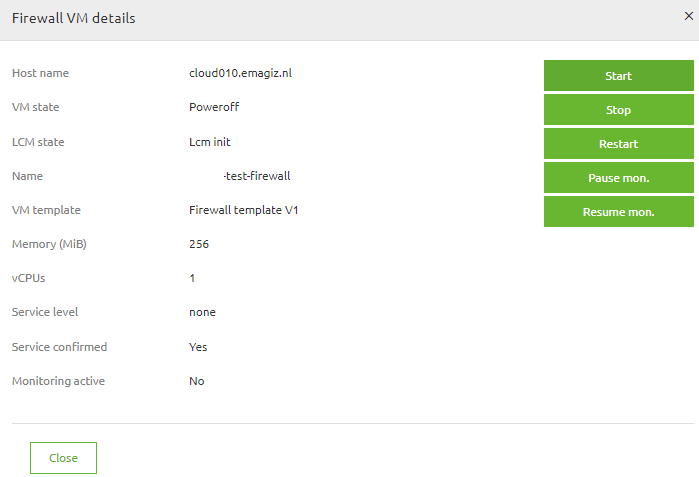
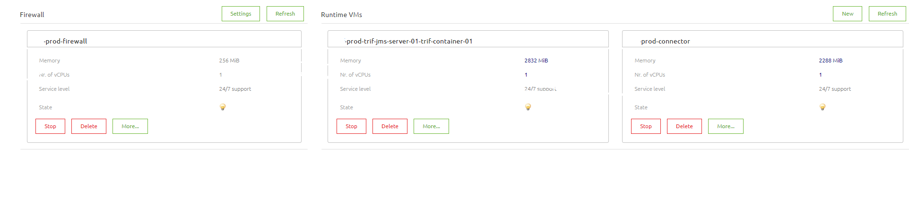
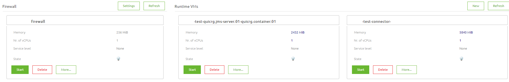
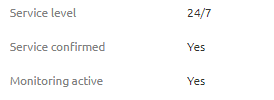

## Introduction
This document describes what the requirements are for a eMagiz Cloud Root runtime installation as well as a step to step guideline how to install a runtime in the Root Cloud. 

 
## Requirements
The requirements to install a Root Cloud runtime are:
1)	eMagiz should make the Root Cloud environment available. The eMagiz Partner Manager will only do this when there is a signed contract. eMagiz creates and releases the environment based on calculations of how many runtimes and flows will be running in the cloud and how much traffic is expected. Make sure that the Cloud calculations are correct and that you have enough space left. 
If you are unsure, please contact your eMagiz Partner Manager.
2)	In case of a connector, make sure you have considerate what kind of connection type you need to use in case of a webservice, HTTPS. A HTTPS connection is always preferred with a connection over the internet. HTTP is not allowed.
3)	In case of a connector, make sure that you cannot use a local file pick up and file drop. Cloud connectors are not meant to store data locally.
4)	In case of migrating a runtime, make sure to make a copy of your properties and the running flows. When migrating the JMS runtime, the JMS host property will be automatically replaced with the new value. You can create a copy of your properties by exporting your properties to a CSV file at the properties page. A copy of your running flows can be created by taking a screenshot of each runtime in your Runtime Dasboard. By not making a copy, you might have issues when you have to roll back.
 
## How To
This section will discuss the steps to install a runtime in the Root Cloud.
1)	Go in eMagiz to ‘Deploy’ and to ‘Cloud’ dashboard.

2)	In case that there is no firewall yet, please create it. The firewall shows the hostname. This will be the hostname for your URL’s when using web services in your connectors.

3)	In case that there is no Virtual Machine (VM) yet, you can create it. 
eMagiz knows two types of VM’s. First VM type consists of a JMS and a container runtime. The second VM type consists of a group of connectors. 

In case that there is already the type of VM you want to use, please stop it before adding a new runtime.

4)	Make sure that for each runtime you will have that the Infra or JMS flow available as package for your environment.

5)	Add the runtime via ‘Add/remove runtime’. 

If you cannot add a runtime, your cloud environment has not enough space or memory left to add this. Please contact your eMagiz Partner Manager for more information.
By adding the JMS runtime, be aware that the JMS host property now will be replaced!

6)	Start the VM via ‘Start’.

7)	Go to the ‘Runtime Dashboard’. Wait for the added runtime to come up.

8)	If you are hosting web services, configure your firewall rules back in the ‘Cloud’ page.
Select ‘Setting’ next to ‘Firewall’.

Add your firewall mapping to your connector VM. The ‘Target port’ is the port you have added in your flow or property and the ‘Incoming port’ is the port for the web service URL This does not have to be the same port as your ‘Target port’.

9)	Test the connection if your bus is working properly.
10)	Check if monitoring is active for all runtimes. If you click more for a runtime in the Cloud page, you will see the current monitoring status.

Check if for your environment the service level is correct. Check it for the live environment. Contact your eMagiz Partner Manager to verify that these settings are correct.
If the service level is set and the monitoring is not yet available, you can resume it by clicking Resume Mon.
