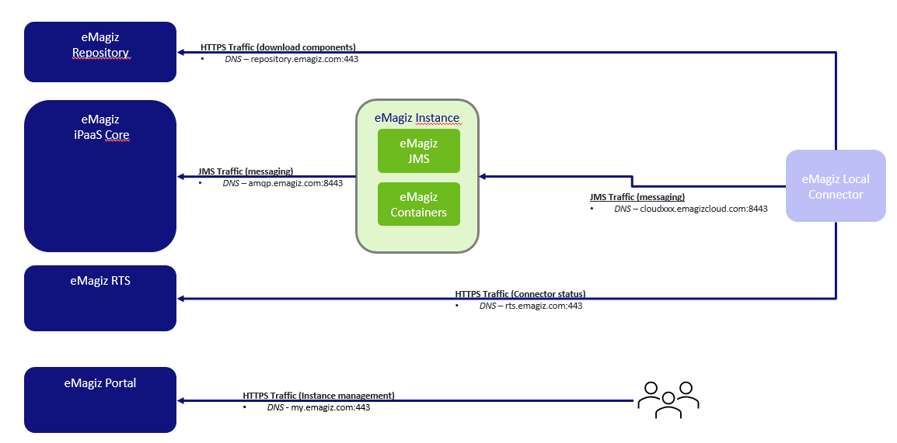
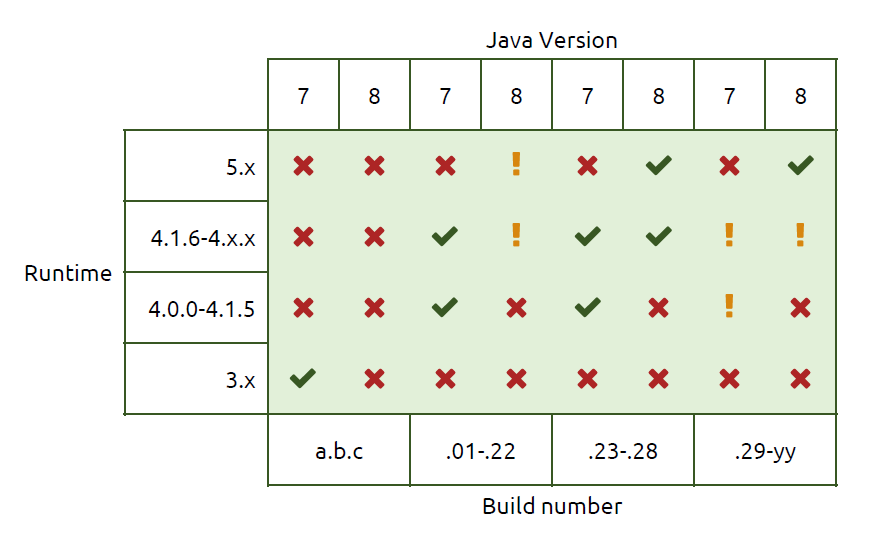
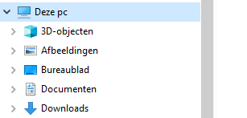
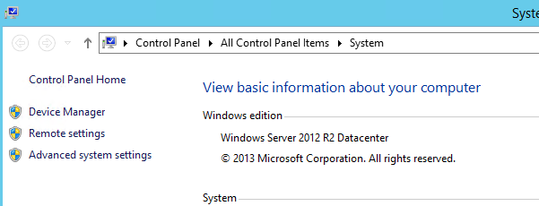
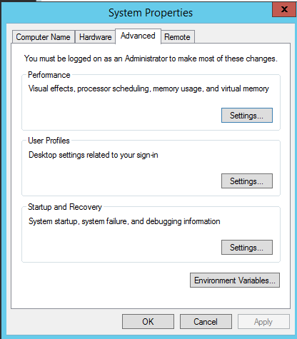
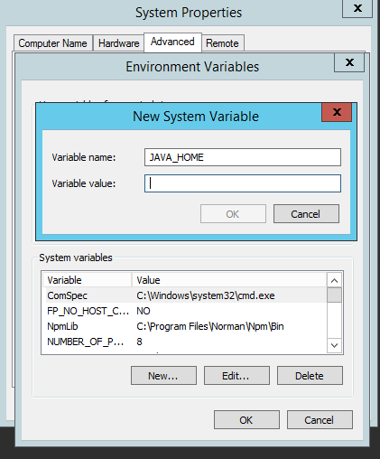
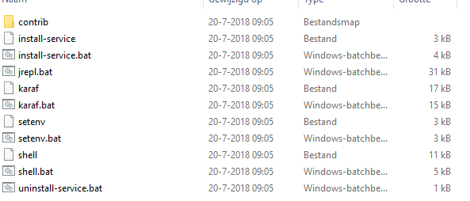
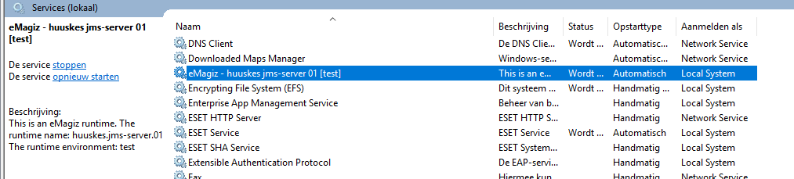
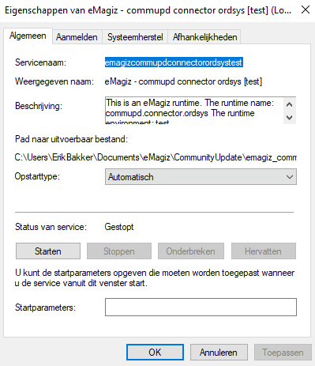
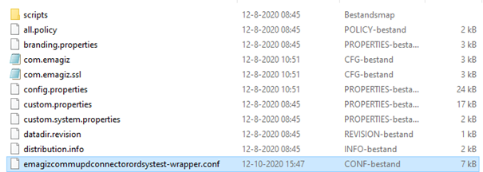

# On-premise (Windows) eMagiz runtime installation document

This document describes what the requirements are for a eMagiz runtime installation on-premise on a Windows machine as well as a step by step guideline how to install a runtime on-premise. 
An on-premise installation often occurs in an architecture where the runtime should run within your own or your customer’s network. 
This is recommended for all connectors that communicate with a system that is located inside your network or if you would like to test locally on your computer. 
For an installation of a runtime on a Linux system please see [On-premise eMagiz runtime installation document Linux](runtime-installations-onpremise-linux.md)

## Requirements
To install a runtime, please be aware that eMagiz needs an environment that satisfies certain requirements. 
These requirements can be different depending on your architectural choices. 
Most common is the connector inside your network and a JMS and container running outside the network. 
In that case, if you are running only connectors on this environment, please keep the following requirements in mind:
1.	OS with support for Java 
2.	OS user with granted security rights to run startup services (Windows services) 
3.	The correct Java installation (Java 8 SE JRE for example, https://adoptopenjdk.net) with NO automatic updates. OpenJDK 8 is currently the recommended version for eMagiz installations.
4.	NTP synchronization – all eMagiz service instances should use the same time and settings. 
5.	Access to internet 
6.	Outbound JMS traffic - port 8443 (and 8444 in case of failover situation) - amqp.emagiz.com / cloudXXXX.emagizcloud.com 
	-	General monitoring data to eMagiz iPaaS 
	-	Specific JMS traffic to eMagiz JMS Server 
7.	Outbound HTTPS traffic – port 443 – Specific provisioning data- https://rts.emagiz.com/ws/ / https://repository.emagiz.com    
8.	Hardware requirements 
	-	Modern CPU  
	-	Enough Disk Space according to sizing calculations 
9.	Enough Memory according to sizing calculations 

## Additional information:
1)	To run an eMagiz runtime, the OS of the server should support and have Java installed. 
The current version is Java 8. eMagiz runtimes with version of 5.x or higher only support Java 8. 
These runtimes will not run on Java 7 or earlier versions. 
If you are running on Java 7, or if you need to use an earlier version of the eMagiz runtime, 
please also check ‘Installing an older version of the eMagiz runtime’.
2)	Additional to 1), please do NOT allow automatic updates. Updates in Java 8 are installed in a different directory than the earlier version. This causes that with every update, your JAVA_HOME system variable, which ensures that if you use Java you use that version, should be updated manually by every update. If you update automatically, this will cause issues since the JAVA_HOME variable will not properly set after each update. See the following Q&A question to learn more about the importance of JAVA_HOME when using on-premise connectors: https://my.emagiz.com/p/question/172825635700348986. Since it can be though to find a Java version via the Oracle site, you are advised to download your Java version from https://adoptopenjdk.net. 
3)	By installing a runtime, you also need an OS user with security rights to run startup services. This is required because installing the corresponding service for a connector will make sure that the connector can independently stop or start without any user intervention. This means that if the server (JMS) restarts, no manual actions are required. 
4)	Each server has a date and time. An eMagiz service instance use the NTP time protocol. The NTP protocol is a networking protocol for clock synchronization based on UTC time. Synchronizing your server with the NTP protocol ensures that eMagiz runtimes ‘talk’ with the same date and time. This ensures that you prevent for example:
-	That you are not able to reach your connector via the Runtime Dashboard
-	That synchronized communication fails due to time out errors caused by out of sync runtimes instead of that a system fails to response.
5)	In order to communicate with other runtimes, that are hosted outside your network, you need access to the internet.
6)	For your connector to communicate with your JMS server, the on-premise server needs to open its port 8443 (and 8444 in case of failover) for outgoing communication (from the server point of view). Via this port JMS data is communicated. In ensures for example that you are able to reach the connector via the runtime dashboard and that you can see statistics of the runtime in Manage. 
Via a different port, your connector will communicate with your container and its flows. eMagiz requires that the server opens its port 443 for outgoing information to communicate the actual messages exchanged. 
7)	The servers itself has requirements as well. Please ensure that the server has a modern CPU, enough diskspace and enough memory. 
8)	Most important is that for each runtime at least 1GB of RAM Memory is available. These calculation is made as follows:
-	500 MB heap memory
-	192 MB metaspace memory
-	100 MB overhead
The above is the bare minimum needed to run. As the number of flows running on a connector increases the memory also needs to be increased. The same logic applies to flows that use up a lot of memory because multiple steps are executed within that flow. Both are solid reasons to use 1GB as a general rule of thumb but at the same time always take into account new developments when setting up the sizing.

If you install your JMS and container as well within your network and not in the cloud, please keep in mind that you need to open port 8443 (and 8444 in case of failover) as well for incoming communication.

## Java runtime and eMagiz runtime compatibility
Java is required to run eMagiz instances, however Java and eMagiz are continuously developing their software. This means that at some point in time older versions of Java and older parts of eMagiz are not supported anymore. In this chapter we will discuss which java version works with which runtime version. 
Different elements will be discussed. The following schema will show the compatibility of eMagiz in relation with Java and the flow build numbers. 

X = Not compatible
! = Caution, not supported anymore 
V = Compatible

With runtime we mean the version of the eMagiz runtime. Not only flows do have a version number, eMagiz is also continuously developing their runtime as well. The newest runtime version above 5.x is only compatible with Java 8. You can check your runtime version in eMagiz Manage -> Monitoring. Search for ‘uptime’ in the message search field. 
The results will show what the runtime version of the runtime is. Runtime versions above 5.x show also the version number in the log lines when starting the runtime.
With build number we mean the flow build number is eMagiz. You can check them either in Deploy -> Releases or in your Runtime Dashboard.
Check before your installation what runtime should be used. Advice and supported option from eMagiz standpoint is to use Java 8 and the newest eMagiz runtime. If that is not possible, please check if your situation is applicable above. 
If you have a situation that you end up with the yellow exclamation mark or you are unsure, please check with your eMagiz consultant or Product Manager (productmanamgent@emagiz.com) about what the possibilities are.

## How to install runtime
This chapter will discuss a step to step guideline of how to install a new eMagiz runtime of 5.X or higher. As a reminder this how to is only applicable for a Windows environment. Please see see [On-premise eMagiz runtime installation document Linux](runtime-installations-onpremise-linux.md) on how to install a runtime on a Linux enviroment. 
If you need to install an earlier version, please also read the extra information ‘Installing an older version of the eMagiz runtime’

### Pre-configuration

1)	The first step of this How-To is to make sure before installing that the requirements as stated above are met. 
2)	Go to the server where you need to install the runtime.
3)	Check the JAVA_HOME system variable if it is set and is directed to the correct folder. You can do this by going to ‘This Computer’.

4) Click with your right mouse button on This PC and go to Properties. The following screen pops up and go to Advanced System Settings.

5) Go to Environment Variables.

6) Check if the JAVA_HOME system veriable exists and it directs to the correct JAVA directory. If it does not exists, please add it.

### Download runtime

1.	Download the eMagiz runtime of your connector, JMS or container via eMagiz Deploy phase in the Containers tab on the server where it needs to be installed. Please note the environment you want the runtime of. If you download the runtime of the wrong environment you will send to or receive of the wrong environment. For example you want to test a flow but by downloading the runtime from the incorrect enviroment you end up sending data to the Production environment. In the case below, we see that we are downloading a connector runtime ordsys for the Test environment.

### Unzip the runtime

1.	Unzip your download package into a directory which is not too deep into the directory structure. 
A directory structure which is too deep will cause issues when extracting the runtime.
For example use: C://eMagiz/test
Do not use: C://Programs/eMagiz/test/connector/appeee/installation
2.	Go to the unpacked package and open the folder

### Test the runtime
1.	In the Bin folder, you can validate if the service can make a connection via karaf.bat. 
To check the connection of the service, use right mouse button the execute the file as Administrator.
Please make sure that before you try this you verify that your JMS is running.

2.	A screen will pop up and will show you the following:
	
	-	Use the command ‘log:tail’ to see the full log. You will see the full stack trace. If the installation is successful, you should see something like this as a result:
		org.eclipse.gemini.blueprint.extender - 2.1.0.RELEASE |  Application context successfully refreshed (ApplicationContext(bundle=nl.capesystemsintegration.demo.bus.commupd.ordsys.connector-infra.spring, config=nl.capesystemsintegration.demo.bus.commupd.ordsys.connector-infra.spring_1.0.0.52.xml))

If you see an error or the popup closes itself immediately, please check the above steps and requirements. If the popup closes this is probably due to a mismatch between Java version and runtime version. Please look back at the section explaining how to set JAVA_HOME for more information. If all the above steps are correct and you are not able to identify the issue, please contact your eMagiz contact person (emagizcc@capegroep.nl).

3.	If you see the expected logging, check in eMagiz if:
-	You are able to reach the runtime via the runtime dashboard.
-	You see runtime statistics in Manage.

4.	Close the popup that is shown (Stop your karaf executable). This makes sure that you stop the karaf.bat from working

### Install the runtime

1.	Install the windows service to ensure that the runtime will automatically start and stop when the server starts, stops or restarts.
You can do this by running the ‘install-service.bat’.

 

2.	Please check if the service is created. This can be viewed via Services in Windows. You can find Services by using the navigation bar of Windows and searching for Services or typ-in ‘Services.msc’ in your run-window (WINDOWS+R) and press enter.
You will find in the list of services your eMagiz runtime service.

If you click on the service, you can either start, stop or restart the service.

3.	Click with your right mouse button on the service and select Properties.
You will see the following screen.

For the start up type, please check Automatically (delayed start)
In the Tab Log On, you are able to change the user that starts this service, if necessary. This mostly occurs when you are requested to use a different user for the service than your windows user due to security reasons.

4.	Check in eMagiz, just as in step 8, if your connector is still running.
5.	Test the connection by sending test messages over the bus. In case of the live environment, contact your technical contact to test for you.
6.	If everything is working correctly, document the steps to access the server and environment and the credentials.

## Sizing upgrade addendum

1)	Estimate the size and the predicted load of the runtime and decide if the default memory settings are enough. 
If you need more memory, for example when you use more than 20 flows on one connector or if some of the flows running on your connector use up more memory as predicted / default. 
In these cases go to your etc folder of your runtime installation which is named according to the following naming convention -> emagiz_{technicalbusname}-{containertype}-{technicalnameofruntime}_{environment}. In this example that would mean emagiz_commupd-connector-ordsys_test. 

Within this folder you will find a wrapper.conf file that is named based on the runtimename. 

When you open this file you can change the memory settings, both heap and metaspace. In the figures shown below you can see which parts of the file you need to change to change the memory settings.

**Heap memory:**

**Metaspace memory:**

Don't forget to save the file as administrator and restart the runtime afterwards to make sure that the new settings are applied

## Multiple Java versions on same server addendum

When confronted with a situation in which you have to support multiple runtime versions running multiple Java versions this addendum is for you. 

This is mainly the case when both Acceptance and Production connectors are running on the same server on-premise or when you migrate environments through multiple steps. To determine the correct Java version needed for your runtime please see the attached picture detailed under Java runtime and eMagiz runtime compatibility. 
Be warned: These steps need to be taken before you install a runtime. If you have already installed the runtime please use the uninstall-service.bat action to uninstall the service before proceeding. When confronted with this situation on a live environment please first discuss your actions with CAPE support and the customer.
1) Navigate to the folder belonging to the runtime you currently want to install and start
2) Navigate to the bin folder within the runtime installation folder
3) Edit the setenv.bat file via Notepad++ / Kladblok / WordPad
4) Search (CTRL + F) for: rem SET JAVA_HOME and change this to SET JAVA_HOME=<Java path>      The Java path refers to the location (path) where Java (8) is installed. Commonly this path will look like: 	 ‘C:\Program Files\Java\jre1.8.x_xxx’ of ‘C:\Program Files\Java\jdk1.8.x_xxx’.
Be warned: Make sure no spaces are surrounding the ‘=’ character
5) Save the file as administrator to ensure that changes made in the file are also represented in 
