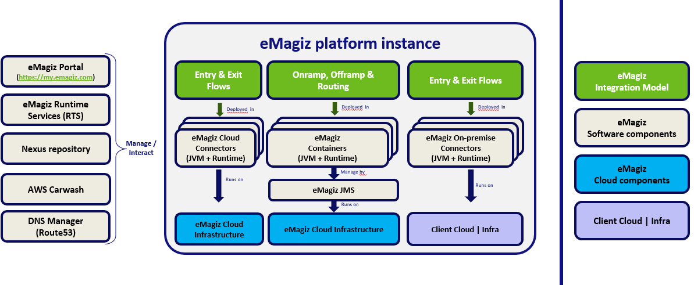
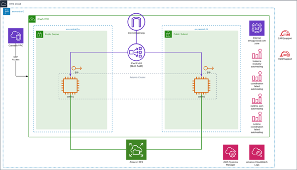
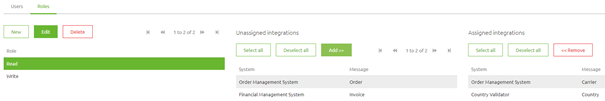

# eMagiz Security Guide

Protecting your data is a joint responsibility between eMagiz and you. The purpose of this security guide is to make clear the security measures eMagiz has taken in the eMagiz platform, so you can assess the eventual additional measures you need to take to ensure that the eMagiz service cooperates securely with the rest of your application and integration landscape

## 1. Architectural setup eMagiz

eMagiz consists of various components communicating with each other to make the process of developing the process layer and subsequently running the message layer as secure and stable as possible for our customers.

1.	In the eMagiz integration project, various flows are configured that work together to realize the integration. The various types are shown on the top of the picture below: Entry, Exits, Offramps, onramps and routing flows.
2.	These flows are then deployed together with a specific build number (contains framework components to make these flows work), into a runtime (java based application container). 
3.	These runtimes run on Cloud machines that contain Cloud templates (all required components to make the Cloud machine operational such as OS, Java runtime version, etc).

The top part of the picture depicts the eMagiz repository. Within this repository all relevant (open-source) libraries that are needed to run flows on a connector are stored.

To prevent unauthorized access of this repository the following measures have been taken
-	Client runtimes can access the repository via a username/password combination through a one-way SSL connection (encrypted) and read the contents of the repository
-	eMagiz developers that need to upload bundles can access the repository through a one-way SSL connection (encrypted)
-	A bitbucket pipeline will be created in the near future to enable automatic updates. This datapipeline will also need a unique username/password combination along with the fact that the connection itself is a one-way SSL connection (encrypted)
-	The repository is read-only for clients. This means that even if someone gets there hands on a username/password combination they do not have sufficient rights to alter anything in the repository. They can only read the data that is kept in the repository.

## 2. Security guidelines for the eMagiz Cloud

In this section we take a closer look at the cloud setup in general. Here we will focus on high level security measurements because specifying security measumerents at the data leve are already discussed in the previous section.

### 2.1 Cloud setup

In the picture shown below you see a standard double-lane setup of an eMagiz instance within the eMagiz Cloud. A single-lane setup looks similar but only consists of one core machine.
This gives a good insight in how messages are flowing through the cloud, which measure are taken for monitoring and auto healing and where data is temporarily stored 'in transit'. 

We would like to use this picture to explain certain components within the cloud from a security perspective. We will start at the outside and work our way inwards.

### 2.2 Cloud location

Within the AWS cloud there are a number of regions were your cloud setup can be running. Examples of these regions are us-east-1, af-south-1, ap-northeast-1, eu-central-1.

As you can see in the picture eMagiz cloud slots are running within the eu-central-1 region. This region is located in Frankfurt and falls therefore under European data and security laws such as the GDPR.

### 2.3 Cloud slot (VPC)

Within this region a unique cloud slot per customer is assigned. In the picture this is represented as a Virtual Private Cloud (VPC). Setting up a VPC provides a logically isolated section of the AWS Cloud where AWS resources can be launched in a virtual network defined. There is complete control over the virtual networking environment, including selection of the IP address range, creation of subnets, and configuration of route tables and network gateways.

Incoming data from the internet passes through a load balancer to route data randomly to one of the core machines containing the runtimes holding the process flows. The setup of a VPC is governed by what is called a Cloud Template.

### 2.4 Cloud template
 
This Cloud Template, designed by eMagiz defines the setup of the cloud instance. The following parts of the cloud setup are configured here:

- Java version
- OS version (Linux)
- Runtime version
- Auto healing
- Monitoring
- Notification options

Staying on the latest cloud template version guards yourself against vulnerabilities in older versions of Java and OS for example. In addition it gives the user more options for monitoring the health of the cloud environment reducing the risk of a loss of availability of data (in a timely manner) without compromizing the integrity of the data.

## 3. Access to runtime / machine

In the last section we looked at data 'in transit'. In this section we take a step back and look at access to the runtime / machine that holds the process flows that process your data. As one can imagine anyone with access to the machines where runtimes are running on can compromize the availability, integrity and confidentiality of data. eMagiz offers two locations were eMagiz runtimes can be installed. Per location, specific security measures are discussed that should be taken to ensure the availability, integrity and confidentiality of the data.

### 3.1 On-premise

On-premise means that the runtimes are running on a machine outside the direct control of eMagiz. This means that the machine is running under the control of the customer that implements eMagiz within their IT landscape.

Because the machine is outside the direct scope of control of eMagiz it becomes a joint effort between eMagiz and you as a customer to make sure that not everyone can access this machine. This becomes even more important when working with file based actions as part of your integration. 
Advice would be to govern this via an IDP (i.e. Azure AD) so you can set up roles that have access to the machine or parts of the machine (i.e. some files).

#### Rights for installing

To install a runtime on a on-premise you need sufficient rights to execute (batch) programs. This means that the user needs administrator rights on that specific machine to correctly perform the installation of the runtime.

#### Rights for running

In Windows a service account is needed to be able to run a Windows Service (in this case the runtime you have installed). This service account is different compared to the user that does the installing of the runtime.
There are two options on this level:
	
- Use the local system account. This account has sufficient rights to run the service and can therefore be used for everything. Less work to configure, more impact on the integrity of data when the account gets compromised.
- Use a specific service account per runtime. This way you limit the power of users to a specific runtime making you less vulnerable if this account gets compromised.

In Linux the service will be running under the local system account as per default.

### 3.2 Cloud

In the eMagiz cloud the access is restricted to those who have a legitimate reason to access it based on the SLA level agreements between customers and eMagiz. This means support engineers, consignment employees and your bus owner have access to your specific cloud setup.
This access is per role furthermore limited. This means that consignment employees and bus owners can only see the logging of the runtimes on the machine and the ability to start/stop machines.

Support engineers have the ability to see more in order to analyze problems on a lower level.

All other users don't have access to the cloud setup as there is no need for access because they can perform the relevant actions on the cloud via the eMagiz portal. For more information on how please see [eMagiz Cloud Management](managing-emagizcloud.md)

#### Rights for installing

To install a runtime in the cloud you need sufficient rights within the Deploy phase of eMagiz. For more information on that subject please see [5. eMagiz iPaaS Portal Security considerations](#5.-emagiz-ipaas-portal-security-considerations)

#### Rights for running

The VPC in the cloud runs on a Linux environment. Therefore the same logic applies as specified above for Linux systems. In Linux the service will be running under the local system account as per default.

## 4. Strengthen your data's security with encryption during transport

### 4.1 Data 'in transit'

As an integration provider we transport data between applications. To ensure that the transport of this data is as secure as possible several measurements have been set up to keep the data confidential.

Let us first look at the data 'in transit'. This is the phase of the process where data is interchanged between flows within the eMagiz platform (i.e from entry to onramp or offramp to exit) via the orchestration of the JMS server on the messaging layer. This is nicely shown in the picture below.

Data ‘in transit’ is temporarily stored on an encrypted filesystem with the help of encryption algorithms. 
For the cloud eMagiz uses the AES-256 encryption algorithm. 
For on-premise runtime installations eMagiz uses the AES-128 encryption algorithm. 
These algorithms make sure that even if third parties could be able to get to the data on that encrypted filesystem they won’t be able to read the data.
That way the data is kept confidential.

Above we mentioned that data 'in transit' is temporarily stored. This can happen at two places:

- On JMS level (EFS)
- Before the message is placed on a queue (H2)

### 4.2 Transport Layer Security

To ensure the integrity of data in the transport layer of eMagiz, eMagiz uses the TLS protocol. This means that all client-server communication is secured via TLS. In eMagiz this is implemented as follows: The necessary certificates of the client(s) are trusted by the server and the server is trusted by the client(s). The relevant information is stored in keystores and truststores that are unique per integration project (ll the integration configurations made to a single eMagiz instance spread across the ILM Phase from Capture to Manage). This ensures that data cannot be sent to other client projects or to other environments within your project.
In other words it prevents others from eavesdropping on your channels. eMagiz follows the standard guidelines when setting up TLS by making sure that the configured trusted certificate authority (CA) bundle that your messaging server uses to verify client connections, is limited to only the CA used for your nodes, preferably an internally managed CA.

## 5. Data exchange with external systems & parties 

Because eMagiz provides the integration between two or more applications via the eMagiz platform the point at which the data is interchanged between application and integration is a critical part of the integration in terms of security.
Within eMagiz there are three main integration patterns a user can configure to support their business case in the most optimal manner. In this section we will look at all three of these integration types in detail and specify the security measures.

### 5.1 Messaging

Messaging is the most flexible option of the three. Therefore a wide range of options is available within eMagiz to secure the connections.
eMagiz offers users the tools to set up integrations and end-points in a secure manner. eMagiz supports well-known market standards, including:

- OpenID Connect
- WS-Security
- API Keys in combination with HTTPS/SSL
- SOAP Authentication
- OAuth2.0
- Basic Authentication
	
This way each connection between the application and the integration (end-point) can be secured in a proper manner and gives the flexibility to confer with the external application which method suits their needs the best. 

#### 5.2 API Gateway

A structure with roles and rights per role can be specified within the portal or via an external IDP, to secure the front end of the API Gateway in eMagiz.

##### Portal
As you can see in the picture shown below the roles are defined in such a manner that the Read role can only access two integrations available for this specific API Gateway. If a client has insufficient rights they will receive a 401 Unauthorized

##### External IDP
Apart from configuring the roles, users and rights within the portal itself it is also possible to hook the API Gateway up to an external IDP. 
By communicating with this IDP via the OAuth2.0 protocol a check is done everytime a client calls a specific operation to see whether that client has sufficient rights to access the operation. 
If so the process continues. If not the client receives a 401 Unauthorized.

For the backend of the API Gateway the same logic applies as stated above for messaging. Meaning that eMagiz supports the industry standard and you as a user should confer with the external party about the correct method.

##### Error handling
To prevent that the error message if it occurs is send straight back to the client you can configure the front end of the API Gateway in such a manner that correct HTTP Status codes are given back to the client including a descriptive message.

### 5.3 Event Streaming
Within the Event Streaming solution eMagiz provides Event Streaming users and topics can be created.
Access to a topic within a cluster is governed by an Access Control List (ACL). This ACL links users to a topic and defines what the user can do on a topic (consume, produce, both).

Only users with sufficient rights in the Deploy phase of eMagiz can add users, topics and change the ACL entries specific to the Event Streaming cluster of a customer.

Apart from being able to produce or consume on a specific topics based on the ACL, users also need to have a valid keystore (containing the key and cert generated automatically) and a valid truststore (containing the CA certificate of the event streaming cluster) in order to produce or consume data.

These are all security measures to prevent that third parties can get unauthorized access to the data that is stored on the topics

### 5.4 Carwash

All data that is exchanged between an external system and a cloud instance goes through the carwash that protects all client instances from harm and routes data to the correct client instance.

In terms of security this means the following benefits from being behind the carwash:

- The connection is https instead of http via the emagiz.com certificate
- Your VMs are protected due to the fact that only the necessary that need to allow traffic let traffic through
- It gives you the ability to submit a certificate request via the Support portal to ensure two way SSL (both server as well as client certificate validation).

## 6. eMagiz iPaaS Portal Security considerations
The eMagiz Portal provides access to users to manage their eMagiz integration configurations. It provides access to all the features to develop, deploy and manage integrations across Test, Acceptance and Production environments.

### 6.1 Authentication & Authorization for ILM Phases

#### User access to https://my.emagiz.com
User can be added with their email address by the eMagiz Partner Manager, upon which the user gets an email to sign-in. A temporary password is created and emailed as well, which has to be changed at the first login to the iPaaS Portal. Users are connected to organizations in eMagiz.
In the adminstration section of the user, a MFA token can be used to enble the Multifactor Authentication on a user level. Typical authenticators on a smart phone can be used such as Google Authenticator. An MFA reponse is required for bus owners to manage the permissions on a project level and for any Edit activity in Production environments. See next sections for more details on these functions.

#### Users access to Integration Projects
Users can be added to Integration projects, which hold all the configurations required to run the different integrations for the TAP environments. Integration projects are connected to organizations in eMagiz to ensure the integration project remains within limits of the license agreements. Users can be added to integration projects of the organization where the user belongs to. Users can't be added to integration projects of other clients. 

#### User authorizations to Integration projects.
Every integration project has a bus owner who can distribute rights across functionalities and environments. In the picture below, one can see the various options available across the Integration Life Cycle (ILM) Phases Capture through Manage. The bus owner manages the user permissions and needs to have the MFA authentication level passed before making any changes. 
- In case an Edit permission is granted on a ILM phase, all the sub-options can be configured
- View rights mean that all options can be viewed only
- In case the user has no Edit or View rights to a certain ILM phase, the phase will not be displayed at all in the eMagiz iPaaS Portal
- Bus owners are assigned to integration projects by eMagiz Administrators
- An audit trail is kept of the changes made in the project permission structure

#### Partner user access to Client environments
Partner organizations are supported in eMagiz. Bus owners can select user from their own organization or from the connected partner organization. The connection between client and partners organization is managed by eMagiz administrators

#### Summary of relevant access to environments for eMagiz Administrators
eMagiz Administrators can view all integration projects, and has the bus owner rights for all integration projects. 

#### Password policy & Validity 
Below the relevant items for the password policy in eMagiz Portal

- There is no expiry policy on the password - eMagiz has a Forget Password functionality. 
- Password must be 8 - 20 characters long, cannot contain white spaces, and must contain at least one digit, one upper case and one lower case letter."

### 6.2 Integration project versioning & audit trails
- In all the relevant parts of the integration project, developers can version the changes that are made. The type (major, minor or patch) can be indicated as well as a comment to describe the change. Once the version is created, that particular version will be available for Deployment and is then kept in the history of changes on a flow level. Both are illustrated in the pictures below.

- On a CDM level, the same functionality exists to indicated the version type incl. comments. All changes to the CDM model are logged in an audit trail that can help to understand what changes are made by who in case of error resolution. The CDM is also protected by the permission structure of the Integration project.

- In Design, the required architecture of the different eMagiz components can be created. An audit trail is kept to see who has made what change, so actual realization issues of this architecture can be resolved faster. In Deply, the architecture is actually implemented t to the Cloud, and a similar audit trail is kept there.

### 6.3 eMagiz Monitoring capabilities & Security features

Monitoring your (Production) environment helps you monitor and detect deviations within your environment in near real-time. The ILM phase Manage provides access to errors logs generated in message processing by the platform, as welll as to monitoring logs of the Cloud components and eMagiz runtimes. All errors and relevant logging is stored for a limited period (two weeks) within eMagiz for auditing or reporting purposes. Furthermore notifications can be sent to people to alert them of a potential loss of data integrity. These alerts can contain a notification or the actual error that occured. 

In case certain messages are processed but result into validation errors or other errors, the message is then send to the error stack. The actual message including the content can be viewed by the developer to understand the error reported properly. The eMagiz store holds a specific transformation (Mask XSLT) that can mask all the fields of the XML message send to the error stack. It can mask all the fields or only specific fields that contain sensitive data. Clients are requested to make this assessment per integration advised by the eMagiz Partner. In future versions of eMagiz, specific attributes of entities in System Messages or CDM messages can be flagged so the platform takes care of this feature automatically.

## 7. GDPR compliancy
Our privacy policy is mentioned on this page: https://www.emagiz.com/privacy-policy/. The eMagiz platform holds for registered users only the username and password. The user name is the company email address, and no other data is kept on a personal user level. 

The eMagiz Portal at https://my.emagiz.com does not store any cookies. There are functional items only kept in the session data of the user once active in the eMagiz Portal. Specific logs are created in the eMagiz Portal that display functional issues a user has in using the Portal. These logs are only viewable by eMagiz users and contain no personal data.

## 8. Data retention  
eMagiz stores in specific integration scenario's data held in messages processed. eMagiz only processes the data and doesn't keep any data from these message streams. All messages are treated in the same way and the platform doesn't distinguish between regular, personal or sensitive data. Clients are requested to make such assessments and take precoutionary measures.

### 8.1 Messaging
In the integrations where the Messaging pattern is selected, the entry connectors (runtimes that receive or pull messages) are equipped with a small temporary database to enure the messages are preserved in this phase. In case of temporary downtime of consecutive components where these messages are processed, these messages are preserved. This is one part of the Guaranteed Delivery mechanism in eMagiz. Messages are encrypted (AES-128) and stored until the message is processed - database can only be fully cleansed if needed by removing the datafile of this database. Only users that have sufficient permissions can restart. Depending on input received and throughput achieved by polling the database this can range between seconds and minutes that a message is kept in the database.

The eMagiz JMS component is managing the queues between the differents steps in the integration flow. All data within these queues are encrypted via an encryption algorithm (AES-256) and data will only be retained here untill the next step in the process is ready to consume the data.

### 8.2 Event Streaming

In case of event streaming the data is temporarily kept on the topic within the event streaming cluster. As specified above access to a topic is secured with the help of certificates and by setting the ACL to guard against a loss of integrity of data. With regards for Event Streaming data is retained for a longer period of times (often days) to make sure that consumers have sufficient time to consume the data before it is deleted. This does mean that the data on these topics can not be easily accessed from unauthorized third parties. Authorized users can edit the retention size and retention times on topic level.

- Service instances and the underlying VMs use full volume encryption using LUKS with a randomly generated ephemeral key per each instance and each volume. The key is never re-used and will be trashed at the destruction of the instance, so there's a natural key rotation with roll-forward upgrades. We use the LUKS default mode aes-xts-plain64:sha256 with a 512-bit key.
- Backups are encrypted with a randomly generated key per file. These keys are in turn encrypted with RSA key-encryption key-pair and stored in the header section of each backup segment. The file encryption is performed with AES-256 in CTR mode with HMAC-SHA256 for integrity protection. The RSA key-pair is randomly generated for each service. The key lengths are 256-bit for block encryption, 512-bit for the integrity protection and 3072-bits for the RSA key. 
- These backup files are stored in the object storage in the same region where the service virtual machines are located.

### 8.3 API Gateway

At this moment, there is no data stored in eMagiz API Gateways configurations. Backend flows that connect to the API's being called use the same queuing mechanism as mentioned in the previous section around Messaging.

## 9. Compliancy

- eMagiz has the ISO-27001 certification at this moment.

## 10. Other

### Penetration testing

eMagiz services are periodically assessed and penetration tested for any security issues by an independent pentesting supplier.

During these tests the pentester will try to achieve goals (penetration of the target system on various levels) by undertaking various means. Such a test can help determine whether a system is vulnerable to attack if the defenses were sufficient, and which defenses (if any) the test defeated. Eventual findings from those tests are dealt with conform the corrective action processes in our ISMS.
