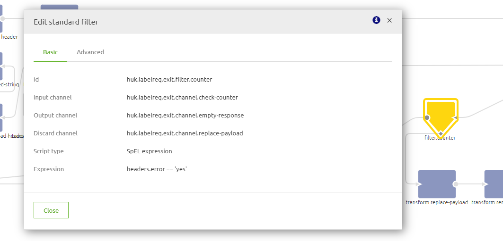
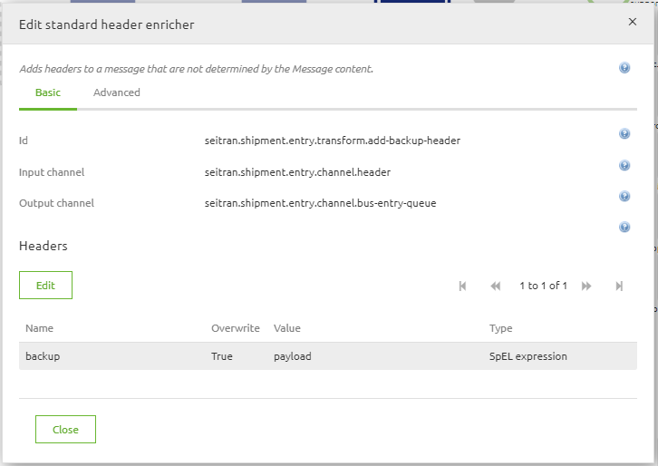
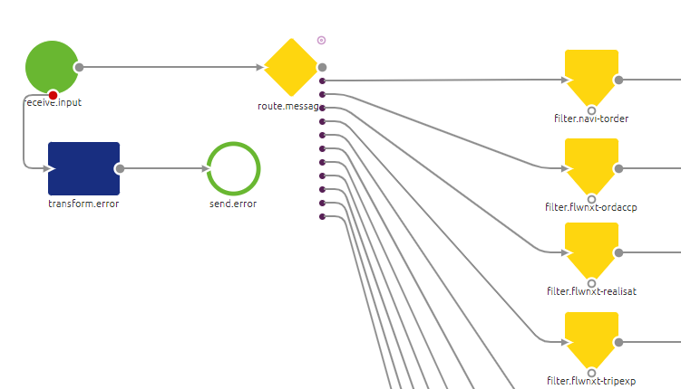

## CONTEXT AND REQUIREMENTS
The tools in eMagiz provide a wide range of options to build your integrations with. In some of the building blocks in the model, capability can be extended using SPeL expressions. SPeL expressions are derived from the Spring Integration Framework and stands for Spring Expression Language. SPEL expressions are very powerful and handy, yet basic knowledge of SPEL expressions is required to add or modify behavior of specific flows in eMagiz. Ensure to use annotations to describe the behavior of the component that has a SPEL expression to allow for easy maintenance of the flow.
SpEL expressions are used in many variations and applications, for example:
-	To split a single adress line into separate values, for example Address: Transportcentrum 16 into Street: Transportcentrum and HouseNumber: 16.
-	To validate and match an API Key to a specific partner and also secure your webservice.
-	To create an if-statement using header values.
-	To determine if an value in your message is listed in a list and use it as an filter
Requirements
-	Access to - and good understanding of eMagiz
-	A (very) basic understanding of Java 

## HOW-TO STEPS
Following you will find a couple of examples to make use of SpEL expression. These are not directly complicated but give you a impression of the power of the SpEL. In chapter 3 several links are provided containing more information on SpEL expressions. 

### Message structure
Below you see a breakdown of the structure of how SpEL interprets a message. It starts with a root entity, this contains the payload as well the headers. The payload of course contains the message passing through eMagiz at moment of using the expression. 
And headers contains a list of headers with their values that the messages contains. In this example the message contains 3 headers with the names ‘messageID’, ‘onebam_messageType” and ‘onebam_targetSystem’ containing the values ‘123412312412312’,’order’ and ‘’.
{"root": {
    "payload": "inhoud van bericht",
    "headers": {
        "messageID": "123412312412312",
        "onebam_messageType": "order",
        "onebam_targetSystem": "sucfact, sapo, ibas"
    }
}}

### Logical operation

A simple example of a SpEL expression is an expression in which you execute a logical operation. In the below example the message may pass through when the header named error has the value ‘yes’. In all other cases the message while be send to the discard channel

### Payload in header

A standard header enricher gives you the option to add information on top of the payload. In this example a new header is added with the name ‘backup’ and the value of the header is the complete payload of the current message, value = ‘payload’. 
Take notice that ‘Type’ is a SpEL expression. This expression is filled in on the tab ‘Advanced’. 

Other examples that can be used to fill a header or to retrieve certain information from a message :
-	headers.MessageID
		- Takes the value of the header with the name ‘MessageID’
-	#xpath(payload,'//*:StandardBusinessDocumentHeader/*:Receiver/*:Identifier')
	- Executes the stated xpath inside the current payload and retrieves this value. 

-	xpath(payload,'//*:StandardBusinessDocumentHeader/*:Receiver/*:Identifier', 'node_list').![textContent.toLowerCase().substring(0,3)])
	- Takes the first three characters of the values of the Identifier elements in the message (see below) and creates a node list value, it also places the values in lowercase.
    <StandardBusinessDocumentHeader>
        <Receiver>
            <Identifier>caP001</Identifier>
        </Receiver>
        <Receiver>
            <Identifier>cap002</Identifier>
        </Receiver>
        <Receiver>
            <Identifier>hst001</Identifier>
        </Receiver>
    </StandardBusinessDocumentHeader>
	- Result: {'cap','cap','hst'}

### Routing flow
Below you will find the best practise to build the routing flow in eMagiz. This best practice makes use of the standard router where you can use a SpEL Expression to route your message. That SpEL Expression looks like this: “headers.bus_targetSystem.split(',').![#this.trim()+#root.headers.bus_messageType]”.
The first part of the SpEL Expression looks at the ‘bus_targetSystem’ header of the message. This header can consist of multiple values separated with a ‘,’ (comma). So a message can be routed to multiple target systems. The second part of the SpEL Expression looks at the ‘bus_messageType’ header of the message. The result of this SpEL expression can be multiple values since the message can have multiple ‘bus_targetSystem’ headers.

To give an example.
Input message
Header: bus_targetSystem: TMS, FMS
Header: bus_messageType: Order
Will be routed to the following value mappings:
TMSOrder
FMSOrder

### Authorization in Entry flow
SpEL expressions could also be utilized to verify if a client is authorized to access a webservice (REST or SOAP) in eMagiz. Below you will find an example of how you can use a Standard filter component to check if the incoming message is authorised to be send to the eMagiz bus: 
“headers['Authorization'] == '${authentication.inbound.api-key}'”
In this case the value in the Authorization header needs to be equal to the value stored in your property. 

## RELEVANT LINKS
Below you can find a list of relevant links that provide you with even more context surrounding SpEL expressions:

- https://www.baeldung.com/spring-expression-language (great explanation on SpEL and it various applications)
- https://docs.spring.io/spring/docs/4.3.10.RELEASE/spring-framework-reference/html/expressions.html (more in depth explanation how SpEL expressions relates to the Spring framework)
