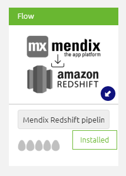
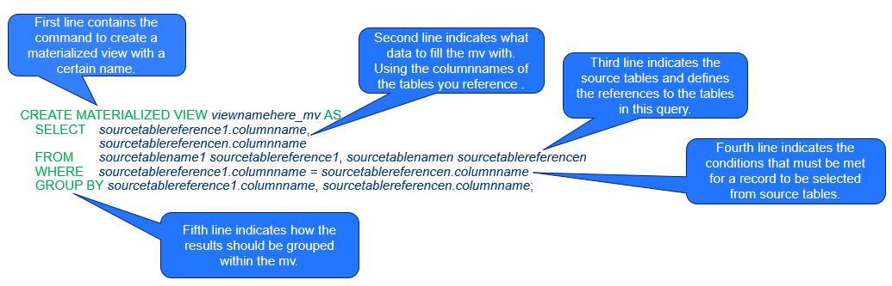
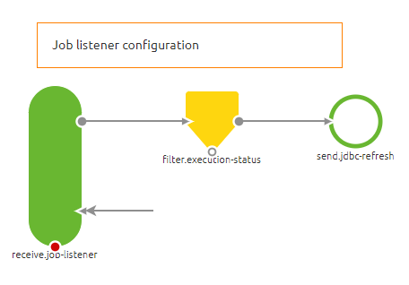

# How to store your Mendix data in AWS Redshift using eMagiz

## 1. Introduction
This document explains how to setup a data pipeline between Mendix and AWS Redshift using eMagiz and how to publish the AWS Redshift data using AWS materialized views. eMagiz data pipelines are flows that support high-volume data transfer using <a href="_new">Spring Batch</a> technology. The data is retrieved from Mendix by using an OData webservice. The data is written to AWS Redshift using the AWS recommended way: Intermediate storage of comma-separates data in AWS S3.

Advantages of eMagiz data pipelines
 * Supports very large tables
 * Fast Mendix to Redshift-integration development compared to message bus integrations

Disadvantages of eMagiz data pipelines
 * Does not support complex data structures (one table per data pipeline)
 * Does not support complex transformations (only column selection/renaming)
 * Data structure changes need to be applied to both source and target tables

## 2. Getting started
1. Publish the data using an OData service in your Mendix project.
1. Use the Mendix PostgreSQL data structure to create the target table in Redshift (Recommended).
1. Import the 'Mendix to Redshift' datapipeline flow from the store.
   

1. Follow the store items instructions to setup the data pipeline.
1. Follow the rest of this how-to to start using AWS materialized views.

## 3. Create a materialized view
1. Use SQL Workbench or the AWS Console to connect to the Redshift database.
1. Write and test the SQL statement to select data from the Redshift database. If you need help joining tables look at the 
    <a target="_new" href="https://www.w3schools.com/sql/sql_join_inner.asp">w3school tutorials</a>.
1. Execute the following statement to create the materialized view: 
    <code>CREATE MATERIALIZED VIEW {viewname} AS {your query};</code>
    

1. For more info see the AWS documentation: 
    <a target="_new" href="https://docs.aws.amazon.com/redshift/latest/dg/materialized-view-overview.html">Creating materialized views in Amazon Redshift</a>

## 4. Refresh the materialized view
1. The example data pipeline flow from the store contains a job listener structure to refresh the AWS Materialized view after the job is complete. In this structure the <i>send.jdbc-refresh</i> component send the <code>REFRESH MATERIALIZED VIEW</code> command to AWS Redshift.
    

1. It is highly recommended to have only one data pipeline in one eMagiz flow. If you have materialized views using data from different data pipelines, by default, the materialized view will be refreshed after each pipeline. If this causes invalid data in the materialized view, consider removing the refresh structure from all but the last scheduled data pipeline.

## 5. Delete the Materialized view
1. Use SQL Workbench or the AWS Console to connect to the Redshift database.
1. Execute the following statement to delete the materialized view: 
<code>DROP MATERIALIZED VIEW {viewname};</code>