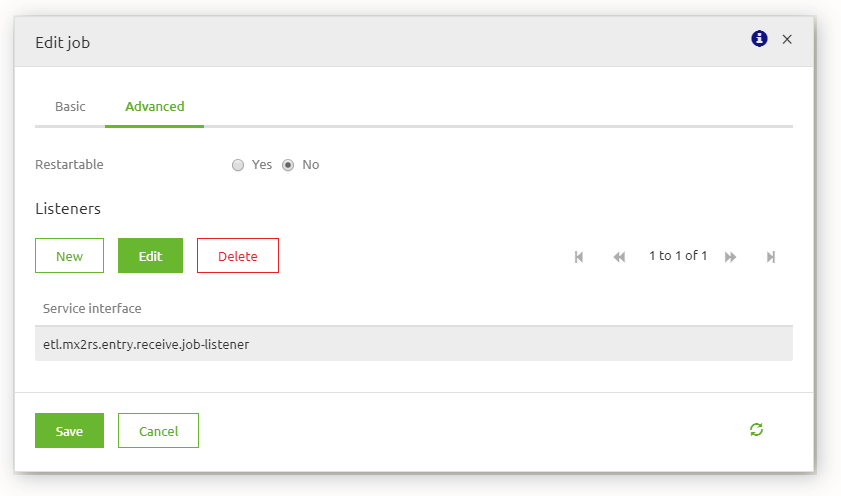

# How to store your Mendix data in AWS Redshift using eMagiz

## 1. Introduction
This document discusses how to setup a data pipeline between Mendix and AWS Redshift using eMagiz and how-to publish the Redshift data using AWS materialized views.
 
## 2. Getting started
1. Publish the data using OData service in your Mendix project.
1. Use the Mendix PostgreSQL data structure to create the target table in Redshift (Recommended).
1. Import the 'Mendix to Redshift' datapipeline flow from the store.
   

1. Follow the store items instructions to setup the data pipeline.
1. Follow the rest of this how-to to start using AWS materialized views.

## 3. Create a materialized view
1. Use SQL Workbench or the AWS Console to connect to the Redshift database.
1. Write and test the SQL statement. If you need help joining tables look at the 
<a target="_new" href="https://www.w3schools.com/sql/sql_join_inner.asp">w3school tutorials</a>.
1. Execute the following statement to create the materialized view: 
<code>CREATE MATERIALIZED VIEW {viewname} AS {your query};</code>
1. For more info see the AWS documentation: 
<a target="_new" href="https://docs.aws.amazon.com/redshift/latest/dg/materialized-view-overview.html">Creating materialized views in Amazon Redshift</a>

## 4. Refresh the materialized view

Use this structure (see image) to trigger logic after a job is done:
1. Add a JDBC outbound channel adapter to your data pipeline flow and connect it to existing JDBC redshift data source. Enter the query: 
<code>REFRESH MATERIALIZED VIEW ${dp.jdbc.message.mvtablename}</code>
1. Use your own trigger mechanism or add a 'Job execution listener gateway' to trigger the refresh after the data pipeline job is done.
1. Add a standard filter in between to only trigger on succesfull job executions. Filter expression: 
<code>payload.status == T(org.springframework.batch.core.BatchStatus).COMPLETED</code>
    

1. Make sure to register the job listener gateway in the job configuration (advanced tab).
    

1. It is highly recommended to have only on data pipeline in one eMagiz flow. If you have materialized views using data from different data pipelines, refresh the materialized view after each pipeline or create a custom refresh mechanism.

## 4. Delete the Materialized view
1. Use SQL Workbench or the AWS Console to connect to the Redshift database.
1. Execute the following statement to create the materialized view: 
<code>DROP MATERIALIZED VIEW {viewname};</code>