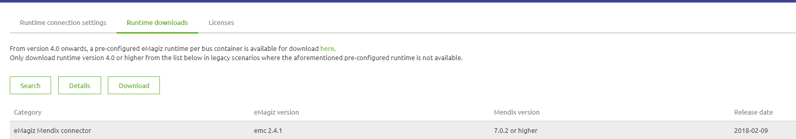
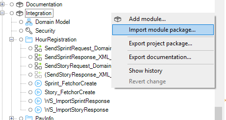
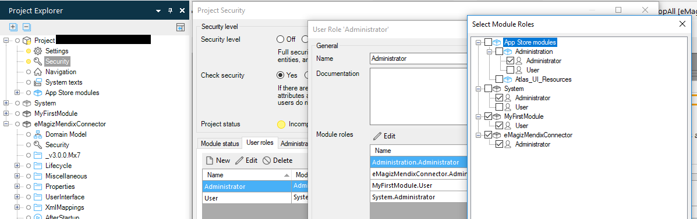
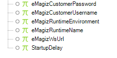
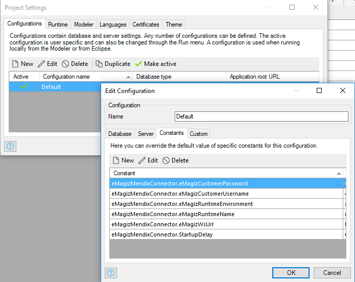

# eMagiz Mendix Connector

The eMagiz Mendix Connector (EMC) is a Mendix Project module that you can import into your application to make it communicate with eMagiz. To make this connector work correctly, you need to follow the steps presented below. But before starting to follow these steps there are a few things that should be known. Even though the EMC module is imported in the Mendix project, Mendix does not know that it has an EMC inside and neither does the EMC know it is inside a Mendix Project. So, the way to make them communicate is using the webservice calls that Mendix supports. But first, in order for the EMC to be able to communicate with the bus, it needs to know the credentials with which it can connect to the HIP bus so that it can retrieve the list of properties. These credentials are referred as constants below in the steps.

After configuring everything needed for establishing the connection to the HIP services, you will need to create one webservice in order to facilitate the communication between the EMC and the Mendix project. After creating the Webservice, you need to call it from a MF, and in the call, you will need to fill in the credentials with which you are authenticating in the WS. The same credentials you need to fill in the eMagiz HIP (Deploy -> Properties) as the values of the properties corresponding to the request handler.

The last part in setting up the EMC is about enabling access to the WS call from the EMC to the Mendix Project. To do that you will need to create a WebService user in the Mendix Project and enable access for that user through the firewall of the Mendix Project Website.

# Step plan installation eMagiz Mendix Connector

To install the eMagiz Mendix Connector in a Mendix app, the following steps need to be performed.  

##  1. Download the eMagiz Mendix connector
   - The eMagiz Mendix connector can be downloaded via eMagiz. Log in and then go to one of the busses you have access to.    
   - Go to **Deploy -> On Premises -> Runtime Downloads** the eMagiz Mendix connector can be downloaded. It is important that you look at the column Mendix version. It must correspond to the Mendix version of the project where you want to use the eMagiz Mendix Connector. If you do not do this then the connector will **not** work.  
   

   

##  2. Importing eMagiz Mendix connector  
   - In the next step the connector is imported into the correct Mendix project. Open the Project. In the Project Explorer, right-click and choose the option "Import module package..."
   

   

   - Select the appropriate eMagiz Mendix connector.

**Please note:**  
If it is already present, you get a question where you choose the **override** option.

 
##  3. Configuration 
- **Afterstartup/Before shutdown:** In the Mendix Project, go to Project settings -> Runtime -> for the fields After startup and Before shutdown select the coresponding MFs from the eMagizMendixConnector module.

   

  

- **Rights** : It is recommended that only the administrator user role has access to the eMagiz Mendix Connector module. In order to do this go to Project Security -> User Roles -> start editing the Administrator User Role -> start editing the Modules roles -> check the box of the eMagiz Mendix Connector module and save. 

   

- **Navigation page item:** In the Mendix project, go to Navigation -> Click New Item -> fill in the fields as in the image below.

   

- **Constants:** In the Mendix project, go to project settings -> start editing the active configuration -> Constants -> and add there the following constants from the eMagizMendixConnector module: 

   

The values for these constants can be found from the eMagiz HIP: Deploy -> On premises -> Runtime connection settings

   

  

These constants are used by the Mendix Connector to get access to the HIP services. 

- **Keystore/Truststore:** In the resources folder of the eMagiz Mendix Connector you need to add the keystore and truststore from the eMagiz HIP which can be found in the Resources tab of the Create phase.

 - **Webservice user:** In order for the eMagiz Mendix Connector flow you need to create a user of the consumed webservice in the Mendix project (Administration Overview page) and use these credentials as the values of the username and password values of the connector flow (they can be defined in Deploy -> Properties).

- **Webservices cloud:**  Add the webservice in the cloud which is hosting the Mendix Project. If your project is hosted in the Mendix cloud, you need to enable acces to your network for the URLs which contain '/emagiz-mendix-connector/'. If it runs locally or is hosted in another cloud environment make sure to enable acces the acces in the firewall to the port 5445 or 8443 depending on whether you migrated or not to eMagiz5.
   
- **Request handler**: 
   - Import xml schema into req handler configuration from the eMagiz HIP. 
   - Create consumed web service in Mx project based on the url 'the url to your MX project' + '/emagiz-mendix-connector/' + 'wsdl' (e.g.: http://localhost:8080/emagiz-mendix-connector/wsdl) and then press 'Import'.  	        
    - Call the webervice in the appropriate MF.   
      **Note:** If you use secrity, in the HTTP headers tab, you need to fill in the credentials that the Request Handler recognizes (the values of the properties used by the request handler set in the Deploy -> Properties in eMagiz HIP)  
                In the SOAP Request Body you need to fill in the values required for the request.  
                In the SOAP Response tab you can opt for storing the response into a variable. To do so, you need to create an import mapping which maps the response of the webservicce into an entity from the domain model.
   

##  4. Usage  
- Deployment/updating flows
- Starting/stopping flows
- Explanation User Interface
- Version Numbering

##  5. Possible errors  

There are several situations where you get errors/warnings in your project as a result of the installation/updating the eMagiz Mendix connector.

  - **Log errors/warnings**
  
 An example of this is when The Mendix project has multiple languages. After the import you will receive multiple errors/warnings. These are easy to solve by following the steps.

   

   

  

  - **Layout errors that can be solved with the eMagiz cleanup tool**
  
Another example is the layouts. These can be solved by choosing the layouts that are used within your project.  

   

 

The cleanup is in the project directory Under the Resource folders.

   

 

Click right mouse button (or double click) For "Openings with | Java™ Platform SE Binary

   

 

After performing this action it is good to check the userlib for verification. This can be based on the following steps. First open your project folder (see below)

   

Then navigate to Userlib. In this userlib, there should only be one reference to a version of the eMagizMendixConnector. (see below)

   

For reference, all JAR files using the eMagizMendixConnector (version 2.4.1):  

   

  - **Cleanup the project directory to avoid other problems**

The last step is to clean up the project directory and then committing your customization. Ideally, you perform all of these actions in a single commit so that you can perform a rollback and so that you can easily isolate any problems.

   

  

##  6. Best practices  

 - Configure startup time
 - Communication in conjunction with Mendix Inbound/outbound Web services
 - Conflicting userlib AppStore Modules
 - Tracing WebServices Lognode at debugging
 - Deployments – updates request handler
 - Restart
 - Stop
 - Start
 - OnDersteunde Mendix Versions
 - What to consider
 - Multithreading
 - Error handling
 - Retry mechanisme
 
# Step plan upgrading the eMagiz Mendix Connector

To get a new version of the eMagiz Mendix Connector in a Mendix app, the following steps from above need to be performed:

   1) [Step 1](upgrade-eMagizMendixConnector.md#1-download-the-emagiz-mendix-connector)
   2) [Step 2](upgrade-eMagizMendixConnector.md#2-importing-emagiz-mendix-connector)
   3) When it comes to [step 3](upgrade-eMagizMendixConnector.md#3-configuration), there is no need to do all the configurations again because they should have already been done when an older version of the connector was installed. So, just to make sure that everything should function correctly, you should go through all the bullet points mentioned in [step 3](upgrade-eMagizMendixConnector.md#3-configuration) and check if there is nothing unusual.
   4) [Step 4](upgrade-eMagizMendixConnector.md#4-usage)   
   <!--- to be detailed later with Samet --->
   5) In [step 5](upgrade-eMagizMendixConnector.md#5-possible-errors) there is a list of possible errors and quick fixes for them, so in case you have any errors you should check it because you might find a solution there. It is highly recommended to try the eMagiz Cleanup Tool.
   6) [Step 6](upgrade-eMagizMendixConnector.md#6-best-practices)
