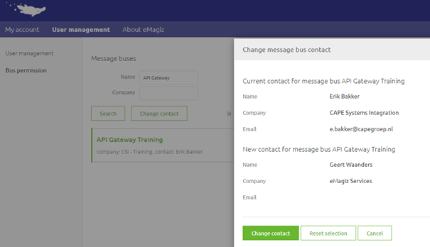
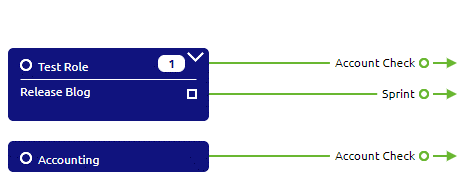
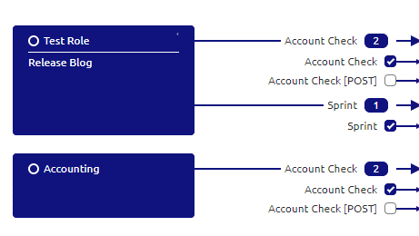
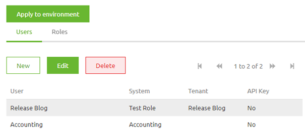

# User Management
Within eMagiz there are multiple ways of handling user management. This information can broadly be divided into two seperate sections:

- User management on platform level
- User management on integration pattern level.

Below we will discuss both of these sections in more detail.

## User management on platform level
On platform level there are several forms of user management embedded within the portal. 
In this section we will discuss user access to integration projects, 
user authorizations to integration projects, the role of the bus owner,  transferring your bus owner role and the company admin role.

### Users access to Integration Projects
Users can be added to Integration projects, which hold all the configurations required to run the different integrations for the TAP environments. 
Integration projects are connected to organizations in eMagiz to ensure the integration project remains within limits of the license agreements. 
Users can be added to integration projects of the organization where the user belongs to. Users can't be added to integration projects of other clients. 
The bus owner and the company admin have the rights to add/remove users from an integration project

### User authorizations to Integration projects.
Every integration project has a bus owner who can distribute rights across functionalities and environments. In the picture below, one can see the various options available across the Integration Life Cycle (ILM) Phases Capture through Manage. The bus owner manages the user permissions and needs to have the MFA authentication level passed before making any changes. 
- In case an Edit permission is granted on a ILM phase, all the sub-options can be configured
- View rights mean that all options can be viewed only
- In case the user has no Edit or View rights to a certain ILM phase, the phase will not be displayed at all in the eMagiz iPaaS Portal
- Bus owners are assigned to integration projects by eMagiz Administrators
- An audit trail is kept of the changes made in the project permission structure

### Bus owner
The bus owner is a eMagiz user that is the first point of contact for a certain integration project. By being a bus owner you have the ability to add/remove users to/from the integration project you are bus owner for. Requests of users to get more or less rights should pass through you.
If you are no longer associated with an integration project you have the option to transfer your role to another active user on that integration project. How to do so is explained in more detail in the following section

#### Change contact
When you navigate to Administration -> User Management -> Bus permissions you will see a list of integration projects you are the bus owner (contact) for. Select the integration project for which you want to transfer your bus owner responsibilities and press Change Contact.
Select the user that will be the new bus owner and press Change contact.

### Company Admin
Every Company that is registered within eMagiz has a so called company admin. The company admin has two specific functions:
- Add/Deactive Users within that Company
- Backup for the bus owner to add/remove a user, and give the appropiate rights, from a specific integration project

#### User management
When you navigate to Administration -> User Management -> User management you will see a list of companies you are the company admin for. Select the company for which you want to add/edit/deactivate users and based on the action press New, Edit or Deactivate.
Follow the instructions of eMagiz based on the choice you have made to succesfull perform the required action.

#### Change contact
When you navigate to Administration -> User Management -> Bus permissions you will see a list of integration projects you are the bus owner (contact) for. Select the integration project for which you want to transfer your bus owner responsibilities and press Change Contact.
Select the user that will be the new bus owner and press Change contact.

## User management on integration pattern level
With the arrival of the API Gateway and Event Streaming modules within our platform a need for proper user management within the portal is needed. 
With the current functionality you have a clear way to define‘consuming’ entities of an API Gateway and assign the correct roles and rights on role and user level. This is done in a two part process.

*In upcoming releases of the platform this functionality will be changed and expended to serve more and other purposes*

### Capture
In Capture you can add a so called 'consuming' system of an API Gateway. 
To define a 'consuming' system you need to draw a line from the system to eMagiz indicating that an external system is 'consuming' the API Gateway.
The type of system you choose does not matter. Both single tenant and multi-tenant systems can fullfil this purposes.

The choice between creating a standard system or a multi-tenant system is based on what you want to achieve in terms of given access to roles and users.
By choosing the standard system you make the implicit choice that one user (i.e that system) has one specific role. 
By choosing the multi-tenant system you state that multiple users have the same role.

If you already have a system that also wants to 'consume' an API Gateway you don't have to create a new system but can simply draw a line from the existing system towards eMagiz.

### Design
When you add a ‘consuming’ system of type API Gateway in Capture you have the ability in Design to assign rights to that ‘consuming’ system on one or more operations. 
This can be done by activating the checkbox in Design. By activating the checkbox in Design you’re telling eMagiz that this particular system (and all underlying users) has rights to access the operation you have just selected.

 
### Deploy
Changes made in Design are automatically updated in Deploy when you navigate to the User management tab.
This means that when you open the User management tab you will see all users and roles in the correct configuration based on the checkboxes selected in Design.
In this screen you do have to create a authentication string (i.e ApiKey) per user.
After you have done this and are satisfied with the manner in which the rights per role and user are configured you can update these settings per environment by pressing the Apply to environment button.
By pressing this button you indicate that the choices you made in Design can be actualized in Deploy for that particular environment.

After you have pressed the Apply to environment button you can retrieve the correct ApiKey per user under the corresponding property and you can test the settings via the Swagger UI which you can access via the Runtime Dashboard -> View Swagger UI

