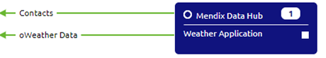
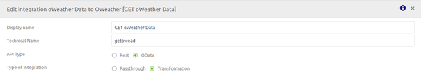
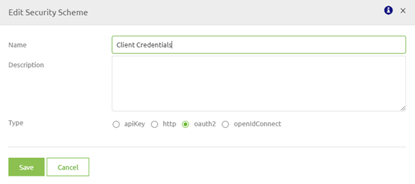
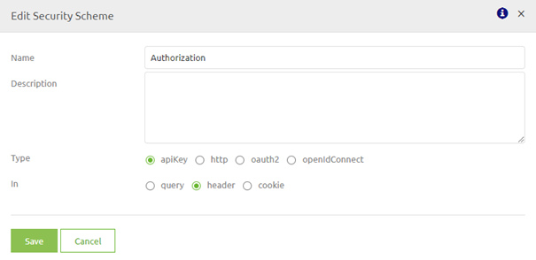

## User Guide API Gateway eMagiz

Below the user guide for OData section of the eMagiz API Gateway. One of the implementation for this solution is connecting with the Mendix DataHub. The guide is split up per ILM phase of eMagiz (Capture, Design, Create, Deploy and Manage), and per section the specific step by step plans and best practices are discussed. Should you have any questions, please contact productmanagement@emagiz.com.

Last update: October 7th 2020

## Pre-requisites
- Basic knowledge of the eMagiz platform
- Understanding of API concept
- Understanding of oData concept
- Understanding of Authentication methods
- Understanding and use of Releases
- Understanding and use of Deployment Plan
- API Gateway made available via your partner manager for your environment

## Capture
As with all integration types you will always start in Capture. This applies for a messaging flow, an API Gateway solution, Event streaming and all other supported types by eMagiz. Based on the business case, choose between which type of integration pattern best suits the business case while filling in Capture. If you need more information on how to make the correct decision, please consult the documentation and training on Integration Patterns.
To make it clear which integration pattern is selected as default eMagiz has added a new option on message type and system level through which you can define what the default integration pattern is. Adding this in Capture is advisable because it helps guide decisions in later phases.
Besides this addition Capture has not changed and still should be filled in according to the business case as you are already used to do when capturing for all integration types. In Capture you draw a line if a new message type needs to be exposed via the API Gateway. In Design you will add operations (GET, POST, DELETE, etc.) to a specific message type
  

 

One distinct differences between setting up Capture for an API Gateway in comparison to Messaging for instance is that with the help of Capture you can visualize the clients calling an API Gateway. In upcoming release, more capabilities could be added to Design this system further. In this document, this system is not further discussed in terms of configuration(s).

### User Management
In Capture you can correctly setup 'consuming' entities of your API Gateway. For more information please read [this](user-management.md) document

## Design

The focus point of configuring the API Gateway to be used via the eMagiz platform lies in Design. In this ILM phase you set up the structure of your API Gateway. The API Gateway consists of a front end (client facing) and a (series of) back end system(s). Each operation created on the front end (client facing) has a link to a back end operation hosted by an external party. 
The Design phase gives you the tools that are needed to set up both the front end as the various back end operations. 
On Integration Level you can add, change and delete operations (GET, POST, PUT, etc.). 
For each opeartion you can select both front end (exposed) and back end (endpoint) in one screen. 
Security of your API Gateway can be defined under the Secutiry tab. 
This is accessible via a right mouse click on the API Icon in your overview page and selecting security. 
For OData calls eMagiz uses the Apache OLingo Standard for the front end (client facing).

### Importing API specifications
eMagiz provides you with the option to import a JSON file containing the API specification of a specific system you want to connect with via the API Gateway. This functionality is only available for backend opeartions. For the front end you link the front end with the correct backend operation. This way eMagiz handles the rest.
Be aware, not all API specifications are accepted by the tooling. Only OpenAPI 3.0 specifications are accepted (more information on OpenAPI can be found here.)

### Importing a backend operation of the API Gateway
To import an OpenAPI specification via eMagiz for a backend system please follow these steps:
1.	Navigate to Design and right click on the correct system
 

2.	Press Edit system and press Import in the next screen
3.	Select the correct JSON file and press Import
4.	All operations detailed out in the specification will be automatically configured. All already existing operations are not changed by this action. Possible duplicates need to be removed by hand

### Change API Gateway settings
Each project comes with his one API Gateway settings. These settings are the same for API Gateway as bus settings are for a messaging bus. These settings can de added or changed via Design -> Settings -> API Gateway

 

1.	By pressing Edit settings you change the following:
	- Technical name of the gateway. This technical name adheres to the same rules as when adding or changing the technical name of a runtime.
	- Amount of containers. To decide whether you want one or multiple containers you should consider volume, throughput and uptime. For situations in which a lot of calls will be executed and uptime is of the utmost importance you should consider adding more containers
2.	After you have edited the settings you have to Apply the settings. There are two ways of doing so
	- Press apply settings in this screen. This directly effects the Architecture overview in Design for all environments (Test, Acceptance and Production). This means that with the next deployment of your architecture you will have the API Gateway in the environment for which you are executing the deployment
	- Navigate to Design -> Architecture and press on the Apply API Gateway settings button for a specific environment. The advice is to start in Test and work your way up to Acceptance and Production after testing and validating if everything works as expected

### Add / Edit integration
1.	Right mouse click on a existing integration to select Add integration or Edit integration
 

2.	In the popup that is presented select OData as API Type and choose transformation. Furthermore fill in the display name and technical name
 

3.	Choose the right operation and choose the path for the front end side. When satisfied press Save.

4.	The result would be something like this. For each added operation the counter will increase and the operation will become visible
 

### Security

A vital part of setting up your API Gateway is securing your operations and therefore your data. eMagiz provides you with two options when it comes to securing your API Gateway setup. These options are:

-oAuth2.0
-ApiKey

Both of these options are discussed in more detail below. Defining which client(s) have access to certain operations is handled via the User management functionality and will be explained accordingly.

#### oAuth2.0

oAuth2.0 is considered a industry standard when it comes to securing REST webservices. This method is implemented by the likes of Google, Amazon and Microsoft to secure their REST webservices. 
eMagiz also provides you with the option to secure your API Gateway via the oAuth2.0 protocol. To do follow these simple steps:

1. Right click on the API icon in the middle of the Design Solution view
2. Select the Security option
3. Select oAuth under the Type option and press Save

#### ApiKey

Although oAuth2.0 is considered an industry standard it is also very complex to implement for a client. Therefore we want to offer an alternative method of securing the API Gateway. 
This is done with the help of the ApiKey method. With this method we verify the identity of the client by checking whether the supplied token is valid for that operation. To activate this method follow these simple steps:

1. Right click on the API icon in the middle of the Design Solution view
2. Select the Security option
3. Select apiKey under the Type option, select header under the option In and press Save

### User Management
In Design you can correctly assign roles and rights to 'consuming' entities of your API Gateway. For more information please read [this](user-management.md) document
 
In the remainder of this section we will look at various scenarios that can occur in Design based on the phase your project is in.

#### Scenario 1: New API Gateway, New System and New API Resource/Operation
1.	First step would be to correctly set the API Gateway Settings. For a detailed explanation on how to configure these settings please read [this](apigw-releasenotes.md) document
2.	Second step in Design would be to define the technical name of the system which you want to connect to the API Gateway.  This can be done by right mouse clicking on the system and pressing Edit System. If you have correctly filled in the setting in Capture the Open API selection has already been made for you. If not please revisit the section on Capture on configuring this option on system level. A fallback option is to select the Open API option in this screen.
 

3.	Next step would be to click on the Manage button for this system and configure the general settings for this system (I.e. Server and Security)
	- For Server you add the first part of the URL (for JIRA this would be https://xxxxx.atlassian.net/)
	- For Security you choose the type of Authentication that is required by the external party (ApiKey for example)
 

4.	Final step would be to either import the Open API specification of this system ([Importing a backend operation of the API Gateway](#importing-a-backend-operation-of-the-api-gateway)) or by adding them manually in this screen.

5.	Following this you will select Add integration [Add / Edit integration](#add-/-edit-integration) and follow the steps outlined there.
 
6.	Configure the general settings for the API Gateway (I.e. Security). This can be done via a right mouse click on the API icon in the center of your Design overview and pressing security.
	- For Security you choose the type of Authentication that is required by eMagiz (ApiKey + Client Certificate is the advised standard)

#### Scenario 2: Existing API Gateway, New System and New API Resource/Operation
1.	First step in Design would be to define the technical name of the systems which you want to connect to the API Gateway.  This can be done by right mouse click on the system and pressing Edit System. If you have correctly filled in the setting in Capture the OpenAPI selection has already been made for you. If not please select it here.
 

2.	Next step would be to click on the Manage button for this system and configure the general settings for this system (I.e. Server and Security)
	- For Server you add the first part of the URL (for JIRA this would be https://xxxxx.atlassian.net/)
	- For Security you choose the type of Authentication that is required by the external party (ApiKey for example)
 

3.	Final step would be to either import the Open API specification of this system ([Importing a backend operation of the API Gateway](#importing-a-backend-operation-of-the-api-gateway)) or by adding them manually in this screen.

4.	Following this you will select Add integration [Add / Edit integration](#add-/-edit-integration) and follow the steps outlined there.
 

#### Scenario 3: Existing API Gateway, Existing System and New API Resource/Operation
1.	Select Edit and check whether Integration Pattern API Gateway is selected. If not change it via the change pattern button. Below is an example of what the screen looks like.
  

2.	Select the integration for which you want to add the Operation (right mouse click on the operation in question)
  

3.	Following this you will select Add integration [Add / Edit integration](#add-/-edit-integration) and follow the steps outlined there.

#### Scenario 4: Existing API Gateway, Existing System and Existing API Resource/Operation
1.	Changes can be made on two levels. One for the exposed part. This can be done via the API Catalog. This can be done by right clicking on the API icon in the middle of your project overview and selecting Edit Catalog. Here you can change endpoints, parameters, responses, etc.
 

2.	The second change can be made on a backend operation. This can be done by right clicking the system, pressing Edit System and pressing Manage. Here you can change endpoints, parameters, responses, etc.

### Transforming data API Gateway

Transforming data can be set up in a similar way as for messaging and event streaming. This means that you can define and/or upload system messages and draw lines between entities and attributes indicating what needs to be translated to what.
When dealing with OData you have to take two things into account when setting up your Gateway message:
-	An ID field (as integer) is mandatory for OData. Therefore you need to add this to your gateway message
-	An OData response consist of an EntitySet and a Entity. The relation between both needs to be named as such that the gateway message says value for the entity that is a list. See below for an explanation:

### Design Architecture <-> Deploy Architecture
Design and Deploy Architecture work the same as is now the case for projects that only include messaging flows. In Design eMagiz will add one or more runtimes for the API Gateway components based on your API Gateway settings. Advice would be to deploy this runtime on a separate machine in the AWS cloud to keep API Gateway components separate from messaging and/or event streaming components.
Changes made via Design Architecture will be actualized in the same manner as you are used to in eMagiz via Deploy Architecture.

## Create

### Scenario 1: Adding an integration
1.	Navigate to Add integrations and select the integration you want to add to create. This works the same in comparison to adding other integration types.
2.	Navigate back to Create
3.	Select API in the right bottom hand corner of your screen to see your API Gateway setup visually
 

4.	Select the all.entry flow related to your API Gateway and click on the Reset flow button. This way the new integration is added to the entry. 
If you configured everything correctly no changes are needed in this flow.
5.	Select the exit related to your integration (I.e. jira.storyget.exit) and open it by double clicking or a right mouse click and selecting Open exit gate flow.
6.	eMagiz generates the flow based on what you defined in Design. In most cases no changes have to be made in the Create phase. In cases where you want to deviate from the chosen authentication method in Design eMagiz still provides you with this opportunity in Create. When in editing mode in Create you still have the same components at your disposal as when building an integration. These components can be added the same way as you would do for any integration (I.e. using support objects or headers on the message). For an example see the picture below
 

7.	When you are finished with the create phase (which should be fast if you filled in Design correctly) press Stop Editing and create a new version for Deploy. This way the newest version will be available for your Releases in Deploy 

### Scenario 2: Updating an integration
1.	Select API in the right bottom hand corner of your screen to see your API Gateway setup visually
 

2.	Select the all.entry flow related to your API Gateway and click on the Reset flow button. This way the new integration is added to the entry. If you configured everything correctly no changes are needed in this flow.
3.	Select the exit related to your integration (I.e. jira.storyget.exit) and open it by double clicking.
4.	eMagiz generates the flow based on what you defined in Design. In most cases no changes have to be made in the Create phase. In cases where you want to deviate from the chosen authentication method in Design eMagiz still provides you with this opportunity in Create. When in editing mode in Create you still have the same components at your disposal as when building an integration. These components can be added the same way as you would do for any integration (I.e. using support objects or headers on the message). For an example see the picture below
 

5.	hen you are finished with the create phase (which should be fast if you filled in Design correctly) press Stop Editing and create a new version for Deploy. This way the newest version will be available for your Releases in Deploy 

## Deploy
1.	Navigate to Deploy -> Releases
2.	Create a new Release based on the currently active release and add to the new release all new flow versions based on the changes made in the Create phase of eMagiz.
3.	Adding and updating flows can be done by selecting the Deploy widget for API and selecting the correct version just as you are used to with messaging
4.	Click on Save
5.	If you have added or updated rights in Design please read [this](user-management.md) document
6.	Press Deploy in the drop-down menu to deploy the various new / updated flow to the correct runtimes. When confronted with the pop up that properties are missing fill them in according to the relevant best practices. A list of relevant properties always needed for an API Gateway are listed under the list of Relevant Properties (see right-hand panel menu)
7.	Verify via the usual steps, checking runtime dashboard and manage, whether all flows are running correctly and as expected.
8. You can test your API Gateway via the SwaggerUI by pressing the View SwaggerUI button located in the runtime dashboard of the gateway container.

### Exposing the operation in the Mendix DataHub
Objective of this step is to create the link between the entity in eMagiz as defined in the Gateway Model, and the Mendix datahub. A CSDL (Conceptual Schema Definition Language) file contains the required definitions to let Mendix Data Hub understand what exactly is in the entity defined. So that the Catalog of the Mendix Data Hub can displayed this properly. It also contains the required connection details for the runtime of Mendix to reach the OData Gateway located in the all.entry.

1. Navigate to Deploy -> API Gateway
2. Press the button called Publish to DataHub
3. Press the button located at the bottom of the page called Export contract as a file
4. Navigate to hub.mendix.com via the browser and log in
5. Press Register new service and follow the wizard

## Manage
Manage works the same for API gateway operations as for messaging flows. So you can set alerting on whether the exposed gateway or a specific backend operation is running. You can see how many messages have been send to a specific backend operation and many more which you can do at the moment in Manage.
This can be seen in more detail under the section API Gateway Statistics (Under Manage -> Monitoring). In this section you can see the number of requests made on a specific backend operations and the number of responses received from the backend operation.

 

## 5. Reference videos

Here are some short videos for each phase how to configure the Data Hub properly. Videos dated October 2020:

Capture
<iframe width="1280" height="720" src="https://www.youtube.com/embed/mUWcZyb5JOg" frameborder="0" allow="accelerometer; autoplay; clipboard-write; encrypted-media; gyroscope; picture-in-picture" allowfullscreen></iframe>

Design
<iframe width="1280" height="720" src="https://www.youtube.com/embed/hm0M7qXd1TM" frameborder="0" allow="accelerometer; autoplay; clipboard-write; encrypted-media; gyroscope; picture-in-picture" allowfullscreen></iframe>

Create
<iframe width="1280" height="720" src="https://www.youtube.com/embed/f-bZX8XDdIY" frameborder="0" allow="accelerometer; autoplay; clipboard-write; encrypted-media; gyroscope; picture-in-picture" allowfullscreen></iframe>

Deploy
<iframe width="1280" height="720" src="https://www.youtube.com/embed/AZZwEwKkaR4" frameborder="0" allow="accelerometer; autoplay; clipboard-write; encrypted-media; gyroscope; picture-in-picture" allowfullscreen></iframe>

Publish
<iframe width="1280" height="720" src="https://www.youtube.com/embed/_dPcRbU3fUI" frameborder="0" allow="accelerometer; autoplay; clipboard-write; encrypted-media; gyroscope; picture-in-picture" allowfullscreen></iframe>

