## User Guide API Gateway eMagiz

Below the user guide for the eMagiz API Gateway. The guide is split up per ILM phase of eMagiz (Capture, Design, Create, Deploy and Manage), and per section the specific step by step plans and best practices are discussed. Should you have any questions, please contact productmanagement@emagiz.com.
Last update: June 30th 2020

## Pre-requisites
- Basic knowledge of the eMagiz platform
- Understanding of API concept
- Understanding of Authentication methods
- Understanding and use of Releases
- Understanding and use of Deployment Plan
- API Gateway made available via your partner manager for your environment

## Capture
As with all integration types you will always start in Capture. This applies for a messaging flow, an API Gateway solution, Event streaming and all other supported types by eMagiz. Based on the business case, choose between which type of integration pattern best suits the business case while filling in Capture. If you need more information on how to make the correct decision, please consult the documentation and training on Integration Patterns.
To make it clear which integration pattern is selected as default eMagiz has added a new option on message type and system level through which you can define what the default integration pattern is. Adding this in Capture is advisable because it helps guide decisions in later phases.
Besides this addition Capture has not changed and still should be filled in according to the business case as you are already used to do when capturing for all integration types. In Capture you draw a line if a new message type needs to be exposed via the API Gateway. In Design you will add operations (GET, POST, DELETE, etc.) to a specific message type
  

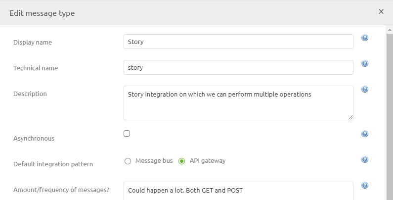

 

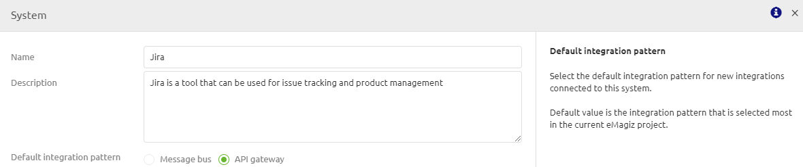

## Design

The focus point of configuring the API Gateway to be used via the eMagiz platform lies in Design. In this ILM phase you set up the structure of your API Gateway. The API Gateway consists of a front end (client facing) and a (series of) back end system(s). Each operation created on the front end (client facing) has a link to a back end operation hosted by an external party. The Design phase gives you the tools that are needed to set up both the front end as the various back end operations. On Integration Level (line visible in the widget) you can configure both front end (exposed) and back end (endpoint) in one screen. Generic settings can be made for the front end via Design -> API Gateway and for the back end on system level. eMagiz uses the Open API Standard (The OpenAPI Specification (OAS) defines a standard, language-agnostic interface to RESTful APIs) for the API Gateway. To illustrate this further we have written down four separate scenarios suited for each phase of your API Gateway

### Importing API specifications
eMagiz provides you with the option to import a JSON file containing the API specification of a specific system you want to connect with via the API Gateway. On both backend system level as for the exposed part of the API Gateway you can import this JSON file.
Be aware, not all API specifications are accepted by the tooling. Only OpenAPI 3.0 specifications are accepted (more information on OpenAPI can be found here.)
	Importing a backend operation of the API Gateway
To import an OpenAPI specification via eMagiz for a backend system please follow these steps:
1.	Navigate to Design and right click on the correct system
 

2.	Press Edit system and press Import in the next screen
3.	Select the correct JSON file and press Import
4.	All operations detailed out in the specification will be automatically configured. All already existing operations are not changed by this action. Possible duplicates need to be removed by hand

### Importing a exposed operation of the API Gateway
To import an OpenAPI specification via eMagiz for the exposed part of the API Gateway please follow these steps:
1. Navigate to Design and right click on the API icon in the middle of the screen and select Edit Catalog
 

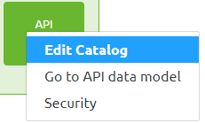

2. Press Import JSON 

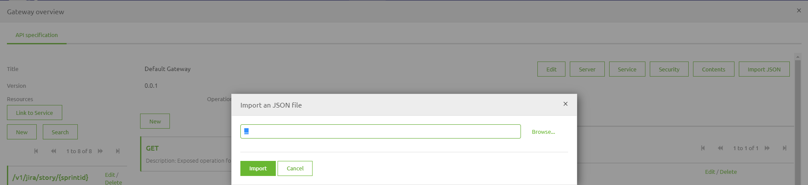

3.	Select the correct JSON file and press Import
4.	All operations detailed out in the specification will be automatically configured. All already existing operations are not changed by this action. Possible duplicates need to be removed by hand

### Change API Gateway settings
Each project comes with his one API Gateway settings. These settings are the same for API Gateway as bus settings are for a messaging bus. These settings can de added or changed via Design -> Settings -> API Gateway
 

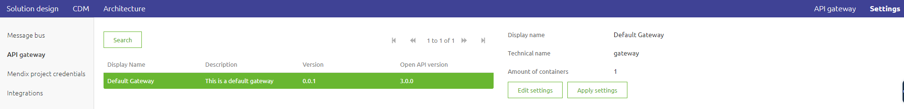

1.	By pressing Edit settings you change the following:
	- Technical name of the gateway. This technical name adheres to the same rules as when adding or changing the technical name of a runtime.
	- Amount of containers. To decide whether you want one or multiple containers you should consider volume, throughput and uptime. For situations in which a lot of calls will be executed and uptime is of the utmost importance you should consider adding more containers
2.	After you have edited the settings you have to Apply the settings. There are two ways of doing so
	- Press apply settings in this screen. This directly effects the Architecture overview in Design for all environments (Test, Acceptance and Production). This means that with the next deployment of your architecture you will have the API Gateway in the environment for which you are executing the deployment
	- Navigate to Design -> Architecture and press on the Apply API Gateway settings button for a specific environment. The advice is to start in Test and work your way up to Acceptance and Production after testing and validating if everything works as expected

### Add operation from scratch
1.	Choose the right resource for the exposed operation. In case of parameter (path or query) add them with the resource to make sure that you don’t need to add them afterwards in create. For a GET call your resource could look like this: / v1/jira/sprint/{boardid} (in case of a pathparameter) or /v1/jira/sprint?boardid={boardid} (in case of a query parameter). In case of no parameter something like /v1/jira/sprint is enough. For naming convention please see below
	- Use a version number to make clear to the caller with version is called
	- When exposing multiple external systems make a reference to the system. This way it is automatically clear to the user on what external system the operation will be performed
	- Always reference to what can be retrieved, changed, created in a singular way (i.e sprint, story, project, order, ticket, hour)
2.	Select the correct Operation (GET, PUT, POST, DELETE)
3.	Select the Tag. The name should make it clear to the caller what the operation does for the client
4.	Define an example (based on the chosen resource and Server setting)
5.	Select the Server
6.	Switch to the tab Endpoint operation
7.	Choose the right resource for the endpoint operation. This information should be provided to you by the external party.
8.	Select the correct Operation (GET, PUT, POST, DELETE) for the endpoint operation. This information should be provided to you by the external party.
9.	Select the Tag based on external documentation
10.	Define an example (based on the chosen resource and Server setting) provided by the external party
11.	Select the server
12.	Press Save
13.	The result would be something like this. For each added operation the counter will increase and the operation will become visible
 

### Add operation
1.	In the following screen press the Select button
 

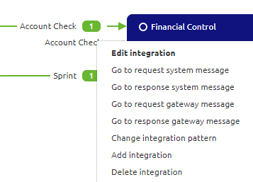

2.	In the popup that is presented choose the right resource and press the Select button
 

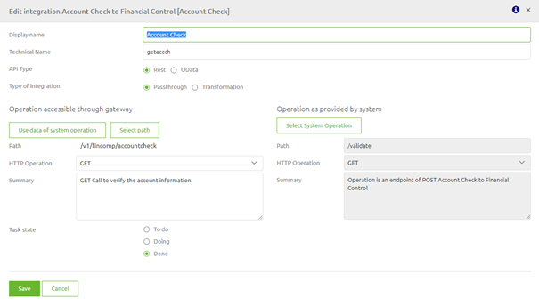

3.	Result will be a filled in Display name and a technical name as shown below. You could change the Display name but this is not necessary. If you are content with how things look press the Create operation button 

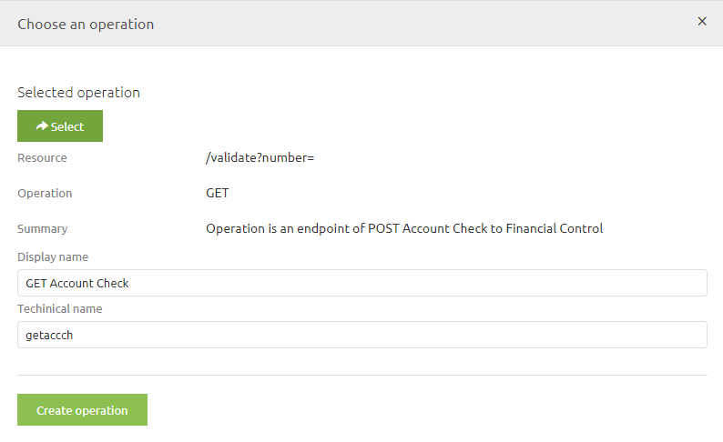

4.	The result would be something like this. For each added operation the counter will increase and the operation will become visible
 

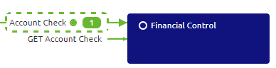

In the remainder of this section we will look at various scenarios that can occur in Design based on the phase your project is in.
 
#### Scenario 1: New API Gateway, New System and New API Resource/Operation
1.	First step would be to correctly set the API Gateway Settings. For a detailed explanation on how to configure these settings please read [this](apigw-releasenotes.md) document
2.	Second step in Design would be to define the technical name of the system which you want to connect to the API Gateway.  This can be done by right mouse clicking on the system and pressing Edit System. If you have correctly filled in the setting in Capture the Open API selection has already been made for you. If not please revisit the section on Capture on configuring this option on system level. A fallback option is to select the Open API option in this screen.
 

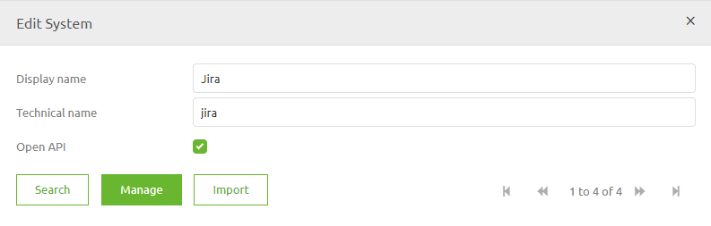

3.	Next step would be to click on the Manage button for this system and configure the general settings for this system (I.e. Server and Security)
	- For Server you add the first part of the URL (for JIRA this would be https://xxxxx.atlassian.net/)
	- For Security you choose the type of Authentication that is required by the external party (ApiKey for example)
 

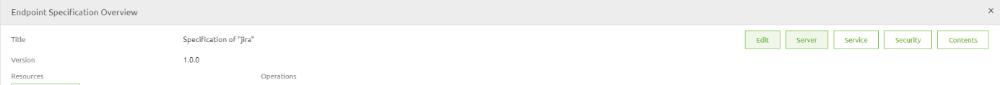

4.	Following this you should do the same for the Exposed part of the API Gateway (the part that your clients would be calling). This can be done by right clicking on the API icon in the middle of your project overview and selecting Edit Catalog
 

5.	Configure the general settings for this system (I.e. Server and Security)
	- For Server you add the first part of the URL (for eMagiz AWS instances this would be https://cloud00xx.emagizcloud.com)
	- For Security you choose the type of Authentication that is required by eMagiz (ApiKey + Client Certificate is the advised standard)
6.	Select the integration for which you want to add the Operation (right mouse click on the integration in question)
  

7.	Select Edit and check whether Integration Pattern API Gateway is selected. If not change it via the change pattern button. Below is an example of what the screen looks like.
  

8.	Click on the Save button and execute another right mouse click on the integration in question. At this moment you have a choice to make. You can import the operation or you can manually add it from scratch. Both are specified below
	- When you choose to import the operation please read the relevant section XX ((see right-hand panel menu)and then use Add Operation section (see right-hand panel menu)
	- When you choose to manually add the operation choose the option Add operation from scratch (see right-hand panel menu)
  

#### Scenario 2: Existing API Gateway, New System and New API Resource/Operation
1.	First step in Design would be to define the technical name of the systems which you want to connect to the API Gateway.  This can be done by right mouse click on the system and pressing Edit System. If you have correctly filled in the setting in Capture the OpenAPI selection has already been made for you. If not please select it here.
 

2.	Next step would be to click on the Manage button for this system and configure the general settings for this system (I.e. Server and Security)
	- For Server you add the first part of the URL (for JIRA this would be https://xxxxx.atlassian.net/)
	- For Security you choose the type of Authentication that is required by the external party (ApiKey for example)
 

3.	Select the integration for which you want to add the Operation (right mouse click on the integration in question)
  

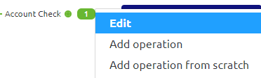

4.	Select Edit and check whether Integration Pattern API Gateway is selected. If not change it via the change pattern button. Below is an example of what the screen looks like.
  

5.	Click on the Save button and execute another right mouse click on the integration in question. At this moment you have a choice to make. You can import the operation or you can manually add it from scratch. Both are specified below
	- When you choose to import the operation please read the relevant section XX ((see right-hand panel menu)and then use Add Operation section (see right-hand panel menu)
	- When you choose to manually add the operation choose the option Add operation from scratch (see right-hand panel menu)
  

#### Scenario 3: Existing API Gateway, Existing System and New API Resource/Operation
1.	Select the integration for which you want to add the Operation (right mouse click on the integration in question)
  

2.	Select Edit and check whether Integration Pattern API Gateway is selected. If not change it via the change pattern button. Below is an example of what the screen looks like.
  

3.	Click on the Save button and execute another right mouse click on the integration in question. At this moment you have a choice to make. You can import the operation or you can manually add it from scratch. Both are specified below
	- When you choose to import the operation please read the relevant section XX ((see right-hand panel menu)and then use Add Operation section (see right-hand panel menu)
	- When you choose to manually add the operation choose the option Add operation from scratch (see right-hand panel menu)
  

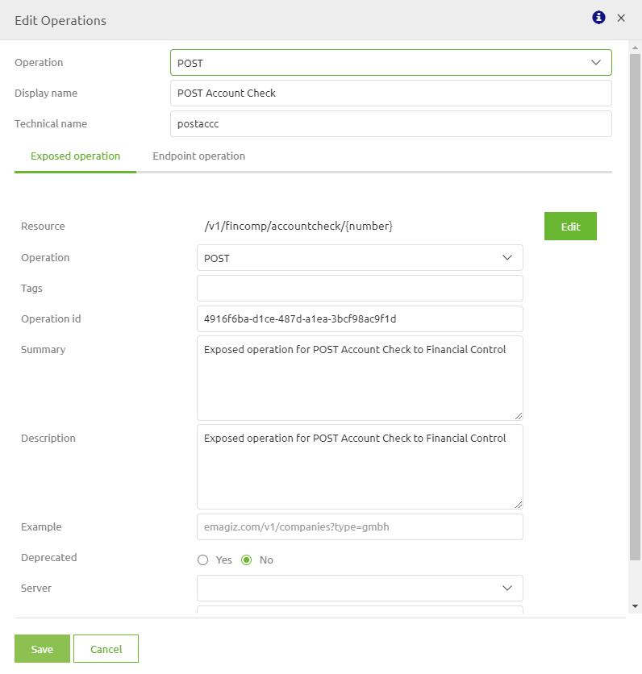

#### Scenario 4: Existing API Gateway, Existing System and Existing API Resource/Operation
1.	Changes can be made on two levels. One for the exposed part. This can be done via the API Catalog. This can be done by right clicking on the API icon in the middle of your project overview and selecting Edit Catalog. Here you can change endpoints, parameters, responses, etc.
 

2.	The second change can be made on a backend operation. This can be done by right clicking the system, pressing Edit System and pressing Manage. Here you can change endpoints, parameters, responses, etc.

### Design Architecture <-> Deploy Architecture
Design and Deploy Architecture work the same as is now the case for projects that only include messaging flows. In Design eMagiz will add one or more runtimes for the API Gateway components based on your API Gateway settings. Advice would be to deploy this runtime on a separate machine in the AWS cloud to keep API Gateway components separate from messaging and/or event streaming components.
Changes made via Design Architecture will be actualized in the same manner as you are used to in eMagiz via Deploy Architecture.

## Create

### Scenario 1: Adding an integration
1.	Navigate to Add integrations and select the integration you want to add to create. This works the same in comparison to adding other integration types.
2.	Navigate back to Create
3.	Instead of visually seeing the integration in the bus overview there is a separate tab created called API Gateway. This way you can see the all-entry of the gateway (exposed part) and the different exit gateway(s) to external systems.
 

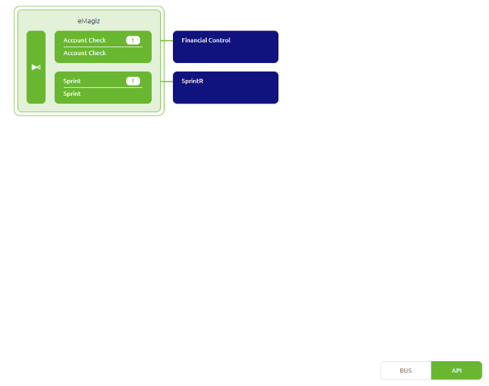

4.	Select the all.entry flow related to your API Gateway and click on the Reset flow button. This way the new integration is added to the entry. If you configured everything correctly no changes are needed in this flow.
5.	Select the exit related to your integration (I.e. jira.storyget.exit) and open it by double clicking.
6.	eMagiz generates the flow based on what you defined in Design. In most cases no changes have to be made in the Create phase. In cases where you want to deviate from the chosen authentication method in Design eMagiz still provides you with this opportunity in Create. When in editing mode in Create you still have the same components at your disposal as when building an integration. These components can be added the same way as you would do for any integration (I.e. using support objects or headers on the message). For an example see the picture below
 

7.	When you are finished with the create phase (which should be fast if you filled in Design correctly) click on the button Transfer to Deploy from the context menu in the bottom right corner of the flow. This way the newest version will be available for your Releases in Deploy 

### Scenario 2: Updating an integration
1.	Instead of visually seeing the integration in the bus overview a separate tab is created called API Gateway. This way you can see the all-entry of the gateway (exposed part) and the different exit gateway(s) to external systems.
 

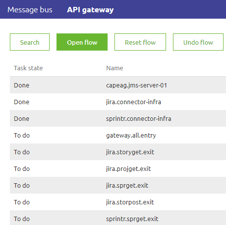

2.	Select the all.entry flow related to your API Gateway and click on the Reset flow button. This way the new integration is added to the entry. If you configured everything correctly no changes are needed in this flow.
3.	Select the exit related to your integration (I.e. jira.storyget.exit) and open it by double clicking.
4.	eMagiz generates the flow based on what you defined in Design. In most cases no changes have to be made in the Create phase. In cases where you want to deviate from the chosen authentication method in Design eMagiz still provides you with this opportunity in Create. When in editing mode in Create you still have the same components at your disposal as when building an integration. These components can be added the same way as you would do for any integration (I.e. using support objects or headers on the message). For an example see the picture below
 

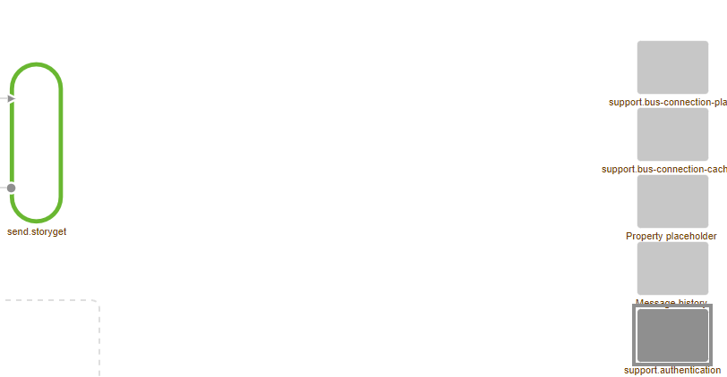

5.	When you are finished with the create phase (which should be fast if you filled in Design correctly) click on the button Transfer to Deploy from the context in the bottom right corner of the flow . This way the newest version will be available for your Releases in Deploy 

## Deploy
1.	Navigate to Deploy -> Releases
2.	Create a new Release based on the currently active release and add to the new release all new flow versions based on the changes made in the Create phase of eMagiz.
3.	Adding and updating flows can be done in a slightly different way in comparison to what you are used when adding /updating a messaging flow.
4.	Click on the details icon (the three dots) and select Details
 

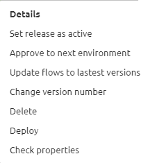

5.	When adding an integration navigate to the integrations tab and Click on Add
 

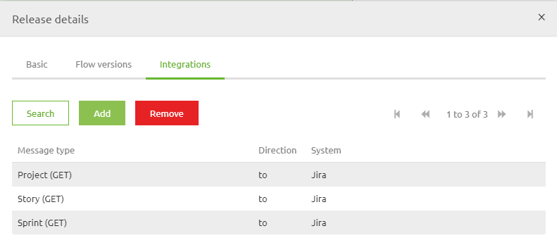

6.	After you have added the integration select the tab Flow versions. In this tab the newly added integration will show up with the latest version
7.	If you want to update a flow you will need to be in the same screen as in step 5 (Flow versions). Here you can easily change the version of a certain flow to the version you want
8.	Click on Save
9.	If this is the first time ever you are about to host an API Gateway please first read the section around Creating and managing API Keys (see right-hand panel menu)
10.	Press Deploy in the drop-down menu to deploy the various new / updated flow to the correct runtimes. When confronted with the pop up that properties are missing fill them in according to the relevant best practices. A list of relevant properties always needed for an API Gateway are listed under the list of Relevant Properties (see right-hand panel menu)
11.	Verify via the usual steps, checking runtime dashboard and manage, whether all flows are running correctly and as expected.

### Creating and managing API Keys

1.	Navigate to Deploy -> API Gateway
2.	Here you can add Users and Roles. The way this works is that you can assign a Role to a User and based on a Role you can grant access to specific exposed operations.
3.	If you want to add an User click on New. Click on edit if you want to edit an User and /or accompanying Authentication Key or Delete if you want to revoke a certain Authentication Key / delete a user
 

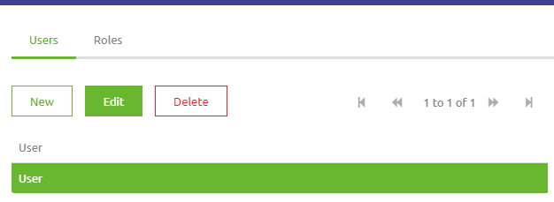

4.	If you want to add an Role click on New. Click on edit if you want to edit an Role or Delete if you want to revoke a certain Role 

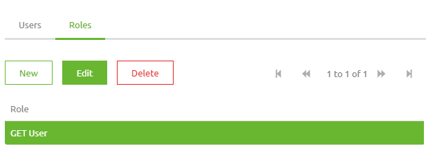

5.	Assign a Role to a specific integrations / operation
6.	Assign a User to a Role to link authentication keys to operations.
7.	After you have assigned the integration the Deploy phase refreshes so you can check under Deploy -> Properties if the key is generated correctly for the gateway
List of relevant properties API Gateway
	- {technicalname -system}.exit.{systemname}. Defines the host for the API of the external system. One needed per external system linked to the API Gateway
	- {technicalname -system}.entry.port. Defines the port on which the API Gateway is running
	- authentication.{technicalname-system}.{technicalname-integration}.api-key. One property with all approved API Keys for a certain integration. Needed if authorization method via ApiKey is used. See Creating and managing API Keys for how to generate these automatically

## Manage
Manage works the same for API gateway operations as for messaging flows. So you can set alerting on whether the exposed gateway or a specific backend operation is running. You can see how many messages have been send to a specific backend operation and many more which you can do at the moment in Manage.
This can be seen in more detail under the section API Gateway Statistics (Under Manage -> Monitoring). In this section you can see the number of requests made on a specific backend operations and the number of responses received from the backend operation.

 

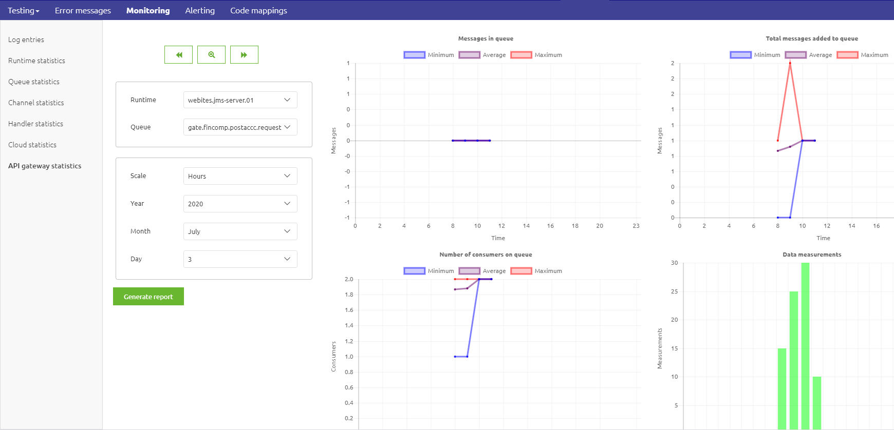

