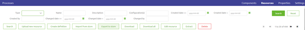
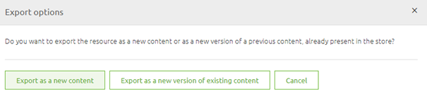
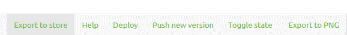
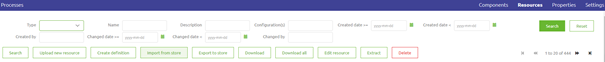
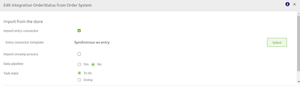

## User Guide eMagiz Store

Below the user guide for the eMagiz Store. Within this guide we discuss the contents you can find in the store, guidelines of the store, how you can import things into the developer / company store. How you can export from the company and/or public store and how the process works of getting something of yours accepted into the public store. Should you have any questions, please contact productmanagement@emagiz.com.
Last update: November 16th 2020

### Store contents

The store contains the following items:

- Flows
	-	Connectors (entry and exit flows)
	-	Processors (onramp and offramp flows)	
- Resources
	-	Definitions
	-	CDM
	-	Message Models
	-	Mappings
	-	Other (custom XSLT's for example)
	
#### Browsing the Store

When you are logged in to the eMagiz portal (my.emagiz.com) you can see the contents of the Public Store, the Company Store and the Developer Page by clicking on the Store icon located in the top right hand corner of your screen.

In all three sections you can search on several indicators (i.e. name, description, market) to see what is available under each section.
The Developer page shows everything you have exported to the store.
	
### Store Guidelines

#### General Guidelines

These guidelines are applicable to all the Store content you want to submit.

- Provide a short name containing key-words, a description of the main features of your content, and an extended documentation.
- Provide a contact.
- Describe typical usage scenario(s).
- Describe the features / limitations of your content.
- Describe dependencies (e.g. for connectors, the external system version).
- Describe the necessary steps to configure the content, if any (e.g. for flows, renaming of properties or other elements that is not automated).
- Describe the market and external system that are applicable for your import
- Possibly provide a logo for your content; this can be done by editing it from the Developer page.

#### Guidelines for flows
If you want to submit a flow, please also consider the following guidelines.

- Follow the naming conventions
- Prefer the use of properties over hardcode values.
- Logging should be added to every flow, using a logging channel adapter and global wire tap.
- Backup of files in entry and exit flows should be available.
- Maintain the flow layout as clean as possible: all support objects on the right side and no crossing lines.
- Be sure that your flow works correctly.
- Be sure that all, and only, the resources used by the flow are attached to the flow and to the components.
- If you have manually added JMS queues in your flow, be sure to add them in the ‘Extra JMS queue configurations’ tab of the ‘Edit Configuration Template’ page, with the correct name.
- Add the runtime version in the documentation.
- Add one or more screenshots of your flow as it appears in the flow designer.

#### Restrictions
If you want to submit something to the flow the following restrictions might apply.

- You cannot export a all entry to the store
- You cannot export a dummy entry to the store
- You cannot export a Mendix entry/exit to the store
- You cannot export a new version of an existing store component if you are not the original author of the store component. This to prevent 'stealing' the work of someone else.
- You cannot export a new entry to the store if the resource / flow was imported from the store and you are not the original author of that store component. This to prevent 'stealing' the work of someone else.
- You cannot export old tooling resources to the flow
- You cannot import resources and flows that are saved in a company store to which you as a user do not belong. For example only CAPE employees can import functionality from the CAPE Store.
- When you import an onramp or offramp the system message definition, message mapping and CDM message are not automatically created based on the import. Instead you get custom resources which you can use for this.

### Export to the store

For resources and flows there is a different approach how to export these functionalities to the store. Below we specify per type what the method is to export something to the store. 
Please keep the above mentioned guidelines and restrictions in mind whilst exporting to the store.

#### Resources

To export a resource to the store you need to navigate to Create -> Resources. In this overview page containing all Resources that are linked to your project you have a button to export to store.

You can press this button after you have selected which resource you want to export to the store. After you have selected the resource and pressed the button export to the store you will see a pop-up.

Within this pop-up you have three choices:

- Export as new content
- Export as a new version of existing content
- Cancel

##### Export as new content

Choosing this option means that you create a new entry within the store. After you have pressed the button you have to fill in a name, description and provide documentation in the new pop-up that is shown. See the guidelines mentioned above for context.
The moment you are satisfied with the results you can press Save. You can navigate to the Developer Page to verify that the export worked.

##### Export as a new version of existing content

Choosing this options means that you create a new version of an existing entry in the store. 
After you have pressed the button you have to select the resource for which you want to export an update to the store. 
After you have chosen and pressed the button you have to write down a remark stating what you have changed and choose whether the update is major, minor or patch.

This leads you to the same pop-up as when you would get when you export something as new content to the store. Verify the metadata and press Save when you are satisfied.

#### Flows

To export a flow to the store you need to be in the flow you want to edit in the Create phase of eMagiz. On the left bottom of the page there is a button called Export to Store

Pressing this button leads to a pop-up. Within this pop-up you have three choices:

- Export as new content
- Export as a new version of existing content
- Cancel

##### Export as new content

Choosing this option means that you create a new entry within the store. After you have pressed the button you have to fill in a name, description and provide documentation in the new pop-up that is shown. See the guidelines mentioned above for context.
The moment you are satisfied with the results you can press Save. You can navigate to the Developer Page to verify that the export worked.

##### Export as a new version of existing content

Choosing this options means that you create a new version of an existing entry in the store. 
After you have pressed the button you have to select the flow for which you want to export an update to the store. 
After you have chosen and pressed the button you have to write down a remark stating what you have changed and choose whether the update is major, minor or patch.

This leads you to the same pop-up as when you would get when you export something as new content to the store. Verify the metadata and press Save when you are satisfied.

### Import from the store

For resources and flows there is a different approach how to import these functionalities from the store. Below we specify per type what the method is to import something from the store. 
Please keep the above mentioned guidelines and restrictions in mind whilst importing from the store.

#### Resources

To import a resource from the store you need to navigate to Create -> Resources. In this overview page containing all Resources that are linked to your project you have a button to import from store.

After you have pressed this button you will see a pop-up containing all resources that are available for you to import from the store. See the section on Restrictions to see what you can and cannot see.
Select the resource you want and press Import to make it available in your project.

#### Flows

To import a flow from the store you need to navigate to Design. In Design select the integration for which you want to import a flow and make the appropiate choice

After you have transported the flow to Create you will see a pop-up when you try to open the flow for the first time stating that the flow will be imported from the store. 
Wait for a while and then open the flow again. You will be presented with a flow configured as it is stored in the eMagiz store.

### Making a store component public

To make a store component public you have to submit your component. 
This means that it becomes a candidate for the public store. 
To submit a component you need to navigate to the Developer Page under the Store. 
Per component you will see a button called Submit. 
In case this button is not visible it means you have already submitted the component to be placed in the public store.

After you have submitted a component a team of experts will look periodically through the list of submitted components to determine whether they are suitable to be made public.
While determining this we consider the following items:

- Is it made clear what the flow does to another user?
	- Description
	- Screenshots	
- Is the process generic enough to be used in different projects?
- Are there no customer specific reference or naming conventions used?