## User Guide Event Streaming eMagiz

Below the user guide for Event Streaming. In this guide we will walk you through the various ILM phases of eMagiz and guide you on which actions to take in each of these phase to implement Event Streaming successfully.

Should you have any questions, please contact productmanagement@emagiz.com.
Last update: November 26th 2020

## Pre-requisites
- Basic knowledge of the eMagiz platform
- Understanding of Event streaming concepts
- Toggle Feature – Event streaming made available via your partner manager for your environment
- eMagiz Event Streaming cluster available for your project (requires proper licensing by eMagiz)

## Capture

As with all integration patterns the process starts in Capture. In Capture you have the option to add systems to the canvas that have the ability to connect to a topic.
To indicate this ability on system level you have the option to select Event Streaming as default integration pattern on system level.

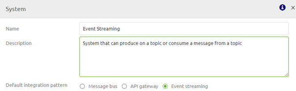

After you have created the system and filled the details in you can add integrations from and to eMagiz. When looking at Event Streaming within the scope of eMagiz the integration (in messaging) equals a topic (in event streaming).
If you draw a line from a system to eMagiz you define that the system from which you have drawn the line is a 'producing' system. A 'producing' system is a system that writes data to one or more topics. If a systems write to more topics you draw more lines.

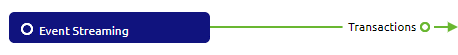

If you draw a line from eMagiz to a system you define that the system to which you have drawn the line is a 'consuming' system on the. A 'consuming' system is a system that reads data from one or more topics. If a systems reads from more topics you draw more lines.

## Design

Design is the crucial phase when it comes to Event Streaming. In this phase you can set the properties of specific topics, add event processors so you can transform data between two separate topics, 
and see the topic storage for your project to determine if this is sufficient or not among others

### Event Streaming Settings

When you navigate to Settings -> Event Streaming you can configure the amount of Event Processing containers. In most cases the default of one is adequate for your needs. Only in cases where there is a larger number of event processors and a need for failover, these settings can be influenced. The size is determined by the number of flows running on the container - similar to the messaging approach.

### Design overview

In Design you see an overview of your landscape including all first class integration patterns (messaging, api gateway and event streaming).

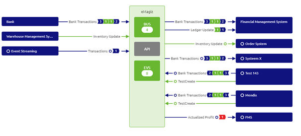

For Event Streaming integrations you see one or more numbers per integration. This numbers mean as follows (left to right):

- Number of 'producers' on a topic
- Number of event processors for which this data of the topic (integration) is the input of the event processor
- Number of event processors for which this data of the topic (integration) is the output of the event processor
- Number of 'consumers' on a topic

### Topic Properties

Based on the lines you drew in Capture eMagiz automatically generates a topic. In other words, for each line you drew in Capture eMagiz will create an accompanying topic.

Apart from the naming of the topic eMagiz also provides you with a set of default settings for your topic. Two of these settings need a closer look from you. These settings are:

- Retention Hours
- Retention Bytes

These two settings mainly determine the amount of GB in storage is necessary on the eMagiz Event Streaming cluster to run all topics. 
As you can imagine the longer you retain data and the more data you retain the higher the costs will be.
You have the option to change these properties by right clicking on the integration to show the context menu so you can select the topic properties option.

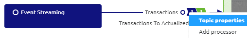

In the pop-up you will see you can expand the Advanced settings information. Here you can set these settings. See below for what these settings mean and how you can determine them

#### Retention Hours

Retention Hours is the number of hours data can reside on the topic before a FiFo principle of removing the first entry in the log kicks in. The moment data is still on the topic beyond this threshold it will automatically start deleting the data.
The default setting eMagiz provides you is 168 hours (7 days). For your use case it might be that there is no need to retain the data for such an extensive period of time. Instead you only want to retain the data for 72 hours (3 days) for example because all consumers can pick up data within that timeframe and all messages older as three days will be obsolete anyway.

#### Retention Bytes

Retention Bytes is the number of bytes available per partition on that topic before a FiFo principle of removing the first entry in the log kicks in. The moment your topic holds more bytes as compared to the retention byte setting it will automatically start deleting the data.
The default setting eMagiz provides you is roughly 500 MB. This might be too low for you if you have millions of messages passing over your topic a day. If so you need to adjust this setting here. Calculating the correct value is explained in the following two sections.

#### Calculating Storage Capacity of a Topic

A calculation example to derive at how many storage capacity of your cluster is being reserved for this specific topic is shown below:

- 100000 messages per day
- 3 days retention
- 5 kB average size of a message placed on the topic

Results in 100000 * 3 * 5 = 1.5 GB in Storage capacity per topic.

#### Calculating Retention Bytes based on Storage Capacity

Based on the previous calculation and the number of partitions (more partitions equals higher throughput) on your topic you can calculate the Retention Bytes setting

- 1.5 GB Storage capacity
- 3 partitions

Results in 1.5 / 3 = 0.5 GB in Retention Bytes. As the name indicates this value needs to be added in bytes. For this example we end up with 524288000 bytes.

### Red background in Design on integration level

If you see a red background behind the number this indicates that you have indicated that a system is consuming data from a specific topic (integration) but have not yet indicated how the data will be produced on the topic.

There are two ways to set this straight:

1. Go back to Capture and draw a line to indicate that a specific system directly produces messages on that topic.
2. Add an Event processor.

### Event Streaming Design Architecture

Within the Design Architecture overview there are two information elements that are Event Streaming specific.

1. Topic Storage
2. Event Processor Container

#### Topic Storage

Whether or not you are using an event processor to transfer data between topic in and topic out or not you will always have a need for temporary data storage. 
Per environment of a project eMagiz gives an advice on how much topic storage is needed for that environment. This advice is based on the input of the developer when configuring the topic properties. 
So make sure you predict the needed storage per topic as good as you are capable.

In Architecture the cumulative total of the topic property configurations will be shown as the adviced sizing given by eMagiz. Just as with messaging and API Gateway you have the ability to change the value here (per increment of 10GB).
To actualize these changes approval is necessary. Please contact your partner manager if you think you are in need of more topic storage.

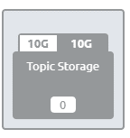

#### Event Processor Container

Just as with API Gateway flows, event processing flows will be deployed on a specific event processor container. This container hosts all flow in which you process data between two topics. 
This container will be running on the same VM as the JMS server.

### Event Streaming Data model

Just as with messaging and API Gateway you can define a data model to visualize the structure of the data that flows through the various topics within your integration landscape. 
You can view and edit this data model by selecting the context menu on Event Streaming (EVS) level. This context menu is located in the center of the Design overview

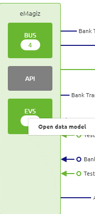

Within this data model you can drag and drop entities on the canvas, add attributes, remove attributes, add/remove datatypes etc. Just as you are used to with messaging. Here you can also specify which part of the data model is the topic definition of a specific topic

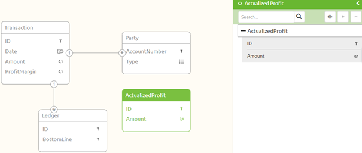

### Add an Event Processor

You can add an Event Processor when you right click on a integration (topic) in Design. A context menu will open giving you two options. One of these options is to Add a processor

In the popup that is presented fill in the Display name and technical name of the event processor. Furthermore choose the input topic (Topic In).

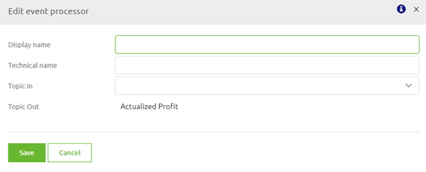

The result of this action will be shown in the Design overview

#### Add / Change processor mapping

On Event Processor level you can select the context menu. One of these options is to go to the processor mapping. You can go here after you have defined the topic definitions of the input and the output topic via the Event Streaming data model.
With this functionality you can create a mapping between the input and the output just as you are used to when creating mappings for messaging and API Gateway integrations.

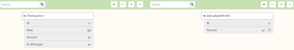

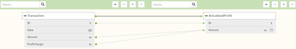

## Create

### Create overview

Within Create you have an overview of your Event Streaming topics and Event processors. You can access this view by select the Stream option as the toggle option of your choice when you enter Create.

The overview will look something like this

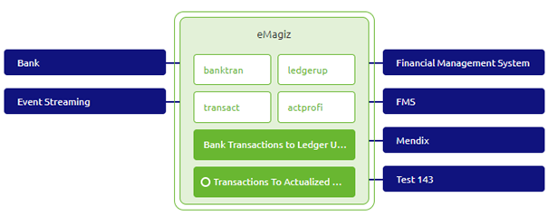

### Adding integrations

Just as with messasing and API Gateway you have the option to transfer a integration (topic) and/or an event processor via the Add integration option in Create. 
In this overview you can select which topics you want to move to Create and eMagiz will create the topics and if needed also the event processors.

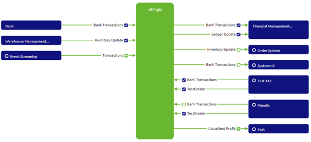

### Viewing Topic Information

When you are in the Create overview you can double click on any topic (white background with green line and green letters) to see the properties as you have configured them in Design
The same can be achieved by a right click and select the option Show topic information

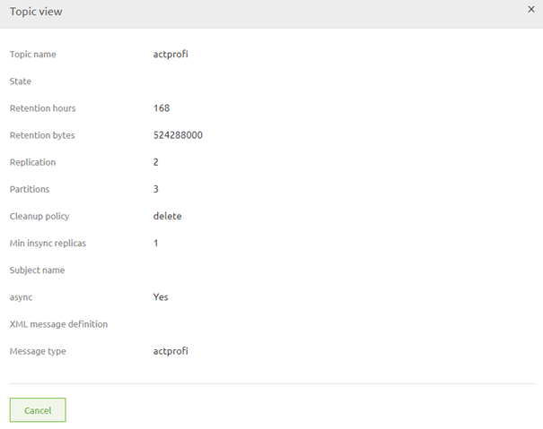

### Opening (and editing) Event Processor

Apart from looking at the topic information you can also open the event processor and see the inner workings of the flow (from topic in to topic out) and even edit the flow if that is necessary.
However since all relevant information is already supplied via Design you don't have to edit this flow in most cases. A typical event processor flow looks as follows:

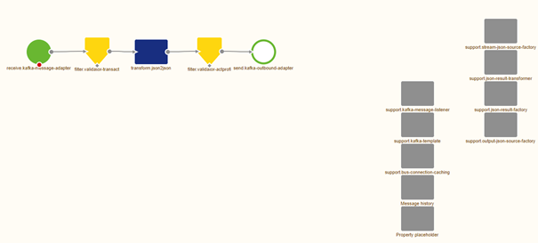

If your case is in need for adjustments you can easily make these adjustments as you are used to. 
Important thing to remember is that you do not have to change the settings of the kafka inbound channel adapter nor the kafka outbound channel adapter.

## Deploy

In Deploy you can select the event processors in your release in the following manner:

- Create a new release
- Open the context menu and select details
- Select the integration tab

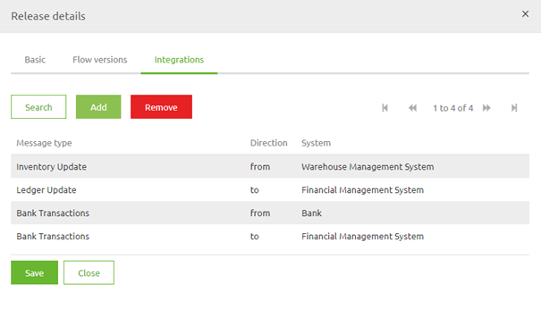

- Press the Add button and select the integration(s) you want to add

- If you are satisfied with your choice press the Add to release button and the flows will be added to your Release. You can Save the release and deploy it.

The moment you make a release active or deploy it, eMagiz will automatically create the relevant topics that you have configured in Design and transferred to Create.

## User Management

When you are in Deploy you can navigate to Event Streaming. Every time a new external producer or consumer needs to be connected to the Event streaming environment you will have to create a new user via the external users screen.
When you want to revoke all rights of an existing user you can remove the user via the Delete button. Don’t forget to also remove the ACL and Topic if this is the last remaining user linked to a specific Topic!

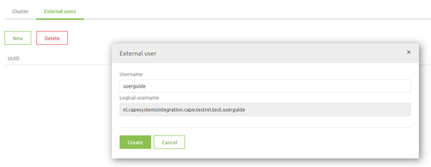

### Configuration of the ACL

After you have added the external users to eMagiz you can give them rights on one or more of the automatically created topics. This can be done by selecting the ACL tab under the Cluster settings.
Within this tab you can Add an ACL Entry or Delete an ACL Entry. By deleting you revoke the rights of a user on a certain topic.

To add an ACL Entry you press the button Add ACL Entry, select the user and topic combination and determine whether that user can consume, produce, do both or is an admin.
This will result in something like this.
 

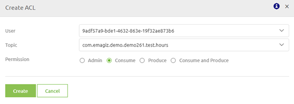

## Event Processor configuration

To make sure that eMagiz can communicate with the topic(s) in case you have build an Event Processor there are three properties you need to fill in:

- emagiz.runtime.environment
- emagiz.runtime.name
- com.emagiz.{displayname}.{technicalname}.bootstrapserver

By filling these in correctly you are able to communicate between eMagiz and the relevant topics for your Event Processor.

## Manage

In Manage there is under Monitoring a section called Topic statistics. In this page you see the following things:

- Configured retention bytes
- Actual size of a topic (in KB, MB or GB depending on the size)
- The size of each partition of a topic (in bytes)
- The last offset per partition (the unique number of the last message that was written to a partition)
- The first offset per partition (the unique number of the first message that is still available to be read on a specific partition)
- The consumer offset (per consumer)
- The number of messages a consumer is behind

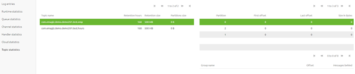

