## User Guide Event Streaming eMagiz

Below the user guide for Event Streaming. In this guide we will focus on the following parts:
- Using the portal to set up an eMagiz Managed Kafka for your project
- Designing an Event Stream (Topic)
- Produce messages on a event stream (Topic)
- Consume messages from a event stream (Topic)
- Transform messages between event streams (Topics)

Should you have any questions, please contact productmanagement@emagiz.com.
Last update: September 29th 2020

## Pre-requisites
- Basic knowledge of the eMagiz platform
- Understanding of Event streaming concepts
- Toggle Feature – Event streaming made available via your partner manager for your environment
- eMagiz Managed Kafka cluster available for your project (requires proper licensing by eMagiz)

## 1. Using the portal to set up an eMagiz Managed Kafka for your project

To set up an eMagiz managed Kafka cluster, for the first time, you need to follow this process

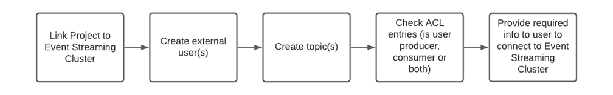

Any optional steps (such as adding schemas to topics) is explained below but is not deemed a necessity to make an eMagiz managed Kafka cluster to work.

First stop is the Design phase of eMagiz. In here you can navigate to the Settings page. In this page you have the option to select the correct multi tenant cluster for your project.
After you have selected this cluster press the button apply settings. This makes sure that eMagiz generates the required information for you that you need.

Next stop is the Deploy phase in emagiz to create users and topics. In case you have already set up an eMagiz managed Kafka cluster before the process will look something like this

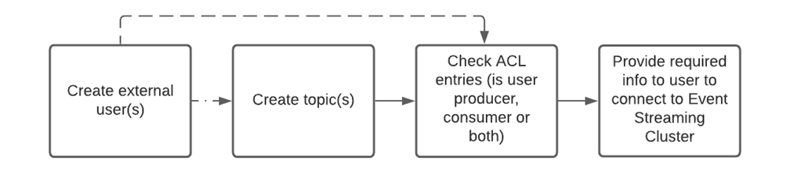

This process indicates that every mutation to the eMagiz Managed Kafka can be the result of the addition of a new user, a new topic or both.

Let us know delve into the specifics of how to set up these various elements. Let us remind ourselves that some of the steps described below are not mandatory.

In the Deploy phase of eMagiz you need to select the Event Streaming tab.

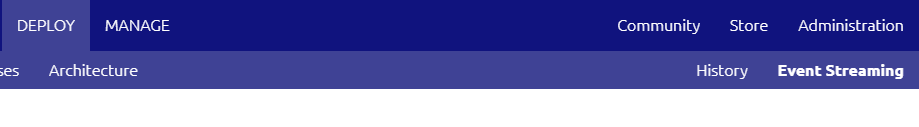

 
In this screen you will have the following options:
-	Users
-	Access Control Lists (ACL)
-	Consumers
-	Topics
-	Schemas
-	Configuration Details

### Users
Under the users tab you can create new users, view information on users or delete a user. Every time a new producer or consumer needs to be connected to the Event streaming environment you will have to create a new user via this screen.
When you want to revoke all rights of an existing user you can remove the user via the Delete button. Don’t forget to also remove the ACL and Topic if this is the last remaining user linked to a specific Topic!
 

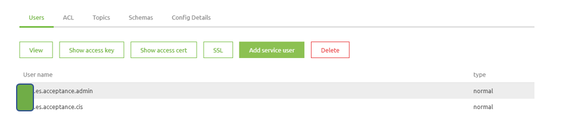

### ACL
ACL stands for Access control list. This list states which user has which rights on which Topic. In this view you can revoke rights by pressing Delete, view the details of a specific entry in the ACL or Add an ACL entry to the list. Adding an ACL entry to the list is preferable not done here but rather via the Topics tab. The reason for this is that in this way you can link the user and the Topic to each other and on the basis of that let eMagiz automatically create the ACL entry for you.

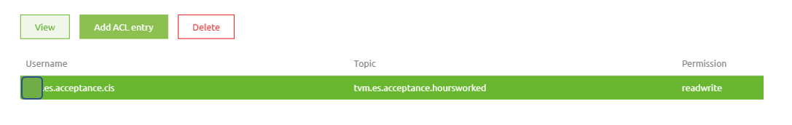

### Topics
This is the main page for the hosting of an Event Streaming solution. Under this page you can create Topics, view Topics, delete Topics, fetch messages and monitor traffic on the Topics. 
 
 
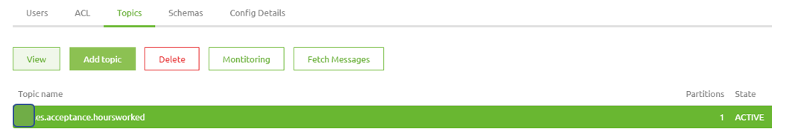

 
Let us first look at creating a Topic. For each distinct event you should create a new Topic. For example when you measure both temperature and humidity in a room, the events that are triggered by temperature variations are placed on a separate Topic in comparison to the events that are triggered based on humidity variations.
Creating a Topic can be done by pressing Add Topic and given the Topic a descriptive name (i.e. emagiz.es.acceptance.temperature or emagiz.es.acceptance.humidity), select the user that will receive rights on this Topic and leave the remainder to the default settings made for you. If you want to deviate from these advanced configurations, please first consult the help text provided by eMagiz.

Via the Delete option you can remove a Topic altogether. This means no messages can be produced or consumed on that specific Topic. All remaining messages that were still residing on the topic will de deleted also.

### Monitoring Topics
The button Monitoring is created so you can monitor the Topic. Under monitoring you will see how many messages are placed on a Topic, what the size of the Topic is at the moment and the so called consumer lag.

### Schemas
Just as with the API gateway and with messaging a certain structure or schema needs can be defined. The purpose of a schema in the context of Event Streaming is to let the consumer know how the message they can consume will look like. For event streaming you can define this via the eMagiz portal by adding an AVRO schema. By creating such a schema you can specify for which Topic the message need to adhere to this schema.

 

 
Creating a schema can be done by pressing the Create subject button. In the following screen you enter the name of the subject, which should mimic the name of the Topic and add the schema. If you have trouble creating an AVRO schema please use this easy to use tool to convert a JSON message to an AVRO schema (such as https://toolslick.com/generation/metadata/avro-schema-from-json). This in combination with the example provided in the help text gives you as user an easy way to correctly set up the schema. In future versions, graphical possibilities will be added to create these AVRO schemas without the need to use such external tools.
Apart from creating a schema you can view it, delete it or see the version of a specific schema. By using the compatibility function you can update a schema to a newer version but by setting the compatibility to Backward compatible also make sure that producers and consumers can still exchange messages that adhere to the old structure. eMagiz provides you with several options as shown below.
 

 
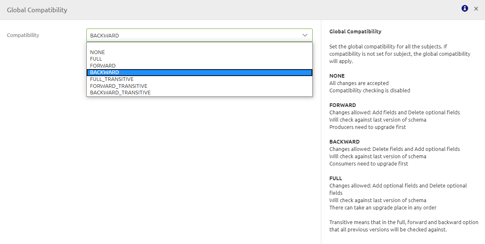

 
### Config details
This is a read only screen that specifies the technical connections needed to set up the Event Streaming functionality. The bootstrap server information is the part of the screen that is relevant for you as a user. Both in case you want to produce or consume messages as a part of a message flow or when you need to communicate this information to the external party. 

To learn more about producing and consuming messages please see the sections on Produce messages on a event stream (Topic) from eMagiz and Consume messages from a event stream (Topic) via eMagiz

### Providing details to user

To make sure that an external user can indeed connect to the topic(s) you have created for your eMagiz managed kafka solution they need the following pieces of information:
-	Topic name
-	Access Key
-	Access Certification (possible in combination with the Key as a .p12 resource)
-	Bootstrap server

## 2. Designing an Event Stream (Topic)

Apart from providing an eMagiz Managed Kafka solution it is also possible to produce and/or consume messages from topics in eMagiz itself. This way you have another integration pattern to select from to better support the business processes.

In this section we will focus on the Capture and Design part of eMagiz. In here, and especially in the Design part, you can design the topics in such a way that configuration in Create and Deploy is kept to a minimum.

We start designing the Event Stream in Capture. In here we draw a system (as we are used to do) and draw a line from that system to eMagiz (producing) or from eMagiz to the system (consuming).
On both system as message type level we indicate that this is an Event Streaming message flow. This we need in Design.

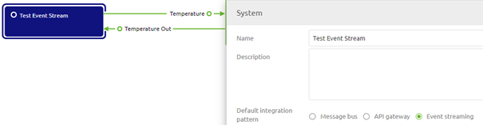

In Design there is an Event Streaming tab. On this tab you will see the following elements:
-	Data Model
-	Processors
-	Topics

In terms of necessity the only required part here is the Topic part (which eMagiz prefills for you). 
Data model can be used as the basis of the schema and the Processor part is needed when a transformation needs to be done between two topics.

Process wise this looks as follows:

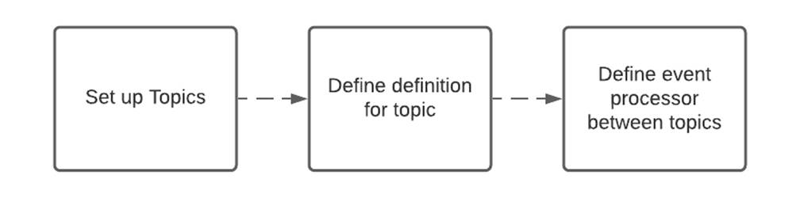

### Topics

Based on the lines you drew in Capture eMagiz automatically generates a topic. In other words, for each line you drew in Capture eMagiz will create an accompanying topic.

Apart from the naming of the topic eMagiz also provides you with a set of default settings for your topic. Two of these settings need a closer look from you. These settings are:

- Retention Hours
- Retention Bytes

These two settings mainly determine the amount of GB in storage is necessary on the eMagiz Managed Kafka cluster to run all topics. As you can imagine the longer you retain data and the more data you retain the higher the costs will be.

#### Retention Hours

Retention Hours is the number of hours data can reside on the topic before a FiFo principle of removing the first entry in the log kicks in. The moment data is still on the topic beyond this threshold it will automatically start deleting the data.
The default setting eMagiz provides you is 168 hours (7 days). For your use case it might be that there is no need to retain the data for such an extensive period of time. Instead you only want to retain the data for 72 hours (3 days) for example because all consumers can pick up data within that timeframe and all messages older as three days will be obsolete anyway.

#### Retention Bytes

Retention Bytes is the number of bytes available on the topic before a FiFo principle of removing the first entry in the log kicks in. The moment your topic holds more bytes as compared to the retention byte setting it will automatically start deleting the data.
The default setting eMagiz provides you is roughly 524 MB. This might be too low for you if you have millions of messages passing over your topic a day. If so you need to adjust this setting here.

#### Calculating Storage Capacity of Topic

A general rule of thumb would be that the Retention Hours and Retention Bytes need to be balanced out. A calculation example of this would be:

- 100000 messages per day
- 3 days retention
- 5 kB average size of a message placed on the topic

Results in 100000 * 3 * 5 = 1.5 GB in Retention Bytes per topic.

### Data Model

The Data Model part can be compared to a CDM like structure in which you can model out the structure of the messages that are placed on topics. From here you have the option to assign parts of the data model to be the message definition belonging to a topic.

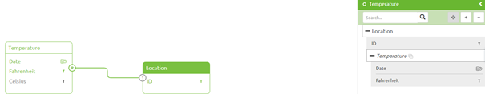

### Processors

Under this part you have the option to create an Event processor. An Event processor, as the name already suggests, processes Events. 
In eMagiz this gives you the option to transform the JSON message from Topic A to Topic B within eMagiz before (external) users can consume the data.
For example when you gather the weather information from American and European sources and want to present those in one generic format (Celcius) 
to be consumed you want to transform the topic containing the American weather information to the European (Celcius) format.

To set up such a processor follow the following steps:

1. Open the Data model and add a message definition to both the input aswell as the output topic
2. Press New under Processors and fill in the required fields
	-	Display Name
	-	Technical Name
	-	Topic In
	-	Topic Out
3. Press Add in this popup screen and select the Topic Out to be linked to the integration. The result of these step should look like this:
	
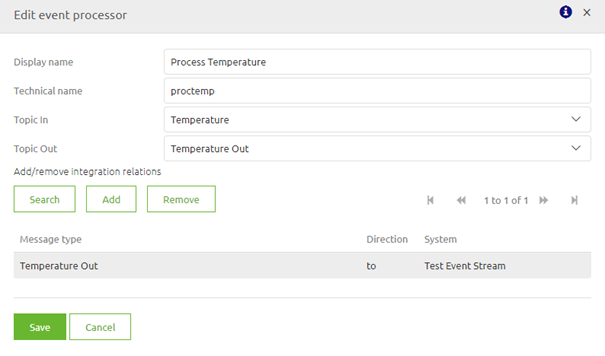

4. Verify that step 1 wend well by pressing the Message In or Message Out button. In the following page you have the ability to switch between the Message In, Message Out and Message Mapping tabs. If both show the expected result click on the Message Mapping tab.
5. Fill in the message mapping as you are used to from other integration patterns.
6. After you have set this up correctly you can move the integration to Create and eMagiz will generate all necessary components for you.

## 2. Architectural Design Event Streaming

All Event Streaming related processes will run in the eMagiz Cloud on separate container(s) that is specifically designed for Event Streaming.
Logically the moment you start adding more Event processors the amount of resources needed to successfully run these Event processors goes about. Comparable to when you add flows to your messaging solution
This looks as follows:

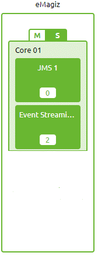

In hybrid situations you will see several containers each linked to a specific integration pattern. 
For example when using both Messaging and Event Streaming separate containers are created for the Messaging portion of your project (onramps, offramps, etc.) and for the Event Streaming part (Event processors). 

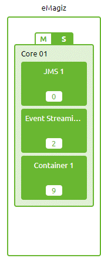

## 3. Produce messages on a event stream (Topic)

After you have designed the event Stream (Topic) in Capture and Design you can move the integration to Create. 
In here eMagiz creates all the required information for you based on the choices you made in Design. So in case of a passthrough case in which eMagiz is a producer eMagiz creates the Kafka template and the Kafka outbound channel adapter for you.
Furthermore eMagiz creates the needed keystores for you and will add those to the flow automatically.

The input that makes sure that eMagiz produces messages could be another topic, another messaging flow or a series of components that is part of this integration

### Reference Information

To produce messages on a Topic you need two components in eMagiz:
1)	A Kafka template. This template sets up the connection between the producer and the server that hosts the Topics. In this component the following things need to be configured:
-	Host and port of the server to which you want to connect to (separated by a semicolon).
-	Security protocol. Default for an server is SSL
-	Client ID. Identifier to determine who produces the messages
-	A keystore (containing a p12 that identifies the client) + including password and type (PKCS12 or JKS)
-	A truststore (containing the ca of the server that authorizes clients) + including password and type (JKS)
 
 
 
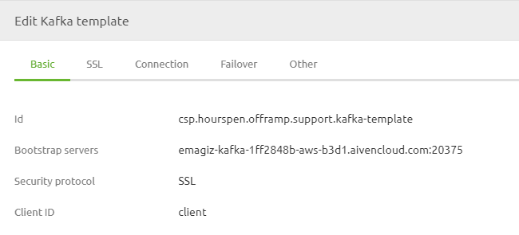

 
2)	A Kafka outbound channel adapter. This adapter produces messages on a specific Topic. To make this work you need to configure the following things:

-	The name of the Topic on which you want to produce messages
-	The Partition ID (default is 0) to which you want to write the message. Deviations from the standard can be made if a lot of messages need to be produced. This to reduce the load a consumer needs to process. Or in cases specific messages are only relevant for certain consumers.
-	Link to a Kafka template

  
 
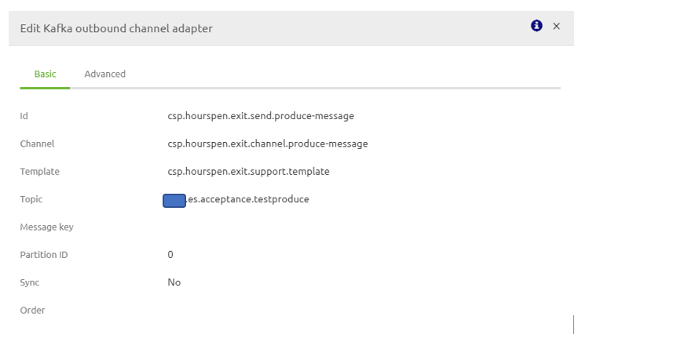

 
## 4. Consume messages from a event stream (Topic)

After you have designed the event Stream (Topic) in Capture and Design you can move the integration to Create. 
In here eMagiz creates all the required information for you based on the choices you made in Design. So in case of a passthrough case in which eMagiz is a consumer eMagiz creates the Kafka message listener container and the Kafka message driven channel adapter for you.
Furthermore eMagiz creates the needed keystores for you and will add those to the flow automatically.

The output of consuming messages could result in message being placed on another topic, another messaging flow, an API Gateway call or a series of components that is part of the integration itself
An example could be the buying certain products leads to an event telling several systems that new raw materials need to be purchased and new goods need to be produced

### Reference Information 
To consume messages from a Topic you need two components in eMagiz:
1)	Kafka message listener container
-	Host and port of the server to which you want to connect to (separated by a semicolon).
-	Security protocol. Default for an server is SSL
-	Group ID (Cluster ID). Identifier of the group / cluster to which the Topic belongs.
-	A keystore (containing a p12 that identifies the client) + including password and type (PKCS12 or JKS)
-	A truststore (containing the ca of the server that authorizes clients) + including password and type (JKS)
   
 
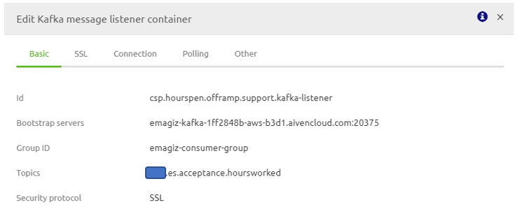

 
 
2)	Kafka message driven channel adapter
-	Link to the Kafka message listener

  
 
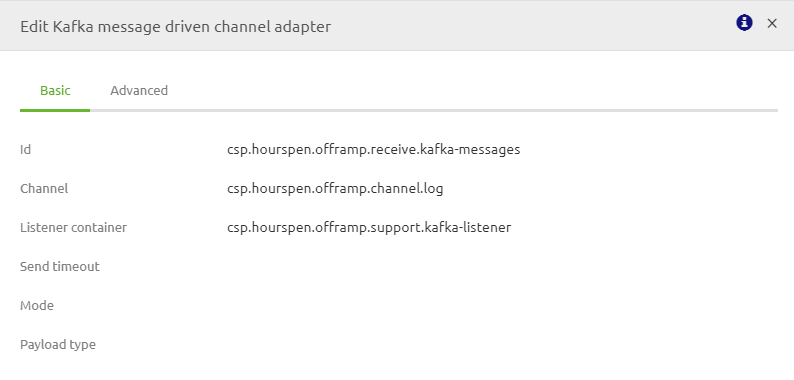

