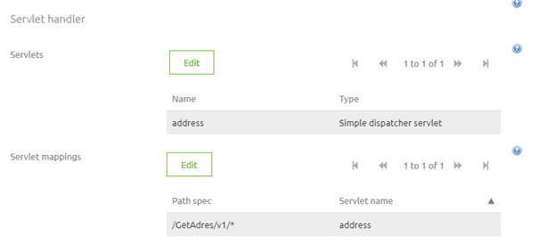
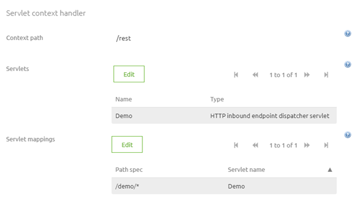
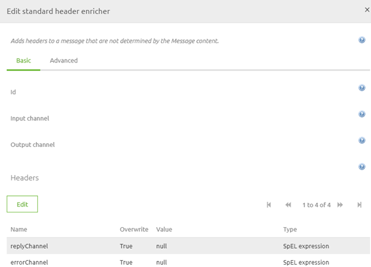

## Identification Legacy parts

Below you will find several sections that identify parts of the framework that are deemed legacy and are replaced by newer and better alternatives. The guide is split up per legacy part. Per section we describe the legacy method, the new method and how to migrate from legacy to new. Should you have any questions, please contact productmanagement@emagiz.com.
Last update: February 17th 2021

## Pre-requisites
- Basic knowledge of the eMagiz platform

## 1. Old Transformation Tooling
A key feature of eMagiz always has been the manner in which you can visually see what you need to transform from A to B. At a certain point eMagiz provided a new way of Designing the transformation. This meant two things. The Design phase in eMagiz has now become the place to set up your transformations instead of doing everything in Create. This way your process of developing an integration became more intuitive and less complex.

### Legacy approach
You can identify Legacy resources (transformation or validation) by navigating to Create -> Resources. In here you can search for XML definition (classic) or XML transformation (classic). All results given back mean that these resources are created with the old transformation tooling and need to be migrated if the resource in question is still being used in a flow. You can see whether they are still used by looking at the configuration column.

Opening a definition in the old tooling will look like this

### New approach
You can identify New resources (transformation or validation) by navigating to Create -> Resources. In here you can search for Message Definition or Message Transformation. All results given back mean that these resources are created with the new transformation tooling. These resources don’t need to be migrated. You can see whether they are still used by looking at the configuration column. If not used you can remove, after verifying if they are indeed not used anymore, these resources as part of your lifecycle management process.

Opening a definition in the new tooling will look something like this

### How to get to the new approach
Migrating from the old tooling to the new tooling takes several steps to make it work correctly. Below you will find all these steps. Follow them carefully to achieve the desired result
1.	Download the XSD, from Create -> Resources, of the system message for the flow you want to migrate
2.	Download the XSD, from Create -> Resources, of the CDM message for the flow you want to migrate
3.	Download the XSLT, from Create -> Resources, of the transformation between the system message and CDM
4.	Navigate to Design
5.	Open the CDM
6.	Open the XSD of the CDM message to see how the CDM message looks
7.	Verify if the entities and attributes in your CDM message are already available in the CDM that you have currently open
-	If yes, continue with step 9
-	If no, continue with step 8
8.	Add the missing entities and attributes to your CDM that are needed in your CDM message
9.	Open the message type of the flow for which you want to migrate
10.	Construct the CDM message based on the XSD you downloaded in step 2
At this point you have successfully migrated your CDM XSD to the new transformation tooling
11.	Navigate to Capture
12.	Open the information page for the flow for which you want to migrate
13.	Add the XSD that you downloaded in step 1 as XSD to Message Content
14.	Navigate to Design
15.	Open the system message page for the flow for which you want to migrate
16.	Press the import button and select From Capture
17.	Select the XSD you have added to Capture in Step 13
Congratulations, at this point you have successfully migrated your system message to the new transformation tooling
18.	Navigate to the message mapping page.
19.	Draw the lines between system message and CDM (or vice versa) based on the XSLT you downloaded in step 3. Based on the color of the background you can see which part of the screen is CDM (green) and system message (blue)
Now you have successfully transformed the XSLT into the Message Mapping in Design
20.	Navigate to Create
21.	Open the flow for which you want to migrate
22.	Open the tabs System message, CDM message and Transformation one by one to verify if the results of the previous steps in Design are visible in Create.
23. If the results **not** visible continue with step 24. If the results **are** visible continue with step 36
24. Press Start Editing
25. Navigate to Resources
26. Press Add bus resources to flow
26.	Search for other standard resources and add them to the flow (take any resource that is related to another flow to ensure that the link between the flow and any resource is severed)
-	In a onramp you need the system message validation and the transformation from system to CDM
-	In a offramp you need the CDM message validation and the transformation from CDM to system
27. Press Stop Editing
28. In case you are working on a offramp also open the exit accompanying the offramp and continue with step 29. If not continue with step 33
29. Press Start Editing
30. Navigate to Resources
31. Press Add bus resources to flow
32.	Search for other standard resources and add them to the flow (take any resource that is related to another flow to ensure that the link between the flow and any resource is severed)
-	In a exit you need a system message validation
33. Navigate to Create -> Resources and search for the resources that eMagiz should have created for you (based on the naming convention)
34. Remove those resources
35. Navigate back to the flow for which you want the resources to be generated correctly
36.	Press Start Editing
37.	Navigate to Resources
38.	Press Add bus resources to flow
39.	Search for the correct resources and add them to the flow
-	In a onramp you need the system message validation and the transformation from system to CDM
-	In a offramp you need the CDM message validation and the transformation from CDM to system
40.	Link the resources to their respective components in the flow
After this you have successfully linked the new transformation tooling resources to your flow in Create
41.	Verify based on the XSLT downloaded in step 3 if changes have to be made to the transformation made in step 19. This can de done by comparing the old and new XSLT. The new XSLT can be downloaded via the Resources tab of the flow
-	If no changes are necessary, continue with step 43
-	If changes are necessary, continue with step 42
42.	Recreate the old mapping logic via the Transformation page in the flow. This can be done in various ways
-	Filter
-	Transformation
-	Static Input
-	Aggregation
-	Grouping
Now you have migrated from the old to the new tooling. Last step will be to verify everything works exactly the same as before. This can be done in two ways
43.	Test your changes
-	If possible, test your flowing by using the Unit Test functionality. For more information see [User Guide Unit testing](userguide-unitttest.md)
-	Otherwise test it by deploying the flow and sending a message.
44.	Verify your results
-	If the result is the same you are finished
-	If changes exists, analyze them and make changes to the transformation until you have reached the correct result
Congratulation, you have successfully migrated your flow from the old transformation tooling to the new transformation tooling.

## 2. Error handling synchronous flows

To properly manage an eMagiz project you need to have robust and stable error handling. This process of error handling was the same for both asynchronous and synchronous flows. In this process all errors that were thrown by a flow would be routed via the asynchronous error process each eMagiz project has. For synchronous flows this meant that apart from the actual error each step in the process that did not receive a message within the set timeframe would subsequently throw an timeout error.
This process had three disadvantages
-	The client needed to wait for the allowed timeout period (default 20000 ms) before knowing whether or not the action succeeded
-	The client only received a generic timeout error instead of information on the error that occurred downstream
-	Any synchronous error could lead to up to five separate error messages making it more confusing and difficult to properly analyze what was going wrong
Based on these consideration the way errors are handled in a synchronous flow has changed. See below for the old way, the new way and how to migrate to the new way

### Legacy approach

In the legacy situation the flow would handle its error message asynchronously. See a picture below for how this is configured in the flow. That way the other flows in the chain are still waiting for an answer that will never come.

### New approach

In the new situation all (error) messages are given back to the flow preceding the current flow. This way the error message is given back to the client so they know what went wrong. This looks as follows in a flow

### How to get to the new approach

Migrating from the old way of handling errors in a synchronous flow to the new way of handling errors in a synchronous flow takes several steps to make it work correctly. Below you will find all these steps. Follow them carefully to achieve the desired result
1.	Identify the synchronous flow in your eMagiz project that you want to change
2.	Navigate to Create and open the exit
3.	Loop back the error to the response channel. See below for the correct configuration

4.	Save the flow and go to the offramp
5.	Loop back the error to the response channel (see above for the correct configuration)
6.	Add a standard filter component and fill it in according to the below specifications

7.	Add a new channel and link the components to achieve a result as shown above under the new section
8.	Save the flow
9.	Repeat steps 5,6 7 and 8 for the onramp
10.	Open the entry
11.	In here you have the choice to handle the error in two ways
-	Send the error back to the client. This can be achieved by following steps 5,6,7 and 8
-	Send the error to the client after setting the statusCode and the error message. For this continue with step 12
-	Don’t send the error to the client but to the emagiz error flow instead. For this continue with step 13
12.	To specify what the client will see as a response in case of an error you can change the following two things
-	The statusCode (i.e. 401,403,500,501). This can be done by setting the header, with the help of a standard header enricher, titled http_statusCode to the desired statusCode
-	The payload. The payload can be changed to what you want with the help of a standard transformer or an XSLT transformer. An example of this is shown below

13.	Add a JMS outbound channel adapter and send the messages to the eMagiz error flow of your project. This way the message will show up in the Error messages overview of eMagiz but all timeout errors won’t show up anymore. 
14.	Test your changes
-	If possible, test your flowing by using the Unit Test functionality. For more information see [User Guide Unit testing](userguide-unitttest.md)
-	Otherwise test it by deploying the flow and sending a message.
15.	Verify your results
-	If the result is the same you are finished
-	If changes exists, analyze them and make changes to the transformation until you have reached the correct result

Of course it is possible to use a combination of the suggestion made in step 11, 12 and 13 to configure the error handling to your specific use case. If you are planning on implementing a new synchronous flow please consider the API Gateway functionality. For more information please see [ User Guide API Gateway](userguide-apigateway.md)

Congratulations, you have successfully migrated the error handling of your synchronous flows to the new best practice

## 3. Error flow

The error flow is part of the default in any eMagiz project. This flow handles all errors that are thrown by (a)synchronous flows within your project and passes them through to the iPaaS so they show up under Manage -> Error Messages. Recently we have made some changes to make the error flow work even more optimal.

### Legacy approach

In the legacy situation the flow would determine for each message whether or not message tracking was enabled. Based on that the error handling responded in a slightly different manner.

### New approach

In the new situation the flow treats all messages the same and removes all headers to reduce the chance the error message will cause problems downstream for the iPaaS or the portal.

### How to get to the new approach

Migrating from the old error flow to the new error flow takes several steps to make it work correctly. Below you will find all these steps. Follow them carefully to achieve the desired result.
1.	Determine if you made any custom changes to the error handling
-	If not, continue with step 2
-	If yet, continue with step 6
2.	Navigate to Create
3.	Right click on the Error process and press Reset flow
4.	Test the flow
5.	Verify your results
-	If the result is the same you are finished
-	If changes exists, analyze them and make changes where necessary
Congratulations, you have successfully migrated the error flow to the new setup
6.	Determine if these changes are still justified
-	If no, execute steps 2, 3, 4 and 5
-	If yes, continue with step 7
7.	Write down all manually changes you still need
8.	Navigate to Create
9.	Right click on the Error process and press Reset flow
10.	Add the manual changes back to the flow
11.	Test the flow
12.	Verify your results
-	If the result is the same you are finished
-	If changes exists, analyze them and make changes where necessary
Congratulations, you have successfully migrated the error flow to the new setup

## 4. JSON related transformations

Within eMagiz you have the option to transform messages from JSON to XML, XML to JSON and from JSON to JSON. In all these scenario’s you had to resort to using at least a custom XSLT. Sometimes even in combination with standard components provided by eMagiz. With the new functionality it has become to possible to define what the input and/or output of a message transformation is as well as having the option to interpret the input against which can be validated.

### Legacy approach

In the Legacy situation you would need to have at least one custom XSLT to transform between JSON and XML (or JSON). A traditional example of transforming from JSON to XML looks as follows.

In here you would use the standard component to transform from JSON to XML followed by a standardized XSLT that was available through the store. A similar setup was needed when transforming XML to JSON.

### New approach

In the new situation you can start your work in Design as you are used to do when transforming XML to XML. The same can now be done with JSON to XML transformations. Note that the definition should have a additional root element (by default eMagiz calls the element root) to make the validation and transformation work as it should be. After you have set your system message and message mapping as you are just to you can navigate to Create and build the flow. Within the flow some small changes are needed. See below for a representation of how this looks in Create

### How to get to the new approach

Migrating from the old way of transforming messages with regards to JSON to the new way of transforming messages with regards to JSON takes several steps to make it work correctly. Below you will find all these steps. Follow them carefully to achieve the desired result.

1.	Navigate to Design -> System message for the flow you are currently want to change to determine whether you already have a system message with a specific added root element
a)	If yes, continue with step 9
b)	If no, continue with step 2
2.	See if you have a XSD against which you could validate the JSON messages against.
a)	If yes, continue with step 2
b)	If not, continue with step 6
3.	Open the XSD via Notepad++ (or any other tooling that is capable to show XSD messages) and add a element to the root of the message. Default name would be root but can be anything you want it to be.
4.	Navigate to Capture
5.	Upload the XSD to the message flow you are currently working on
6.	Navigate to Design
7.	Import the XSD via the option From Capture in your system message if you have one. If not, create the system message by hand (Don’t forget to add a specific root element)
8.	Navigate to Design -> Message mapping to create the message mapping between system and CDM message
9.	Navigate to Create
10.	Open the flow for which you have changed the system message and the message mapping
11.	Press Start Editing
12.	Determine whether any validation component in your flow has a JSON message as input. For example:
o	In an asynchronous onramp this would be the validation you encounter first in your flow. 
o	In a asynchronous offramp no validations need to be changed because in here you validate the CDM and that is still based on XML. 
o	This logic applies the same for other asynchronous and synchronous flows. 
13.	If the answer is yes for the flow you are currently editing you should add a support object called JSON source factory and couple this to the validation. See below for how this looks

14.	Determine whether any transformation component in your flow has a JSON message as input. For example:
a)	In an asynchronous onramp this would be the standard transformation based on your message mapping made in Design
b)	In a asynchronous offramp no transformation will have JSON as input because in here you transform message from CDM to system message and the CDM and that is still based on XML. 
c)	This logic applies the same for other asynchronous and synchronous flows. 
15.	If the answer is yes for the flow you are currently editing you have a choice to make
a)	If output is JSON you have to add two support objects. One support object called JSON result transformer and the other called JSON result factory. See step 16 for more details
b)	If output is XML you have to add one support object. This support object is called result to string transformer. See step 17 for more details
16.	Couple the just created support objects to your transformation as shown below

Congratulations, you have successfully migrated your current flow to transform JSON message
17.	Couple the just created support object to your transformation as shown below

Congratulations, you have successfully migrated your current flow to transform JSON message

## 5. Hosting a custom REST webservice (and using parameters)

Within eMagiz you have the option to host a SOAP and a REST webservice. When dealing with REST webservices the advised choice is the API Gateway in case the call is synchronous in nature. Not in all cases however the API Gateway completely suits your needs. For example when the process is asynchronous in nature. In these situations you will need to build your own REST webservice that eMagiz can host. With the new functionality it has become more intuitive to host a custom REST webservice via eMagiz.

### Legacy approach

In the old situation you would use a Simple Dispatcher servlet to define the correct endpoints that would be hosted by the REST webservice. See below for how this looks

Furthermore when dealing with parameters you needed to use the HTTP parameter to XML component to map HTTP parameters to XML. See below for an illustration of this component.

This component resulted in a xml that needed to be transformed to a correct system message afterwards.

### New approach

In the new situation you can more intuitively set up your REST webservice. On the jetty server you choose the option HTTP Inbound Endpoint Dispatcher Servlet. This gives you the option to define the first part of your endpoint in the Jetty server.

The remainder of your endpoint (as well as the correct operations and payload types) can now be defined on the Inbound gateway. 

In the advanced tab of the Inbound gateway you furthermore have the option to add all path and query parameters to separate headers (one header per path or query parameter). This means you can easily use this information further downstream in your mapping the moment you will need it.

### How to get to the new approach

Migrating from the old way of hosting a custom REST webservice to the new way of hosting a custom REST webservices needs several steps to make it work correctly. Follow them carefully to achieve the desired result.
In this case a detailed user guide is already available within the portal. So instead of listing the steps once more we advice you to read that user guide. Please go to [Hosting a REST Webservice](hosting-rest-webservice.md)

## 6. Removing headers from your message

Within eMagiz you can place headers on your message and you can subsequently also remove these headers again. For example when some form of authentication is placed in headers you do not want to send this information to an external party that you are connecting to another system. Removing headers has been a tedious process but with some new functionality it makes it easier and more evident to remove these headers.

### Legacy approach

In the old situation you would need to add a standard header enricher to your flow and set the header to null via a SPeL expression.

### New approach

In the new situation you can more intuitively set up the removal of these headers. This can be done by using a new and specific component that has as sole purpose to remove headers from your message. The component is called header filter and in it you can define the names of all headers you want to remove. A wildcard search using a * is also possible. This way you remove all custom set headers from your message. See below for an illustration.

### How to get to the new approach

Migrating from the old way of removing headers from messages to the new way of removing headers from messages takes several steps to make it work correctly. Below you will find all these steps. Follow them carefully to achieve the desired result.

1.	Identify a flow where you remove a header in the old way or don’t remove the header at all where it would be wise to do so (in case of authentication for example or privacy sensitive information)
2.	Add the header filter component to the flow
3.	Add the correct header names (or a wildcard) to the header names field
4.	Press Save
5.	Remove the old functionality where you set the value to null for a specific header.

Congratulations, you have successfully migrated to a good and easy way to remove headers from your message

## 7. Legacy flow components

Below you will find a list of flow components that are deemed legacy by eMagiz. If you are using any of the components listed below your partner will contact you about valid alternatives or a migration path to remove these components from your flows.

- HornetQ componenten -> in-vm connection

- HTTP parameter map to XML transformer

- Image transformer

- ISO8583 componenten

- Mendix FileDocument WS request transformer

- ThClient componenten

- Sonic en WebSphere componenten

