### User Guide Unit Testing eMagiz

Below the user guide for Unit Testing. In this guide we will focus on the following parts:
-	Adding Test Messages
-	Creating a unit test
-	Executing a unit test
-	Validate results of unit test

Should you have any questions, please contact productmanagement@emagiz.com.

Last update: September 4th 2020

## Pre-requisites
- Basic knowledge of the eMagiz platform
- Understanding of Unit testing concept
- On- or offramp (without splitter or router) that needs to be tested

## Introduction

The eMagiz platform gives the user the option to test certain flows via the unit test functionality embedded in the platform. With the help of this functionality you can more easily develop and thoroughly test functionality that is build in these flow as ever before. Making use of this functionality consists of the following four steps:
1.	Adding example messages to Capture
2. 	Adding Test Messages
3. 	Edit a Test message
4.	Delete a Test message
5.	Creating a unit test
6.	Executing a unit test
7.	Validate results of unit test

## Adding Example messages to Capture

Ideally example messages are known in advance and part of the Discovery. 
In eMagiz there is a centralized place where you store all relevant files and data belonging to an integration and that is Capture. 
You can also use this place to store example messages you have received from an external source

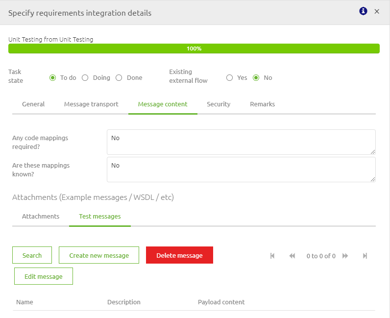

## Adding Test messages

When you navigate to the flow you want to execute a unit test on you can select the option Configure tests.
In this overview you can drag a new message on an input or output component to Create a new message:

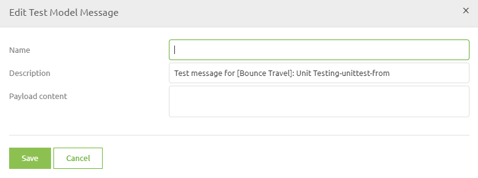

eMagiz provides you with four distinct options to add/create test messages on the basis of certain elements within or outside the portal. Each of these options are discussed in detail below:

- Create message from scratch
- Create message based on a example message
- Create message based on eMagiz definition
- Create message based on external definition

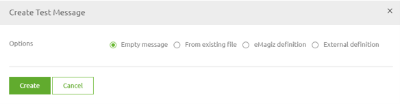

### Create message from scratch

The first option you have is to create a message from scratch. This means that you have the option to copy paste or write out your own message by hand.

Simply select the option Empty message and press Create. In the pop-up that follows you have to fill in a name (make it clear what the message is about) and fill in the content of the message

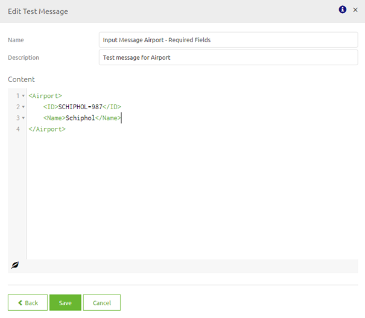

When you are satisfied press Save. If you have doubts about the choice you made press back. If you made a mistake and want to start over again completly press Cancel.

### Create message based on a example message

If you have added example messages in Capture or if there are existing messages in Create already you can now use these messages to create test messages for your unit test.
First select the option From existing file. Secondly you have to make a choice whether you want your input message from Capture or Create

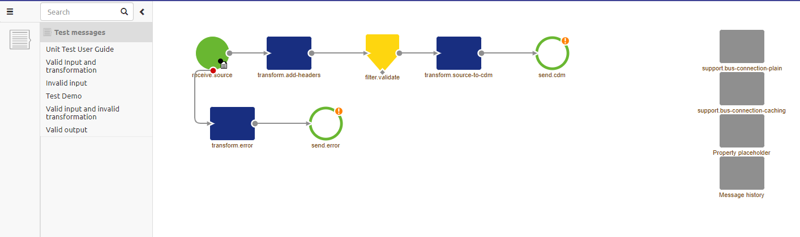

If you choose Capture you can select all example messages you have added to this flow in Capture. 
If you choose Create you can select either all existing test messages attached to the current flow or select existing test messages within your project.

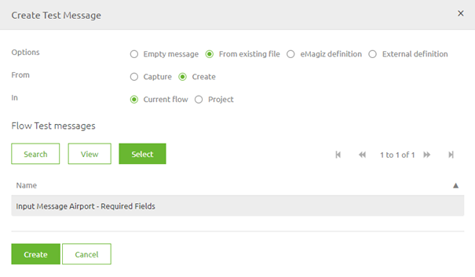

Regardless of the chosen option, the moment you are satisfied with your choice you should select the message and press Select. After you have selected one specific message you press Create. 
eMagiz will now create a new test message based on your selection. In the pop-up that follows verify the name (make it clear what the message is about) and check the content.

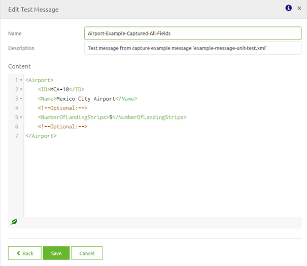

When you are satisfied press Save. If you have doubts about the choice you made press back. If you made a mistake and want to start over again completly press Cancel.

### Create message based on eMagiz definition

If you have used the eMagiz tooling in Design you have yet another choice to base your test messages on. This option is the option to create a message based on a eMagiz definition.
To start things off let us select the option eMagiz definition. 
Within this context we have to make the choice whether we want to use a eMagiz definition linked to this flow or one that is linked to the project as a whole.

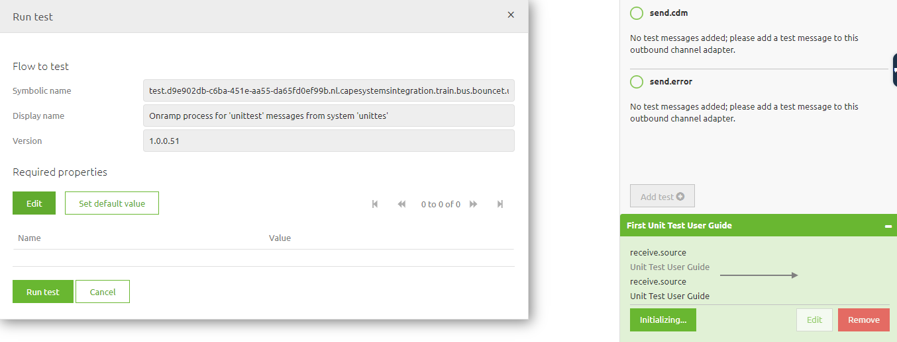

Furthermore you have to make a choice between Minimal or Complete. By selecting Complete you get an example message based on all elements and attributes. 
If you choose Minimal you get an example message based on all required elements and attributes.

Regardless of the chosen option, the moment you are satisfied with your choice you should select the message and press Select. After you have selected one specific message you press Create. 
eMagiz will now create a new test message based on your selection. In the pop-up that follows verify the name (make it clear what the message is about) and check the content.

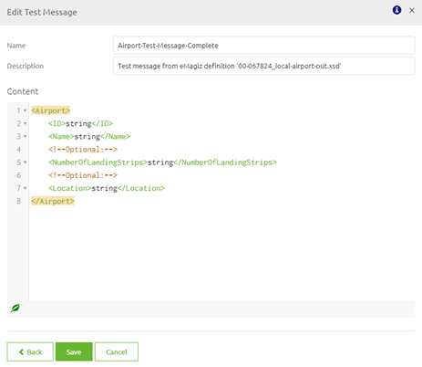

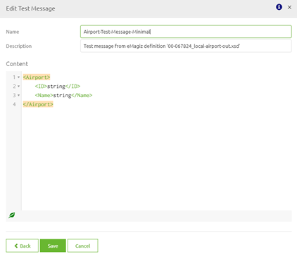

When you are satisfied press Save. If you have doubts about the choice you made press back. If you made a mistake and want to start over again completly press Cancel.

### Create message based on external definition

If you have an external definition (.XSD) that is not yet attached to Capture nor the basis of a eMagiz definition you have the option to manually upload this definition so it can be the basis of your test message.
To do so you have to select the option External definition. Within this context you have to press the Upload button and select the file you want to Upload.

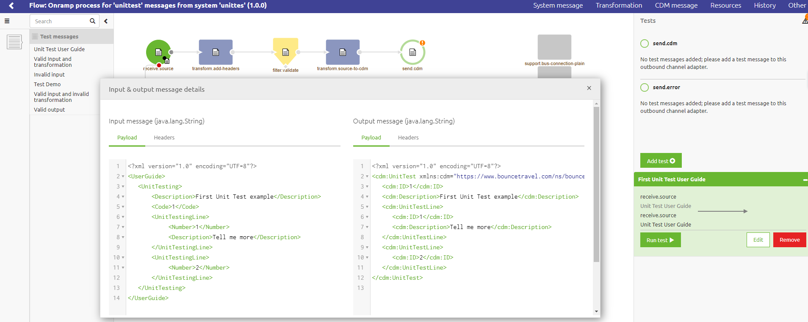

After you have succesfully uploaded the file you can either view the message so you can verify that you have uploaded the correct definition or press Create

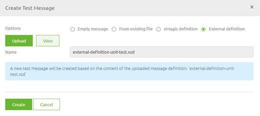

After you press Create eMagiz will create a new test message based on your selection. In the pop-up that follows verify the name (make it clear what the message is about) and check the content.

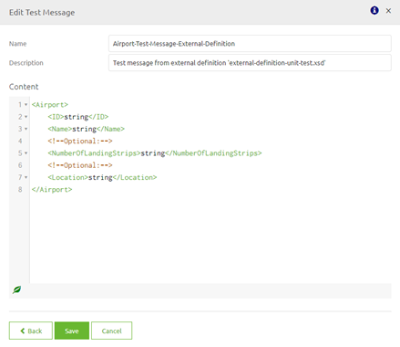

When you are satisfied press Save. If you have doubts about the choice you made press back. If you made a mistake and want to start over again completly press Cancel.

## Edit a Test message
From the context menu you can edit the messages that are linked to your flow as you are used in other context menus. 
When you press the pencil icon a popup is shown. In this popup you can edit the message.

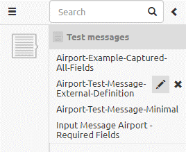
 

## Delete a Test message
In the same context menu where you can edit a test message you can also delete a test message. 
This can be done by clicking the x icon. Be aware, when a message is linked to a unit test you first need to delete the unit test before deleting the test message itself.

## Creating a unit test
On flow level in eMagiz you can create a unit test that is specific for that flow. 
This can be done by pressing the Configure tests button located on the bottom of your screen. For making a unit test the editing modus on the flow is not mandatory.
Pressing this button leads to the following screen.

### Setting up the flow components
 
In the left hand side panel you can see all test messages that are linked to this specific flow.

First step in creating a unit test is to verify if there are messaged linked to the input and output components in the flow. If such a component has one or more messages linked to it you will see this via the small message icon on the component.
Components that not yet have any message linked to them have a orange icon with a exclamation mark linked to them (input and output components). 

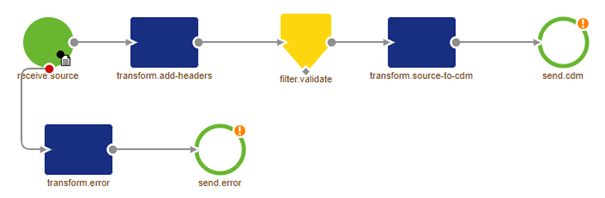

To succesfully create a unit test you need to atleast have messages linked to the input component. Linking messages to the outbound component(s) is optional.

If you need to link a new message to an inbound adapter you should first look at the available list of messages that are already linked to the flow by opening the left panel menu.

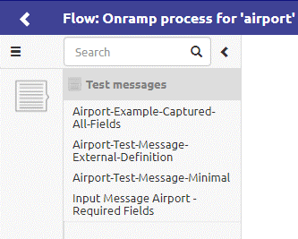

If one of these messages fits your needs you can drag and drop it onto the inbound component (or outbound component).

If there are not yet messages available in this left panel menu or the ones that are available don't fit your requirements you have to create a new test message. To learn more on this please see the section on [Adding Test messages](#adding-test-messages).

### Configure the unit test

Next step is to press the Add test button, Press Edit and select the correct Input message. 

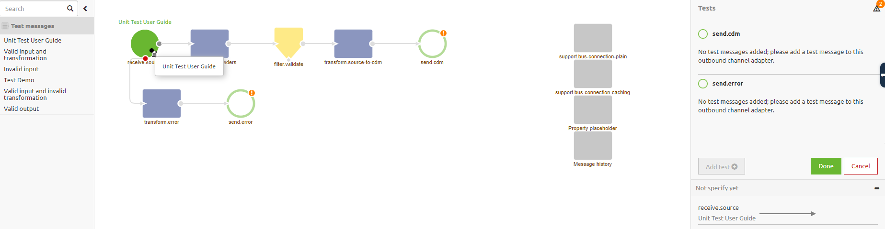

After you have selected the correct message press Done and give the Unit Test a name (by pressing the pencil icon)

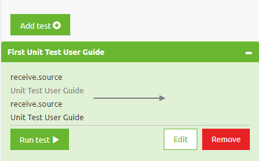

Congratulations, you have successfully create a unit test!

## Executing a unit test
You can simple execute a unit test by pressing the Run test button. After this eMagiz will show you the following popup. 
In case properties are used in the flow you are about to test you need to add values for them. 
If not just press Run Test (Note: When you are the first of the day using the functionality the Unit Testing bus needs to wake up. Therefore it can take a while until you get a result)

When no popup indicating an error shows up the test has run successfully. 
Congratulations! The color of the backscreen indicates the result of the test. For more information on validating the result please see the section on [Validate result of unit test](#validate-result-of-unit-test).

## Validate result of unit test
After you ran the test eMagiz gives you, the user, feedback in two ways:
1.	The color of the background of the screen (red means failed, green means success)
2.	Showing the state of the message in each component it passes
Let’s look into these two ways with a little bit more detail

### Feedback through color of background
As specified before the color of the background is a quick indicator to the user telling the user if the executed test was successful or not. If the background turns red it means the test was not successful. Be aware, when you do not define an expected outcome the result of the test will always be a fail and therefore the color will also be red. For an example see below

After you have specified the expected outcome of the flow the screen will turn green if the actual result equals (in every detail) the expected outcome. If the actual message does not match the expected outcome the background will turn red. See below for a green result!

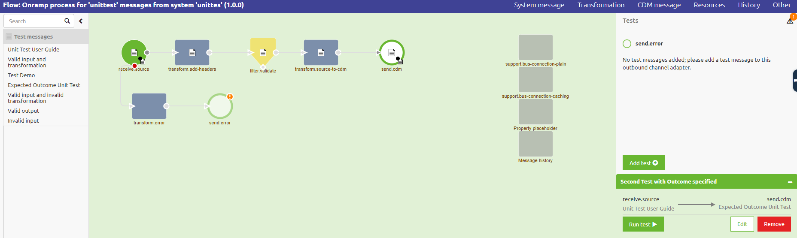

### State of message throughout the flow
eMagiz will also give you feedback on how the message looks like in every component of the flow it passed. This way you can validate if certain headers are set correctly and if certain transformations were successful. Below is an example of comparing the input and output of the transformation component shown in the flow. In here you can see in detail what the transformation has done. This way you can determine whether the change you have just made was indeed successful.

Now you have successfully learned how to implement a unit test within eMagiz and test it you can develop more effectively and more robust.

## Key notes

1. Please make sure that you have a valid configuration to test. In case the flow is invalid, it will not be able to run on the unit test environment. You will get a pop-up explaining that the flow was unable to start, and the unit test can't run. Your bus owner will be able to request the error message as these are not yet displayed in the unit test page.

