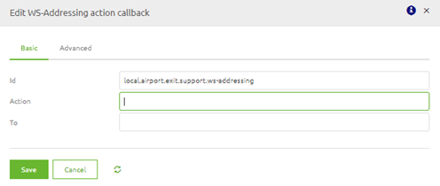
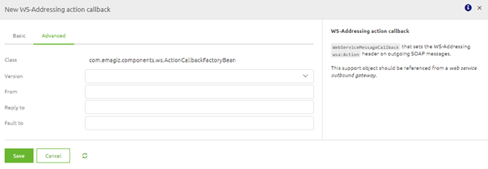
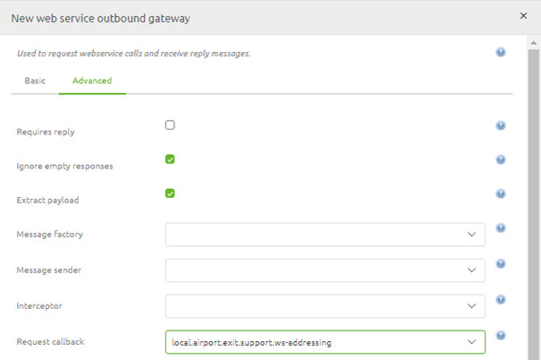

# WS-Addressing

Within eMagiz there are multiple ways of handling security in relation to SOAP Webservices. One of these methods is WS-Addressing. 
In this guide we will look at WS-Addressing from the following viewpoints:

- What is WS-Addressing
- Calling an external SOAP Webservice that requires WS-Addressing

## What is WS-Addressing

WS-Addressing is a standardized way of including message routing data within SOAP headers. 
Instead of relying on network-level transport to convey routing information, 
a message utilizing WS-Addressing may contain its own dispatch metadata in a standardized SOAP header.

This can be achieved by sending (a set of) WS-Addressing SOAP Headers along with the SOAP body. Examples of these headers are:

Relationship to previous messages (A pair of URIs)
- Message destination URI
- Source endpoint
- Reply endpoint
- Fault endpoint
- Action

What an external system exactly requires in terms of WS-Adressing headers depends on the requirements made by that system.

## Calling an external SOAP Webservice that requires WS-Addressing

To ensure that eMagiz creates the required SOAP headers on top of your SOAP message you have to add one support objects to the flow where you want to call the external webservice (predominantly the exit). 
This support object is:

- WS-Addressing action callback

Within this component you can set the following headers aswell as choosing the version of WS-Addressing that is required:

- Action (required)
- To
- From
- Reply To
- Fault To

When you are satisfied with your configuration you can link this support object to the webservice outbound gateway as follows:

After you done all this you can test the flow to verify that the WS-Addressing is correctly configured making you able to call the external webservice
