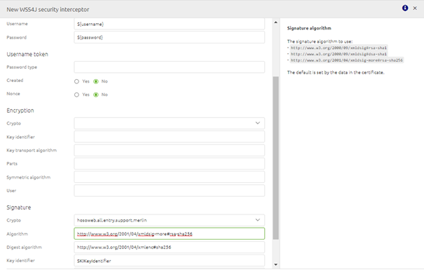
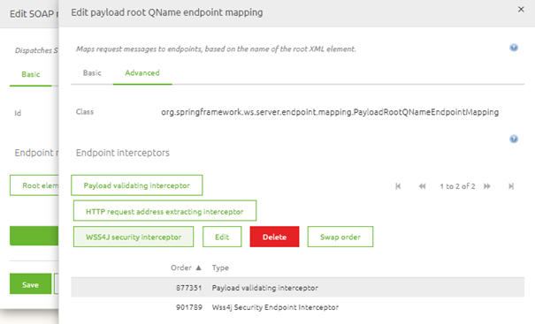

# WS-Security
Within eMagiz there are multiple ways of handling security in relation to SOAP Webservices. One of these methods is WS-Security. In this guide we will look at WS-Security from the following viewpoints:

- What is WS-Security
- Calling an external SOAP Webservice that has secured their webservice via WS-Security
- Securing an eMagiz SOAP Webservice with the help of WS-Security

## What is WS-Security

Web Services Security (WS Security) is a specification that defines how security measures are implemented in web services to protect them from external attacks.
This is done via a set of protocols that ensure the principles of confidentiality, integrity and authentication via security for SOAP-based messages.

The aim of WS-Security is to ensure that communication between two parties is not interrupted or interpreted by an unauthorized third party. 
The receiver needs to be assured that the message was indeed sent by the sender, and the sender should be assured the receiver cannot deny receiving the message. 
Finally, the data sent during communication should not be altered by an unauthorized source.

These aims can be implemented by sending (a set of) WS-Security SOAP Headers along with the SOAP body. Examples of these headers are:
- UsernameToken
- Timestamp
- Encrypt
- Signature
- NoSecurity 

For eMagiz hosted SOAP Webservice we require the Signature option. What an external system requires depends on the requirements made by that system.

## Calling an external SOAP Webservice that has secured their webservice via WS-Security

To ensure that eMagiz creates the required SOAP headers on top of your SOAP message you have to add two support objects to the flow where you want to call the external webservice (predominantly the exit). 
These support objects are:

- Merlin crypto
- WSS4J security interceptor

In the merlin crypto support object you need to place a reference to the keystore you need to authenticate yourself with the external party. This keystore should hold the correct key to access the webservice.

The WSS4J support object should be filed in based on the specifications as delivered by the external party. Below you will find a standard implementation of WS-Security for an external SOAP webservice. As a user you need to fill in the details on both the basic level as well as the securement level

To make sure that the actual headers are send as part of the SOAP webservice call eMagiz will execute you will have to link the WSS4J security interceptor as interceptor on your webservice outbound gateway.
If you have done so your configuration of WS-Security will be correct.

You can test the setup by sending a message via eMagiz towards this SOAP webservice to see if the requirements of the external party are correctly implemented by you.

## Securing an eMagiz SOAP Webservice with the help of WS-Security

To ensure that eMagiz can validate the incoming requests for the avalibity of the correct WS-Security SOAP headers you need to add one support object and add a wss4j security validating interceptor to the message dispatcher component.

The support object you need to link to the entry is:

- Merlin crypto

In the merlin crypto support object you need to place a reference to the truststore where you store the public certificate against which the external needs to authenticate themselves.

Next to adding the support object you also need to open the message dispatcher support object. Within this component you select the payload root QName endpoint mapping for which you want to add the WS-Security settings and press Edit.
In the following pop-up you can navigate to the Advanced tab, select the WSS4J security interceptor and configure this component as follows

If you have configured this correctly you will end up with something like this

When you are done with the configuration you can deploy the flow via Releases or straight from the flow if you have a Test environment and ask the external party to send a message towards your endpoint so you can validate the result.

