# Integration Lifecycle Management (ILM)

ILM is an approach to data and storage management that recognizes that the value of information changes over time and that it must be managed accordingly. ILM seeks to classify data according to its business value and establish policies to migrate and store data on the appropriate storage tier and, ultimately, remove it altogether. ILM has evolved to include upfront initiatives like master data management and compliance. It consists of five phases:
1. **CAPTURE** requirements
   - Define integrations
   - Obtain test data
2. **DESIGN** solution
   - Architecture
   - Message definitions
3. **CREATE** flows
4. **DEPLOY** flow to the environment
5. **MANAGE** and monitor flows

## 1. Capture

#### Why capture requirements?
- Determine scope
- Provides guidelines for designing flows first time right
- Reduces chance of overlooking key decisions
- Centralized documentation of requirements
- Support developer during the design phase

#### HowTo capture requirements?
- Determine systems that are integrated
- Determine information flows/message types
- Determine alerts/events you want to be notified of
- Connect the systems with information flows

#### Result

## 2. Design

#### Design phase objective
- Design the solution based on the requirements of the capture phase
- Design tasks:
  - Systems connection settings
  - CDM
  - Message definitions (x 3: CDM, system 1, system 2)
  - Message mappings
  - Architecture

#### Results  
- Message bus:  
  
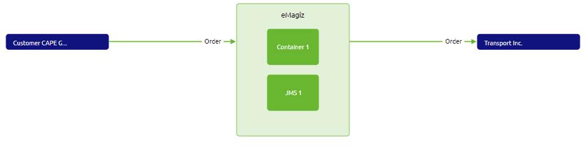
  
- CDM:  
  

  
- CDM message definition:  
  
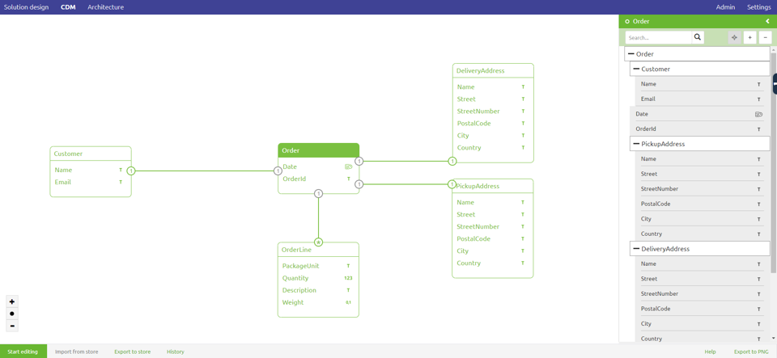
  
- System message:  
  

  
- Message mapping:  
  

  
- Architecture:  
  

  
     
## 3. Create
- Build the solution that has been designed in the prior phase
- Transfer the integrations from Design to Create
- Fill in missing details:  
  - Flows
  - Definitions
  - Transformations

<b>Graphical representation of an integration</b>

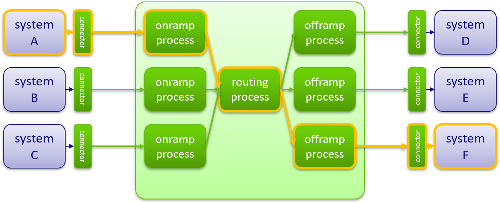
  

#### Entry connector
- First entry point for messages on the bus.
- Deals with transport from the application to the message bus.
- Separate interface from transformation logic.
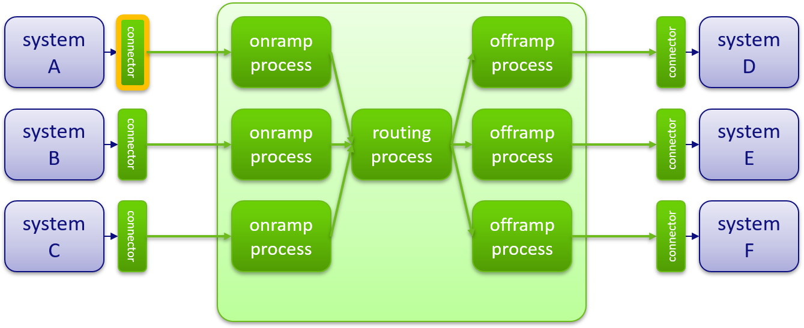

#### Onramp process
- Validates source application data
- Transforms source application data to common data model 
- Adds metadata for routing purposes
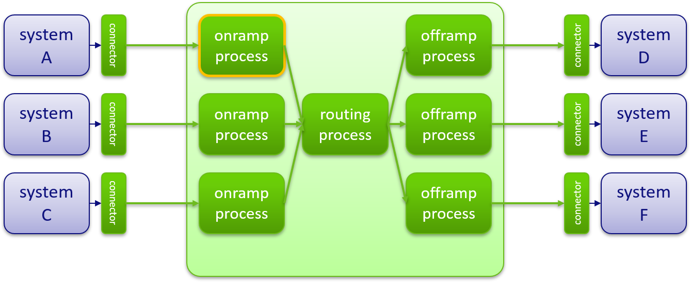

#### Routing process
- Routes messages to the designated offramp based on: metadata, message content or pre-defined routing rules.
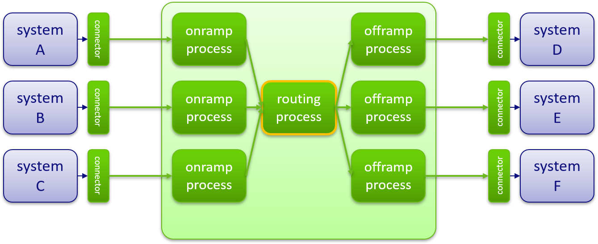

#### Offramp process
- Validates common data model data
- Transforms common data model data to destination format

#### Exit connector
- Exit point for messages on the bus.
- Deals with transport from the message bus to the target application e.g. call a webservice, drop a file, post a http request.
- Separate interface from transformation logic.
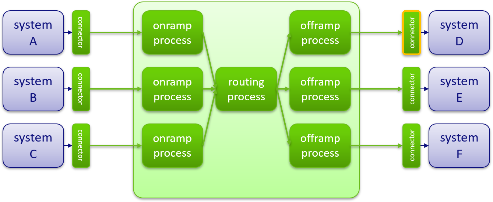

### eMagiz diagram notation

#### Channels
- Decouples Producers from Consumers
- Provide extension points for interceptors
- May follow Point-to-Point or Pub-Sub
- Messages may be queued / buffered
- Synchronous / Asynchronous

#### Endpoints
- Producers send Messages to Message Channels
- Consumers receive Messages from Message Channels
- Endpoints can be both Consumer and Producer
- Message driven or polling, depending on the input Channel

#### Channel adapters
- Connects a channel to some other system or transport
- Inbound or outbound
- Unidirectional
- Implementations including: JMS, File, FTP(S), HTTP, JDBC, TCP, IMAP/Mail, XMPP.

#### Filters
- Discard messages based on boolean evaluation
- Implementations: XML validating filter, XPath filter, Standard filter.

#### Transformer
- Convert payload or modify headers
- Implementations including: XSLT, XPath, Flat file to XML, ISO8583 bytes to XML, JSON to XML, File to String and many more.

#### Routers
- Determine next channel based on content of the Message
- Implementations: XPath router, Header value router, Payload type router,  Recipient list router.

#### Support object
- Provide additional functionality used by other messaging components
- Reusable
- Not connected to message channels
- Implementations including: FTP connection settings, Property placeholder, Jetty server and many more

#### Gateways
- Same as Channel Adapter, but bidirectional
- Implementations including: Web services, HTTP, JMS, TCP, JDBC.

#### Splitters
- Generate multiple messages from one
- Implementations: XPath splitter, Standard splitter.

---

#### eMagiz entry message flow example
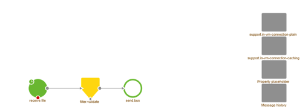

#### eMagiz onramp process flow example
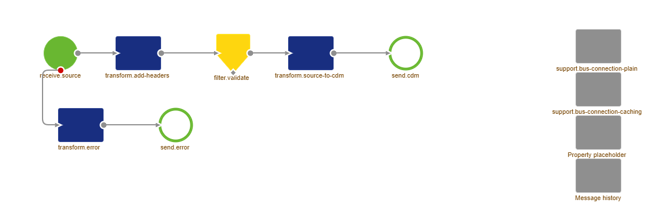

#### eMagiz routing process flow example
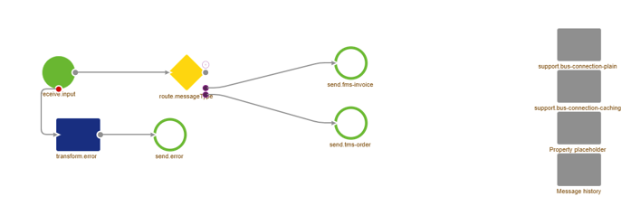

#### eMagiz offramp process flow example

#### eMagiz exit message flow example
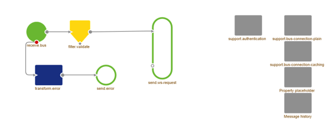

---

<b>Messaging infrastructure layer</b>

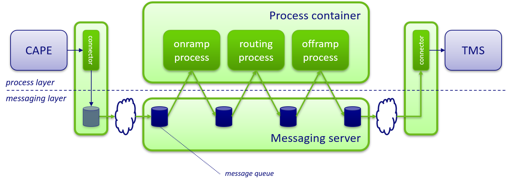

## 4. Deploy

#### Why Deploy?
- To deploy your bus components in correct runtime environments
- "To run what you built"

#### How to Deploy?
- Buy a license for your bus from the trainer​
- Make a new release, based on what is in Create​
- Press install once
- Read the message and follow it:
- Create new properties
  - Global: name=[mybusname].jms01.host, value=localhost (=the bus runs on my laptop)
  - Global: name=[mybusname].jms01.port, value=5445
  
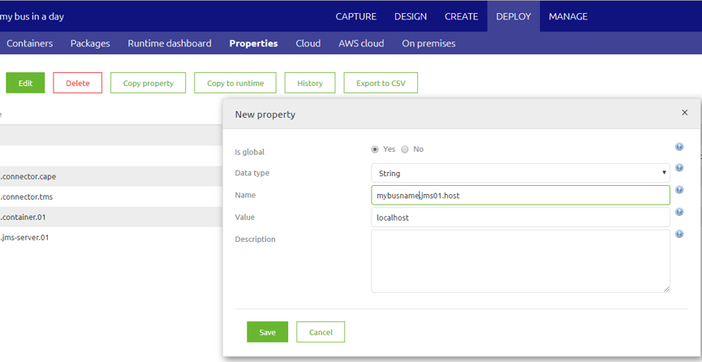

- Download runtimes, and unpack (preferably in C:/Dev/)
- Start runtimes (for each unpacked folder-->bin/karaf.bat)
- Press install again to install the functional flows
- Start the flows from the Runtime dashboard
  
 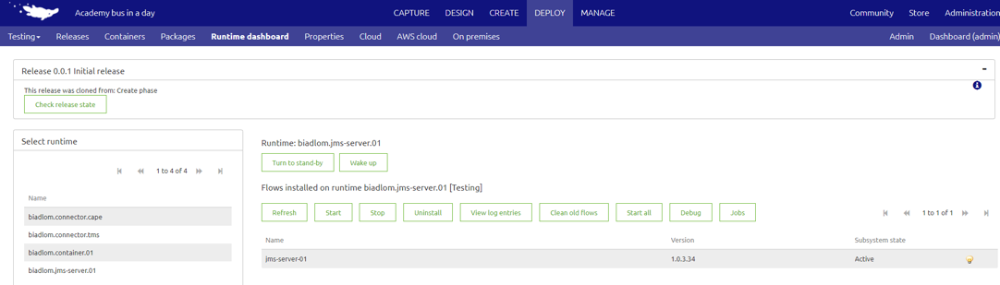 

#### Test the deploy/the flows:
- Checking the flow status in the Runtime dashboard
- Check if the message in and out directories have been created
- Dropping the order example file in the "in" directory (pickup)
- See if it disappears within 6 seconds
- See if it shows up in the "out" directory (drop)

## 5. Manage

#### Why manage?
- Pro active service and support based on alerts and notifications
- Logs all failed messages, including the:   
  - exception that caused the error  
  - message headers and payload at the time of the error  
  - message history at that moment  
- Gives insight into the performance of your bus with statistics
- Log entries of runtimes

#### Ways of managing
- Monitoring
- Alerting & Notifying
- Environment management

#### Monitoring statistics
- Queue statistics
  - Used to determine amount of consumers
  - Used to determine amount of processed messages per message type
- Runtime statistics
  - Used to determine memory usage
  - Used to determine CPU usage
  - Used to determine if a runtime is connected
- Error messages & monitoring log entries
  - Errors and logs of runtimes are send to the eMagiz portal
  - Errors show functional errors and caught exceptions
  - Logs show uncaught exceptions, info and warning message

#### How to manage? 
- Check the logs to see if your runtime started correctly
- Check the queue statistics if messages have been processed
- Check error messages if any messages failed
- Check alerts and notifications
     
#### Tips&tricks
- Send yourself a notification email (for a failed message)
  - Enable the “error message” notification setting
  - Generate an error message in your bus
  - Wait 2 minutes, and then check your email
  - Disable the notification setting again to avoid spam
