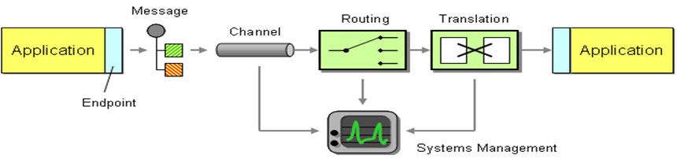
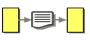
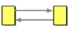
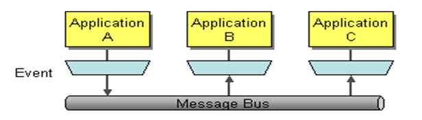
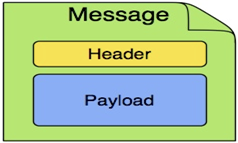

# Introduction to integration
  
  

## The need for integration speed
* Enterprises own applications that are: 
  - custom-build
  - acquired from a third-party
  - part of a legacy system, or a combination thereof
  - operating in multiple tiers of different operating system platforms
* Creating a single, big application to run a complete business is next to impossible (think about the fit of [ERP](https://en.wikipedia.org/wiki/Enterprise_resource_planning "Enterprice Resource Planning"))
* Vendors offer focused applications around a specific core function
* To support common business processes and data sharing across applications, these applications need to be integrated
* Application integration needs to provide efficient, reliable and secure data exchange between multiple enterprise applications

## Integration scenarios
* Information portals
* Data replication
* Shared business functions
* Service-Oriented Architectures (SOA)
* Distributed business processes
* Business-to-Business (B2B) Integration

## Integration concept
## 

## Integration styles  
| File transfer | Shared database | Messaging | Other patterns |  
| :-----------: | :-------------: | :-------: | :------------: |
|  |  |  |  |  

## What Is Messaging?

Messaging is a method of communication between software components or applications. A simple way to understand what messaging does is to consider the telephone system. A telephone call is a synchronous form of communication. I can only communicate with the other party if the other party is available at the time I place the call. Voice mail on the other hand, allows asynchronous communication. With voice mail, when the receiver does not answer, the caller can leave him a message; later the receiver (at his convenience) can listen to the messages queued in his mailbox. Voice mail enables the caller to leave a message now so that the receiver can listen to it later, which is lot easier than trying to get the caller and the receiver on the phone at the same time. Voice mail bundles (at least part of) a phone call into a message and queues it for later consumption; this is essentially how messaging works.

Messaging is a technology that enables high-speed, asynchronous, program-to-program communication with reliable delivery. Programs communicate by sending packets of data called messages to each other. Channels, also known as queues, are logical pathways that connect the programs and convey messages. A channel behaves like a collection or array of messages, but one that is magically shared across multiple computers and can be used concurrently by multiple applications. A sender or producer is a program that sends a message by writing the message to a channel. A receiver or consumer is a program that receives a message by reading (and deleting) it from a channel.

The message itself is simply some sort of data structure—such as a string, a byte array, a record, or an object. It can be interpreted simply as data, as the description of a command to be invoked on the receiver, or as the description of an event that occurred in the sender. A message actually contains two parts, a header and a body. The header contains meta-information about the message—who sent it, where it’s going, etc.; this information is used by the messaging system and is mostly (but not always) ignored by the applications using the messages. The body contains the data being transmitted and is ignored by the messaging system. In conversation, when an application developer who is using messaging talks about a message, he’s usually referring to the data in the body of the message.

Asynchronous messaging architectures are powerful, but require us to rethink our development approach. As compared to the other three integration approaches, relatively few developers have had exposure to messaging and message systems. As a result, application developers in general are not as familiar with the idioms and peculiarities of this communications platform.

Messaging enables distributed communication that is loosely coupled. A component sends a message to a destination, and the recipient can retrieve the message from the destination. However, the sender and the receiver do not have to be available at the same time in order to communicate. In fact, the sender does not need to know anything about the receiver; nor does the receiver need to know anything about the sender. The sender and the receiver need to know only which message format and which destination to use. In this respect, messaging differs from tightly coupled technologies, such as Remote Method Invocation (RMI), which require an application to know a remote application’s methods.

Messaging also differs from electronic mail (email), which is a method of communication between people or between software applications and people. Messaging is used for communication between software applications or software components.

# Messaging Concepts
Apache ActiveMQ Artemis is an asynchronous messaging system, an example of Message Oriented Middleware, we'll just call them messaging systems in the remainder of this documentation. Apache ActiveMQ Artemis is primarily used as the server-side of the messaging in the eMagiz platform.  

We'll first present a brief overview of what kind of things messaging systems do, where they're useful and the kind of concepts you'll hear about in the messaging world.

If you're already familiar with what a messaging system is and what it's capable of, then you can skip this chapter.

## General Concepts
Messaging systems allow you to loosely couple heterogeneous systems together, whilst typically providing reliability, transactions and many other features.

Unlike systems based on a Remote Procedure Call (RPC) pattern, messaging systems primarily use an asynchronous message passing pattern with no tight relationship between requests and responses. Most messaging systems also support a request-response mode but this is not a primary feature of messaging systems.

Designing systems to be asynchronous from end-to-end allows you to really take advantage of your hardware resources, minimizing the amount of threads blocking on IO operations, and to use your network bandwidth to its full capacity. With an RPC approach you have to wait for a response for each request you make so are limited by the network round trip time, or latency of your network. With an asynchronous system you can pipeline flows of messages in different directions, so are limited by the network bandwidth not the latency. This typically allows you to create much higher performance applications.

Messaging systems decouple the senders of messages from the consumers of messages. The senders and consumers of messages are completely independent and know nothing of each other. This allows you to create flexible, loosely coupled systems.

Often, large enterprises use a messaging system to implement a message bus which loosely couples heterogeneous systems together. Message buses often form the core of an Enterprise Service Bus (ESB). Using a message bus to decouple the different systems allows the overall IT landscape to grow and adapt more easily. It also allows more flexibility to add new systems or retire old ones since they don't have brittle dependencies on each other.

## Messaging styles
Messaging systems normally support two main styles of asynchronous messaging: message queue messaging (also known as point-to-point messaging) and publish subscribe messaging. We'll summarise them briefly here:

### Point-to-Point
With this type of messaging you send a message to a queue. The message is then typically persisted to provide a guarantee of delivery, then some time later the messaging system delivers the message to a consumer. The consumer then processes the message and when it is done, it acknowledges the message. Once the message is acknowledged it disappears from the queue and is not available to be delivered again. If the system crashes before the messaging server receives an acknowledgement from the consumer, then on recovery, the message will be available to be delivered to a consumer again.

With point-to-point messaging, there can be many consumers on the queue but a particular message will only ever be consumed by a maximum of one of them. Senders (also known as producers) to the queue are completely decoupled from receivers (also known as consumers) of the queue - they do not know of each other's existence.

A classic example of point to point messaging would be an order queue in a company's order booking system. Each order is represented as a message which is sent to the order queue. Let's imagine there are many front-end ordering systems which send orders to the order queue. When a message arrives on the queue it is persisted - this ensures that if the server crashes the order is not lost. Let's also imagine there are many consumers on the order queue - each representing an instance of an order processing component - these can be on different physical machines but consuming from the same queue. The messaging system delivers each message to one and only one of the ordering processing components. Different messages can be processed by different order processors, but a single order is only processed by one order processor - this ensures orders aren't processed twice.

As an order processor receives a message, it fulfills the order, sends order information to the warehouse system and then updates the order database with the order details. Once it has done that it acknowledges the message to tell the server that the order has been processed and can be forgotten about. Often the send to the warehouse system, update in database and acknowledgement will be completed in a single transaction to ensure ACID properties.

### Publish-Subscribe
With publish-subscribe messaging many senders can send messages to an entity on the server, often called a topic (e.g. in the JMS world).

There can be many subscriptions on a topic, a subscription is just another word for a consumer of a topic. Each subscription receives a copy of each message sent to the topic. This differs from the message queue pattern where each message is only consumed by a single consumer.

Subscriptions can optionally be durable which means they retain a copy of each message sent to the topic until the subscriber consumes them - even if the server crashes or is restarted in between. Non-durable subscriptions only last a maximum of the lifetime of the connection that created them.

An example of publish-subscribe messaging would be a news feed. As news articles are created by different editors around the world they are sent to a news feed topic. There are many subscribers around the world who are interested in receiving news items - each one creates a subscription and the messaging system ensures that a copy of each news message is delivered to each subscription.

### Delivery guarantees
A key feature of most messaging systems is reliable messaging. With reliable messaging the server gives a guarantee that the message will be delivered once and only once to each consumer of a queue or each durable subscription of a topic, even in the event of system failure. This is crucial for many businesses; e.g. you don't want your orders fulfilled more than once or any of your orders to be lost.

In other cases you may not care about a once and only once delivery guarantee and are happy to cope with duplicate deliveries or lost messages - an example of this might be transient stock price updates - which are quickly superseded by the next update on the same stock. The messaging system allows you to configure which delivery guarantees you require.

### Durability
Messages are either durable or non durable. Durable messages will be persisted in permanent storage and will survive server failure or restart. Non durable messages will not survive server failure or restart. Examples of durable messages might be orders or trades, where they cannot be lost. An example of a non durable message might be a stock price update which is transitory and does not need to survive a restart.

## Messaging APIs and protocols
How do client applications interact with messaging systems in order to send and consume messages? Several messaging systems provide their own proprietary APIs with which the client communicates with the messaging system. There are also some standard ways of operating with messaging systems and some emerging standards in this space. Let's take a brief look at these:

### Java Message Service (JMS)
JMS is part of Oracle's Java EE specification. It's a Java API that encapsulates both message queue and publish-subscribe messaging patterns. JMS is a lowest common denominator specification - i.e. it was created to encapsulate common functionality of the already existing messaging systems that were available at the time of its creation.

JMS is a very popular API and is implemented by most messaging systems. JMS is only available to clients running Java.

JMS does not define a standard wire format - it only defines a programmatic API so JMS clients and servers from different vendors cannot directly interoperate since each will use the vendor's own internal wire protocol.

Apache ActiveMQ Artemis provides a fully compliant JMS 1.1 and JMS 2.0 client implementation.

### System specific APIs
Many systems provide their own programmatic API for which to interact with the messaging system. The advantage of this it allows the full set of system functionality to be exposed to the client application. API's like JMS are not normally rich enough to expose all the extra features that most messaging systems provide.

Apache ActiveMQ Artemis provides its own core client API for clients to use if they wish to have access to functionality over and above that accessible via the JMS API.

### RESTful API
REST approaches to messaging are showing a lot interest recently.

It seems plausible that API standards for cloud computing may converge on a REST style set of interfaces and consequently a REST messaging approach is a very strong contender for becoming the de-facto method for messaging interoperability.

With a REST approach messaging resources are manipulated as resources defined by a URI and typically using a simple set of operations on those resources, e.g. PUT, POST, GET etc. REST approaches to messaging often use HTTP as their underlying protocol.

The advantage of a REST approach with HTTP is in its simplicity and the fact the internet is already tuned to deal with HTTP optimally.

### AMQP
AMQP is a specification for interoperable messaging. It also defines a wire format, so any AMQP client can work with any messaging system that supports AMQP. AMQP clients are available in many different programming languages.

Apache ActiveMQ Artemis implements the AMQP 1.0 specification. Any client that supports the 1.0 specification will be able to interact with Apache ActiveMQ Artemis.

## Qpid
Qpid JMS is a complete Java Message Service 2.0 client built using the Qpid Proton protocol engine.

Features:
- JMS 2.0 API
- Secure communication via SSL and SASL
- Producer flow control
- Failover
- Pure-Java implementation

Most of the relevant information about Qpid is displayed in the helptext of eMagiz right where it is needed. For more information please see [JMS with the strength of AMQP](https://qpid.apache.org/components/jms/index.html#jms-with-the-strength-of-amqp)

## High Availability
High Availability (HA) means that the system should remain operational after failure of one or more of the servers. The degree of support for HA varies between various messaging systems.

Apache ActiveMQ Artemis provides automatic failover where your sessions are automatically reconnected to the backup server on event of live server failure.

## Clusters
Many messaging systems allow you to create groups of messaging servers called clusters. Clusters allow the load of sending and consuming messages to be spread over many servers. This allows your system to scale horizontally by adding new servers to the cluster.

Degrees of support for clusters varies between messaging systems, with some systems having fairly basic clusters with the cluster members being hardly aware of each other.

Apache ActiveMQ Artemis provides very configurable state-of-the-art clustering model where messages can be intelligently load balanced between the servers in the cluster, according to the number of consumers on each node, and whether they are ready for messages.

Apache ActiveMQ Artemis also has the ability to automatically redistribute messages between nodes of a cluster to prevent starvation on any particular node.

## Bridges and routing
Some messaging systems allow isolated clusters or single nodes to be bridged together, typically over unreliable connections like a wide area network (WAN), or the internet.

A bridge normally consumes from a queue on one server and forwards messages to another queue on a different server. Bridges cope with unreliable connections, automatically reconnecting when the connections becomes available again.

Apache ActiveMQ Artemis bridges can be configured with filter expressions to only forward certain messages, and transformation can also be hooked in.

Apache ActiveMQ Artemis also allows routing between queues to be configured in server side configuration. This allows complex routing networks to be set up forwarding or copying messages from one destination to another, forming a global network of interconnected brokers.

## Sources
- https://activemq.apache.org/artemis/docs/latest/
- https://docs.oracle.com/cd/E19798-01/821-1841/6nmq2cpoq/index.html
- https://www.enterpriseintegrationpatterns.com/patterns/messaging/Introduction.html
- https://spring.io/understanding/AMQP
- https://qpid.apache.org/components/jms/index.html
