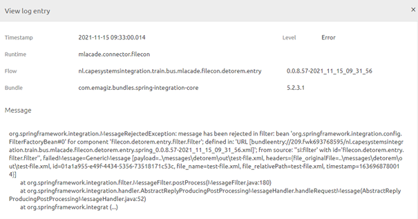
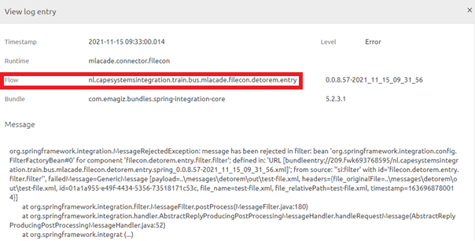
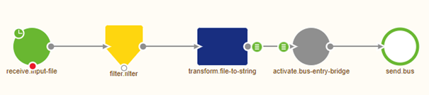
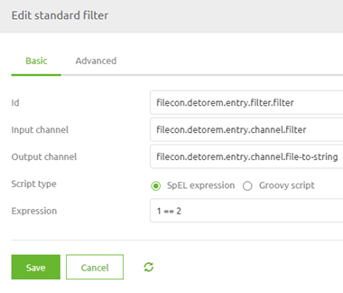

    

        <main class="micro-learning">
        <ul class="doc-nav">
            <li class="doc-nav__item"><a href="../../docs/microlearning/advanced-active-monitoring-index" class="doc-nav__link">Home</a></li>
            <li class="doc-nav__item"><a href="#intro" class="doc-nav__link">Intro</a></li>
            <li class="doc-nav__item"><a href="#theory" class="doc-nav__link">Theory</a></li>
            <li class="doc-nav__item"><a href="#practice" class="doc-nav__link">Practice</a></li>
            <li class="doc-nav__item"><a href="#solution" class="doc-nav__link">Solution</a></li>
        </ul>

##### Intro

# Determining cause of log entry
 
When something goes wrong within the process, you want to determine what caused the error to be raised. In earlier microlearnings, we learned how to determine the cause of error messages. Now, we shift our focus to the log entries. In eMagiz, errors can show up in the dashboard and the log entries. For this microlearning, we will look at the log entries and see how we can use that information to look at the flow to determine what part of the flow is causing the error.

Should you have any questions, please get in touch with academy@emagiz.com.

- Last update: November 15th, 2021
- Required reading time: 5 minutes

## 1. Prerequisites
- Advanced knowledge of the eMagiz platform
- Errors in the log that can be analyzed

## 2. Key concepts
This microlearning centers around determining the cause of log entry
By determining the cause, we mean: Figuring out what was responsible for generating an error.

- The component that raises the error could differ from the component that causes the error
- A log entry error could be raised on runtime level or flow level but can be related to a specific part of the process

##### Theory
  
## 3. Determining the cause of log entry

When something goes wrong within the process, you want to determine what caused the error to be raised. In earlier microlearnings, we learned how to determine the cause of error messages. Now, we shift our focus to the log entries. In eMagiz, errors can show up in the dashboard and the log entries. For this microlearning, we will look at the log entries and see how we can use that information to look at the flow to determine what part of the flow is causing the error.

- The component that raises the error could differ from the component that causes the error
- A log entry error could be raised on runtime level or flow level but can be related to a specific part of the process

In eMagiz, you can find the log entries under Manage -> Log entries. Here you can focus your search by searching for a specific runtime. An example of an error that could be raised and shown in the log entries is any error introduced in the entry that causes the transaction to fail.

When you have found the log entry, it becomes time to read it to see whether you can interpret the problem. For example, in this case, we that a message has been rejected in a filter component. When we read on, we see the name of the specific filter component that is throwing the error.

Now that we know the component that raised the error, we can navigate to the flow in which this component is used. You can determine based on the naming, but the flow's name is also shown on the log entry if it is known.

When we navigate to the flow that is raising the error in our example, we see that a filter is in the flow that checks before the message can be further processed by eMagiz.

When we open the filter, we can see what check is done. By analyzing the check, we can determine whether the statement itself is faulty, a configuration error occurred, or whether input created earlier in the flow was the culprit in this case. For this example, we used an obvious error to make the problem clear to you. In real-life scenarios identifying the cause might take some additional work to determine the specific reason for your particular problem.

##### Practice

## 4. Assignment

Search for problems in the log and see if you can find out what caused these problems. This assignment can be completed with the help of the (Academy) project that you have created/used in the previous assignment.

## 5. Key takeaways

- The log entry shows which flow has raised the error
- You need to read the log entry to interpret on which component the error is raised
- With the information from the log entry, you can analyze the flow starting at the component that raised the error and move back in the process step by step

##### Solution

## 6. Suggested Additional Readings

No suggested additional readings for this microlearning.

## 7. Silent demonstration video

This video demonstrates a working solution and how you can validate whether you have successfully completed the assignment.

<iframe width="1280" height="720" src="../../vid/microlearning/advanced-active-monitoring-determining-cause-of-log-entry.mp4" frameborder="0" allow="accelerometer; autoplay; clipboard-write; encrypted-media; gyroscope; picture-in-picture" allowfullscreen></iframe>

</main>

