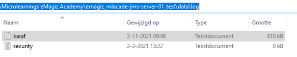
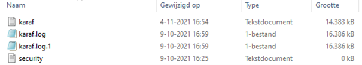
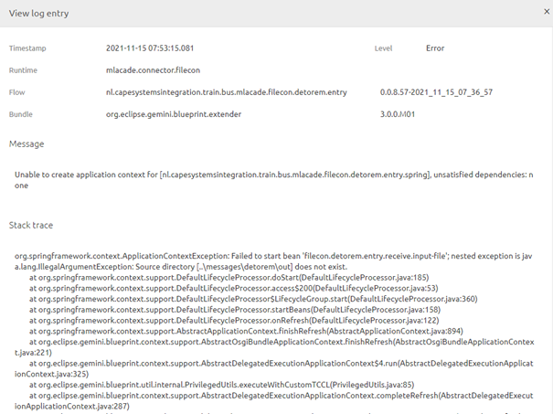
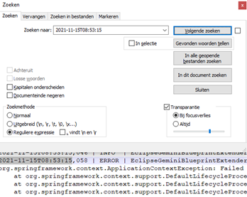

    

        <main class="micro-learning">
        <ul class="doc-nav">
            <li class="doc-nav__item"><a href="../../docs/microlearning/advanced-active-monitoring-index" class="doc-nav__link">Home</a></li>
            <li class="doc-nav__item"><a href="#intro" class="doc-nav__link">Intro</a></li>
            <li class="doc-nav__item"><a href="#theory" class="doc-nav__link">Theory</a></li>
            <li class="doc-nav__item"><a href="#practice" class="doc-nav__link">Practice</a></li>
            <li class="doc-nav__item"><a href="#solution" class="doc-nav__link">Solution</a></li>
        </ul>

##### Intro

# Interpreting karaf.log on-premise
 
There is a need to see the complete stack trace logged when something goes wrong on runtime in some cases. In eMagiz, only the top-level information is shown and not always the entire stack trace. When this particular runtime runs on-premises, you can see the complete logging on the runtime in the karaf.log. In this microlearning, we will learn how to find the karaf log and search within the karaf log to find the corresponding error and subsequently analyze that error. 

Should you have any questions, please get in touch with academy@emagiz.com.

- Last update: November 15th, 2021
- Required reading time: 5 minutes

## 1. Prerequisites
- Advanced knowledge of the eMagiz platform

## 2. Key concepts
This microlearning centers around interpreting the karaf.log for an on-premise runtime
With a karaf.log, we mean: A file that holds the logging related to that specific runtime

In a karaf log, you see (among others) the following information:

- Start and stop information of flows or the complete runtime
- Manual logging you defined on flows running within that runtime
- Connection logging indicates whether there are connection problems
- Errors when something in an entry breaks down

##### Theory
  
## 3. Interpreting karaf.log on-premise

There is a need to see the complete stack trace logged when something goes wrong on runtime in some cases. In eMagiz, only the top-level information is shown and not always the entire stack trace. When this particular runtime runs on-premises, you can see the complete logging on the runtime in the karaf.log. In this microlearning, we will learn how to find the karaf log and search within the karaf log to find the corresponding error and subsequently analyze that error. 

In a karaf log, you see (among others) the following information:

- Start and stop information of flows or the complete runtime
- Manual logging you defined on flows running within that runtime
- Connection logging indicates whether there are connection problems
- Errors when something in an entry breaks down

### 3.1 Where to find the karaf.log

Before we can interpret the karaf.log, the first action will be to find the karaf.log. The karaf.log is available within the data folder of each eMagiz runtime that is running on-premises. To see it, you first need to know the location where you saved and unpacked the runtime zips. Suppose you open the runtime for which you want to interpret the karaf log and open the data folder. Within the data folder, there is a folder called log. In there, you will see a file called karaf which can be opened with a tool such as Notepad++.

When you open the karaf.log file, you will see all logging that took place on that runtime. Note that when there is an extreme amount of logging, new karaf.log files are created. The first one is without a suffix and each of the following with a suffix (1,2,3,4) up to 9. When you exceed, that maximum eMagiz will start wiping the oldest logging to prevent problems with regards to disk size.

### 3.2 Find additional information

Now that we know where to find the karaf.log, the next step is to analyze the karaf.log. The most logical scenario to arrive here is when you saw an error in the eMagiz Manage phase that could not be explained without looking at the complete stack trace. By opening and analyzing the karaf.log, you can find the whole stack trace to assist in performing your RCA on the problem at hand. Below you see an error in eMagiz for illustrative purposes.

As you can see, we have the timestamp (in UTC) of when the logging was triggered. Having this information helps us to quickly locate the corresponding logging around that time by searching Notepad++. That way, you can find the related error easily to read the stack trace and interpret the error in more detail.

##### Practice

## 4. Assignment

Run your own Academy project on your laptop (on-premise), so you can experiment a bit with analyzing the karaf.log on-premise. This assignment can be completed with the help of the (Academy) project that you have created/used in the previous assignment.

## 5. Key takeaways

- The karaf.log can be found within the folder called log under the folder data
- You can search the log with the help of tools such as Notepad++
- By looking at the timestamp in the eMagiz Manage Log, you can run a focused search

##### Solution

## 6. Suggested Additional Readings

No suggested additional readings for this microlearning.

## 7. Silent demonstration video

As this is a more theoretical microlearning, we have no video for this

</main>

